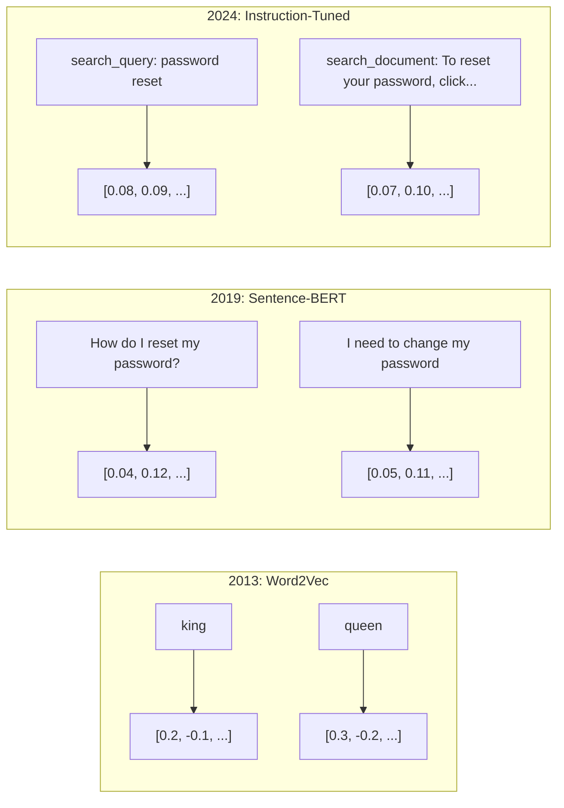
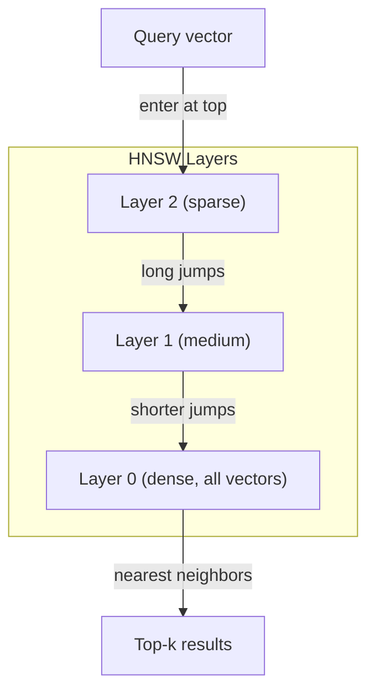
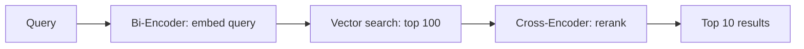

# Embedding & Representasi Vector

> Teks bersifat diskrit. Matematika itu berkelanjutan. Setiap kali kamu meminta LLM untuk menemukan dokumen yang "serupa", membandingkan makna, atau mencari di luar kata kunci, kamu mengandalkan jembatan antara dua dunia ini. Jembatan itu adalah sebuah embedding. Jika kamu tidak memahami embedding, kamu tidak memahami AI modern. kamu cukup menggunakannya.

**Type:** Build
**Language:** Python
**Prerequisites:** Fase 11, Lesson 01 (Rekayasa Cepat)
**Waktu:** ~75 menit
**Terkait:** Fase 5 · 22 (Penyelaman Model Embedding Mendalam) mencakup padat vs jarang vs multi-vector, pemotongan Matryoshka, dan pemilihan model per sumbu. Lesson ini berfokus pada jalur produksi (DB vector, HNSW, matematika kesamaan). Baca Phase 5 · 22 sebelum memilih model.

## Tujuan Pembelajaran

- Hasilkan embedding teks menggunakan penyedia API dan model sumber terbuka, dan hitung kesamaan kosinus di antara keduanya
- Jelaskan mengapa embedding memecahkan masalah ketidakcocokan kosakata yang tidak dapat ditangani oleh pencarian kata kunci
- Membangun indeks pencarian semantik yang mengambil dokumen berdasarkan makna, bukan pencocokan kata kunci yang tepat
- Evaluasi kualitas embedding menggunakan tolok ukur pengambilan (precision@k, recall) dan pilih model embedding yang tepat untuk tugas kamu

## Masalah

kamu memiliki 10.000 tiket dukungan. Seorang pelanggan menulis "pembayaran saya tidak berhasil." kamu perlu menemukan tiket serupa sebelumnya. Pencarian kata kunci menemukan tiket yang berisi "pembayaran" dan "tidak berhasil". Tidak ada "transaksi gagal", "tagihan ditolak", dan "kesalahan penagihan". Tiket ini menggambarkan masalah yang sama dengan kata-kata yang sangat berbeda.

Ini adalah masalah ketidakcocokan kosakata. Bahasa manusia memiliki banyak cara untuk mengatakan hal yang sama. Pencarian kata kunci memperlakukan setiap kata sebagai simbol independen yang tidak memiliki arti. Tidak dapat diketahui bahwa “ditolak” dan “tidak lolos” mengacu pada konsep yang sama.

kamu memerlukan representasi teks yang maknanya, bukan ejaannya, yang menentukan kesamaan. kamu memerlukan cara untuk menempatkan "pembayaran saya tidak berhasil" dan "transaksi ditolak" berdekatan dalam ruang matematika, sambil menjauhkan "pembayaran saya tiba tepat waktu" meskipun berbagi kata "pembayaran".

Representasi itu adalah sebuah embedding.

## Konsep

### Apa itu Embedding?

Embedding adalah vector padat angka floating-point yang mewakili makna teks. Kata "padat" penting -- setiap dimension membawa informasi, tidak seperti representasi renggang (sekantong kata, TF-IDF) yang sebagian besar dimensinya nol.

"Kucing duduk di atas matras" menjadi seperti `[0.023, -0.041, 0.087, ..., 0.012]` -- daftar angka 768 hingga 3072 bergantung pada modelnya. Angka-angka ini menyandikan makna. kamu tidak pernah memeriksanya secara langsung. kamu membandingkannya.

### Terobosan Word2Vec

Pada tahun 2013, Tomas Mikolov dan rekannya di Google menerbitkan Word2Vec. Wawasan inti: melatih neural network untuk memprediksi sebuah kata dari tetangganya (atau tetangga dari sebuah kata), dan weight layer tersembunyi menjadi representasi vector yang bermakna.

Hasil yang terkenal:

```
king - man + woman = queen
```

Aritmatika vector pada embedding kata menangkap hubungan semantik. Arah dari "pria" ke "wanita" kira-kira sama dengan arah dari "raja" ke "ratu". Inilah saatnya bidang ini menyadari bahwa geometri dapat menyandikan makna.

Word2Vec menghasilkan vector 300 dimension. Setiap kata mendapat satu vector terlepas dari konteksnya. "Bank" di "tepi sungai" dan "rekening bank" memiliki embedding yang sama. Keterbatasan ini mendorong penelitian pada dekade berikutnya.

### Dari Kata ke KalimatPenyematan kata mewakili token tunggal. Sistem produksi perlu embed seluruh kalimat, paragraf, atau dokumen. Empat pendekatan muncul:

**Averaging**: mengambil mean dari semua vector kata dalam kalimat. Murah, lossy, ternyata lumayan untuk teks pendek. Kehilangan urutan kata seluruhnya -- "dog bites man" dan "man bites dog" memiliki embeddings yang identik.

**Token CLS**: model Transformer (BERT, 2018) mengeluarkan embedding token [CLS] khusus yang mewakili seluruh input. Lebih baik daripada rata-rata tetapi token [CLS] dilatih untuk prediksi kalimat berikutnya, bukan kesamaan.

**Pembelajaran kontrastif**: melatih model secara eksplisit untuk menyatukan pasangan serupa dan memisahkan pasangan berbeda. Sentence-BERT (Reimers & Gurevych, 2019) menggunakan pendekatan ini dan menjadi dasar model embedding modern. Mengingat "Bagaimana cara mereset kata sandi saya?" dan "Saya perlu mengubah kata sandi", model mengetahui bahwa kata sandi tersebut seharusnya memiliki vector yang hampir sama.

**Embedding yang disesuaikan dengan instruksi**: pendekatan terbaru. Model seperti E5 dan GTE menerima awalan tugas ("search_query:", "search_document:") yang memberi tahu model jenis embedding apa yang akan dihasilkan. Hal ini memungkinkan satu model melayani banyak tugas.



### Model Embedding Modern

Pasar telah memilih beberapa opsi tingkat produksi (skor MTEB pada awal tahun 2026, MTEB v2):

| Model | Penyedia | Dimension | MTEB | Konteks | Biaya / 1 juta token |
|-------|----------|-----------|------|---------|------------------|
| Embedding Gemini 2 | Google | 3072 (Matryoshka) | 67.7 (pengambilan) | 8192 | $0,15 |
| semat-v4 | menyatu | 1024 (Matryoshka) | 65.2 | 128K | $0,12 |
| pelayaran-4 | Pelayaran AI | 1024/2048 (Matryoshka) | 66.8 | 32K | $0,12 |
| embedding teks-3-besar | OpenAI | 3072 (Matryoshka) | 64.6 | 8192 | $0,13 |
| teks-embedding-3-kecil | OpenAI | 1536 (Matryoshka) | 62.3 | 8192 | $0,02 |
| BGE-M3 | BAAI | 1024 (padat+jarang+ColBERT) | 63.0 multibahasa | 8192 | Berat terbuka |
| Qwen3-Embedding | Alibaba | 4096 (Matryoshka) | 66.9 | 32K | Berat terbuka |
| Nomic-embed-v2 | Nomik | 768 (Matryoshka) | 63.1 | 8192 | Berat terbuka |

MTEB (Massive Text Embedding Benchmark) v2 mencakup 100+ tugas dalam pengambilan, klasifikasi, pengelompokan, pemeringkatan ulang, dan ringkasan. Lebih tinggi lebih baik. Pada tahun 2026, model berbobot terbuka (Qwen3-Embedding, BGE-M3) menyamai atau mengalahkan model yang dihosting tertutup di sebagian besar sumbu. Gemini Embedding 2 memimpin pengambilan murni; Voyage/Cohere memimpin domain tertentu (keuangan, hukum, code). Selalu tolok ukur pertanyaan kamu sendiri sebelum melakukan.

### Metrik Kesamaan

Diberikan dua vector embedding, tiga cara untuk mengukur seberapa mirip keduanya:

**Kesamaan kosinus**: kosinus sudut antara dua vector. Berkisar dari -1 (berlawanan) hingga 1 (arah identik). Mengabaikan besaran -- kalimat 10 kata dan dokumen 500 kata dapat mendapat skor 1,0 jika mengarah ke arah yang sama. Ini adalah default untuk 90% kasus penggunaan.

```
cosine_sim(a, b) = dot(a, b) / (||a|| * ||b||)
```

**Perkalian titik**: hasil kali dalam mentah dari dua vector. Identik dengan kesamaan kosinus ketika vector dinormalisasi (satuan panjang). Lebih cepat untuk menghitung. Embedding OpenAI dinormalisasi, jadi perkalian titik dan kosinus memberikan peringkat yang sama.

```
dot(a, b) = sum(a_i * b_i)
```

**Distance Euclidean (L2)**: distance garis lurus dalam ruang vector. Lebih kecil = lebih mirip. Sensitif terhadap perbedaan besarnya. Gunakan ketika posisi absolut dalam ruang penting, bukan hanya arahnya.

```
L2(a, b) = sqrt(sum((a_i - b_i)^2))
```

Kapan menggunakan yang mana:| Metrik | Gunakan ketika | Hindari ketika |
|--------|----------|------------|
| Kesamaan kosinus | Membandingkan teks dengan panjang berbeda; sebagian besar tugas pengambilan | Besaran membawa informasi |
| Produk titik | Embedding sudah dinormalisasi; kecepatan maksimum | Vector mempunyai besaran yang berbeda-beda |
| Distance Euclidean | Kekelompokan; masalah tata ruang nearest neighbor | Membandingkan dokumen dengan panjang yang sangat berbeda |

### Basis Data Vector dan HNSW

Pencarian kesamaan brute force membandingkan kueri dengan setiap vector yang disimpan. Dengan 1 juta vector dengan 1536 dimension, itu berarti 1,5 miliar operasi perkalian per kueri. Terlalu lambat.

Basis data vector menyelesaikan masalah ini dengan algoritma Approximate Nearest Neighbor (ANN). Algoritma yang dominan adalah HNSW (Hierarchical Navigable Small World):

1. Buatlah grafik vector berlapis-lapis
2. Layer atas jarang -- koneksi distance jauh antar cluster yang jauh
3. Layer bawah padat -- hubungan berbutir halus antara vector-vector terdekat
4. Pencarian dimulai dari layer atas, dengan rakus turun untuk menyaring
5. Mengembalikan perkiraan hasil top-k dalam waktu O(log n) dan bukan O(n)

HNSW menukar sedikit kehilangan akurasi (biasanya 95-99% recall) dengan peningkatan kecepatan yang sangat besar. Pada 10 juta vector, kekerasan membutuhkan waktu beberapa detik. HNSW membutuhkan waktu milidetik.



Pilihan produksi:

| Basis Data | Ketik | Terbaik untuk | Skala maksimal |
|----------|------|----------|-----------|
| biji pinus | SaaS Terkelola | Produksi tanpa operasi | Miliaran |
| Weaviate | Sumber terbuka | Pencarian hibrid yang dihosting sendiri | 100 juta+ |
| Qdrant | Sumber terbuka | Performa tinggi, pemfilteran | 100 juta+ |
| ChromaDB | Tertanam | Pembuatan prototipe, pengembang lokal | 1M |
| vector pg | Ekstensi Postgres | Sudah menggunakan Postgres | 10 juta |
| FAISS | Perpustakaan | Dalam proses, penelitian | 1B+ |

### Strategi Pemotongan

Dokumen terlalu panjang untuk di-embed sebagai vector tunggal. PDF setebal 50 halaman mencakup lusinan topik -- embedding-nya menjadi rata-rata dari segalanya, hampir tidak ada yang spesifik. kamu membagi dokumen menjadi beberapa bagian dan menyematkannya masing-masing.

**Pembagian ukuran tetap**: membagi setiap N token dengan M-token yang tumpang tindih. Sederhana dan dapat diprediksi. Berfungsi dengan baik ketika dokumen tidak memiliki struktur yang jelas. Potongan 512 token dengan 50 token tumpang tindih: potongan 1 adalah token 0-511, potongan 2 adalah token 462-973.

**Pengelompokan berdasarkan kalimat**: membagi pada batas kalimat, mengelompokkan kalimat hingga mencapai batas token. Setiap bagian setidaknya terdiri dari satu kalimat lengkap. Lebih baik daripada ukuran tetap karena kamu tidak pernah memotong pikiran menjadi dua.

**Pembagian rekursif**: coba pisahkan pada batas terbesar terlebih dahulu (header bagian). Jika masih terlalu besar, coba batas paragraf. Lalu batasan kalimat. Lalu batasan karakter. Ini adalah `RecursiveCharacterTextSplitter` LangChain dan berfungsi dengan baik untuk corpora format campuran.

**Pembagian semantik**: embed setiap kalimat, lalu mengelompokkan kalimat berurutan yang embedding-nya serupa. Ketika kesamaan embedding turun di bawah ambang batas, mulailah potongan baru. Mahal (memerlukan embedding setiap kalimat satu per satu) tetapi menghasilkan potongan yang paling koheren.

| Strategi | Kompleksitas | Kualitas | Terbaik untuk |
|----------|-----------|---------|----------|
| Ukuran tetap | Rendah | Layak | Teks tidak terstruktur, log |
| Berbasis kalimat | Rendah | Bagus | Artikel, email |
| Rekursif | Sedang | Bagus | Penurunan harga, HTML, dokumen campuran |
| Semantik | Tinggi | Terbaik | Kualitas pengambilan kritis |

Titik terbaik untuk sebagian besar sistem: 256-512 potongan token dengan 50 token yang tumpang tindih.

### Bi-Encoder vs Cross-EncoderBi-encoder embed kueri dan dokumen secara independen, lalu membandingkan vector. Cepat -- kamu embed kueri satu kali dan membandingkannya dengan embedding dokumen yang telah dihitung sebelumnya. Inilah yang kamu gunakan untuk pengambilan.

Pembuat enkode silang mengambil kueri dan dokumen sebagai input tunggal dan menghasilkan skor relevansi. Lambat -- ini memproses setiap pasangan dokumen kueri melalui model lengkap. Namun jauh lebih akurat karena dapat menangani seluruh token kueri dan dokumen secara bersamaan.

Pola produksi: bi-encoder mengambil 100 kandidat teratas, cross-encoder memeringkatnya menjadi 10 teratas. Ini adalah jalur pengambilan lalu peringkat ulang.



Model pemeringkatan ulang: Cohere Reranker 3.5 ($2 per 1000 kueri), BGE-reranker-v2 (gratis, sumber terbuka), Jina Reranker v2 (gratis, sumber terbuka).

### Embedding Matryoshka

Embedding tradisional adalah segalanya atau tidak sama sekali. Vector berdimensi 1536 menggunakan 1536 pelampung. kamu tidak dapat memotong ke 256 dimension tanpa training ulang.

Pembelajaran Representasi Matryoshka (Kusupati et al., 2022) memperbaikinya. Model dilatih sedemikian rupa sehingga dimension N pertama menangkap informasi paling penting, seperti boneka bersarang Rusia. Memotong embedding Matryoshka 1536-d ke 256 dimension kehilangan beberapa akurasi tetapi tetap berfungsi.

Text-embedding-3-small dan text-embedding-3-large OpenAI mendukung pemotongan Matryoshka melalui parameter `dimensions`. Meminta 256 dimension, bukan 1536, memotong penyimpanan sebesar 6x dengan kehilangan akurasi sekitar 3-5% pada benchmark MTEB.

### Kuantisasi Biner

Embedding 1536 dimension yang disimpan sebagai float32 menggunakan 6.144 byte. Kalikan dengan 10 juta dokumen: 61 GB hanya untuk vector.

Kuantisasi biner mengubah setiap float menjadi satu bit: nilai positif menjadi 1, nilai negatif menjadi 0. Penyimpanan turun dari 6.144 byte menjadi 192 byte -- pengurangan sebesar 32x. Kesamaan dihitung menggunakan distance Hamming (menghitung bit yang berbeda), yang dapat dilakukan CPU dalam satu instruksi.

Akurasi yang dicapai sekitar 5-10% pada penarikan kembali. Pola umumnya: kuantisasi biner untuk penelusuran first-pass pada jutaan vector, lalu menilai ulang 1000 teratas dengan vector presisi penuh. Ini memberi kamu akurasi presisi penuh 95%+ dengan memori 32x lebih sedikit.

## Build

Kami membangun mesin pencari semantik dari awal. Tidak ada basis data vector. Tidak ada API embedding eksternal. Python murni dengan numpy untuk perhitungannya.

### Langkah 1: Pemotongan Teks

```python
def chunk_text(text, chunk_size=200, overlap=50):
    words = text.split()
    chunks = []
    start = 0
    while start < len(words):
        end = start + chunk_size
        chunk = " ".join(words[start:end])
        chunks.append(chunk)
        start += chunk_size - overlap
    return chunks


def chunk_by_sentences(text, max_chunk_tokens=200):
    sentences = text.replace("\n", " ").split(".")
    sentences = [s.strip() + "." for s in sentences if s.strip()]
    chunks = []
    current_chunk = []
    current_length = 0
    for sentence in sentences:
        sentence_length = len(sentence.split())
        if current_length + sentence_length > max_chunk_tokens and current_chunk:
            chunks.append(" ".join(current_chunk))
            current_chunk = []
            current_length = 0
        current_chunk.append(sentence)
        current_length += sentence_length
    if current_chunk:
        chunks.append(" ".join(current_chunk))
    return chunks
```

### Langkah 2: Membangun Embeddings dari Awal

Kami menerapkan embedding padat sederhana menggunakan TF-IDF dengan normalisasi L2. Ini bukan embedding saraf, tetapi mengikuti kontrak yang sama: teks masuk, vector berukuran tetap keluar, teks serupa menghasilkan vector serupa.

```python
import math
import numpy as np
from collections import Counter

class SimpleEmbedder:
    def __init__(self):
        self.vocab = []
        self.idf = []
        self.word_to_idx = {}

    def fit(self, documents):
        vocab_set = set()
        for doc in documents:
            vocab_set.update(doc.lower().split())
        self.vocab = sorted(vocab_set)
        self.word_to_idx = {w: i for i, w in enumerate(self.vocab)}
        n = len(documents)
        self.idf = np.zeros(len(self.vocab))
        for i, word in enumerate(self.vocab):
            doc_count = sum(1 for doc in documents if word in doc.lower().split())
            self.idf[i] = math.log((n + 1) / (doc_count + 1)) + 1

    def embed(self, text):
        words = text.lower().split()
        count = Counter(words)
        total = len(words) if words else 1
        vec = np.zeros(len(self.vocab))
        for word, freq in count.items():
            if word in self.word_to_idx:
                tf = freq / total
                vec[self.word_to_idx[word]] = tf * self.idf[self.word_to_idx[word]]
        norm = np.linalg.norm(vec)
        if norm > 0:
            vec = vec / norm
        return vec
```

### Langkah 3: Fungsi Kesamaan

```python
def cosine_similarity(a, b):
    dot = np.dot(a, b)
    norm_a = np.linalg.norm(a)
    norm_b = np.linalg.norm(b)
    if norm_a == 0 or norm_b == 0:
        return 0.0
    return float(dot / (norm_a * norm_b))


def dot_product(a, b):
    return float(np.dot(a, b))


def euclidean_distance(a, b):
    return float(np.linalg.norm(a - b))
```

### Langkah 4: Indeks Vector dengan Pencarian Brute-Force

```python
class VectorIndex:
    def __init__(self):
        self.vectors = []
        self.texts = []
        self.metadata = []

    def add(self, vector, text, meta=None):
        self.vectors.append(vector)
        self.texts.append(text)
        self.metadata.append(meta or {})

    def search(self, query_vector, top_k=5, metric="cosine"):
        scores = []
        for i, vec in enumerate(self.vectors):
            if metric == "cosine":
                score = cosine_similarity(query_vector, vec)
            elif metric == "dot":
                score = dot_product(query_vector, vec)
            elif metric == "euclidean":
                score = -euclidean_distance(query_vector, vec)
            else:
                raise ValueError(f"Unknown metric: {metric}")
            scores.append((i, score))
        scores.sort(key=lambda x: x[1], reverse=True)
        results = []
        for idx, score in scores[:top_k]:
            results.append({
                "text": self.texts[idx],
                "score": score,
                "metadata": self.metadata[idx],
                "index": idx
            })
        return results

    def size(self):
        return len(self.vectors)
```

### Langkah 5: Mesin Pencari Semantik

```python
class SemanticSearchEngine:
    def __init__(self, chunk_size=200, overlap=50):
        self.embedder = SimpleEmbedder()
        self.index = VectorIndex()
        self.chunk_size = chunk_size
        self.overlap = overlap

    def index_documents(self, documents, source_names=None):
        all_chunks = []
        all_sources = []
        for i, doc in enumerate(documents):
            chunks = chunk_text(doc, self.chunk_size, self.overlap)
            all_chunks.extend(chunks)
            name = source_names[i] if source_names else f"doc_{i}"
            all_sources.extend([name] * len(chunks))
        self.embedder.fit(all_chunks)
        for chunk, source in zip(all_chunks, all_sources):
            vec = self.embedder.embed(chunk)
            self.index.add(vec, chunk, {"source": source})
        return len(all_chunks)

    def search(self, query, top_k=5, metric="cosine"):
        query_vec = self.embedder.embed(query)
        return self.index.search(query_vec, top_k, metric)

    def search_with_scores(self, query, top_k=5):
        results = self.search(query, top_k)
        return [
            {
                "text": r["text"][:200],
                "source": r["metadata"].get("source", "unknown"),
                "score": round(r["score"], 4)
            }
            for r in results
        ]
```

### Langkah 6: Membandingkan Metrik Kesamaan

```python
def compare_metrics(engine, query, top_k=3):
    results = {}
    for metric in ["cosine", "dot", "euclidean"]:
        hits = engine.search(query, top_k=top_k, metric=metric)
        results[metric] = [
            {"score": round(h["score"], 4), "preview": h["text"][:80]}
            for h in hits
        ]
    return results
```

## Pakai

Dengan API embedding produksi, arsitekturnya tetap sama. Hanya penyematnya yang berubah:

```python
from openai import OpenAI

client = OpenAI()

def openai_embed(texts, model="text-embedding-3-small", dimensions=None):
    kwargs = {"model": model, "input": texts}
    if dimensions:
        kwargs["dimensions"] = dimensions
    response = client.embeddings.create(**kwargs)
    return [item.embedding for item in response.data]
```

Pemotongan Matryoshka dengan OpenAI -- model yang sama, dimension lebih sedikit, penyimpanan lebih rendah:

```python
full = openai_embed(["semantic search query"], dimensions=1536)
compact = openai_embed(["semantic search query"], dimensions=256)
```

Vector 256-d menggunakan penyimpanan 6x lebih sedikit. Untuk 10 juta dokumen, itu berarti 10 GB vs 61 GB. Hilangnya akurasi sekitar 3-5% pada benchmark standar.

Untuk pemeringkatan ulang dengan Cohere:

```python
import cohere

co = cohere.ClientV2()

results = co.rerank(
    model="rerank-v3.5",
    query="What is the refund policy?",
    documents=["Full refund within 30 days...", "No refunds after 90 days..."],
    top_n=3
)
```

Untuk embedding lokal tanpa ketergantungan API:

```python
from sentence_transformers import SentenceTransformer

model = SentenceTransformer("BAAI/bge-small-en-v1.5")
embeddings = model.encode(["semantic search query", "another document"])
```Kelas VectorIndex dari build kami berfungsi dengan semua ini. Tukar fungsi embedding, pertahankan logika pencarian.

## Kirim

Lesson ini menghasilkan:
- `outputs/prompt-embedding-advisor.md` -- prompt untuk memilih model dan strategi embedding untuk kasus penggunaan tertentu
- `outputs/skill-embedding-patterns.md` -- keterampilan yang mengajarkan agen cara menggunakan embeddings secara efektif dalam produksi

## Latihan

1. **Perbandingan metrik**: menjalankan 5 kueri yang sama terhadap dokumen sample menggunakan kesamaan kosinus, perkalian titik, dan distance euclidean. Catat hasil 3 teratas untuk masing-masingnya. Pertanyaan mana yang tidak disetujui oleh metrik? Mengapa?

2. **Eksperimen ukuran potongan**: mengindeks dokumen sample dengan ukuran potongan 50, 100, 200, dan 500 kata. Untuk masing-masing kueri, jalankan 5 kueri dan catat 1 skor kesamaan teratas. Plot hubungan antara ukuran potongan dan kualitas pengambilan. Temukan titik di mana bongkahan yang lebih besar mulai terasa sakit.

3. **Simulasi Matryoshka**: membuat SimpleEmbedder yang menghasilkan vector 500 hari. Pangkas menjadi 50, 100, 200, dan 500 dimension. Ukur bagaimana penurunan penarikan kembali pada setiap pemotongan. Ini mensimulasikan perilaku Matryoshka tanpa memerlukan trik training yang sebenarnya.

4. **Kuantisasi biner**: ambil embedding dari mesin telusur, konversikan ke biner (1 jika positif, 0 jika negatif), dan terapkan penelusuran distance Hamming. Bandingkan hasil 10 teratas dengan kesamaan kosinus presisi penuh. Ukur persentase tumpang tindih.

5. **Pembagian berdasarkan kalimat**: ganti pengelompokan ukuran tetap dengan `chunk_by_sentences`. Jalankan kueri yang sama dan bandingkan skor pengambilan. Apakah menghormati batasan kalimat meningkatkan hasil?

## Istilah Kunci

| Istilah | Apa kata orang | Apa sebenarnya arti |
|------|----------------|----------------------|
| Embed | "Teks ke angka" | Vector padat dengan kedekatan geometris mengkodekan kesamaan semantik |
| Kata2Vec | "Embedding OG" | Model 2013 yang mempelajari vector kata dengan memprediksi kata konteks; aritmatika vector terbukti mengkodekan makna |
| Kesamaan kosinus | "Betapa miripnya dua vector" | Kosinus sudut antar vector; 1 = searah, 0 = ortogonal, -1 = berlawanan |
| HNSW | "Pencarian vector cepat" | Grafik Dunia Kecil yang Dapat Dinavigasi Hierarki -- struktur multi-layer yang memungkinkan O(log n) memperkirakan pencarian nearest neighbor |
| Bi-encoder | "Sematkan secara terpisah, bandingkan dengan cepat" | Mengkodekan kueri dan dokumen secara independen ke dalam vector; memungkinkan pra-perhitungan dan pengambilan cepat |
| Pembuat enkode silang | "Reranker yang lambat tapi akurat" | Memproses pasangan dokumen kueri secara bersama-sama melalui model lengkap; akurasi lebih tinggi, tanpa perhitungan awal |
| Embedding Matryoshka | "Vector yang dapat dipotong" | Embedding dilatih sehingga N dimension pertama menangkap informasi paling penting, memungkinkan penyimpanan ukuran variabel |
| Kuantisasi biner | "embedding 1-bit" | Mengonversi vector float ke biner (hanya bit tanda) untuk pengurangan penyimpanan 32x dengan pencarian distance Hamming |
| Potongan | "Pisahkan dokumen untuk di-embed" | Memecah dokumen menjadi 256-512 segmen token sehingga masing-masing dapat di-embed dan diambil secara independen |
| Basis data vector | "Mesin pencari untuk embedding" | Penyimpanan data dioptimalkan untuk menyimpan vector dan melakukan perkiraan pencarian nearest neighbor dalam skala |
| Pembelajaran kontrastif | "Berlatih dengan perbandingan" | Pendekatan training yang memisahkan embedding pasangan serupa dan embedding pasangan berbeda |
| MTEB | "Tolok ukur embedding" | Tolok Ukur Embedding Teks Besar -- 56 dataset dalam 8 tugas; standar untuk membandingkan model embedding |## Bacaan Lanjutan

- Mikolov dkk., "Estimasi Representasi Kata yang Efisien dalam Ruang Vector" (2013) -- makalah Word2Vec yang memulai revolusi embedding dengan analogi raja-ratu
- Reimers & Gurevych, "Sentence-BERT: Sentence Embeddings menggunakan Siamese BERT-Networks" (2019) -- cara melatih bi-encoder untuk kesamaan tingkat kalimat, dasar model embedding modern
- Kusupati dkk., "Pembelajaran Representasi Matryoshka" (2022) -- teknik di balik embedding dimension variabel yang diadopsi OpenAI untuk embedding teks-3
- Malkov & Yashunin, "Perkiraan Tetangga Terdekat yang Efisien dan Kuat menggunakan Grafik Dunia Kecil yang Dapat Dinavigasi Hierarki" (2018) -- makalah HNSW, algoritme di balik sebagian besar penelusuran vector produksi
- Panduan Embedding OpenAI (platform.openai.com/docs/guides/embeddings) -- referensi praktis untuk model embedding teks-3 termasuk dimensionality reduction Matryoshka
- Papan Peringkat MTEB (huggingface.co/spaces/mteb/leaderboard) -- tolok ukur langsung yang membandingkan semua model embedding di seluruh tugas dan bahasa
- [Muennighoff et al., "MTEB: Massive Text Embedding Benchmark" (EACL 2023)](https://arxiv.org/abs/2210.07316) -- tolok ukur yang mendefinisikan 8 kategori tugas (klasifikasi, pengelompokan, klasifikasi pasangan, pemeringkatan ulang, pengambilan, STS, ringkasan, penambangan biteks) yang dilaporkan di papan peringkat; baca sebelum mempercayai skor MTEB apa pun.
- [Dokumentasi Kalimat Transformers](https://www.sbert.net/) -- referensi kanonik untuk bi-encoder vs cross-encoder, strategi pengumpulan, dan pipeline RAG ingest-split-embed-store yang diterapkan dalam lesson ini.
