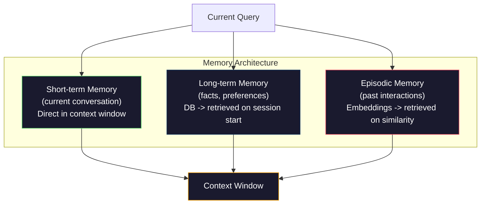

# Rekayasa Konteks: Windows, Anggaran, Memori, dan Pengambilan

> Rekayasa cepat adalah bagiannya. Rekayasa konteks adalah keseluruhan permainannya. Prompt adalah string yang kamu ketik. Konteks adalah segala sesuatu yang masuk ke jendela model: instruksi sistem, dokumen yang diambil, definisi alat, riwayat percakapan, beberapa contoh, dan prompt itu sendiri. Insinyur AI terbaik di tahun 2026 adalah insinyur konteks. Mereka memutuskan apa yang masuk, apa yang tidak, dan bagaimana urutannya.

**Type:** Build
**Language:** Python
**Prerequisites:** Fase 10 (LLM dari Awal), Fase 11 Lesson 01-02
**Waktu:** ~90 menit
**Terkait:** Fase 11 · 15 (Prompt Caching) — tata letak ramah cache merupakan perpanjangan dari rekayasa konteks. Fase 5 · 28 (Evaluasi Konteks Panjang) tentang bagaimana mengukur loss di tengah-tengah dengan NIAH/RULER.

## Tujuan Pembelajaran

- Hitung anggaran token di semua komponen jendela konteks (system prompt, alat, riwayat, dokumen yang diambil, ruang kepala pembuatan)
- Menerapkan strategi manajemen jendela konteks: pemotongan, ringkasan, dan jendela geser untuk riwayat percakapan
- Memprioritaskan dan mengurutkan komponen konteks untuk memaksimalkan attention model pada informasi yang paling relevan
- Membangun assembler konteks yang secara dinamis mengalokasikan token berdasarkan jenis kueri dan ruang jendela yang tersedia

## Masalah

Claude Opus 4.7 memiliki jendela token 200 ribu (1 juta dalam versi beta). GPT-5 memiliki 400K. Gemini 3 Pro memiliki 2M. Llama 4 mengklaim 10 juta. Angka-angka ini terdengar sangat besar sampai kamu mengisinya.

Berikut adalah rincian nyata untuk asisten coding. System prompt: 500 token. Definisi alat untuk 50 alat: 8.000 token. Dokumentasi yang diambil: 4.000 token. Riwayat percakapan (10 putaran): 6.000 token. Permintaan pengguna saat ini: 200 token. Anggaran pembangkitan (output maksimal): 4.000 token. Total: 22.700 token. Itu hanya 18% dari jendela 128K.

Namun attention tidak berskala linear seiring dengan panjangnya konteks. Model dengan 128 ribu token konteks memberikan biaya attention kuadrat (O(n^2) pada Transformer vanilla, meskipun sebagian besar model produksi menggunakan varian attention yang efisien). Lebih penting lagi, akurasi pengambilan menurun. Tes "Jarum di Tumpukan Jerami" menunjukkan bahwa model kesulitan menemukan informasi yang ditempatkan di tengah konteks yang panjang. Penelitian Liu dkk. (2023) menunjukkan bahwa LLM mengambil informasi di awal dan akhir konteks panjang dengan akurasi mendekati sempurna, namun akurasi turun 10-20% untuk informasi yang ditempatkan di tengah (posisi 40-70% konteks). Efek "hilang di tengah-tengah" ini bervariasi berdasarkan model, namun memengaruhi semua arsitektur saat ini.

Lesson praktisnya: tersedianya 200 ribu token tidak berarti penggunaan 200 ribu token itu efektif. Konteks token 10K yang dikurasi dengan cermat sering kali mengungguli konteks token 100K yang dibuang. Rekayasa konteks adalah disiplin memaksimalkan rasio signal-to-noise dalam jendela konteks.

Setiap token yang kamu masukkan ke dalam jendela menggantikan token yang dapat membawa informasi yang lebih relevan. Setiap definisi alat yang tidak relevan, setiap percakapan yang membosankan, setiap potongan teks yang diambil yang tidak menjawab pertanyaan -- masing-masing membuat model sedikit lebih buruk dalam tugasnya.

## Konsep

### Jendela Konteks adalah Sumber Daya yang Langka

Bayangkan jendela konteks sebagai RAM, bukan disk. Ini cepat dan dapat diakses langsung, tetapi terbatas. kamu tidak bisa menyesuaikan semuanya. kamu harus memilih.

```mermaid
graph TD
    subgraph Window["Context Window (128K tokens)"]
        direction TB
        S["System Prompt\n~500 tokens"] --> T["Tool Definitions\n~2K-8K tokens"]
        T --> R["Retrieved Context\n~2K-10K tokens"]
        R --> H["Conversation History\n~2K-20K tokens"]
        H --> F["Few-shot Examples\n~1K-3K tokens"]
        F --> Q["User Query\n~100-500 tokens"]
        Q --> G["Generation Budget\n~2K-8K tokens"]
    end

    style S fill:#1a1a2e,stroke:#e94560,color:#fff
    style T fill:#1a1a2e,stroke:#0f3460,color:#fff
    style R fill:#1a1a2e,stroke:#ffa500,color:#fff
    style H fill:#1a1a2e,stroke:#51cf66,color:#fff
    style F fill:#1a1a2e,stroke:#9b59b6,color:#fff
    style Q fill:#1a1a2e,stroke:#e94560,color:#fff
    style G fill:#1a1a2e,stroke:#0f3460,color:#fff
```Setiap komponen bersaing untuk mendapatkan ruang. Menambahkan lebih banyak definisi alat berarti lebih sedikit ruang untuk riwayat percakapan. Menambahkan lebih banyak konteks yang diambil berarti lebih sedikit ruang untuk beberapa contoh. Rekayasa konteks adalah seni mengalokasikan anggaran ini untuk memaksimalkan kinerja tugas.

### Tersesat di Tengah

Temuan empiris paling penting dalam rekayasa konteks. Model memperhatikan informasi dengan lebih baik di awal dan akhir konteks. Informasi yang berada di tengah mendapat skor attention yang lebih rendah dan lebih besar kemungkinannya untuk diabaikan.

Liu dkk. (2023) mengujinya secara sistematis. Mereka menempatkan dokumen yang relevan di antara 20 dokumen yang tidak relevan di berbagai posisi dan mengukur keakuratan jawaban. Ketika dokumen yang relevan berada di urutan pertama atau terakhir, keakuratannya adalah 85-90%. Saat berada di tengah (posisi 10 dari 20), akurasinya turun menjadi 60-70%.

Hal ini mempunyai implikasi rekayasa langsung:

- Tempatkan informasi terpenting terlebih dahulu (system prompt, instruksi penting)
- Letakkan kueri saat ini dan konteks yang paling relevan di urutan terakhir (bias kekinian membantu)
- Perlakukan konteks tengah sebagai zona dengan prioritas paling rendah
- Jika kamu harus memasukkan informasi di tengah, duplikat poin kunci di akhir

```mermaid
graph LR
    subgraph Attention["Attention Distribution Across Context"]
        direction LR
        P1["Position 0-20%\nHIGH attention\n(system prompt)"]
        P2["Position 20-40%\nMODERATE"]
        P3["Position 40-70%\nLOW attention\n(lost in middle)"]
        P4["Position 70-90%\nMODERATE"]
        P5["Position 90-100%\nHIGH attention\n(current query)"]
    end

    style P1 fill:#51cf66,color:#000
    style P2 fill:#ffa500,color:#000
    style P3 fill:#ff6b6b,color:#fff
    style P4 fill:#ffa500,color:#000
    style P5 fill:#51cf66,color:#000
```

### Komponen Konteks

**Permintaan sistem**: menetapkan persona, batasan, dan aturan perilaku. Ini dilakukan terlebih dahulu dan tetap konstan sepanjang putaran. Claude Code menggunakan sekitar 6.000 token untuk prompt sistemnya termasuk definisi alat dan instruksi perilaku. Jaga agar tetap rapat. Setiap kata dalam system prompt diulangi pada setiap panggilan API.

**Definisi alat**: setiap alat menambahkan 50-200 token (nama, deskripsi, skema parameter). 50 alat dengan masing-masing 150 token sama dengan 7.500 token sebelum percakapan apa pun terjadi. Pemilihan alat dinamis -- hanya menyertakan alat yang relevan dengan kueri saat ini -- dapat mengurangi hal ini sebesar 60-80%.

**Konteks yang diambil**: dokumen dari database vector, hasil pencarian, konten file. Kualitas pengambilan secara langsung menentukan kualitas respons. Pengambilan yang buruk lebih buruk daripada tidak ada pengambilan -- hal ini memenuhi jendela dengan gangguan dan secara aktif menyesatkan model.

**Riwayat percakapan**: setiap pesan pengguna sebelumnya dan respons asisten. Tumbuh secara linear seiring dengan lamanya percakapan. Percakapan 50 putaran dengan 200 token per giliran adalah 10.000 token sejarah. Sebagian besar tidak relevan dengan kueri saat ini.

**Contoh singkat**: pasangan input/output yang menunjukkan perilaku yang diinginkan. Dua hingga tiga contoh yang dipilih dengan baik sering kali meningkatkan kualitas output lebih dari ribuan token instruksi. Tapi itu membutuhkan ruang.

**Anggaran pembangkitan**: token yang dicadangkan untuk respons model. Jika kamu mengisi jendela hingga kapasitasnya, model tidak memiliki ruang untuk menjawab. Cadangan setidaknya 2.000-4.000 token untuk pembuatan.

### Strategi Kompresi Konteks

**Ringkasan riwayat**: daripada menyimpan semua putaran sebelumnya secara verbatim, rangkum percakapan secara berkala. “Kami berdiskusi X, memutuskan Y, dan pengguna menginginkan Z” dalam 100 token menggantikan 10 putaran yang membutuhkan 2.000 token. Jalankan peringkasan ketika riwayat melebihi ambang batas (misalnya, 5.000 token).

**Pemfilteran relevansi**: menilai setiap dokumen yang diambil berdasarkan kueri saat ini dan membuang dokumen di bawah ambang batas. Jika kamu mengambil 10 potongan tetapi hanya 3 yang relevan, buang 7 potongan lainnya. Lebih baik memiliki 3 potongan yang sangat relevan daripada 10 potongan yang biasa-biasa saja.**Pemangkasan alat**: mengklasifikasikan maksud kueri pengguna dan hanya menyertakan alat yang relevan dengan maksud tersebut. Pertanyaan code tidak memerlukan alat kalender. Pertanyaan penjadwalan tidak memerlukan alat sistem file. Hal ini dapat mengurangi definisi alat dari 8.000 token menjadi 1.000.

**Peringkasan rekursif**: untuk dokumen yang sangat panjang, rangkum secara bertahap. Pertama-tama rangkum setiap bagian, lalu rangkum ringkasannya. Dokumen setebal 50 halaman menjadi intisari 500 token yang menangkap poin-poin penting.

### Sistem Memori

Rekayasa konteks mencakup tiga cakrawala waktu.

**Memori jangka pendek**: percakapan saat ini. Disimpan di jendela konteks secara langsung. Tumbuh di setiap belokan. Dikelola dengan peringkasan dan pemotongan.

**Memori jangka panjang**: fakta dan preferensi yang bertahan sepanjang percakapan. "Pengguna lebih menyukai TypeScript." "Proyek ini menggunakan PostgreSQL." Disimpan dalam database, diambil pada awal sesi. Claude Code menyimpannya dalam file CLAUDE.md. ChatGPT menyimpannya di feature memorinya.

**Memori episodik**: interaksi spesifik di masa lalu yang mungkin relevan. "Selasa lalu, kami men-debug masalah serupa di modul autentikasi." Disimpan sebagai embedding, diambil ketika percakapan saat ini cocok dengan episode sebelumnya.



### Majelis Konteks Dinamis

Wawasan utamanya: kueri yang berbeda memerlukan konteks yang berbeda. Prompt sistem statis + alat statis + riwayat statis adalah pemborosan. Sistem terbaik secara dinamis menyusun konteks per kueri.

1. Klasifikasikan maksud kueri
2. Pilih alat yang relevan (tidak semua alat)
3. Ambil dokumen yang relevan (bukan kumpulan tetap)
4. Sertakan pergantian sejarah yang relevan (tidak semua sejarah)
5. Tambahkan beberapa contoh contoh yang cocok dengan jenis tugas
6. Urutkan segala sesuatu berdasarkan kepentingannya: penting pertama, penting terakhir, opsional di tengah

Inilah yang membedakan aplikasi AI yang bagus dengan aplikasi hebat. Modelnya sama. Konteksnya adalah pembedanya.

## Build

### Langkah 1: Penghitung Token

kamu tidak dapat menganggarkan apa yang tidak dapat kamu ukur. Buat penghitung token sederhana (perkiraan menggunakan pemisahan spasi, karena jumlah pastinya bergantung pada tokenizer).

```python
import json
import numpy as np
from collections import OrderedDict

def count_tokens(text):
    if not text:
        return 0
    return int(len(text.split()) * 1.3)

def count_tokens_json(obj):
    return count_tokens(json.dumps(obj))
```

### Langkah 2: Manajer Anggaran Konteks

Abstraksi inti. Manajer anggaran melacak berapa banyak token yang digunakan setiap komponen dan menerapkan batasan.

```python
class ContextBudget:
    def __init__(self, max_tokens=128000, generation_reserve=4000):
        self.max_tokens = max_tokens
        self.generation_reserve = generation_reserve
        self.available = max_tokens - generation_reserve
        self.allocations = OrderedDict()

    def allocate(self, component, content, max_tokens=None):
        tokens = count_tokens(content)
        if max_tokens and tokens > max_tokens:
            words = content.split()
            target_words = int(max_tokens / 1.3)
            content = " ".join(words[:target_words])
            tokens = count_tokens(content)

        used = sum(self.allocations.values())
        if used + tokens > self.available:
            allowed = self.available - used
            if allowed <= 0:
                return None, 0
            words = content.split()
            target_words = int(allowed / 1.3)
            content = " ".join(words[:target_words])
            tokens = count_tokens(content)

        self.allocations[component] = tokens
        return content, tokens

    def remaining(self):
        used = sum(self.allocations.values())
        return self.available - used

    def utilization(self):
        used = sum(self.allocations.values())
        return used / self.max_tokens

    def report(self):
        total_used = sum(self.allocations.values())
        lines = []
        lines.append(f"Context Budget Report ({self.max_tokens:,} token window)")
        lines.append("-" * 50)
        for component, tokens in self.allocations.items():
            pct = tokens / self.max_tokens * 100
            bar = "#" * int(pct / 2)
            lines.append(f"  {component:<25} {tokens:>6} tokens ({pct:>5.1f}%) {bar}")
        lines.append("-" * 50)
        lines.append(f"  {'Used':<25} {total_used:>6} tokens ({total_used/self.max_tokens*100:.1f}%)")
        lines.append(f"  {'Generation reserve':<25} {self.generation_reserve:>6} tokens")
        lines.append(f"  {'Remaining':<25} {self.remaining():>6} tokens")
        return "\n".join(lines)
```

### Langkah 3: Penataan Ulang yang Hilang di Tengah

Terapkan strategi penataan ulang: item yang paling penting didahulukan dan terakhir, yang paling tidak penting ditempatkan di tengah.

```python
def reorder_lost_in_middle(items, scores):
    paired = sorted(zip(scores, items), reverse=True)
    sorted_items = [item for _, item in paired]

    if len(sorted_items) <= 2:
        return sorted_items

    first_half = sorted_items[::2]
    second_half = sorted_items[1::2]
    second_half.reverse()

    return first_half + second_half

def score_relevance(query, documents):
    query_words = set(query.lower().split())
    scores = []
    for doc in documents:
        doc_words = set(doc.lower().split())
        if not query_words:
            scores.append(0.0)
            continue
        overlap = len(query_words & doc_words) / len(query_words)
        scores.append(round(overlap, 3))
    return scores
```

### Langkah 4: Kompresor Riwayat Percakapan

Ringkaslah percakapan lama untuk mendapatkan kembali anggaran token.

```python
class ConversationManager:
    def __init__(self, max_history_tokens=5000):
        self.turns = []
        self.summaries = []
        self.max_history_tokens = max_history_tokens

    def add_turn(self, role, content):
        self.turns.append({"role": role, "content": content})
        self._compress_if_needed()

    def _compress_if_needed(self):
        total = sum(count_tokens(t["content"]) for t in self.turns)
        if total <= self.max_history_tokens:
            return

        while total > self.max_history_tokens and len(self.turns) > 4:
            old_turns = self.turns[:2]
            summary = self._summarize_turns(old_turns)
            self.summaries.append(summary)
            self.turns = self.turns[2:]
            total = sum(count_tokens(t["content"]) for t in self.turns)

    def _summarize_turns(self, turns):
        parts = []
        for t in turns:
            content = t["content"]
            if len(content) > 100:
                content = content[:100] + "..."
            parts.append(f"{t['role']}: {content}")
        return "Previous: " + " | ".join(parts)

    def get_context(self):
        parts = []
        if self.summaries:
            parts.append("[Conversation Summary]")
            for s in self.summaries:
                parts.append(s)
        parts.append("[Recent Conversation]")
        for t in self.turns:
            parts.append(f"{t['role']}: {t['content']}")
        return "\n".join(parts)

    def token_count(self):
        return count_tokens(self.get_context())
```

### Langkah 5: Pemilih Alat Dinamis

Hanya sertakan alat yang relevan dengan kueri saat ini. Klasifikasikan niat, lalu filter.

```python
TOOL_REGISTRY = {
    "read_file": {
        "description": "Read contents of a file",
        "tokens": 120,
        "categories": ["code", "files"],
    },
    "write_file": {
        "description": "Write content to a file",
        "tokens": 150,
        "categories": ["code", "files"],
    },
    "search_code": {
        "description": "Search for patterns in codebase",
        "tokens": 130,
        "categories": ["code"],
    },
    "run_command": {
        "description": "Execute a shell command",
        "tokens": 140,
        "categories": ["code", "system"],
    },
    "create_calendar_event": {
        "description": "Create a new calendar event",
        "tokens": 180,
        "categories": ["calendar"],
    },
    "list_emails": {
        "description": "List recent emails",
        "tokens": 160,
        "categories": ["email"],
    },
    "send_email": {
        "description": "Send an email message",
        "tokens": 200,
        "categories": ["email"],
    },
    "web_search": {
        "description": "Search the web for information",
        "tokens": 140,
        "categories": ["research"],
    },
    "query_database": {
        "description": "Run a SQL query on the database",
        "tokens": 170,
        "categories": ["code", "data"],
    },
    "generate_chart": {
        "description": "Generate a chart from data",
        "tokens": 190,
        "categories": ["data", "visualization"],
    },
}

def classify_intent(query):
    query_lower = query.lower()

    intent_keywords = {
        "code": ["code", "function", "bug", "error", "file", "implement", "refactor", "debug", "test"],
        "calendar": ["meeting", "schedule", "calendar", "appointment", "event"],
        "email": ["email", "mail", "send", "inbox", "message"],
        "research": ["search", "find", "what is", "how does", "explain", "look up"],
        "data": ["data", "query", "database", "chart", "graph", "analytics", "sql"],
    }

    scores = {}
    for intent, keywords in intent_keywords.items():
        score = sum(1 for kw in keywords if kw in query_lower)
        if score > 0:
            scores[intent] = score

    if not scores:
        return ["code"]

    max_score = max(scores.values())
    return [intent for intent, score in scores.items() if score >= max_score * 0.5]

def select_tools(query, token_budget=2000):
    intents = classify_intent(query)
    relevant = {}
    total_tokens = 0

    for name, tool in TOOL_REGISTRY.items():
        if any(cat in intents for cat in tool["categories"]):
            if total_tokens + tool["tokens"] <= token_budget:
                relevant[name] = tool
                total_tokens += tool["tokens"]

    return relevant, total_tokens
```

### Langkah 6: Alur Perakitan Konteks Penuh

Hubungkan semuanya menjadi satu. Jika ada kueri, susun konteks optimal secara dinamis.

```python
class ContextEngine:
    def __init__(self, max_tokens=128000, generation_reserve=4000):
        self.budget = ContextBudget(max_tokens, generation_reserve)
        self.conversation = ConversationManager(max_history_tokens=5000)
        self.system_prompt = (
            "You are a helpful AI assistant. You have access to tools for "
            "code editing, file management, web search, and data analysis. "
            "Use the appropriate tools for each task. Be concise and accurate."
        )
        self.knowledge_base = [
            "Python 3.12 introduced type parameter syntax for generic classes using bracket notation.",
            "The project uses PostgreSQL 16 with pgvector for embedding storage.",
            "Authentication is handled by Supabase Auth with JWT tokens.",
            "The frontend is built with Next.js 15 using the App Router.",
            "API rate limits are set to 100 requests per minute per user.",
            "The deployment pipeline uses GitHub Actions with Docker multi-stage builds.",
            "Test coverage must be above 80% for all new modules.",
            "The codebase follows the repository pattern for data access.",
        ]

    def assemble(self, query):
        self.budget = ContextBudget(self.budget.max_tokens, self.budget.generation_reserve)

        system_content, _ = self.budget.allocate("system_prompt", self.system_prompt, max_tokens=1000)

        tools, tool_tokens = select_tools(query, token_budget=2000)
        tool_text = json.dumps(list(tools.keys()))
        tool_content, _ = self.budget.allocate("tools", tool_text, max_tokens=2000)

        relevance = score_relevance(query, self.knowledge_base)
        threshold = 0.1
        relevant_docs = [
            doc for doc, score in zip(self.knowledge_base, relevance)
            if score >= threshold
        ]

        if relevant_docs:
            doc_scores = [s for s in relevance if s >= threshold]
            reordered = reorder_lost_in_middle(relevant_docs, doc_scores)
            doc_text = "\n".join(reordered)
            doc_content, _ = self.budget.allocate("retrieved_context", doc_text, max_tokens=3000)

        history_text = self.conversation.get_context()
        if history_text.strip():
            history_content, _ = self.budget.allocate("conversation_history", history_text, max_tokens=5000)

        query_content, _ = self.budget.allocate("user_query", query, max_tokens=500)

        return self.budget

    def chat(self, query):
        self.conversation.add_turn("user", query)
        budget = self.assemble(query)
        response = f"[Response to: {query[:50]}...]"
        self.conversation.add_turn("assistant", response)
        return budget


def run_demo():
    print("=" * 60)
    print("  Context Engineering Pipeline Demo")
    print("=" * 60)

    engine = ContextEngine(max_tokens=128000, generation_reserve=4000)

    print("\n--- Query 1: Code task ---")
    budget = engine.chat("Fix the bug in the authentication module where JWT tokens expire too early")
    print(budget.report())

    print("\n--- Query 2: Research task ---")
    budget = engine.chat("What is the best approach for implementing vector search in PostgreSQL?")
    print(budget.report())

    print("\n--- Query 3: After conversation history builds up ---")
    for i in range(8):
        engine.conversation.add_turn("user", f"Follow-up question number {i+1} about the implementation details of the system")
        engine.conversation.add_turn("assistant", f"Here is the response to follow-up {i+1} with technical details about the architecture")

    budget = engine.chat("Now implement the changes we discussed")
    print(budget.report())

    print("\n--- Tool Selection Examples ---")
    test_queries = [
        "Fix the bug in auth.py",
        "Schedule a meeting with the team for Tuesday",
        "Show me the database query performance stats",
        "Search for best practices on error handling",
    ]

    for q in test_queries:
        tools, tokens = select_tools(q)
        intents = classify_intent(q)
        print(f"\n  Query: {q}")
        print(f"  Intents: {intents}")
        print(f"  Tools: {list(tools.keys())} ({tokens} tokens)")

    print("\n--- Lost-in-the-Middle Reordering ---")
    docs = ["Doc A (most relevant)", "Doc B (somewhat relevant)", "Doc C (least relevant)",
            "Doc D (relevant)", "Doc E (moderately relevant)"]
    scores = [0.95, 0.60, 0.20, 0.80, 0.50]
    reordered = reorder_lost_in_middle(docs, scores)
    print(f"  Original order: {docs}")
    print(f"  Scores:         {scores}")
    print(f"  Reordered:      {reordered}")
    print(f"  (Most relevant at start and end, least relevant in middle)")
```

## Pakai

### Strategi Konteks Claude Code

Claude Code mengelola konteks dengan pendekatan berlapis. System prompt mencakup aturan perilaku dan definisi alat (~6 ribu token). Saat kamu membuka file, isinya dimasukkan sebagai konteks. Saat kamu mencari, hasilnya ditambahkan. Percakapan lama dirangkum. CLAUDE.md menyediakan memori jangka panjang yang bertahan di seluruh sesi.

Keputusan teknis utama: Claude Code tidak membuang seluruh basis code kamu ke dalam konteksnya. Ini mengambil file yang relevan sesuai permintaan. Ini adalah rekayasa konteks dalam praktiknya.

### Pemuatan Konteks Dinamis KursorKursor mengindeks seluruh basis code kamu ke dalam embeddings. Saat kamu mengetikkan kueri, kueri tersebut mengambil file dan blok code yang paling relevan menggunakan kesamaan vector. Hanya bagian-bagian itu yang masuk ke jendela konteks. Basis code 500 ribu baris dikompresi menjadi 5-10 blok code paling relevan.

Inilah polanya: sematkan semuanya, ambil sesuai permintaan, sertakan hanya yang penting saja.

### Memori ObrolanGPT

ChatGPT menyimpan preferensi dan fakta pengguna sebagai memori jangka panjang. Pada setiap percakapan dimulai, kenangan yang relevan diambil dan disertakan dalam system prompt. "Pengguna lebih memilih Python" berharga 5 token tetapi menghemat ratusan token instruksi berulang di seluruh percakapan.

### RAG sebagai Rekayasa Konteks

Retrieval-Augmented Generation adalah rekayasa konteks yang diformalkan. Daripada memasukkan pengetahuan ke dalam weight model (training) atau system prompt (konteks statis), kamu mengambil dokumen yang relevan pada waktu kueri dan memasukkannya ke dalam jendela konteks. Keseluruhan pipeline RAG -- chunking, embedding, retrieval, reranking -- hadir untuk memecahkan satu masalah: menempatkan informasi yang benar di jendela konteks.

## Kirim

Lesson ini menghasilkan `outputs/prompt-context-optimizer.md` -- prompt yang dapat digunakan kembali untuk mengaudit strategi perakitan konteks dan merekomendasikan optimization. Berikan prompt sistem kamu, jumlah alat, panjang riwayat rata-rata, dan strategi pengambilan, dan ini mengidentifikasi pemborosan token dan menyarankan perbaikan.

Ini juga menghasilkan `outputs/skill-context-engineering.md` -- kerangka keputusan untuk merancang alur perakitan konteks berdasarkan jenis tugas, ukuran jendela konteks, dan anggaran latensi.

## Latihan

1. Tambahkan "detektor pemborosan token" ke kelas ContextBudget. Ini harus menandai komponen yang menggunakan lebih dari 30% anggaran dan menyarankan strategi kompresi khusus untuk setiap jenis komponen (meringkas riwayat, alat pemangkasan, menyusun ulang peringkat dokumen).

2. Menerapkan deduplikasi semantik untuk konteks yang diambil. Jika dua dokumen yang diambil memiliki kemiripan lebih dari 80% (berdasarkan kata yang tumpang tindih atau kemiripan kosinus dari embedding-nya), simpan hanya dokumen yang memiliki skor lebih tinggi. Ukur berapa banyak anggaran token yang dapat dipulihkan.

3. Buat alat "pemutaran ulang konteks". Dengan adanya transkrip percakapan, putar ulang melalui ContextEngine dan visualisasikan bagaimana alokasi anggaran berubah secara bergantian. Plot penggunaan token per komponen dari waktu ke waktu. Identifikasi titik balik ketika konteks mulai dikompresi.

4. Menerapkan pemilih alat berdasarkan prioritas. Alih-alih menyertakan/mengecualikan biner, tetapkan skor relevansi pada setiap alat untuk kueri saat ini. Sertakan alat dalam urutan relevansi menurun hingga anggaran alat habis. Bandingkan kinerja tugas dengan 5, 10, 20, dan 50 alat yang disertakan.

5. Membangun kompresor konteks multi-strategi. Terapkan tiga strategi kompresi (pemotongan, peringkasan, ekstraksi kalimat kunci) dan tolak ukurnya pada 20 dokumen. Ukur tradeoff antara rasio kompresi dan retensi informasi (apakah versi terkompresi masih berisi jawaban atas pertanyaan?).

## Istilah Kunci| Istilah | Apa kata orang | Apa sebenarnya arti |
|------|----------------|----------------------|
| Jendela konteks | "Seberapa banyak model yang dapat membaca" | Jumlah maksimum token (input + output) yang diproses model dalam satu forward pass -- 400K untuk GPT-5, 200K (1M beta) untuk Claude Opus 4.7, 2M untuk Gemini 3 Pro |
| Rekayasa konteks | "Rekayasa cepat tingkat lanjut" | Disiplin dalam memutuskan apa yang masuk ke jendela konteks, dalam urutan apa, dan pada prioritas apa -- meliputi pengambilan, kompresi, pemilihan alat, dan manajemen memori |
| Tersesat di tengah | "Model melupakan hal-hal di tengah" | Temuan empiris bahwa LLM memberikan attention lebih baik pada awal dan akhir konteks, dengan penurunan akurasi 10-20% untuk informasi yang ditempatkan di tengah |
| Anggaran token | "Berapa banyak token yang tersisa" | Alokasi eksplisit kapasitas jendela konteks di seluruh komponen (system prompt, alat, riwayat, pengambilan, pembuatan) dengan batasan per komponen |
| Konteks dinamis | "Memuat barang dengan cepat" | Merakit jendela konteks secara berbeda untuk setiap kueri berdasarkan klasifikasi maksud, pemilihan alat yang relevan, dan hasil pengambilan |
| Ringkasan sejarah | "Memampatkan percakapan" | Mengganti percakapan lama kata demi kata dengan ringkasan ringkas, mengurangi biaya token sambil menjaga informasi penting |
| Alat pemangkasan | "Hanya menyertakan alat yang relevan" | Mengklasifikasikan maksud kueri dan hanya menyertakan definisi alat yang cocok, mengurangi biaya token alat sebesar 60-80% |
| Memori jangka panjang | "Mengingat seluruh sesi" | Fakta dan preferensi disimpan dalam database dan diambil pada awal sesi -- CLAUDE.md, Memori ChatGPT, dan sistem serupa |
| Memori episodik | "Mengingat peristiwa masa lalu yang spesifik" | Interaksi sebelumnya disimpan sebagai embedding dan diambil ketika kueri saat ini mirip dengan percakapan sebelumnya |
| Anggaran generasi | "Ruang untuk jawabannya" | Token dicadangkan untuk output model -- jika konteks memenuhi jendela sepenuhnya, model tidak mempunyai ruang untuk merespons |

## Bacaan Lanjutan- [Liu et al., 2023 -- "Lost in the Middle: How Language Models Use Long Contexts"](https://arxiv.org/abs/2307.03172) -- studi definitif tentang attention yang bergantung pada posisi, menunjukkan bahwa model kesulitan dengan informasi di tengah konteks yang panjang
- [postingan blog Pengambilan Kontekstual Anthropic](https://www.anthropic.com/news/contextual-retrieval) -- bagaimana Anthropic melakukan pendekatan pengambilan bongkahan sadar konteks, sehingga mengurangi kegagalan pengambilan sebesar 49%
- ["Rekayasa Konteks" Simon Willison](https://simonwillison.net/2025/Jun/27/context-engineering/) -- entri blog yang memberi nama disiplin ilmu tersebut dan membedakannya dari rekayasa cepat
- [Dokumentasi LangChain tentang RAG](https://python.langchain.com/docs/tutorials/rag/) -- implementasi praktis dari generasi retrieval-augmented sebagai pola rekayasa konteks
- [Tes Needle in a Haystack Greg Kamradt](https://github.com/gkamradt/LLMTest_NeedleInAHaystack) -- tolok ukur yang mengungkapkan kegagalan pengambilan yang bergantung pada posisi di semua model utama
- [Pope et al., "Efficiently Scaling Transformer Inference" (2022)](https://arxiv.org/abs/2211.05102) -- mengapa panjang konteks mendorong memori dan latensi, dan bagaimana cache KV, MQA, dan GQA mengubah penghitungan anggaran.
- [Agrawal dkk., "SARATHI: Inference LLM yang Efisien dengan Membonceng Dekode dengan Prefill yang Dipotong" (2023)](https://arxiv.org/abs/2308.16369) -- dua fase inference yang membuat permintaan panjang menjadi mahal di TTFT namun murah di TPOT; kebenaran dasar di balik tradeoff yang mengemas konteks.
- [Ainslie dkk., "GQA: Training Model Transformer Multikueri Umum dari Pos Pemeriksaan Multi-Kepala" (EMNLP 2023)](https://arxiv.org/abs/2305.13245) -- makalah attention kueri yang dikelompokkan yang memotong memori KV 8× dalam dekoder produksi tanpa kehilangan kualitas.
