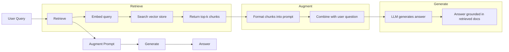
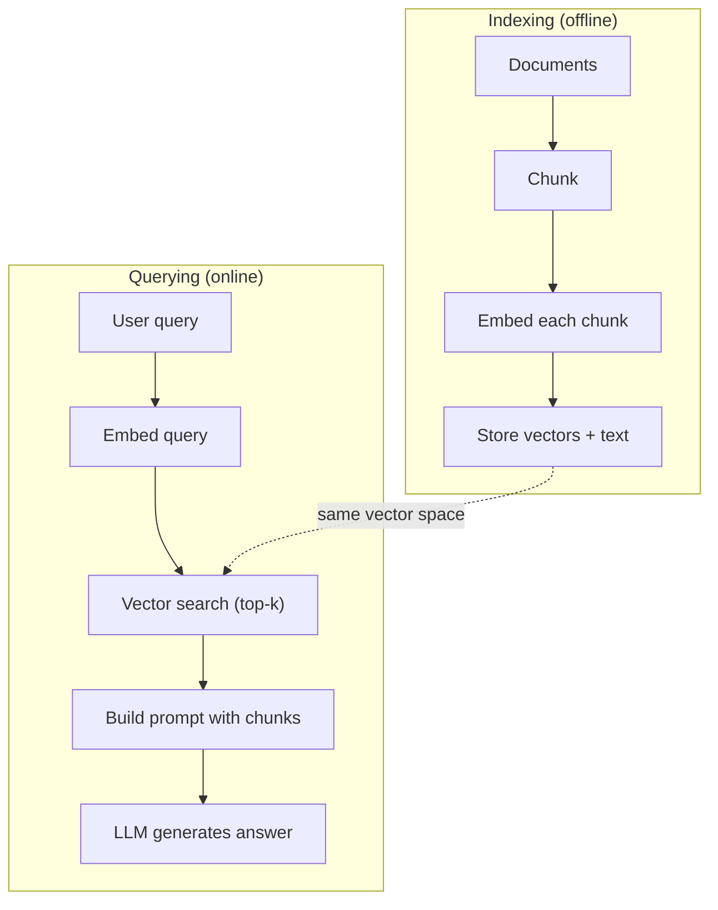

# RAG (Generasi Pengambilan-Augmented)

> LLM kamu mengetahui segalanya hingga batas training-nya. Ia tidak mengetahui apa pun tentang dokumen perusahaan kamu, basis code kamu, atau catatan rapat minggu lalu. RAG memecahkan masalah ini dengan mengambil dokumen yang relevan dan memasukkannya ke dalam prompt. Ini adalah pola yang paling banyak diterapkan dalam AI produksi. Jika kamu membangun satu hal dari kursus ini, buatlah pipeline RAG.

**Type:** Build
**Language:** Python
**Prerequisites:** Fase 10 (LLM dari Awal), Fase 11 Lesson 01-05
**Waktu:** ~90 menit
**Terkait:** Fase 5 · 23 (Strategi Chunking untuk RAG) untuk enam algoritma chunking dan kapan masing-masing algoritma menang. Fase 5 · 22 (Penyelaman Model Embedding Mendalam) untuk memilih penyemat. Fase 11 · 07 (RAG Lanjutan) untuk pencarian hibrid, pemeringkatan ulang, dan transformasi kueri.

## Tujuan Pembelajaran

- Build pipeline RAG yang lengkap: pemuatan dokumen, pemotongan, embedding, penyimpanan vector, pengambilan, dan pembuatan
- Menerapkan pencarian semantik menggunakan database vector (ChromaDB, FAISS, atau Pinecone) dengan pengindeksan yang tepat
- Jelaskan mengapa RAG lebih disukai daripada penyesuaian untuk aplikasi berbasis pengetahuan (biaya, kesegaran, atribusi)
- Evaluasi kualitas RAG menggunakan metrik pengambilan (presisi, perolehan) dan metrik generasi (kesetiaan, relevansi)

## Masalah

kamu membangun chatbot untuk perusahaan kamu. Seorang pelanggan bertanya, "Apa kebijakan pengembalian dana untuk paket perusahaan?" LLM merespons dengan jawaban umum tentang kebijakan pengembalian dana SaaS pada umumnya. Kebijakan sebenarnya, yang tertanam dalam wiki internal setebal 200 halaman, mengatakan bahwa pelanggan perusahaan mendapatkan jangka waktu 60 hari dengan pengembalian dana pro-rata. LLM belum pernah melihat dokumen ini. Ia tidak dapat mengetahui apa yang tidak dilatihnya.

Penyempurnaan adalah salah satu solusinya. Ambil LLM, latih di dokumen internal kamu, dan terapkan model yang diperbarui. Ini berhasil tetapi memiliki masalah serius. Penyempurnaan membutuhkan biaya komputasi ribuan dolar. Model menjadi basi saat dokumen berubah. kamu tidak dapat mengetahui dari sumber mana model tersebut diambil. Dan jika perusahaan mengakuisisi lini produk lain bulan depan, kamu akan menyempurnakannya lagi.

RAG adalah solusi lainnya. Biarkan modelnya tidak tersentuh. Saat ada pertanyaan yang masuk, cari bagian yang relevan di penyimpanan dokumen kamu, tempelkan ke dalam prompt sebelum pertanyaan, dan biarkan model menjawab menggunakan bagian tersebut sebagai konteks. Penyimpanan dokumen dapat diperbarui dalam hitungan menit. kamu dapat melihat dengan tepat dokumen mana yang diambil. Modelnya sendiri tidak pernah berubah. Inilah sebabnya RAG menjadi pola dominan dalam produksi: lebih murah, lebih segar, lebih mudah diaudit, dan dapat digunakan dengan LLM apa pun.

## Konsep

### Pola RAG

Seluruh pola cocok dalam empat langkah:



Kueri -> Ambil -> Tingkatkan prompt -> Hasilkan. Setiap sistem RAG mengikuti pola ini. Perbedaan antara sistem RAG produksi terletak pada detail setiap langkahnya: cara kamu melakukan pemotongan, cara kamu embed, cara kamu mencari, dan cara kamu membuat prompt.

### Mengapa RAG Mengalahkan Penyempurnaan

| Kekhawatiran | Penyempurnaan | RAG |
|---------|------------|-----|
| Biaya | $1.000-$100.000+ per training | $0,01-$0,10 per kueri (embedding + LLM) |
| Kesegaran | Basi sampai dilatih ulang | Diperbarui dalam hitungan menit dengan mengindeks ulang dokumen |
| Auditabilitas | Tidak dapat melacak jawaban ke sumber | Dapat menampilkan bagian yang diambil dengan tepat |
| Halusinasi | Masih bebas berhalusinasi | Didasarkan pada dokumen yang diambil |
| Privasi data | Training data dimasukkan ke dalam weight | Dokumen tetap berada di penyimpanan vector kamu |Penyempurnaan mengubah weight model secara permanen. RAG mengubah konteks model untuk sementara. Untuk sebagian besar aplikasi, konteks sementara adalah yang kamu inginkan.

Satu-satunya kasus di mana penyesuaian lebih unggul: ketika kamu memerlukan model untuk mengadopsi gaya, nada, atau pola penalaran tertentu yang tidak dapat dicapai melalui dorongan saja. Untuk pengambilan pengetahuan faktual, RAG selalu menang.

### Embed Model

Model embedding mengubah teks menjadi vector padat. Teks serupa menghasilkan vector yang berdekatan dalam ruang berdimensi tinggi ini. "Bagaimana cara mereset kata sandi saya?" dan "Saya perlu mengubah kata sandi" menghasilkan vector yang hampir sama meskipun hanya berbagi sedikit kata. "Kucing itu duduk di atas matras" menghasilkan vector yang sangat berbeda.

Model embedding umum (Jajaran produk tahun 2026 — lihat Fase 5 · 22 untuk analisis selengkapnya):

| Model | Dimension | Penyedia | Catatan |
|-------|-----------|----------|-------|
| teks-embedding-3-kecil | 1536 (Matryoshka) | OpenAI | Harga/kinerja terbaik untuk sebagian besar kasus penggunaan |
| embedding teks-3-besar | 3072 (Matryoshka) | OpenAI | Akurasi lebih tinggi, dapat dipotong hingga 256/512/1024 |
| Embedding Gemini 2 | 3072 (Matryoshka) | Google | Pengambilan MTEB teratas; Konteks 8K |
| pelayaran-4 | 1024/2048 (Matryoshka) | Pelayaran AI | Varian domain (code, keuangan, hukum) |
| Di sini semat-v4 | 1024 (Matryoshka) | menyatu | Multibahasa yang kuat, konteks 128K |
| BGE-M3 | 1024 (padat + jarang + ColBERT) | BAAI (weight terbuka) | Tiga tampilan dari satu model |
| Qwen3-Embedding | 4096 (Matryoshka) | Alibaba (berat terbuka) | Skor pengambilan weight terbuka teratas |
| semua-MiniLM-L6-v2 | 384 | Weight terbuka (Transformer Kalimat) | Dasar pembuatan prototipe |

Untuk lesson ini, kita membuat embedding sederhana kita sendiri menggunakan TF-IDF. Bukan karena TF-IDF yang digunakan oleh sistem produksi, namun karena TF-IDF membuat konsep menjadi konkrit: teks masuk, vector keluar, teks serupa menghasilkan vector serupa.

### Kemiripan Vector

Diberikan dua vector, bagaimana kamu mengukur kesamaan? Tiga pilihan:

**Kesamaan kosinus**: kosinus sudut antara dua vector. Berkisar dari -1 (berlawanan) hingga 1 (identik). Mengabaikan besarnya, hanya peduli pada arah. Ini adalah default untuk RAG.

```
cosine_sim(a, b) = dot(a, b) / (||a|| * ||b||)
```

**Produk titik**: produk dalam mentah. Vector yang lebih besar mendapatkan skor yang lebih tinggi. Berguna ketika besarnya informasi membawa informasi (dokumen yang lebih panjang mungkin lebih relevan).

```
dot(a, b) = sum(a_i * b_i)
```

**Distance L2 (Euclidean)**: distance garis lurus dalam ruang vector. Distance lebih kecil = lebih mirip. Sensitif terhadap perbedaan besarnya.

```
L2(a, b) = sqrt(sum((a_i - b_i)^2))
```

Kesamaan kosinus adalah standarnya. Ini menangani dokumen dengan panjang berbeda dengan baik karena dinormalisasi berdasarkan besarnya. Ketika seseorang mengatakan "pencarian vector", yang mereka maksud hampir selalu adalah kesamaan kosinus.

### Strategi Pemotongan

Dokumen terlalu panjang untuk di-embed sebagai vector tunggal. PDF setebal 50 halaman mungkin menghasilkan embedding yang buruk karena berisi lusinan topik. Sebagai gantinya, kamu membagi dokumen menjadi beberapa bagian dan embed setiap bagian secara terpisah.

**Pembagian ukuran tetap**: membagi setiap N token. Sederhana dan dapat diprediksi. Potongan 512 token dengan 50 token tumpang tindih berarti potongan 1 adalah token 0-511, potongan 2 adalah token 462-973, dan seterusnya. Tumpang tindih memastikan kamu tidak membagi kalimat pada batas yang tidak menguntungkan.

**Pembagian semantik**: terbagi pada batas alami. Paragraf, bagian, atau header penurunan harga. Setiap bagian merupakan unit makna yang koheren. Lebih kompleks untuk diterapkan tetapi menghasilkan pengambilan yang lebih baik.**Pembagian rekursif**: coba pisahkan pada batas terbesar terlebih dahulu (header bagian). Jika suatu bagian masih terlalu besar, pisahkan pada batas paragraf. Jika paragraf masih terlalu besar, pisahkan pada batas kalimat. Ini adalah pendekatan LangChain RecursiveCharacterTextSplitter dan berfungsi dengan baik dalam praktiknya.

Ukuran potongan lebih penting daripada yang dipikirkan orang:

- Terlalu kecil (64-128 token): setiap bagian tidak memiliki konteks. "Ini meningkat 15% pada kuartal terakhir" tidak berarti apa-apa tanpa mengetahui apa yang dimaksud dengan "itu".
- Terlalu besar (2048+ token): setiap bagian mencakup banyak topik, sehingga mengurangi relevansi. Saat kamu menelusuri data pendapatan, kamu mendapatkan potongan 10% tentang pendapatan dan 90% tentang jumlah karyawan.
- Sweet spot (256-512 token): cukup konteks untuk mandiri, cukup fokus agar relevan.

Sebagian besar sistem RAG produksi menggunakan 256-512 potongan token dengan 50 token yang tumpang tindih. Pedoman RAG Anthropic merekomendasikan kisaran ini.

### Basis Data Vector

Setelah kamu memiliki embeddings, kamu memerlukan tempat untuk menyimpan dan mencarinya. Pilihan:

| Basis Data | Ketik | Terbaik untuk |
|----------|------|----------|
| FAISS | Perpustakaan (dalam proses) | Pembuatan prototipe, dataset kecil hingga menengah |
| Kroma | DB Ringan | Pembangunan lokal, penerapan kecil |
| biji pinus | Layanan terkelola | Produksi tanpa overhead operasi |
| Weaviate | DB sumber terbuka | Produksi yang dihosting sendiri |
| vector pg | Ekstensi Postgres | Sudah menggunakan Postgres |
| Qdrant | DB sumber terbuka | Dihosting sendiri dengan performa tinggi |

Untuk lesson ini, kita membangun penyimpanan vector sederhana dalam memori. Ia menyimpan vector dalam daftar dan melakukan pencarian kesamaan kosinus secara brute force. Ini setara dengan FAISS dengan indeks datar. Skalanya mungkin mencapai 100.000 vector sebelum menjadi lambat. Sistem produksi menggunakan algoritma perkiraan nearest neighbor (ANN) seperti HNSW untuk mencari jutaan vector dalam milidetik.

### Pipeline Pipa Penuh



Fase pengindeksan berjalan satu kali per dokumen (atau saat dokumen diperbarui). Fase kueri berjalan pada setiap permintaan pengguna. Dalam produksi, pengindeksan mungkin memproses jutaan dokumen selama berjam-jam. Kueri harus merespons dalam waktu kurang dari satu detik.

### Bilangan Nyata

Sebagian besar sistem RAG produksi menggunakan parameter berikut:

- **k = 5 hingga 10** potongan yang diambil per kueri
- **Ukuran potongan = 256 hingga 512 token** dengan 50 token tumpang tindih
- **Anggaran konteks**: 2.500-5.000 token konten yang diambil per kueri
- **Total prompt**: ~8.000-16.000 token (system prompt + potongan yang diambil + riwayat percakapan + kueri pengguna)
- **Dimension embedding**: 384-3072 tergantung model
- **Throughput pengindeksan**: 100-1.000 dokumen per detik dengan embedding API
- **Latensi kueri**: 50-200 md untuk pengambilan, 500-3000 md untuk pembuatan

## Build

### Langkah 1: Pemotongan Dokumen

```python
def chunk_text(text, chunk_size=200, overlap=50):
    words = text.split()
    chunks = []
    start = 0
    while start < len(words):
        end = start + chunk_size
        chunk = " ".join(words[start:end])
        chunks.append(chunk)
        start += chunk_size - overlap
    return chunks
```

### Langkah 2: Embedding TF-IDF

Kami membangun fungsi embedding sederhana. TF-IDF (Term Frekuensi-Inverse Dokumen Frekuensi) bukanlah embedding saraf, namun mengubah teks menjadi vector dengan cara yang menangkap pentingnya kata. Kata-kata yang sering muncul dalam dokumen mendapatkan TF lebih tinggi. Kata-kata langka di seluruh korpus mendapatkan IDF yang lebih tinggi. Hasil perkaliannya memberikan vector dimana kata-kata penting dan khas memiliki nilai yang tinggi.

```python
import math
from collections import Counter

def build_vocabulary(documents):
    vocab = set()
    for doc in documents:
        vocab.update(doc.lower().split())
    return sorted(vocab)

def compute_tf(text, vocab):
    words = text.lower().split()
    count = Counter(words)
    total = len(words)
    return [count.get(word, 0) / total for word in vocab]

def compute_idf(documents, vocab):
    n = len(documents)
    idf = []
    for word in vocab:
        doc_count = sum(1 for doc in documents if word in doc.lower().split())
        idf.append(math.log((n + 1) / (doc_count + 1)) + 1)
    return idf

def tfidf_embed(text, vocab, idf):
    tf = compute_tf(text, vocab)
    return [t * i for t, i in zip(tf, idf)]
```

### Langkah 3: Pencarian Kesamaan Kosinus

```python
def cosine_similarity(a, b):
    dot = sum(x * y for x, y in zip(a, b))
    norm_a = math.sqrt(sum(x * x for x in a))
    norm_b = math.sqrt(sum(x * x for x in b))
    if norm_a == 0 or norm_b == 0:
        return 0.0
    return dot / (norm_a * norm_b)

def search(query_embedding, stored_embeddings, top_k=5):
    scores = []
    for i, emb in enumerate(stored_embeddings):
        sim = cosine_similarity(query_embedding, emb)
        scores.append((i, sim))
    scores.sort(key=lambda x: x[1], reverse=True)
    return scores[:top_k]
```

### Langkah 4: Konstruksi Segera

Di sinilah "augmented" di RAG terjadi. Ambil potongan yang diambil, format menjadi prompt, dan minta LLM menjawab berdasarkan konteks yang disediakan.

```python
def build_rag_prompt(query, retrieved_chunks):
    context = "\n\n---\n\n".join(
        f"[Source {i+1}]\n{chunk}"
        for i, chunk in enumerate(retrieved_chunks)
    )
    return f"""Answer the question based ONLY on the following context.
If the context doesn't contain enough information, say "I don't have enough information to answer that."

Context:
{context}

Question: {query}

Answer:"""
```

### Langkah 5: Pipeline Pipa RAG Lengkap

```python
class RAGPipeline:
    def __init__(self):
        self.chunks = []
        self.embeddings = []
        self.vocab = []
        self.idf = []

    def index(self, documents):
        all_chunks = []
        for doc in documents:
            all_chunks.extend(chunk_text(doc))
        self.chunks = all_chunks
        self.vocab = build_vocabulary(all_chunks)
        self.idf = compute_idf(all_chunks, self.vocab)
        self.embeddings = [
            tfidf_embed(chunk, self.vocab, self.idf)
            for chunk in all_chunks
        ]

    def query(self, question, top_k=5):
        query_emb = tfidf_embed(question, self.vocab, self.idf)
        results = search(query_emb, self.embeddings, top_k)
        retrieved = [(self.chunks[i], score) for i, score in results]
        prompt = build_rag_prompt(
            question, [chunk for chunk, _ in retrieved]
        )
        return prompt, retrieved
```

### Langkah 6: Pembuatan (simulasi)Dalam produksi, di sinilah kamu memanggil LLM API. Untuk lesson ini, kami melakukan simulasi pembangkitan dengan mengekstraksi kalimat paling relevan dari konteks yang diambil.

```python
def simple_generate(prompt, retrieved_chunks):
    query_words = set(prompt.lower().split("question:")[-1].split())
    best_sentence = ""
    best_score = 0
    for chunk in retrieved_chunks:
        for sentence in chunk.split("."):
            sentence = sentence.strip()
            if not sentence:
                continue
            words = set(sentence.lower().split())
            overlap = len(query_words & words)
            if overlap > best_score:
                best_score = overlap
                best_sentence = sentence
    return best_sentence if best_sentence else "I don't have enough information."
```

## Pakai

Dengan model embedding nyata dan LLM, kodenya hampir tidak berubah:

```python
from openai import OpenAI

client = OpenAI()

def embed(text):
    response = client.embeddings.create(
        model="text-embedding-3-small",
        input=text
    )
    return response.data[0].embedding

def generate(prompt):
    response = client.chat.completions.create(
        model="gpt-4o-mini",
        messages=[{"role": "user", "content": prompt}],
        temperature=0
    )
    return response.choices[0].message.content
```

Atau dengan Antropik:

```python
import anthropic

client = anthropic.Anthropic()

def generate(prompt):
    response = client.messages.create(
        model="claude-sonnet-4-20250514",
        max_tokens=1024,
        messages=[{"role": "user", "content": prompt}]
    )
    return response.content[0].text
```

Pipeline pipanya sama. Tukar fungsi embedding. Tukar fungsi pembangkitan. Logika pengambilan, pemotongan, konstruksi cepat -- semuanya identik, apa pun model yang kamu gunakan.

Untuk penyimpanan vector dalam skala besar, ganti pencarian brute force dengan database vector yang tepat:

```python
import chromadb

client = chromadb.Client()
collection = client.create_collection("my_docs")

collection.add(
    documents=chunks,
    ids=[f"chunk_{i}" for i in range(len(chunks))]
)

results = collection.query(
    query_texts=["What is the refund policy?"],
    n_results=5
)
```

Chroma menangani embedding secara internal (menggunakan all-MiniLM-L6-v2 secara default) dan menyimpan vector dalam database lokal. Polanya sama, pipanya berbeda.

## Kirim

Lesson ini menghasilkan:
- `outputs/prompt-rag-architect.md` -- prompt untuk merancang sistem RAG untuk kasus penggunaan tertentu
- `outputs/skill-rag-pipeline.md` -- keterampilan yang mengajarkan agen cara membangun dan men-debug pipeline RAG

## Latihan

1. Ganti embedding TF-IDF dengan pendekatan kumpulan kata sederhana (biner: 1 jika ada kata, 0 jika tidak). Bandingkan kualitas pengambilan pada dokumen sample. TF-IDF seharusnya memiliki kinerja yang lebih baik karena bobotnya lebih tinggi pada kata-kata langka.

2. Bereksperimenlah dengan ukuran potongan: coba 50, 100, 200, dan 500 kata pada kumpulan dokumen yang sama. Untuk setiap ukuran, jalankan 5 kueri yang sama dan hitung berapa banyak yang mengembalikan potongan relevan di 3 teratas. Temukan titik terbaik di mana kualitas pengambilan mencapai puncaknya.

3. Tambahkan metadata ke setiap bongkahan (nama dokumen sumber, posisi bongkahan). Ubah template prompt untuk menyertakan atribusi sumber sehingga LLM mengutip sumbernya.

4. Terapkan evaluasi sederhana: berikan 10 pasangan pertanyaan-jawaban, jalankan setiap pertanyaan melalui pipeline RAG, dan ukur berapa persentase potongan yang diambil yang berisi jawabannya. Ini adalah penarikan kembali di k.

5. Build pipeline RAG yang peka terhadap percakapan: pertahankan riwayat 3 pertukaran terakhir dan sertakan dalam prompt di samping potongan yang diambil. Uji dengan pertanyaan lanjutan seperti "Bagaimana dengan perusahaan?" setelah bertanya tentang harga.

## Istilah Kunci| Istilah | Apa kata orang | Apa sebenarnya arti |
|------|----------------|----------------------|
| RAG | "AI yang membaca dokumen kamu" | Ambil dokumen yang relevan, tempelkan ke prompt, dan hasilkan jawaban berdasarkan dokumen |
| Embed | "Ubah teks menjadi angka" | Representasi teks vector padat yang makna serupa menghasilkan vector serupa |
| Basis data vector | "Mesin pencari untuk AI" | Penyimpanan data yang dioptimalkan untuk menyimpan vector dan menemukan nearest neighbor berdasarkan kesamaan |
| Potongan | "Pisahkan dokumen menjadi beberapa bagian" | Memecah dokumen menjadi segmen-segmen yang lebih kecil (biasanya 256-512 token) sehingga masing-masing dapat di-embed dan diambil secara mandiri |
| Kesamaan kosinus | "Betapa miripnya dua vector" | Kosinus sudut antara dua vector; 1 = searah, 0 = ortogonal, -1 = berlawanan |
| Pengambilan top-k | "Dapatkan k kecocokan terbaik" | Kembalikan k potongan yang paling mirip dengan kueri dari penyimpanan vector |
| Jendela konteks | "Berapa banyak teks yang dapat dilihat LLM" | Jumlah maksimum token yang dapat diproses LLM dalam satu permintaan; potongan yang diambil harus sesuai dengan |
| Generasi yang ditambah | "Jawab menggunakan konteks tertentu" | Menghasilkan respons menggunakan dokumen yang diambil sebagai konteks daripada hanya mengandalkan pengetahuan terlatih |
| TF-IDF | "Skor pentingnya kata" | Term Frekuensi dikali Inverse Frekuensi Dokumen; memberi weight pada kata-kata berdasarkan keistimewaannya dalam korpus |
| Pengindeksan | "Mempersiapkan dokumen untuk pencarian" | Proses offline untuk memotong, embed, dan menyimpan dokumen sehingga dapat dicari pada waktu kueri |

## Bacaan Lanjutan

- Lewis et al., "Retrieval-Augmented Generation for Knowledge-Intensive NLP Tasks" (2020) -- makalah RAG asli dari Facebook AI Research yang memformalkan pola ambil-lalu-hasilkan
- Dokumentasi RAG Anthropic (docs.anthropic.com) -- pedoman praktis untuk ukuran bongkahan, konstruksi cepat, dan evaluasi
- Pusat Pembelajaran Biji Pinus, "Apa itu RAG?" -- penjelasan visual yang jelas tentang jalur pipa RAG dengan pertimbangan produksi
- Kalimat-BERT: Reimers & Gurevych (2019) -- makalah di balik model embedding MiniLM, menunjukkan cara melatih bi-encoder untuk kesamaan semantik
- [Karpukhin et al., "Dense Passage Retrieval for Open-Domain Question Answering" (EMNLP 2020)](https://arxiv.org/abs/2004.04906) -- makalah DPR yang membuktikan pengambilan bi-encoder yang padat mengalahkan BM25 pada QA domain terbuka dan menetapkan pola untuk pengambilan RAG modern.
- [Konsep Tingkat Tinggi LlamaIndex](https://docs.llamaindex.ai/en/stable/getting_started/concepts.html) -- konsep utama yang perlu diketahui saat membuat pipeline RAG: pemuat data, pengurai simpul, indeks, pengambilan, penyintesis respons.
- [Tutorial LangChain RAG](https://python.langchain.com/docs/tutorials/rag/) -- orkestrator dengan rasa yang berlawanan; tampilan chain-of-runnables dari pola ambil-lalu-hasilkan yang sama.
