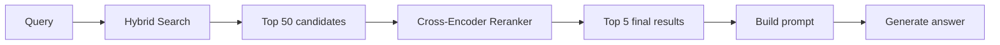
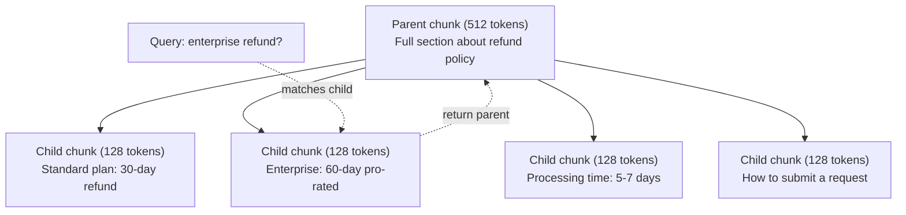
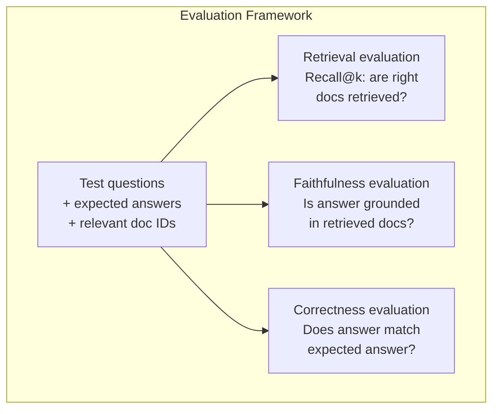

# RAG Tingkat Lanjut (Pembagian, Pemeringkatan Ulang, Pencarian Hibrid)

> RAG Dasar mengambil k bagian teratas yang paling mirip. Itu berfungsi untuk pertanyaan sederhana. Ini berantakan karena alasan multi-hop, pertanyaan ambigu, dan corpora besar. RAG tingkat lanjut adalah perbedaan antara demo yang bekerja pada 10 dokumen dan sistem yang bekerja pada 10 juta dokumen.

**Type:** Build
**Language:** Python
**Prerequisites:** Fase 11, Lesson 06 (RAG)
**Waktu:** ~90 menit
**Terkait:** Fase 5 · 23 (Strategi Chunking untuk RAG) mencakup keenam algoritma chunking — rekursif, semantik, kalimat, dokumen induk, pemotongan akhir, pengambilan kontekstual — dengan tolok ukur Vectara/Anthropic. Lesson ini merupakan lanjutan dari: penelusuran hibrid, pemeringkatan ulang, transformasi kueri.

## Tujuan Pembelajaran

- Menerapkan strategi chunking tingkat lanjut (semantik, rekursif, parent-child) yang menjaga struktur dan konteks dokumen
- Membangun pipeline pencarian hibrid yang menggabungkan pencocokan kata kunci BM25 dengan pencarian vector semantik dan reranker lintas-encoder
- Menerapkan teknik transformasi kueri (HyDE, multi-query, step-back) untuk meningkatkan pengambilan pertanyaan yang ambigu atau kompleks
- Mendiagnosis dan memperbaiki kegagalan RAG yang umum: potongan yang salah diambil, jawaban tidak sesuai konteks, gangguan penalaran multi-hop

## Masalah

kamu membuat pipeline RAG dasar di Lesson 06. Ini berfungsi untuk pertanyaan langsung pada korpus kecil. Sekarang coba ini:

**Pertanyaan ambigu**: "Berapa pendapatan kuartal terakhir?" Penelusuran semantik menghasilkan informasi tentang strategi pendapatan, proyeksi pendapatan, dan pemikiran CFO tentang pertumbuhan pendapatan. Semuanya secara semantik mirip dengan kata "pendapatan". Tidak ada yang berisi nomor sebenarnya. Bagian yang benar menyatakan "$47,2 juta pada Q3 2025" namun menggunakan kata "pendapatan" dan bukan "pendapatan". Model embedding menganggap "strategi pendapatan" lebih mendekati kueri daripada "penghasilan Q3 sebesar $47,2 juta".

**Pertanyaan multi-hop**: "Tim mana yang mengalami peningkatan skor kepuasan pelanggan tertinggi?" Hal ini memerlukan pencarian skor kepuasan untuk setiap tim, membandingkannya, dan mengidentifikasi skor maksimum. Tidak ada satu pun bagian yang berisi jawabannya. Informasi tersebut tersebar di seluruh laporan tim.

**Masalah korpus besar**: kamu memiliki 2 juta bongkahan. Jawaban yang benar ada pada potongan #1.847.293. Pengambilan 5 teratas kamu mengambil potongan #14, #89.201, #1.200.000, #44, dan #901.333. Dekat dalam ruang embedding, tetapi tidak ada yang berisi jawabannya. Pada skala ini, perkiraan penelusuran nearest neighbor menghasilkan cukup banyak kesalahan sehingga hasil yang relevan dikeluarkan dari k teratas.

RAG dasar gagal karena kesamaan vector tidak sama dengan relevansi. Sebuah potongan bisa secara semantik mirip dengan kueri tanpa berguna untuk menjawabnya. RAG tingkat lanjut mengatasi hal ini dengan empat teknik: penelusuran hibrid (tambahkan pencocokan kata kunci), pemeringkatan ulang (skor kandidat dengan lebih hati-hati), transformasi kueri (perbaiki kueri sebelum melakukan penelusuran), dan pengelompokan yang lebih baik (pengambilan pada perincian yang tepat).

## Konsep

### Penelusuran Hibrid: Semantik + Kata Kunci

Pencarian semantik (kesamaan vector) bagus dalam memahami makna. "Bagaimana cara membatalkan langganan saya?" cocok dengan "Langkah-langkah untuk menghentikan rencana kamu" meskipun tidak ada kata-kata yang diucapkan. Tapi itu tidak memiliki kecocokan persis. "Code kesalahan E-4021" mungkin tidak cocok dengan potongan yang berisi "E-4021" jika model embedding memperlakukannya sebagai gangguan.

Pencarian kata kunci (BM25) adalah kebalikannya. Ini unggul dalam pencocokan tepat. "E-4021" sangat cocok. Namun "batalkan langganan saya" tidak memberikan hasil apa pun jika dokumen mengatakan "hentikan paket kamu".

Pencarian hibrid menjalankan keduanya, lalu menggabungkan hasilnya.**BM25** (Pencocokan Terbaik 25) adalah algoritma pencarian kata kunci standar. Ini telah menjadi tulang punggung mesin pencari sejak tahun 1990an. Rumusnya:

```
BM25(q, d) = sum over terms t in q:
    IDF(t) * (tf(t,d) * (k1 + 1)) / (tf(t,d) + k1 * (1 - b + b * |d| / avgdl))
```

Dimana tf(t,d) adalah frekuensi term dari t pada dokumen d, IDF(t) adalah frekuensi inverse dokumen, |d| adalah panjang dokumen, avgdl adalah rata-rata panjang dokumen, k1 mengontrol saturasi frekuensi term (default 1.2), dan b mengontrol normalisasi panjang (default 0.75).

Secara sederhana: BM25 memberi skor lebih tinggi pada dokumen ketika berisi istilah kueri (terutama yang jarang), namun dengan hasil yang semakin berkurang untuk istilah yang diulang. Sebuah dokumen dengan kata "pendapatan" sebanyak 50 kali tidak 50x lebih relevan daripada dokumen yang memuat kata tersebut satu kali.

### Penggabungan Peringkat Timbal Balik (RRF)

kamu memiliki dua daftar peringkat: satu dari pencarian vector, satu dari BM25. Bagaimana cara menggabungkannya? Reciprocal Rank Fusion adalah pendekatan standar.

```
RRF_score(d) = sum over rankings R:
    1 / (k + rank_R(d))
```

Dimana k adalah konstanta (biasanya 60) yang mencegah hasil peringkat teratas mendominasi.

Sebuah dokumen peringkat #1 dalam pencarian vector dan #5 di BM25 mendapatkan: 1/(60+1) + 1/(60+5) = 0,0164 + 0,0154 = 0,0318

Sebuah dokumen peringkat #3 dalam pencarian vector dan #2 di BM25 mendapatkan: 1/(60+3) + 1/(60+2) = 0,0159 + 0,0161 = 0,0320

RRF secara alami menyeimbangkan kedua sinyal tersebut. Dokumen yang berperingkat tinggi di kedua daftar akan mendapat skor terbaik. Dokumen yang menempati peringkat #1 dalam satu daftar tetapi tidak ada di daftar lainnya akan mendapat skor sedang. Hal ini kuat karena menggunakan peringkat, bukan skor mentah, sehingga perbedaan distribusi skor antara kedua sistem tidak menjadi masalah.

### Pemeringkatan ulang

Pengambilan (baik vector, kata kunci, atau hibrida) cepat tetapi tidak tepat. Ia menggunakan bi-encoder: kueri dan setiap dokumen di-embed secara independen, lalu dibandingkan. Embedding dihitung satu kali dan di-cache. Ini mencakup jutaan dokumen.

Pemeringkatan ulang menggunakan encoder silang: kueri dan dokumen kandidat dimasukkan bersama ke dalam model yang menghasilkan skor relevansi. Model ini melihat kedua teks secara bersamaan dan dapat menangkap interaksi mendetail di antara keduanya. Cross-encoder dapat memahami "Berapa penghasilan Q3?" sangat relevan dengan potongan yang berisi "$47,2 juta di Q3" meskipun bi-encoder melewatkan koneksinya.

Keuntungannya: pembuat enkode silang 100-1000x lebih lambat dibandingkan pembuat enkode ganda karena keduanya memproses pasangan dokumen kueri secara bersamaan. kamu tidak dapat menghitung terlebih dahulu skor lintas-encoder untuk satu juta dokumen. Solusinya: ambil kumpulan kandidat yang lebih besar (50 teratas dari penelusuran hibrid), lalu rangking ulang dengan pembuat enkode silang untuk mendapatkan 5 besar terakhir.



Model pemeringkatan umum (barisan tahun 2026):
- Cohere Rerank 3.5: API terkelola, multibahasa, perolehan recall terbaik pada corpora campuran
- Voyage rerank-2.5: API terkelola, latensi terendah dari opsi yang dihosting
- Jina-Reranker-v2 Multibahasa: weight terbuka, 100+ bahasa
- bge-reranker-v2-m3: weight terbuka, baseline kuat
- cross-encoder/ms-marco-MiniLM-L-6-v2: open-weight, berjalan pada CPU untuk pembuatan prototipe
- ColBERTv2 / Jina-ColBERT-v2: pemeringkatan multi-vector interaksi terlambat — O(token) bukan O(dokumen) pada waktu penilaian

### Transformasi Kueri

Terkadang masalahnya bukan pada pengambilan, melainkan pada kueri itu sendiri. "Apa yang menarik dari perubahan kebijakan baru ini?" adalah permintaan pencarian yang buruk. Ini tidak mengandung istilah khusus. Embedding-nya tidak jelas. Tidak ada sistem pengambilan yang dapat menemukan dokumen yang tepat dari sini.

**Penulisan ulang kueri**: menyusun ulang kueri pengguna menjadi kueri penelusuran yang lebih baik. LLM dapat melakukan ini:

```
User: "What was that thing about the new policy change?"
Rewritten: "Recent policy changes and updates"
```**HyDE (Hypothetical Document Embeddings)**: daripada menelusuri dengan kueri, buatlah jawaban hipotetis, sematkan jawaban tersebut, dan telusuri dokumen nyata yang serupa.

```
Query: "What is the refund policy for enterprise?"
Hypothetical answer: "Enterprise customers are eligible for a full refund
within 60 days of purchase. Refunds are pro-rated based on the remaining
subscription period and processed within 5-7 business days."
```

Tanamkan jawaban hipotetis dan cari dokumen nyata yang serupa dengannya. Intuisi: jawaban hipotetis lebih dekat dalam menanamkan ruang dengan jawaban sebenarnya dibandingkan dengan pertanyaan awal. Tanya jawab mempunyai struktur kebahasaan yang berbeda. Dengan menghasilkan jawaban hipotetis, kamu menjembatani kesenjangan antara "ruang pertanyaan" dan "ruang jawaban" dalam embedding.

HyDE menambahkan satu panggilan LLM sebelum pengambilan. Ini meningkatkan latensi sebesar 500-2000ms. Layak dilakukan ketika kualitas pengambilan buruk pada kueri mentah.

### Pemotongan Orang Tua-Anak

Pengelompokan standar memaksa adanya trade-off: potongan kecil untuk pengambilan yang tepat, potongan besar untuk konteks yang memadai. Pengelompokan orang tua-anak menghilangkan trade-off ini.

Indeks potongan kecil (128 token) untuk diambil. Saat potongan kecil diambil, kembalikan potongan induknya (512 token) untuk prompt. Potongan kecil tersebut sama persis dengan kueri. Potongan induk memberikan konteks yang cukup bagi LLM untuk menghasilkan jawaban yang baik.



Pertanyaan "pengembalian dana perusahaan?" cocok dengan potongan anak C2 dengan tepat. Namun prompt tersebut menerima potongan induk P secara penuh, yang mencakup konteks sekitar tentang waktu pemrosesan dan proses pengiriman.

### Pemfilteran Metadata

Sebelum menjalankan pencarian vector, filter korpus berdasarkan metadata: tanggal, sumber, kategori, penulis, bahasa. Hal ini mengurangi ruang pencarian dan mencegah hasil yang tidak relevan.

“Apa yang berubah dalam kebijakan keamanan bulan lalu?” sebaiknya hanya mencari dokumen dari 30 hari terakhir dalam kategori keamanan. Tanpa pemfilteran metadata, kamu mencari seluruh korpus dan mungkin mengambil dokumen keamanan berusia 2 tahun yang kebetulan serupa secara semantik.

Sistem RAG produksi menyimpan metadata di samping setiap potongan: dokumen sumber, tanggal pembuatan, kategori, penulis, versi. Basis data vector mendukung pra-pemfilteran berdasarkan metadata sebelum pencarian kesamaan, yang sangat penting untuk performa dalam skala besar.

### Evaluasi

kamu membangun sistem RAG. Bagaimana kamu tahu kalau itu berhasil? Tiga metrik:

**Relevansi pengambilan (Recall@k)**: untuk serangkaian pertanyaan tes dengan dokumen relevan yang diketahui, berapa persentase dokumen relevan yang muncul di hasil top-k? Jika jawaban pertanyaan ada di bagian #47, apakah bagian #47 muncul di 5 besar?

**Kesetiaan**: apakah jawaban yang dihasilkan didasarkan pada dokumen yang diambil? Jika potongan yang diambil mengatakan "jangka waktu pengembalian dana 60 hari" dan model mengatakan "jangka waktu pengembalian dana 90 hari", itu adalah kegagalan kesetiaan. Model tersebut berhalusinasi meskipun memiliki konteks yang benar.

**Kebenaran jawaban**: apakah jawaban yang dihasilkan sesuai dengan jawaban yang diharapkan? Ini adalah metrik ujung ke ujung. Ini menggabungkan kualitas pengambilan dan kualitas generasi.

Pemeriksaan kesetiaan yang sederhana: ambil setiap klaim dalam jawaban yang dihasilkan dan verifikasi bahwa klaim tersebut muncul (secara substansi) dalam potongan yang diambil. Jika jawabannya mengandung fakta yang tidak ada dalam bagian yang diambil, kemungkinan besar itu adalah halusinasi.



## Build

### Langkah 1: Implementasi BM25

```python
import math
from collections import Counter

class BM25:
    def __init__(self, k1=1.2, b=0.75):
        self.k1 = k1
        self.b = b
        self.docs = []
        self.doc_lengths = []
        self.avg_dl = 0
        self.doc_freqs = {}
        self.n_docs = 0

    def index(self, documents):
        self.docs = documents
        self.n_docs = len(documents)
        self.doc_lengths = []
        self.doc_freqs = {}

        for doc in documents:
            words = doc.lower().split()
            self.doc_lengths.append(len(words))
            unique_words = set(words)
            for word in unique_words:
                self.doc_freqs[word] = self.doc_freqs.get(word, 0) + 1

        self.avg_dl = sum(self.doc_lengths) / self.n_docs if self.n_docs else 1

    def score(self, query, doc_idx):
        query_words = query.lower().split()
        doc_words = self.docs[doc_idx].lower().split()
        doc_len = self.doc_lengths[doc_idx]
        word_counts = Counter(doc_words)
        score = 0.0

        for term in query_words:
            if term not in word_counts:
                continue
            tf = word_counts[term]
            df = self.doc_freqs.get(term, 0)
            idf = math.log((self.n_docs - df + 0.5) / (df + 0.5) + 1)
            numerator = tf * (self.k1 + 1)
            denominator = tf + self.k1 * (1 - self.b + self.b * doc_len / self.avg_dl)
            score += idf * numerator / denominator

        return score

    def search(self, query, top_k=10):
        scores = [(i, self.score(query, i)) for i in range(self.n_docs)]
        scores.sort(key=lambda x: x[1], reverse=True)
        return scores[:top_k]
```

### Langkah 2: Penggabungan Peringkat Timbal Balik

```python
def reciprocal_rank_fusion(ranked_lists, k=60):
    scores = {}
    for ranked_list in ranked_lists:
        for rank, (doc_id, _) in enumerate(ranked_list):
            if doc_id not in scores:
                scores[doc_id] = 0.0
            scores[doc_id] += 1.0 / (k + rank + 1)
    fused = sorted(scores.items(), key=lambda x: x[1], reverse=True)
    return fused
```

### Langkah 3: Pipeline Pencarian Hibrid

```python
def hybrid_search(query, chunks, vector_embeddings, vocab, idf, bm25_index, top_k=5, fusion_k=60):
    query_emb = tfidf_embed(query, vocab, idf)
    vector_results = search(query_emb, vector_embeddings, top_k=top_k * 3)
    bm25_results = bm25_index.search(query, top_k=top_k * 3)
    fused = reciprocal_rank_fusion([vector_results, bm25_results], k=fusion_k)
    return fused[:top_k]
```

### Langkah 4: Reranker Sederhana

Dalam produksi, kamu akan menggunakan model lintas-encoder. Di sini kami membuat pemeringkatan ulang yang menilai relevansi dokumen kueri menggunakan kata yang tumpang tindih, kepentingan istilah, dan pencocokan frasa.

```python
def rerank(query, candidates, chunks):
    query_words = set(query.lower().split())
    stop_words = {"the", "a", "an", "is", "are", "was", "were", "what", "how",
                  "why", "when", "where", "do", "does", "for", "of", "in", "to",
                  "and", "or", "on", "at", "by", "it", "its", "this", "that",
                  "with", "from", "be", "has", "have", "had", "not", "but"}
    query_terms = query_words - stop_words

    scored = []
    for doc_id, initial_score in candidates:
        chunk = chunks[doc_id].lower()
        chunk_words = set(chunk.split())

        term_overlap = len(query_terms & chunk_words)

        query_bigrams = set()
        q_list = [w for w in query.lower().split() if w not in stop_words]
        for i in range(len(q_list) - 1):
            query_bigrams.add(q_list[i] + " " + q_list[i + 1])
        bigram_matches = sum(1 for bg in query_bigrams if bg in chunk)

        position_boost = 0
        for term in query_terms:
            pos = chunk.find(term)
            if pos != -1 and pos < len(chunk) // 3:
                position_boost += 0.5

        rerank_score = (
            term_overlap * 1.0
            + bigram_matches * 2.0
            + position_boost
            + initial_score * 5.0
        )
        scored.append((doc_id, rerank_score))

    scored.sort(key=lambda x: x[1], reverse=True)
    return scored
```### Langkah 5: HyDE (Embedding Dokumen Hipotetis)

```python
def hyde_generate_hypothesis(query):
    templates = {
        "what": "The answer to '{query}' is as follows: Based on our documentation, {topic} involves specific policies and procedures that define how the process works.",
        "how": "To address '{query}': The process involves several steps. First, you need to initiate the request. Then, the system processes it according to the defined rules.",
        "default": "Regarding '{query}': Our records indicate specific details and policies related to this topic that provide a comprehensive answer."
    }
    query_lower = query.lower()
    if query_lower.startswith("what"):
        template = templates["what"]
    elif query_lower.startswith("how"):
        template = templates["how"]
    else:
        template = templates["default"]

    topic_words = [w for w in query.lower().split()
                   if w not in {"what", "is", "the", "how", "do", "does", "a", "an",
                                "for", "of", "to", "in", "on", "at", "by", "and", "or"}]
    topic = " ".join(topic_words) if topic_words else "this topic"

    return template.format(query=query, topic=topic)


def hyde_search(query, chunks, vector_embeddings, vocab, idf, top_k=5):
    hypothesis = hyde_generate_hypothesis(query)
    hypothesis_emb = tfidf_embed(hypothesis, vocab, idf)
    results = search(hypothesis_emb, vector_embeddings, top_k)
    return results, hypothesis
```

### Langkah 6: Pengelompokan Orang Tua-Anak

```python
def create_parent_child_chunks(text, parent_size=200, child_size=50):
    words = text.split()
    parents = []
    children = []
    child_to_parent = {}

    parent_idx = 0
    start = 0
    while start < len(words):
        parent_end = min(start + parent_size, len(words))
        parent_text = " ".join(words[start:parent_end])
        parents.append(parent_text)

        child_start = start
        while child_start < parent_end:
            child_end = min(child_start + child_size, parent_end)
            child_text = " ".join(words[child_start:child_end])
            child_idx = len(children)
            children.append(child_text)
            child_to_parent[child_idx] = parent_idx
            child_start += child_size

        parent_idx += 1
        start += parent_size

    return parents, children, child_to_parent
```

### Langkah 7: Evaluasi Kesetiaan

```python
def evaluate_faithfulness(answer, retrieved_chunks):
    answer_sentences = [s.strip() for s in answer.split(".") if len(s.strip()) > 10]
    if not answer_sentences:
        return 1.0, []

    grounded = 0
    ungrounded = []
    context = " ".join(retrieved_chunks).lower()

    for sentence in answer_sentences:
        words = set(sentence.lower().split())
        stop_words = {"the", "a", "an", "is", "are", "was", "were", "and", "or",
                      "to", "of", "in", "for", "on", "at", "by", "it", "this", "that"}
        content_words = words - stop_words
        if not content_words:
            grounded += 1
            continue

        matched = sum(1 for w in content_words if w in context)
        ratio = matched / len(content_words) if content_words else 0

        if ratio >= 0.5:
            grounded += 1
        else:
            ungrounded.append(sentence)

    score = grounded / len(answer_sentences) if answer_sentences else 1.0
    return score, ungrounded


def evaluate_retrieval_recall(queries_with_relevant, retrieval_fn, k=5):
    total_recall = 0.0
    results = []

    for query, relevant_indices in queries_with_relevant:
        retrieved = retrieval_fn(query, k)
        retrieved_indices = set(idx for idx, _ in retrieved)
        relevant_set = set(relevant_indices)
        hits = len(retrieved_indices & relevant_set)
        recall = hits / len(relevant_set) if relevant_set else 1.0
        total_recall += recall
        results.append({
            "query": query,
            "recall": recall,
            "hits": hits,
            "total_relevant": len(relevant_set)
        })

    avg_recall = total_recall / len(queries_with_relevant) if queries_with_relevant else 0
    return avg_recall, results
```

## Pakai

Dengan cross-encoder nyata untuk pemeringkatan ulang:

```python
from sentence_transformers import CrossEncoder

reranker = CrossEncoder("cross-encoder/ms-marco-MiniLM-L-6-v2")

def rerank_with_cross_encoder(query, candidates, chunks, top_k=5):
    pairs = [(query, chunks[doc_id]) for doc_id, _ in candidates]
    scores = reranker.predict(pairs)
    scored = list(zip([doc_id for doc_id, _ in candidates], scores))
    scored.sort(key=lambda x: x[1], reverse=True)
    return scored[:top_k]
```

Dengan reranker yang dikelola Cohere:

```python
import cohere

co = cohere.Client()

def rerank_with_cohere(query, candidates, chunks, top_k=5):
    docs = [chunks[doc_id] for doc_id, _ in candidates]
    response = co.rerank(
        model="rerank-english-v3.0",
        query=query,
        documents=docs,
        top_n=top_k
    )
    return [(candidates[r.index][0], r.relevance_score) for r in response.results]
```

Untuk HyDE dengan LLM nyata:

```python
import anthropic

client = anthropic.Anthropic()

def hyde_with_llm(query):
    response = client.messages.create(
        model="claude-sonnet-4-20250514",
        max_tokens=256,
        messages=[{
            "role": "user",
            "content": f"Write a short paragraph that would be a good answer to this question. Do not say you don't know. Just write what the answer would look like.\n\nQuestion: {query}"
        }]
    )
    return response.content[0].text
```

Untuk pencarian hibrid produksi dengan Weaviate:

```python
import weaviate

client = weaviate.connect_to_local()

collection = client.collections.get("Documents")
response = collection.query.hybrid(
    query="enterprise refund policy",
    alpha=0.5,
    limit=10
)
```

Parameter alpha mengontrol keseimbangan: 0,0 = kata kunci murni (BM25), 1,0 = vector murni, 0,5 = weight yang sama. Sebagian besar sistem produksi menggunakan alpha antara 0,3 dan 0,7.

## Kirim

Lesson ini menghasilkan:
- `outputs/prompt-advanced-rag-debugger.md` -- prompt untuk mendiagnosis dan memperbaiki masalah kualitas RAG
- `outputs/skill-advanced-rag.md` -- keterampilan untuk membuat RAG tingkat produksi dengan penelusuran hibrid dan pemeringkatan ulang

## Latihan

1. Bandingkan BM25 vs pencarian vector vs pencarian hybrid pada contoh dokumen. Untuk masing-masing dari 5 kueri pengujian, catat pendekatan mana yang mengembalikan potongan paling relevan di posisi #1. Pencarian hibrid harus menang setidaknya pada 3 dari 5.

2. Menerapkan filter metadata. Tambahkan bidang "kategori" ke setiap dokumen (keamanan, penagihan, api, produk). Sebelum menjalankan pencarian vector, filter potongan ke kategori yang relevan saja. Uji dengan "Enkripsi apa yang digunakan?" dan verifikasi itu hanya mencari potongan kategori keamanan.

3. Build pipeline HyDE lengkap menggunakan fungsi generate sederhana dari Lesson 06. Bandingkan kualitas pengambilan (relevansi 3 teratas) antara pencarian kueri langsung dan pencarian HyDE pada kelima kueri pengujian. HyDE harus meningkatkan hasil untuk pertanyaan yang tidak jelas.

4. Menerapkan strategi pemisahan induk-anak pada dokumen sample. Gunakan ukuran_anak=30 dan ukuran_orangtua=100. Telusuri dengan potongan anak tetapi kembalikan potongan induk saat diminta. Bandingkan jawaban yang dihasilkan dengan potongan standar dengan chunk_size=50.

5. Buat dataset evaluasi: 10 pertanyaan dengan potongan jawaban yang diketahui. Ukur Recall@3, Recall@5, dan Recall@10 untuk (a) pencarian vector saja, (b) hanya BM25, (c) pencarian hybrid, (d) hybrid + pemeringkatan ulang. Plot hasilnya dan identifikasi bagian mana yang paling membantu pemeringkatan ulang.

## Istilah Kunci| Istilah | Apa kata orang | Apa sebenarnya arti |
|------|----------------|----------------------|
| BM25 | "Pencarian kata kunci" | Algoritma pemeringkatan probabilistik yang menilai dokumen berdasarkan frekuensi istilah, frekuensi dokumen terbalik, dan normalisasi panjang dokumen |
| Pencarian hibrida | "Terbaik dari kedua dunia" | Menjalankan pencarian semantik (vector) dan kata kunci (BM25) secara paralel, lalu menggabungkan hasilnya dengan rank fusion |
| Penggabungan Peringkat Timbal Balik | "Gabungkan daftar peringkat" | Menggabungkan beberapa daftar peringkat dengan menjumlahkan 1/(k + peringkat) untuk setiap dokumen di seluruh daftar |
| Pemeringkatan ulang | "Skor operan kedua" | Menggunakan model cross-encoder yang lebih mahal untuk menilai ulang kumpulan kandidat dari pengambilan awal |
| Pembuat enkode silang | "Model dokumen kueri gabungan" | Model yang menggunakan kueri dan dokumen sebagai input tunggal, menghasilkan skor relevansi; lebih akurat daripada bi-encoder tetapi terlalu lambat untuk pencarian korpus lengkap |
| Bi-encoder | "Model embedding independen" | Model yang embed kueri dan dokumen secara independen; cepat karena embedding telah dihitung sebelumnya, tetapi kurang akurat dibandingkan pembuat enkode silang |
| HyDE | "Cari dengan jawaban palsu" | Hasilkan jawaban hipotetis atas kueri tersebut, sematkan, dan cari dokumen nyata yang serupa dengan itu |
| Pengelompokan orang tua-anak | "Pencarian kecil, konteks besar" | Indeks potongan kecil untuk pengambilan yang tepat tetapi kembalikan potongan induk yang lebih besar untuk memberikan konteks yang memadai |
| Pemfilteran metadata | "Persempit sebelum mencari" | Memfilter dokumen berdasarkan atribut (tanggal, sumber, kategori) sebelum menjalankan pencarian vector untuk mengurangi ruang pencarian |
| Kesetiaan | "Apakah itu tetap membumi" | Apakah jawaban yang dihasilkan didukung oleh dokumen yang diambil, bukan berhalusinasi dari training data model |

## Bacaan Lanjutan- Robertson & Zaragoza, "The Probabilistic Relevance Framework: BM25 and Beyond" (2009) -- referensi definitif untuk BM25, menjelaskan landasan probabilistik di balik rumus tersebut
- Cormack et al., "Reciprocal Rank Fusion Outperforms Condorcet dan Individual Rank Learning Methods" (2009) -- makalah RRF asli yang menunjukkan bahwa metode ini mengalahkan metode fusion yang lebih kompleks
- Gao dkk., "Pengambilan Padat Zero-Shot yang Akurat tanpa Label Relevansi" (2022) -- makalah HyDE yang menunjukkan bahwa embedding dokumen hipotetis meningkatkan pengambilan tanpa training data apa pun
- Nogueira & Cho, "Passage Re-ranking with BERT" (2019) -- menunjukkan pemeringkatan lintas-encoder di atas BM25 secara signifikan meningkatkan kualitas pengambilan
- [Khattab dkk., "DSPy: Mengompilasi Panggilan Model Bahasa Deklaratif ke dalam Pipeline yang Dapat Ditingkatkan Sendiri" (2023)](https://arxiv.org/abs/2310.03714) -- memperlakukan konstruksi cepat dan pemilihan weight sebagai masalah optimization pada pipeline pengambilan; baca ini untuk "program LLM" dan bukan "LLM cepat".
- [Edge dkk., "Dari Lokal ke Global: Pendekatan Graph RAG ke Peringkasan Berfokus pada Kueri" (Microsoft Research 2024)](https://arxiv.org/abs/2404.16130) -- Makalah GraphRAG: ekstraksi hubungan entitas + deteksi komunitas Leiden untuk peringkasan yang berfokus pada kueri; perbedaan pengambilan global vs lokal.
- [Asai et al., "Self-RAG: Belajar Mengambil, Menghasilkan, dan Mengkritik melalui Refleksi Diri" (ICLR 2024)](https://arxiv.org/abs/2310.11511) -- RAG yang mengevaluasi diri dengan token refleksi; batas agen melewati pengambilan-lalu-hasilkan statis.
- [Blog Konstruksi Kueri LangChain](https://blog.langchain.dev/query-construction/) -- cara menerjemahkan kueri bahasa alami menjadi kueri basis data terstruktur (Text-to-SQL, Cypher) sebagai langkah pra-pengambilan.
