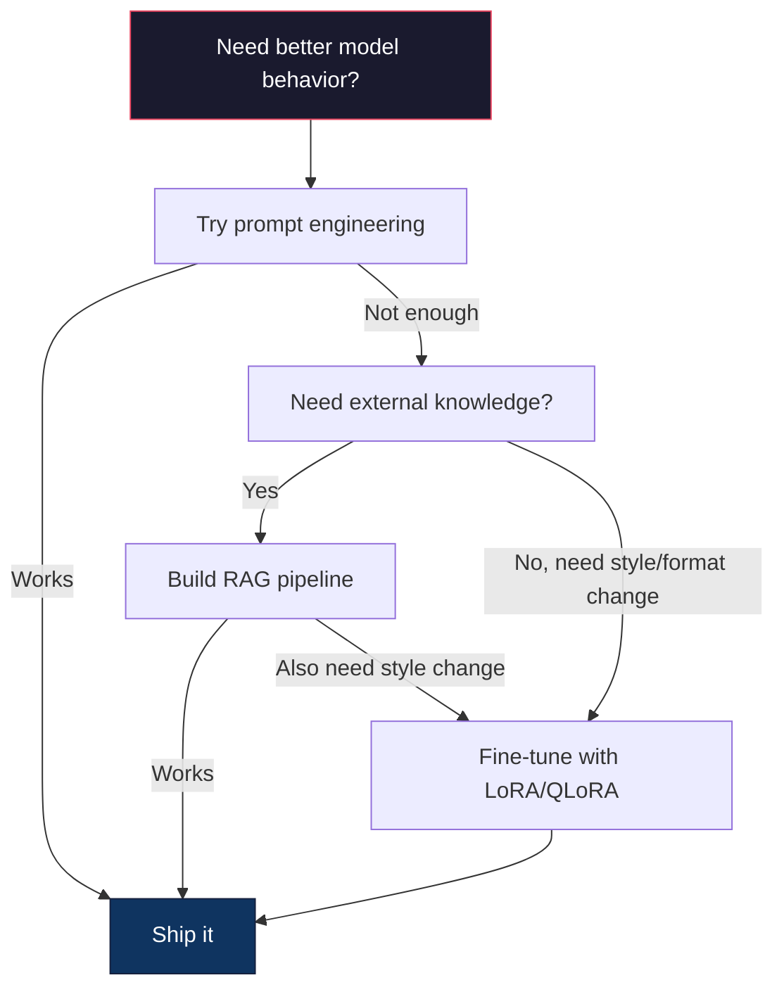

# Penyempurnaan dengan LoRA & QLoRA

> Penyempurnaan penuh model 7B memerlukan VRAM 56 GB. kamu tidak memilikinya. Begitu pula sebagian besar perusahaan. LoRA memungkinkan kamu menyempurnakan model yang sama dalam 6 GB dengan melatih kurang dari 1% parameter. Ini bukan kompromi -- ini cocok dengan kualitas penyesuaian penuh pada sebagian besar tugas. Seluruh ekosistem penyempurnaan sumber terbuka dijalankan dengan trik yang satu ini.

**Type:** Build
**Language:** Python
**Prerequisites:** Fase 10, Lesson 06 (Instruction Tuning / SFT)
**Waktu:** ~75 menit
**Terkait:** Fase 10 mencakup loop SFT/DPO dari awal. Lesson ini memasukkannya ke dalam perangkat PEFT 2026 (PEFT, TRL, Unsloth, Axolotl, LLaMA-Factory).

## Tujuan Pembelajaran

- Menerapkan LoRA dengan memasukkan matrix adaptor peringkat rendah (A dan B) ke dalam layer attention model yang telah dilatih sebelumnya
- Hitung penghematan parameter LoRA vs penyesuaian penuh: peringkat r dengan dimension d_model melatih parameter 2*r*d alih-alih d^2
- Menyempurnakan model menggunakan QLoRA (basis terkuantisasi 4-bit + adaptor LoRA) agar sesuai dengan memori GPU konsumen
- Gabungkan kembali weight LoRA ke model dasar untuk penerapan dan bandingkan kecepatan inference dengan dan tanpa adaptor

## Masalah

kamu memiliki model dasar. Lama 3 8B. kamu menginginkannya menjawab tiket dukungan pelanggan dengan suara perusahaan kamu. SFT adalah jawabannya. Namun SFT mempunyai masalah biaya.

Penyempurnaan penuh memperbarui setiap parameter dalam model. Llama 3 8B memiliki 8 miliar parameter. Di fp16, setiap parameter membutuhkan 2 byte. Itu 16GB hanya untuk memuat weight. Selama training, kamu juga memerlukan gradient (16 GB), status optimizer untuk Adam (32 GB untuk momentum + varians), dan activation. Total: sekitar 56GB VRAM untuk satu model 8B.

A100 80GB hampir tidak bisa memuat ini. Dua A100 berharga $3-4/jam pada penyedia cloud. Training selama 3 epoch dengan 50.000 contoh membutuhkan waktu 6-10 jam. Itu berarti $30-40 per eksperimen. Jalankan 10 eksperimen untuk mendapatkan hyperparameter yang benar dan kamu telah menghabiskan $400 sebelum menerapkan apa pun.

Skalakan ini ke Llama 3 70B dan angkanya menjadi tidak masuk akal. 140GB untuk weight saja. kamu membutuhkan sebuah cluster. $100+ per eksperimen.

Ada masalah yang lebih dalam juga. Penyempurnaan penuh mengubah setiap weight dalam model. Jika kamu menyempurnakan data dukungan pelanggan, kamu mungkin menurunkan kemampuan umum model. Ini disebut bencana lupa. Model menjadi lebih baik dalam tugas kamu dan lebih buruk dalam segala hal lainnya.

kamu memerlukan metode yang melatih lebih sedikit parameter, menggunakan lebih sedikit memori, dan tidak merusak pengetahuan model yang sudah ada.

## Konsep

### LoRA: Adaptasi Tingkat Rendah

Edward Hu dan rekannya di Microsoft menerbitkan LoRA pada bulan Juni 2021. Wawasan makalah ini: pembaruan weight selama penyesuaian memiliki peringkat intrinsik yang rendah. kamu tidak perlu memperbarui 16,7 juta parameter dalam matrix weight 4096x4096. Informasi berguna dalam pembaruan dapat ditangkap oleh matrix peringkat 16 atau 32.

Berikut perhitungannya. Layer linier standar menghitung:

```
y = Wx
```

Dimana W adalah matrix d_out x d_in. Untuk proyeksi attention 4096x4096, itu berarti 16.777.216 parameter.

LoRA membekukan W dan menambahkan decomposition tingkat rendah:

```
y = Wx + BAx
```

Dimana B adalah (d_out x r) dan A adalah (r x d_in). Peringkat r jauh lebih kecil dari d -- biasanya 8, 16, atau 32.

Untuk r=16 pada layer 4096x4096:
- Parameter asli: 4096 x 4096 = 16.777.216
- Parameter LoRA : (4096 x 16) + (16 x 4096) = 65.536 + 65.536 = 131.072
- Pengurangan : 131.072 / 16.777.216 = 0,78%

kamu melatih 0,78% parameter dan mendapatkan kualitas 95-100%.

```mermaid
graph LR
    X["Input x"] --> W["Frozen W (d x d)"]
    X --> A["A (r x d)"]
    A --> B["B (d x r)"]
    W --> Plus["+ (merge)"]
    B --> Plus
    Plus --> Y["Output y"]

    style W fill:#1a1a2e,stroke:#e94560,color:#fff
    style A fill:#0f3460,stroke:#16213e,color:#fff
    style B fill:#0f3460,stroke:#16213e,color:#fff
```A diinisialisasi dengan Gaussian acak. B diinisialisasi ke nol. Artinya, kontribusi LoRA dimulai dari nol -- model memulai training dari perilaku aslinya dan secara bertahap mempelajari adaptasinya.

### Faktor Penskalaan: Alpha

LoRA memperkenalkan faktor penskalaan alpha yang mengontrol seberapa besar pengaruh pembaruan peringkat rendah terhadap output:

```
y = Wx + (alpha / r) * BAx
```

Ketika alpha = r, skalanya adalah 1x. Jika alpha = 2r (default umum), penskalaannya adalah 2x. Hyperparameter ini mengontrol learning rate jalur LoRA secara independen dari learning rate dasar.

Panduan praktis:
- alpha = 2 * rank adalah konvensi umum komunitas (makalah asli menggunakan alpha = rank di sebagian besar eksperimen)
- alpha = rank memberikan penskalaan 1x, konservatif namun stabil
- Alpha yang lebih tinggi berarti pembaruan yang lebih besar per langkah, yang dapat mempercepat konvergensi atau menyebabkan ketidakstabilan

### Tempat Mendaftar LoRA

Sebuah Transformer memiliki banyak layer linier. kamu tidak perlu menambahkan LoRA ke semuanya. Makalah asli menguji kombinasi yang berbeda:

| Layer Target | Param yang Dapat Dilatih (7B) | Kualitas |
|--------------|----------------------|---------|
| hanya q_proj | 4,7 juta | Bagus |
| q_proj + v_proj | 9,4 juta | Lebih baik |
| q_proj + k_proj + v_proj + o_proj | 18,9M | Terbaik untuk attention |
| Semua linier (attention + MLP) | 37,7 juta | Keuntungan marjinal, 2x parameter |

Titik terbaik untuk sebagian besar tugas: q_proj + v_proj. Ini menargetkan proyeksi kueri dan nilai dalam attention diri, yang mengontrol apa yang diperhatikan model dan informasi apa yang diekstraksi. Menambahkan layer MLP membantu tugas-tugas kompleks seperti pembuatan code tetapi menggandakan jumlah parameter untuk mengurangi hasil pada tugas-tugas sederhana.

### Pemilihan Peringkat

Peringkat r mengontrol ekspresi adaptasi:

| Peringkat | Param yang Dapat Dilatih (per layer) | Terbaik Untuk |
|------|---------------------------|----------|
| 4 | 32.768 | Klasifikasi sederhana, sentimen |
| 8 | 65.536 | Tanya Jawab domain tunggal, ringkasan |
| 16 | 131.072 | Tugas multi-domain, mengikuti instruksi |
| 32 | 262.144 | Penalaran kompleks, pembuatan code |
| 64 | 524.288 | Mengurangi hasil untuk sebagian besar tugas |
| 128 | 1.048.576 | Jarang dibenarkan |

Hu dkk. menunjukkan bahwa r=4 sudah mencakup sebagian besar adaptasi untuk tugas-tugas sederhana. r=8 dan r=16 adalah pilihan paling umum dalam praktiknya. Melampaui r=64 jarang meningkatkan kualitas dan mulai kehilangan keunggulan memori LoRA.

### QLoRA: Kuantisasi 4-Bit + LoRA

Tim Dettmers dan rekannya di Universitas Washington menerbitkan QLoRA pada Mei 2023. Idenya: mengkuantisasi model dasar beku ke presisi 4-bit, lalu memasang adaptor LoRA di fp16 di atasnya.

Ini mengubah persamaan memori secara dramatis:

| Metode | Memori Berat (7B) | Memori Training (7B) | Diperlukan GPU |
|--------|-------------------|---------------------|-------------|
| Penyempurnaan penuh (fp16) | 14GB | ~56GB | 1x A100 80GB |
| LoRA (basis fp16) | 14GB | ~18GB | 1x A100 40GB |
| QLoRA (basis 4-bit) | 3,5GB | ~6GB | 1x RTX 3090 24GB |

QLoRA memberikan tiga kontribusi teknis:

**NF4 (Normal Float 4-bit)**: Tipe data baru yang dirancang khusus untuk weight jaringan neural. Weight neural network mengikuti distribusi yang kira-kira normal. NF4 menempatkan 16 tingkat kuantisasinya pada kuantil distribusi normal standar. Ini secara teori merupakan informasi yang optimal untuk data yang terdistribusi normal. Ia kehilangan lebih sedikit informasi dibandingkan kuantisasi 4-bit seragam (INT4) atau Float4 standar.**Kuantisasi ganda**: Konstanta kuantisasi itu sendiri memerlukan memori. Setiap blok dengan 64 weight memerlukan faktor skala fp32 (4 byte). Untuk model 7B, itu tambahan 0,4 GB. Kuantisasi ganda mengkuantisasi konstanta ini menjadi fp8, mengurangi overhead menjadi 0,1 GB. Kecil tapi bertambah.

**Optimizer halaman**: Selama training, status optimizer (momentum dan varians Adam) dapat melebihi memori GPU pada urutan yang panjang. Optimizer halaman menggunakan memori terpadu NVIDIA untuk secara otomatis menyatakan optimizer halaman ke RAM CPU ketika memori GPU habis, dan mengembalikan halaman tersebut saat diperlukan. Hal ini mencegah OOM mogok dengan mengorbankan sejumlah throughput.

### Pertanyaan Kualitas

Apakah mengurangi parameter atau mengkuantisasi basis akan merusak kualitas? Hasil dari beberapa makalah:

| Metode | MMLU (5 tembakan) | MT-Bangku | Evaluasi Manusia |
|--------|--------------|----------|-----------|
| Penyempurnaan penuh (Llama 2 7B) | 48.3 | 6.72 | 14.6 |
| LoRA r=16 | 47.9 | 6.68 | 14.0 |
| QLoRA r=16 (NF4) | 47,5 | 6.61 | 13.4 |
| QLoRA r=64 (NF4) | 48.1 | 6.70 | 14.2 |

LoRA pada r=16 berada dalam 1% dari penyesuaian penuh pada sebagian besar tolok ukur. QLoRA pada r=16 kehilangan sepersekian persen lagi. QLoRA pada r=64 pada dasarnya cocok dengan penyempurnaan penuh sambil menggunakan memori 90% lebih sedikit.

### Biaya Dunia Nyata

Menyempurnakan Llama 3 8B pada 50.000 contoh (3 epoch):

| Metode | GPU | Waktu | Biaya |
|--------|-----|------|------|
| Penyempurnaan penuh | 2x A100 80GB | 8 jam | ~$32 |
| LoRA r=16 | 1x A100 40GB | 4 jam | ~$8 |
| QLoRA r=16 | 1x RTX 4090 24GB | 6 jam | ~$5 |
| QLoRA r=16 (Tidak Kemalasan) | 1x RTX 4090 24GB | 2,5 jam | ~$2 |
| QLoRA r=16 | 1x T4 16GB | 12 jam | ~$4 |

QLoRA pada satu GPU konsumen harganya kurang dari makan siang. Inilah sebabnya mengapa komunitas fine-tuning open-weight meledak pada tahun 2023 dan mengapa setiap kerangka training di bawah ini mengirimkan QLoRA secara default pada tahun 2026.

### Tumpukan PEFT 2026

| Kerangka | Apa itu | Pilih kapan |
|-----------|-----------|-----------|
| **Memeluk Wajah PEFT** | Pustaka LoRA/QLoRA/DoRA/IA3 kanonik | kamu menginginkan kontrol mentah dan loop training kamu sudah ada di `transformers.Trainer` |
| **TRL** | Pelatih penguatan dari umpan balik HF (SFT, DPO, GRPO, PPO, ORPO) | kamu memerlukan DPO/GRPO setelah SFT; dibangun di atas PEFT |
| **Tidak Kemalasan** | Penulisan ulang kernel Triton dari pass maju/mundur | kamu menginginkan percepatan 2-5x + setengah VRAM tanpa kehilangan akurasi; Keluarga Llama/Mistral/Qwen |
| **Axolotl** | Pembungkus konfigurasi YAML melalui PEFT + TRL + DeepSpeed ​​+ Unsloth | kamu ingin training yang dapat direproduksi dan dikontrol versi |
| **Pabrik LLaMA** | GUI/CLI/API melalui PEFT + TRL | kamu ingin penyesuaian tanpa code; 100+ keluarga model didukung |
| **torchtun** | Resep asli PyTorch, tidak ada `transformers` dep | kamu menginginkan deps minimal dan organisasi kamu sudah terstandarisasi di PyTorch |

Aturan praktisnya: penggunaan penelitian atau eksperimen satu kali → PEFT. Jalur produksi berulang → Axolotl dengan kernel Unsloth diaktifkan. Pembuatan prototipe sekali pakai → Pabrik LLaMA.

### Menggabungkan Adaptor

Setelah training, kamu memiliki dua hal: model dasar yang dibekukan dan adaptor LoRA kecil (biasanya 10-100MB). kamu dapat:

1. **Pisahkan keduanya**: Muat model dasar, muat adaptor di atas. Tukar adaptor untuk tugas yang berbeda. Inilah cara kamu menyajikan beberapa varian yang disesuaikan dari satu model dasar.

2. **Gabungkan semuanya secara permanen**: Hitung W' = W + (alpha/r) * BA dan simpan hasilnya sebagai model lengkap baru. Model yang digabungkan ukurannya sama dengan aslinya. Tidak ada overhead inference. Tidak ada adaptor untuk dikelola.Untuk melayani banyak tugas (adaptor dukungan pelanggan, adaptor code, adaptor terjemahan), pisahkan semuanya. Untuk menerapkan satu model khusus, gabungkan.

Teknik penggabungan tingkat lanjut untuk menggabungkan beberapa adaptor:

- **TIES-Merging** (Yadav et al. 2023): Memangkas parameter berkekuatan kecil, menyelesaikan konflik tanda, lalu menggabungkan. Mengurangi interferensi antar adaptor.
- **DARE** (Yu dkk. 2023): Menghapus parameter adaptor secara acak sebelum menggabungkan dan mengubah skala sisanya. Sangat efektif dalam menggabungkan kemampuan.
- **Aritmatika tugas**: Cukup tambahkan atau kurangi weight adaptor. Menambahkan adaptor "code" dan adaptor "matematika" sering kali menghasilkan model yang bagus dalam keduanya.

### Kapan TIDAK Menyempurnakan

Penyempurnaan adalah pilihan ketiga, bukan yang pertama.

**Pertama: rekayasa cepat.** Tulis system prompt yang lebih baik. Tambahkan beberapa contoh contoh. Gunakan rantai pemikiran. Ini tidak memerlukan biaya apa pun dan hanya membutuhkan waktu beberapa menit. Jika prompt tersebut membuat kamu mencapai 80%, kamu mungkin tidak perlu melakukan penyesuaian.

**Kedua: RAG.** Jika model perlu mengetahui data spesifik kamu (dokumen, basis pengetahuan, katalog produk), pengambilan lebih murah dan lebih mudah dikelola daripada memasukkannya ke dalam weight. Lihat Lesson 06.

**Ketiga: penyempurnaan.** Gunakan ini saat kamu memerlukan model untuk mengadopsi gaya, format, atau pola penalaran tertentu yang tidak dapat dicapai melalui dorongan. Saat kamu membutuhkan output terstruktur yang konsisten. Saat kamu perlu menyaring model yang lebih besar menjadi model yang lebih kecil. Saat latensi penting dan kamu tidak mampu membeli token tambahan dari beberapa kali prompt.



## Build

Kami menerapkan LoRA dari awal di PyTorch murni. Tidak ada perpustakaan. Tidak ada keajaiban. kamu akan membuat layer LoRA, memasukkannya ke dalam model, melatihnya, dan menggabungkan kembali bobotnya.

### Langkah 1: Layer LoRA

```python
import torch
import torch.nn as nn
import math

class LoRALayer(nn.Module):
    def __init__(self, in_features, out_features, rank=8, alpha=16):
        super().__init__()
        self.rank = rank
        self.alpha = alpha
        self.scaling = alpha / rank

        self.A = nn.Parameter(torch.randn(in_features, rank) * (1 / math.sqrt(rank)))
        self.B = nn.Parameter(torch.zeros(rank, out_features))

    def forward(self, x):
        return (x @ self.A @ self.B) * self.scaling
```

A diinisialisasi dengan nilai acak berskala. B diinisialisasi ke nol. Produk BA dimulai dari nol, sehingga model dimulai dengan perilaku aslinya.

### Langkah 2: Layer Linier Terbungkus LoRA

```python
class LinearWithLoRA(nn.Module):
    def __init__(self, linear, rank=8, alpha=16):
        super().__init__()
        self.linear = linear
        self.lora = LoRALayer(
            linear.in_features, linear.out_features, rank, alpha
        )

        for param in self.linear.parameters():
            param.requires_grad = False

    def forward(self, x):
        return self.linear(x) + self.lora(x)
```

Layer linier asli dibekukan. Hanya parameter LoRA (A dan B) yang dapat dilatih.

### Langkah 3: Memasukkan LoRA ke dalam Model

```python
def inject_lora(model, target_modules, rank=8, alpha=16):
    for param in model.parameters():
        param.requires_grad = False

    lora_layers = {}
    for name, module in model.named_modules():
        if isinstance(module, nn.Linear):
            if any(t in name for t in target_modules):
                parent_name = ".".join(name.split(".")[:-1])
                child_name = name.split(".")[-1]
                parent = dict(model.named_modules())[parent_name]
                lora_linear = LinearWithLoRA(module, rank, alpha)
                setattr(parent, child_name, lora_linear)
                lora_layers[name] = lora_linear
    return lora_layers
```

Pertama, bekukan setiap parameter dalam model. Kemudian telusuri pohon model, temukan layer linier yang cocok dengan nama target kamu, dan gantikan dengan versi yang dibungkus LoRA. Matrix LoRA A dan B adalah satu-satunya parameter yang dapat dilatih di keseluruhan model.

### Langkah 4: Hitung Parameter

```python
def count_parameters(model):
    total = sum(p.numel() for p in model.parameters())
    trainable = sum(p.numel() for p in model.parameters() if p.requires_grad)
    frozen = total - trainable
    return {
        "total": total,
        "trainable": trainable,
        "frozen": frozen,
        "trainable_pct": 100 * trainable / total if total > 0 else 0
    }
```

### Langkah 5: Gabungkan Kembali Weight

```python
def merge_lora_weights(model):
    for name, module in model.named_modules():
        if isinstance(module, LinearWithLoRA):
            with torch.no_grad():
                merged = (
                    module.lora.A @ module.lora.B
                ) * module.lora.scaling
                module.linear.weight.data += merged.T
            parent_name = ".".join(name.split(".")[:-1])
            child_name = name.split(".")[-1]
            if parent_name:
                parent = dict(model.named_modules())[parent_name]
            else:
                parent = model
            setattr(parent, child_name, module.linear)
```

Setelah penggabungan, layer LoRA hilang. Modelnya berukuran sama dengan aslinya dengan adaptasi yang dimasukkan ke dalam bobotnya. Tidak ada overhead inference.

### Langkah 6: Simulasi Kuantisasi QLoRA

```python
def quantize_to_nf4(tensor, block_size=64):
    blocks = tensor.reshape(-1, block_size)
    scales = blocks.abs().max(dim=1, keepdim=True).values / 7.0
    scales = torch.clamp(scales, min=1e-8)
    quantized = torch.round(blocks / scales).clamp(-8, 7).to(torch.int8)
    return quantized, scales

def dequantize_from_nf4(quantized, scales, original_shape):
    dequantized = quantized.float() * scales
    return dequantized.reshape(original_shape)
```

Ini mensimulasikan kuantisasi 4-bit dengan memetakan weight ke dalam 16 level diskrit dalam blok 64. Produksi QLoRA menggunakan perpustakaan bitsandbytes untuk NF4 sebenarnya pada GPU.

### Langkah 7: Lingkaran Latihan

```python
def train_lora(model, data, epochs=5, lr=1e-3, batch_size=4):
    optimizer = torch.optim.AdamW(
        [p for p in model.parameters() if p.requires_grad], lr=lr
    )
    criterion = nn.MSELoss()

    losses = []
    for epoch in range(epochs):
        epoch_loss = 0.0
        n_batches = 0
        indices = torch.randperm(len(data["inputs"]))

        for i in range(0, len(indices), batch_size):
            batch_idx = indices[i:i + batch_size]
            x = data["inputs"][batch_idx]
            y = data["targets"][batch_idx]

            output = model(x)
            loss = criterion(output, y)

            optimizer.zero_grad()
            loss.backward()
            optimizer.step()

            epoch_loss += loss.item()
            n_batches += 1

        avg_loss = epoch_loss / n_batches
        losses.append(avg_loss)

    return losses
```

### Langkah 8: Demo Lengkap

```python
def demo():
    torch.manual_seed(42)
    d_model = 256
    n_classes = 10

    model = nn.Sequential(
        nn.Linear(d_model, 512),
        nn.ReLU(),
        nn.Linear(512, 512),
        nn.ReLU(),
        nn.Linear(512, n_classes),
    )

    n_samples = 500
    x = torch.randn(n_samples, d_model)
    y = torch.randint(0, n_classes, (n_samples,))
    y_onehot = torch.zeros(n_samples, n_classes).scatter_(1, y.unsqueeze(1), 1.0)

    data = {"inputs": x, "targets": y_onehot}

    params_before = count_parameters(model)

    lora_layers = inject_lora(
        model, target_modules=["0", "2"], rank=8, alpha=16
    )

    params_after = count_parameters(model)

    losses = train_lora(model, data, epochs=20, lr=1e-3)

    merge_lora_weights(model)
    params_merged = count_parameters(model)

    return {
        "params_before": params_before,
        "params_after": params_after,
        "params_merged": params_merged,
        "losses": losses,
    }
```

Demo ini membuat model kecil, memasukkan LoRA ke dalam dua layer, melatihnya, dan menggabungkan kembali bobotnya. Jumlah parameter turun dari dapat dilatih penuh menjadi ~1% dapat dilatih selama training LoRA, kemudian kembali ke arsitektur asli setelah penggabungan.

## Pakai

Dengan ekosistem Hugging Face, LoRA pada model nyata membutuhkan sekitar 20 baris:

```python
from transformers import AutoModelForCausalLM, AutoTokenizer
from peft import LoraConfig, get_peft_model, TaskType

model = AutoModelForCausalLM.from_pretrained("meta-llama/Llama-3.1-8B")
tokenizer = AutoTokenizer.from_pretrained("meta-llama/Llama-3.1-8B")

lora_config = LoraConfig(
    task_type=TaskType.CAUSAL_LM,
    r=16,
    lora_alpha=32,
    lora_dropout=0.05,
    target_modules=["q_proj", "v_proj"],
)

model = get_peft_model(model, lora_config)
model.print_trainable_parameters()
```

Untuk QLoRA, tambahkan kuantisasi bitsandbytes:

```python
from transformers import BitsAndBytesConfig

bnb_config = BitsAndBytesConfig(
    load_in_4bit=True,
    bnb_4bit_quant_type="nf4",
    bnb_4bit_compute_dtype=torch.bfloat16,
    bnb_4bit_use_double_quant=True,
)

model = AutoModelForCausalLM.from_pretrained(
    "meta-llama/Llama-3.1-8B",
    quantization_config=bnb_config,
    device_map="auto",
)

model = get_peft_model(model, lora_config)
```Itu saja. Lingkaran training yang sama. Pipeline data yang sama. Model dasar sekarang ada dalam 4-bit, adaptor LoRA dilatih dalam fp16, dan semuanya muat dalam 6GB.

Untuk training dengan Hugging Face Trainer:

```python
from transformers import TrainingArguments, Trainer
from datasets import load_dataset

dataset = load_dataset("tatsu-lab/alpaca", split="train[:5000]")

training_args = TrainingArguments(
    output_dir="./lora-llama",
    num_train_epochs=3,
    per_device_train_batch_size=4,
    gradient_accumulation_steps=4,
    learning_rate=2e-4,
    fp16=True,
    logging_steps=10,
    save_strategy="epoch",
    optim="paged_adamw_8bit",
)

trainer = Trainer(
    model=model,
    args=training_args,
    train_dataset=dataset,
)

trainer.train()

model.save_pretrained("./lora-adapter")
```

Adaptor yang disimpan berukuran 10-100MB. Model dasar tetap tidak tersentuh. kamu dapat berbagi adaptor di Hugging Face Hub tanpa mendistribusikan ulang model lengkapnya.

## Kirim

Lesson ini menghasilkan:
- `outputs/prompt-lora-advisor.md` -- prompt yang membantu kamu menentukan peringkat LoRA, modul target, dan hyperparameter untuk tugas spesifik kamu
- `outputs/skill-fine-tuning-guide.md` -- keterampilan yang mengajarkan agen pohon keputusan tentang kapan dan bagaimana menyempurnakannya

## Latihan

1. **Studi ablasi peringkat.** Jalankan demo dengan peringkat 2, 4, 8, 16, 32, dan 64. Plot kekalahan akhir vs. peringkat. Temukan titik pengembalian yang semakin berkurang di mana penggandaan peringkat tidak lagi mengurangi separuh loss. Untuk tugas klasifikasi sederhana pada feature 256-dim, nilai ini seharusnya berada di sekitar r=8-16.

2. **Perbandingan modul target.** Ubah inject_lora untuk hanya menargetkan layer "0", hanya layer "2", hanya layer "4", dan ketiganya. Latih setiap varian selama 20 epoch. Bandingkan kecepatan konvergensi dan loss akhir. Ini mencerminkan keputusan sebenarnya dalam menargetkan q_proj vs v_proj vs semua layer linier.

3. **Analisis kesalahan kuantisasi.** Ambil matrix weight model terlatih sebelum dan sesudah quantize_to_nf4 / dequantize_from_nf4. Hitung rata-rata kesalahan kuadrat, kesalahan absolut maksimum, dan korelasi antara weight asli dan weight yang direkonstruksi. Bereksperimenlah dengan nilai block_size 32, 64, 128, dan 256.

4. **Pelayanan multi-adaptor.** Latih dua adaptor LoRA pada subset data yang berbeda (indeks genap vs indeks ganjil). Simpan kedua adaptor. Muat model dasar satu kali, lalu tukar adaptor dan verifikasi bahwa masing-masing menghasilkan output berbeda pada input yang sama. Beginilah cara sistem produksi menyajikan beberapa model yang disesuaikan dari satu basis.

5. **Inference gabungan vs. tidak digabungkan.** Bandingkan output model LoRA sebelum dan sesudah merge_lora_weights pada 100 input yang sama. Verifikasi bahwa keluarannya identik (dalam toleransi floating-point 1e-5). Maka kecepatan inference patokan untuk keduanya -- penggabungan seharusnya sedikit lebih cepat karena ini merupakan perkalian matrix tunggal, bukan dua.

## Istilah Kunci| Istilah | Apa kata orang | Apa sebenarnya arti |
|------|----------------|----------------------|
| LoRA | "Penyempurnaan yang efisien" | Adaptasi Tingkat Rendah: membekukan weight dasar, melatih dua matrix kecil A dan B yang produknya mendekati pembaruan weight penuh |
| QLoRA | "Sempurnakan di laptop" | LoRA terkuantisasi: muat model dasar dalam NF4 4-bit, latih adaptor LoRA dalam fp16 di atas, memungkinkan penyesuaian 7B dalam VRAM 6GB |
| Peringkat (kanan) | "Seberapa banyak yang dapat dipelajari model" | Dimension dalam matrix A dan B; mengontrol ekspresi vs. jumlah parameter |
| Alpha | "Learning rate LoRA" | Faktor penskalaan diterapkan pada output LoRA; alpha/r menskalakan kontribusi adaptasi terhadap hasil akhir |
| NF4 | "kuantisasi 4-bit" | Normal Float 4: tipe data 4-bit dengan tingkat kuantisasi pada kuantil distribusi normal, optimal untuk weight neural network |
| Adaptor | "Bagian kecil yang terlatih" | Matrix LoRA A dan B disimpan sebagai file terpisah (10-100MB), dapat dimuat di atas salinan model dasar apa pun |
| Modul sasaran | "Layer mana yang ke LoRA" | Layer linier tertentu (q_proj, v_proj, dll.) tempat adaptor LoRA disuntikkan |
| Penggabungan | "Panggang" | Menghitung W + (alpha/r) * BA dan mengganti weight asli, menghilangkan overhead adaptor pada inference |
| Optimizer halaman | "Jangan OOM saat latihan" | Membongkar status optimizer (momentum Adam, varians) ke CPU ketika memori GPU habis |
| Lupa bencana | "Penyempurnaan merusak segalanya" | Saat memperbarui semua weight menyebabkan model kehilangan kemampuan yang dipelajari sebelumnya |

## Bacaan Lanjutan

- Hu et al., "LoRA: Adaptasi Tingkat Rendah dari Large Language Model" (2021) -- makalah asli yang memperkenalkan metode decomposition tingkat rendah, diuji pada GPT-3 175B dengan peringkat serendah 4
- Dettmers dkk., "QLoRA: Penyempurnaan Efisien Model Bahasa Terkuantisasi" (2023) -- memperkenalkan NF4, kuantisasi ganda, dan optimizer halaman, memungkinkan penyempurnaan 65B pada satu GPU 48 GB
- Dokumentasi pustaka PEFT (huggingface.co/docs/peft) -- pustaka standar untuk LoRA, QLoRA, dan metode efisien parameter lainnya di ekosistem Hugging Face
- Yadav et al., "TIES-Merging: Resolving Interference When Merging Models" (2023) -- teknik untuk menggabungkan beberapa adaptor LoRA tanpa penurunan kualitas
- [Rafailov dkk., "Optimization Preferensi Langsung: Model Bahasa kamu Secara Rahasia adalah Model Hadiah" (NeurIPS 2023)](https://arxiv.org/abs/2305.18290) -- Derivasi DPO; phase penyesuaian preferensi yang muncul setelah SFT, tidak diperlukan model penghargaan.
- [Dokumentasi TRL](https://huggingface.co/docs/trl/) -- referensi resmi untuk `SFTTrainer`, `DPOTrainer`, `KTOTrainer`, dan permukaan integrasi dengan PEFT/bitsandbytes/Unsloth.
- [Dokumentasi Unsloth](https://docs.unsloth.ai/) -- kernel yang menyatu yang menggandakan throughput penyetelan dan membagi separuh memori; layer kinerja di bawah TRL.
- [Dokumentasi Axolotl](https://axolotl-ai-cloud.github.io/axolotl/) -- Pelatih SFT/DPO/QLoRA multi-GPU yang dikonfigurasi YAML; alternatif config-as-code untuk skrip tulisan tangan.
