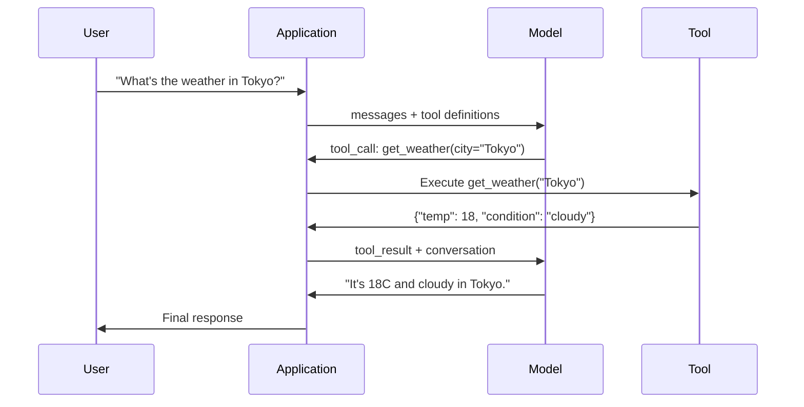

# Panggilan Fungsi & Penggunaan Alat

> LLM tidak bisa berbuat apa-apa. Mereka menghasilkan teks. Itu adalah keseluruhan kemampuan. Mereka tidak dapat memeriksa cuaca, menanyakan database, mengirim email, menjalankan code, atau membaca file. Setiap "agen AI" yang pernah kamu lihat adalah JSON yang menghasilkan LLM yang menyatakan fungsi mana yang harus dipanggil -- dan kemudian code kamu benar-benar memanggilnya. Modelnya adalah otak. Alat adalah tangan. Pemanggil fungsi adalah sistem saraf yang menghubungkannya.

**Type:** Build
**Language:** Python
**Prerequisites:** Fase 11 Lesson 03 (Output Terstruktur)
**Waktu:** ~75 menit
**Terkait:** Fase 11 · 14 (Model Context Protocol) — saat alat dibagikan ke seluruh host, beralih dari pemanggilan fungsi inline ke server MCP. Lesson ini mencakup kasus inline; MCP mencakup kasus protokol.

## Tujuan Pembelajaran

- Mengimplementasikan loop pemanggilan fungsi: menentukan skema alat, mengurai JSON panggilan alat model, menjalankan fungsi, dan mengembalikan hasil
- Rancang skema alat dengan deskripsi yang jelas dan parameter yang diketik sehingga model dapat dipanggil dengan andal
- Membangun loop agen multi-putaran yang menghubungkan beberapa panggilan fungsi untuk menjawab pertanyaan kompleks
- Menangani kasus tepi pemanggilan fungsi: pemanggilan pahat paralel, propagasi kesalahan, dan mencegah loop pahat tak terbatas

## Masalah

kamu membuat chatbot. Seorang pengguna bertanya: "Bagaimana cuaca di Tokyo saat ini?"

Model tersebut menjawab: "Saya tidak memiliki akses ke data cuaca real-time, namun berdasarkan musim, suhu di Tokyo kemungkinan berkisar 15 derajat Celcius..."

Itu adalah halusinasi yang disclaimer. Modelnya tidak mengetahui cuaca. Itu tidak akan pernah terjadi. Cuaca berubah setiap jam. Training data model berumur beberapa bulan.

Jawaban yang benar memerlukan pemanggilan OpenWeatherMap API, mendapatkan suhu saat ini, dan mengembalikan bilangan sebenarnya. Model tidak dapat memanggil API. Code kamu bisa. Bagian yang hilang: protokol terstruktur yang memungkinkan model mengatakan "Saya perlu memanggil API cuaca dengan argumen ini" dan membiarkan code kamu mengeksekusinya dan mengembalikan hasilnya.

Ini adalah pemanggilan fungsi. Model mengeluarkan JSON terstruktur yang menjelaskan fungsi mana yang akan dipanggil dengan argumen apa. Aplikasi kamu menjalankan fungsinya. Hasilnya kembali ke percakapan. Model menggunakan hasilnya untuk menghasilkan jawaban akhirnya.

Tanpa pemanggilan fungsi, LLM adalah ensiklopedia. Dengan itu, mereka menjadi agen.

## Konsep

### Loop Pemanggilan Fungsi

Setiap interaksi penggunaan alat mengikuti putaran 5 langkah yang sama.



Langkah 1: pengguna mengirim pesan. Langkah 2: model menerima pesan beserta definisi alat (Skema JSON yang menjelaskan fungsi yang tersedia). Langkah 3: alih-alih merespons dengan teks, model mengeluarkan panggilan alat -- objek JSON terstruktur dengan nama fungsi dan argumen. Langkah 4: code kamu menjalankan fungsi dan menangkap hasilnya. Langkah 5: hasilnya kembali ke model, yang kini memiliki data nyata untuk menghasilkan jawaban akhirnya.

Model tidak pernah mengeksekusi apa pun. Ia hanya memutuskan apa yang harus dipanggil dan dengan argumen apa. Code kamu adalah pelaksananya.

### Definisi Alat: Kontrak Skema JSON

Setiap alat ditentukan oleh Skema JSON yang memberi tahu model fungsi apa yang dilakukan, argumen apa yang diperlukan, dan jenis argumen apa yang harus digunakan.

```json
{
  "type": "function",
  "function": {
    "name": "get_weather",
    "description": "Get current weather for a city. Returns temperature in Celsius and conditions.",
    "parameters": {
      "type": "object",
      "properties": {
        "city": {
          "type": "string",
          "description": "City name, e.g. 'Tokyo' or 'San Francisco'"
        },
        "units": {
          "type": "string",
          "enum": ["celsius", "fahrenheit"],
          "description": "Temperature units"
        }
      },
      "required": ["city"]
    }
  }
}
```Bidang `description` sangat penting. Model membacanya untuk memutuskan kapan dan bagaimana menggunakan alat tersebut. Deskripsi yang tidak jelas seperti "mendapatkan cuaca" menghasilkan pemilihan alat yang lebih buruk daripada "Mendapatkan cuaca terkini untuk suatu kota. Mengembalikan suhu dalam Celsius dan kondisinya." Deskripsinya adalah petunjuk untuk pemilihan alat.

### Perbandingan Penyedia

Setiap penyedia besar mendukung pemanggilan fungsi, tetapi permukaan API berbeda.

| Penyedia | Parameter API | Format Panggilan Alat | Panggilan Paralel | Panggilan Paksa |
|----------|--------------|-----------------|---------------|----------------|
| OpenAI (GPT-5, o4) | `tools` | `tool_calls[].function` | Ya (kelipatan per putaran) | `tool_choice="required"` |
| Antropis (Claude 4.6/4.7) | `tools` | `content[].type="tool_use"` | Ya (beberapa blok) | `tool_choice={"type":"any"}` |
| Google (Gemini 3) | `function_declarations` | `functionCall` | Ya | `function_calling_config` |
| Kelas terbuka (Llama 4, Qwen3, DeepSeek-V3) | Asli `tools` di Llama 4; Hermes atau ChatML pada orang lain | Campuran | Tergantung model | Berbasis prompt atau `tool_choice` jika didukung |

Pada tahun 2026, ketiga penyedia tertutup tersebut telah berkumpul pada format berbasis Skema JSON yang hampir identik. Llama 4 dikirimkan dengan bidang asli `tools` yang cocok dengan bentuk OpenAI. Penyempurnaan weight terbuka masih bervariasi — format Hermes (NousResearch) adalah yang paling umum untuk penyempurnaan pihak ketiga. Untuk alat bersama di seluruh host, pilih MCP (Fase 11 · 14) daripada pemanggilan fungsi inline — servernya sama untuk semuanya.

### Pilihan Alat: Otomatis, Wajib, Spesifik

kamu mengontrol kapan model menggunakan alat.

**Otomatis** (default): model memutuskan apakah akan memanggil alat atau merespons secara langsung. "Apa itu 2+2?" -- merespons secara langsung. "Bagaimana cuacanya?" -- memanggil alat tersebut.

**Wajib**: model harus memanggil setidaknya satu alat. Gunakan ini ketika kamu mengetahui maksud pengguna memerlukan alat. Mencegah model menebak-nebak alih-alih mencari data sebenarnya.

**Fungsi spesifik**: memaksa model memanggil fungsi tertentu. `tool_choice={"type":"function", "function": {"name": "get_weather"}}` menjamin alat cuaca dipanggil, apa pun permintaannya. Gunakan ini untuk perutean -- ketika logika upstream sudah menentukan alat mana yang diperlukan.

### Memanggil Fungsi Paralel

GPT-4o dan Claude dapat memanggil banyak fungsi dalam satu giliran. Seorang pengguna bertanya: "Bagaimana cuaca di Tokyo dan New York?" Model ini mengeluarkan dua panggilan alat secara bersamaan:

```json
[
  {"name": "get_weather", "arguments": {"city": "Tokyo"}},
  {"name": "get_weather", "arguments": {"city": "New York"}}
]
```

Code kamu mengeksekusi keduanya (idealnya secara bersamaan), mengembalikan kedua hasil, dan model mensintesis satu respons. Hal ini memotong perjalanan bolak-balik dari 2 menjadi 1. Untuk agen dengan 5-10 panggilan alat per kueri, panggilan paralel mengurangi latensi sebesar 60-80%.

### Output Terstruktur vs Pemanggilan Fungsi

Lesson 03 mencakup output terstruktur. Pemanggilan fungsi menggunakan mesin Skema JSON yang sama, namun untuk tujuan yang berbeda.

**Output terstruktur**: memaksa model untuk menghasilkan data dalam bentuk tertentu. Outputnya adalah produk akhir. Contoh: ekstrak info produk dari teks sebagai `{name, price, in_stock}`.

**Pemanggilan fungsi**: model mendeklarasikan niat untuk menjalankan suatu tindakan. Outputnya adalah langkah perantara. Contoh: `get_weather(city="Tokyo")` -- model meminta suatu tindakan, tidak menghasilkan jawaban akhir.

Gunakan output terstruktur saat kamu ingin ekstraksi data. Gunakan pemanggilan fungsi saat kamu ingin model berinteraksi dengan sistem eksternal.

### Keamanan: Aturan yang Tidak Dapat DinegosiasikanPemanggilan fungsi adalah kemampuan paling berbahaya yang dapat kamu berikan pada LLM. Model memilih apa yang akan dieksekusi. Jika rangkaian alat kamu menyertakan kueri database, model akan membuat kueri tersebut. Jika itu mencakup prompt shell, model akan menuliskannya.

**Aturan 1: Jangan pernah meneruskan SQL yang dihasilkan model langsung ke database.** Model dapat dan akan menghasilkan DROP TABLE, injeksi UNION, atau kueri yang mengembalikan setiap baris. Selalu membuat parameter. Selalu validasi. Selalu gunakan daftar operasi yang diizinkan.

**Aturan 2: Daftarkan fungsi yang diizinkan.** Model hanya dapat memanggil fungsi yang kamu tetapkan secara eksplisit. Jangan pernah membuat alat umum "jalankan fungsi apa pun berdasarkan nama". Jika kamu memiliki 50 fungsi internal, tampilkan hanya 5 fungsi yang dibutuhkan pengguna.

**Aturan 3: Validasi argumen.** Model mungkin meneruskan nama kota `"; DROP TABLE users; --"`. Validasi setiap argumen terhadap tipe, rentang, dan format yang diharapkan sebelum dieksekusi.

**Aturan 4: Sanitasi hasil alat.** Jika alat mengembalikan data sensitif (kunci API, PII, error internal), filter sebelum mengirimkannya kembali ke model. Model ini akan menyertakan hasil alat dalam responsnya secara verbatim.

**Aturan 5: Pemanggilan alat dengan batas kecepatan.** Model dalam satu loop dapat memanggil alat ratusan kali. Tetapkan jumlah maksimum (10-20 panggilan per percakapan masuk akal). Hancurkan loop tak terbatas.

### Penanganan Kesalahan

Alat gagal. Waktu tunggu API habis. Basis data turun. File tidak ada. Model perlu mengetahui kapan suatu alat gagal dan alasannya.

Kembalikan kesalahan sebagai hasil alat terstruktur, bukan pengecualian:

```json
{
  "error": true,
  "message": "City 'Toky' not found. Did you mean 'Tokyo'?",
  "code": "CITY_NOT_FOUND"
}
```

Model membaca ini, menyesuaikan argumennya, dan mencoba lagi. Model pandai mengoreksi diri dari pesan kesalahan terstruktur. Mereka buruk dalam memulihkan tanggapan kosong atau kesalahan umum "ada yang tidak beres".

### MCP: Protokol Konteks Model

MCP adalah standar terbuka Anthropic untuk interoperabilitas alat. Daripada setiap aplikasi mendefinisikan alatnya sendiri, MCP menyediakan protokol universal: alat dilayani oleh server MCP, digunakan oleh klien MCP (seperti Claude Code, Cursor, atau aplikasi kamu).

Satu server MCP dapat mengekspos alat ke klien mana pun yang kompatibel. Server Postgres MCP memberikan akses database agen yang kompatibel dengan MCP. Server GitHub MCP memberikan akses repositori agen apa pun. Alat-alat tersebut ditentukan sekali, digunakan di mana saja.

MCP berfungsi memanggil HTTP ke jaringan. Ini menstandarkan layer transport sehingga alat menjadi portabel.

## Build

### Langkah 1: Tentukan Alat Registri

Build registri yang menyimpan definisi alat dan implementasinya. Setiap alat memiliki definisi Skema JSON (apa yang dilihat model) dan fungsi Python (apa yang dijalankan code kamu).

```python
import json
import math
import time
import hashlib


TOOL_REGISTRY = {}


def register_tool(name, description, parameters, function):
    TOOL_REGISTRY[name] = {
        "definition": {
            "type": "function",
            "function": {
                "name": name,
                "description": description,
                "parameters": parameters,
            },
        },
        "function": function,
    }
```

### Langkah 2: Implementasikan 5 Alat

Buat kalkulator, pencarian cuaca, simulator pencarian web, pembaca file, dan pelari code.

```python
def calculator(expression, precision=2):
    allowed = set("0123456789+-*/.() ")
    if not all(c in allowed for c in expression):
        return {"error": True, "message": f"Invalid characters in expression: {expression}"}
    try:
        result = eval(expression, {"__builtins__": {}}, {"math": math})
        return {"result": round(float(result), precision), "expression": expression}
    except Exception as e:
        return {"error": True, "message": str(e)}


WEATHER_DB = {
    "tokyo": {"temp_c": 18, "condition": "cloudy", "humidity": 72, "wind_kph": 14},
    "new york": {"temp_c": 22, "condition": "sunny", "humidity": 45, "wind_kph": 8},
    "london": {"temp_c": 12, "condition": "rainy", "humidity": 88, "wind_kph": 22},
    "san francisco": {"temp_c": 16, "condition": "foggy", "humidity": 80, "wind_kph": 18},
    "sydney": {"temp_c": 25, "condition": "sunny", "humidity": 55, "wind_kph": 10},
}


def get_weather(city, units="celsius"):
    key = city.lower().strip()
    if key not in WEATHER_DB:
        suggestions = [c for c in WEATHER_DB if c.startswith(key[:3])]
        return {
            "error": True,
            "message": f"City '{city}' not found.",
            "suggestions": suggestions,
            "code": "CITY_NOT_FOUND",
        }
    data = WEATHER_DB[key].copy()
    if units == "fahrenheit":
        data["temp_f"] = round(data["temp_c"] * 9 / 5 + 32, 1)
        del data["temp_c"]
    data["city"] = city
    return data


SEARCH_DB = {
    "python function calling": [
        {"title": "OpenAI Function Calling Guide", "url": "https://platform.openai.com/docs/guides/function-calling", "snippet": "Learn how to connect LLMs to external tools."},
        {"title": "Anthropic Tool Use", "url": "https://docs.anthropic.com/en/docs/tool-use", "snippet": "Claude can interact with external tools and APIs."},
    ],
    "MCP protocol": [
        {"title": "Model Context Protocol", "url": "https://modelcontextprotocol.io", "snippet": "An open standard for connecting AI models to data sources."},
    ],
    "weather API": [
        {"title": "OpenWeatherMap API", "url": "https://openweathermap.org/api", "snippet": "Free weather API with current, forecast, and historical data."},
    ],
}


def web_search(query, max_results=3):
    key = query.lower().strip()
    for db_key, results in SEARCH_DB.items():
        if db_key in key or key in db_key:
            return {"query": query, "results": results[:max_results], "total": len(results)}
    return {"query": query, "results": [], "total": 0}


FILE_SYSTEM = {
    "data/config.json": '{"model": "gpt-4o", "temperature": 0.7, "max_tokens": 4096}',
    "data/users.csv": "name,email,role\nAlice,alice@example.com,admin\nBob,bob@example.com,user",
    "README.md": "# My Project\nA tool-use agent built from scratch.",
}


def read_file(path):
    if ".." in path or path.startswith("/"):
        return {"error": True, "message": "Path traversal not allowed.", "code": "FORBIDDEN"}
    if path not in FILE_SYSTEM:
        available = list(FILE_SYSTEM.keys())
        return {"error": True, "message": f"File '{path}' not found.", "available_files": available, "code": "NOT_FOUND"}
    content = FILE_SYSTEM[path]
    return {"path": path, "content": content, "size_bytes": len(content), "lines": content.count("\n") + 1}


def run_code(code, language="python"):
    if language != "python":
        return {"error": True, "message": f"Language '{language}' not supported. Only 'python' is available."}
    forbidden = ["import os", "import sys", "import subprocess", "exec(", "eval(", "__import__", "open("]
    for pattern in forbidden:
        if pattern in code:
            return {"error": True, "message": f"Forbidden operation: {pattern}", "code": "SECURITY_VIOLATION"}
    try:
        local_vars = {}
        exec(code, {"__builtins__": {"print": print, "range": range, "len": len, "str": str, "int": int, "float": float, "list": list, "dict": dict, "sum": sum, "min": min, "max": max, "abs": abs, "round": round, "sorted": sorted, "enumerate": enumerate, "zip": zip, "map": map, "filter": filter, "math": math}}, local_vars)
        result = local_vars.get("result", None)
        return {"success": True, "result": result, "variables": {k: str(v) for k, v in local_vars.items() if not k.startswith("_")}}
    except Exception as e:
        return {"error": True, "message": f"{type(e).__name__}: {e}"}
```

### Langkah 3: Daftarkan Semua Alat

```python
def register_all_tools():
    register_tool(
        "calculator", "Evaluate a mathematical expression. Supports +, -, *, /, parentheses, and decimals. Returns the numeric result.",
        {"type": "object", "properties": {"expression": {"type": "string", "description": "Math expression, e.g. '(10 + 5) * 3'"}, "precision": {"type": "integer", "description": "Decimal places in result", "default": 2}}, "required": ["expression"]},
        calculator,
    )
    register_tool(
        "get_weather", "Get current weather for a city. Returns temperature, condition, humidity, and wind speed.",
        {"type": "object", "properties": {"city": {"type": "string", "description": "City name, e.g. 'Tokyo' or 'San Francisco'"}, "units": {"type": "string", "enum": ["celsius", "fahrenheit"], "description": "Temperature units, defaults to celsius"}}, "required": ["city"]},
        get_weather,
    )
    register_tool(
        "web_search", "Search the web for information. Returns a list of results with title, URL, and snippet.",
        {"type": "object", "properties": {"query": {"type": "string", "description": "Search query"}, "max_results": {"type": "integer", "description": "Maximum results to return", "default": 3}}, "required": ["query"]},
        web_search,
    )
    register_tool(
        "read_file", "Read the contents of a file. Returns the file content, size, and line count.",
        {"type": "object", "properties": {"path": {"type": "string", "description": "Relative file path, e.g. 'data/config.json'"}}, "required": ["path"]},
        read_file,
    )
    register_tool(
        "run_code", "Execute Python code in a sandboxed environment. Set a 'result' variable to return output.",
        {"type": "object", "properties": {"code": {"type": "string", "description": "Python code to execute"}, "language": {"type": "string", "enum": ["python"], "description": "Programming language"}}, "required": ["code"]},
        run_code,
    )
```

### Langkah 4: Membangun Loop Pemanggilan Fungsi

Ini adalah mesin inti. Ini mensimulasikan model yang memutuskan alat mana yang akan dipanggil, mengeksekusi alat tersebut, dan memberikan hasil kembali.

```python
def simulate_model_decision(user_message, tools, conversation_history):
    msg = user_message.lower()

    if any(word in msg for word in ["weather", "temperature", "forecast"]):
        cities = []
        for city in WEATHER_DB:
            if city in msg:
                cities.append(city)
        if not cities:
            for word in msg.split():
                if word.capitalize() in [c.title() for c in WEATHER_DB]:
                    cities.append(word)
        if not cities:
            cities = ["tokyo"]
        calls = []
        for city in cities:
            calls.append({"name": "get_weather", "arguments": {"city": city.title()}})
        return calls

    if any(word in msg for word in ["calculate", "compute", "math", "what is", "how much"]):
        for token in msg.split():
            if any(c in token for c in "+-*/"):
                return [{"name": "calculator", "arguments": {"expression": token}}]
        if "+" in msg or "-" in msg or "*" in msg or "/" in msg:
            expr = "".join(c for c in msg if c in "0123456789+-*/.() ")
            if expr.strip():
                return [{"name": "calculator", "arguments": {"expression": expr.strip()}}]
        return [{"name": "calculator", "arguments": {"expression": "0"}}]

    if any(word in msg for word in ["search", "find", "look up", "google"]):
        query = msg.replace("search for", "").replace("look up", "").replace("find", "").strip()
        return [{"name": "web_search", "arguments": {"query": query}}]

    if any(word in msg for word in ["read", "file", "open", "cat", "show"]):
        for path in FILE_SYSTEM:
            if path.split("/")[-1].split(".")[0] in msg:
                return [{"name": "read_file", "arguments": {"path": path}}]
        return [{"name": "read_file", "arguments": {"path": "README.md"}}]

    if any(word in msg for word in ["run", "execute", "code", "python"]):
        return [{"name": "run_code", "arguments": {"code": "result = 'Hello from the sandbox!'", "language": "python"}}]

    return []


def execute_tool_call(tool_call):
    name = tool_call["name"]
    args = tool_call["arguments"]

    if name not in TOOL_REGISTRY:
        return {"error": True, "message": f"Unknown tool: {name}", "code": "UNKNOWN_TOOL"}

    tool = TOOL_REGISTRY[name]
    func = tool["function"]
    start = time.time()

    try:
        result = func(**args)
    except TypeError as e:
        result = {"error": True, "message": f"Invalid arguments: {e}"}

    elapsed_ms = round((time.time() - start) * 1000, 2)
    return {"tool": name, "result": result, "execution_time_ms": elapsed_ms}


def run_function_calling_loop(user_message, max_iterations=5):
    conversation = [{"role": "user", "content": user_message}]
    tool_definitions = [t["definition"] for t in TOOL_REGISTRY.values()]
    all_tool_results = []

    for iteration in range(max_iterations):
        tool_calls = simulate_model_decision(user_message, tool_definitions, conversation)

        if not tool_calls:
            break

        results = []
        for call in tool_calls:
            result = execute_tool_call(call)
            results.append(result)

        conversation.append({"role": "assistant", "content": None, "tool_calls": tool_calls})

        for result in results:
            conversation.append({"role": "tool", "content": json.dumps(result["result"]), "tool_name": result["tool"]})

        all_tool_results.extend(results)
        break

    return {"conversation": conversation, "tool_results": all_tool_results, "iterations": iteration + 1 if tool_calls else 0}
```

### Langkah 5: Validasi Argumen

Build validator yang memeriksa argumen panggilan alat terhadap Skema JSON sebelum dieksekusi.

```python
def validate_tool_arguments(tool_name, arguments):
    if tool_name not in TOOL_REGISTRY:
        return [f"Unknown tool: {tool_name}"]

    schema = TOOL_REGISTRY[tool_name]["definition"]["function"]["parameters"]
    errors = []

    if not isinstance(arguments, dict):
        return [f"Arguments must be an object, got {type(arguments).__name__}"]

    for required_field in schema.get("required", []):
        if required_field not in arguments:
            errors.append(f"Missing required argument: {required_field}")

    properties = schema.get("properties", {})
    for arg_name, arg_value in arguments.items():
        if arg_name not in properties:
            errors.append(f"Unknown argument: {arg_name}")
            continue

        prop_schema = properties[arg_name]
        expected_type = prop_schema.get("type")

        type_checks = {"string": str, "integer": int, "number": (int, float), "boolean": bool, "array": list, "object": dict}
        if expected_type in type_checks:
            if not isinstance(arg_value, type_checks[expected_type]):
                errors.append(f"Argument '{arg_name}': expected {expected_type}, got {type(arg_value).__name__}")

        if "enum" in prop_schema and arg_value not in prop_schema["enum"]:
            errors.append(f"Argument '{arg_name}': '{arg_value}' not in {prop_schema['enum']}")

    return errors
```

### Langkah 6: Jalankan Demo

```python
def run_demo():
    register_all_tools()

    print("=" * 60)
    print("  Function Calling & Tool Use Demo")
    print("=" * 60)

    print("\n--- Registered Tools ---")
    for name, tool in TOOL_REGISTRY.items():
        desc = tool["definition"]["function"]["description"][:60]
        params = list(tool["definition"]["function"]["parameters"].get("properties", {}).keys())
        print(f"  {name}: {desc}...")
        print(f"    params: {params}")

    print(f"\n--- Argument Validation ---")
    validation_tests = [
        ("get_weather", {"city": "Tokyo"}, "Valid call"),
        ("get_weather", {}, "Missing required arg"),
        ("get_weather", {"city": "Tokyo", "units": "kelvin"}, "Invalid enum value"),
        ("calculator", {"expression": 123}, "Wrong type (int for string)"),
        ("unknown_tool", {"x": 1}, "Unknown tool"),
    ]
    for tool_name, args, label in validation_tests:
        errors = validate_tool_arguments(tool_name, args)
        status = "VALID" if not errors else f"ERRORS: {errors}"
        print(f"  {label}: {status}")

    print(f"\n--- Tool Execution ---")
    direct_tests = [
        {"name": "calculator", "arguments": {"expression": "(10 + 5) * 3 / 2"}},
        {"name": "get_weather", "arguments": {"city": "Tokyo"}},
        {"name": "get_weather", "arguments": {"city": "Mars"}},
        {"name": "web_search", "arguments": {"query": "python function calling"}},
        {"name": "read_file", "arguments": {"path": "data/config.json"}},
        {"name": "read_file", "arguments": {"path": "../etc/passwd"}},
        {"name": "run_code", "arguments": {"code": "result = sum(range(1, 101))"}},
        {"name": "run_code", "arguments": {"code": "import os; os.system('rm -rf /')"}},
    ]
    for call in direct_tests:
        result = execute_tool_call(call)
        print(f"\n  {call['name']}({json.dumps(call['arguments'])})")
        print(f"    -> {json.dumps(result['result'], indent=None)[:100]}")
        print(f"    time: {result['execution_time_ms']}ms")

    print(f"\n--- Full Function Calling Loop ---")
    test_queries = [
        "What's the weather in Tokyo?",
        "Calculate (100 + 250) * 0.15",
        "Search for MCP protocol",
        "Read the config file",
        "Run some Python code",
        "Tell me a joke",
    ]
    for query in test_queries:
        print(f"\n  User: {query}")
        result = run_function_calling_loop(query)
        if result["tool_results"]:
            for tr in result["tool_results"]:
                print(f"    Tool: {tr['tool']} ({tr['execution_time_ms']}ms)")
                print(f"    Result: {json.dumps(tr['result'], indent=None)[:90]}")
        else:
            print(f"    [No tool called -- direct response]")
        print(f"    Iterations: {result['iterations']}")

    print(f"\n--- Parallel Tool Calls ---")
    multi_city_query = "What's the weather in tokyo and london?"
    print(f"  User: {multi_city_query}")
    result = run_function_calling_loop(multi_city_query)
    print(f"  Tool calls made: {len(result['tool_results'])}")
    for tr in result["tool_results"]:
        city = tr["result"].get("city", "unknown")
        temp = tr["result"].get("temp_c", "N/A")
        print(f"    {city}: {temp}C, {tr['result'].get('condition', 'N/A')}")

    print(f"\n--- Security Checks ---")
    security_tests = [
        ("read_file", {"path": "../../etc/passwd"}),
        ("run_code", {"code": "import subprocess; subprocess.run(['ls'])"}),
        ("calculator", {"expression": "__import__('os').system('ls')"}),
    ]
    for tool_name, args in security_tests:
        result = execute_tool_call({"name": tool_name, "arguments": args})
        blocked = result["result"].get("error", False)
        print(f"  {tool_name}({list(args.values())[0][:40]}): {'BLOCKED' if blocked else 'ALLOWED'}")
```

## Pakai

### Panggilan Fungsi OpenAI

```python
# from openai import OpenAI
#
# client = OpenAI()
#
# tools = [{
#     "type": "function",
#     "function": {
#         "name": "get_weather",
#         "description": "Get current weather for a city",
#         "parameters": {
#             "type": "object",
#             "properties": {
#                 "city": {"type": "string"},
#                 "units": {"type": "string", "enum": ["celsius", "fahrenheit"]}
#             },
#             "required": ["city"]
#         }
#     }
# }]
#
# response = client.chat.completions.create(
#     model="gpt-4o",
#     messages=[{"role": "user", "content": "Weather in Tokyo?"}],
#     tools=tools,
#     tool_choice="auto",
# )
#
# tool_call = response.choices[0].message.tool_calls[0]
# args = json.loads(tool_call.function.arguments)
# result = get_weather(**args)
#
# final = client.chat.completions.create(
#     model="gpt-4o",
#     messages=[
#         {"role": "user", "content": "Weather in Tokyo?"},
#         response.choices[0].message,
#         {"role": "tool", "tool_call_id": tool_call.id, "content": json.dumps(result)},
#     ],
# )
# print(final.choices[0].message.content)
```OpenAI mengembalikan panggilan alat sebagai `response.choices[0].message.tool_calls`. Setiap panggilan memiliki `id` yang harus kamu sertakan saat mengembalikan hasilnya. Model menggunakan ID ini untuk mencocokkan hasil dengan panggilan. GPT-4o dapat mengembalikan beberapa panggilan alat dalam satu respons -- mengulangi dan mengeksekusi semuanya.

### Penggunaan Alat Antropik

```python
# import anthropic
#
# client = anthropic.Anthropic()
#
# response = client.messages.create(
#     model="claude-sonnet-4-20250514",
#     max_tokens=1024,
#     tools=[{
#         "name": "get_weather",
#         "description": "Get current weather for a city",
#         "input_schema": {
#             "type": "object",
#             "properties": {
#                 "city": {"type": "string"},
#                 "units": {"type": "string", "enum": ["celsius", "fahrenheit"]}
#             },
#             "required": ["city"]
#         }
#     }],
#     messages=[{"role": "user", "content": "Weather in Tokyo?"}],
# )
#
# tool_block = next(b for b in response.content if b.type == "tool_use")
# result = get_weather(**tool_block.input)
#
# final = client.messages.create(
#     model="claude-sonnet-4-20250514",
#     max_tokens=1024,
#     tools=[...],
#     messages=[
#         {"role": "user", "content": "Weather in Tokyo?"},
#         {"role": "assistant", "content": response.content},
#         {"role": "user", "content": [{"type": "tool_result", "tool_use_id": tool_block.id, "content": json.dumps(result)}]},
#     ],
# )
```

Panggilan alat pengembalian antropik sebagai blok konten dengan `type: "tool_use"`. Hasil alat masuk ke pesan pengguna dengan `type: "tool_result"`. Perhatikan perbedaan utamanya: Anthropic menggunakan `input_schema` untuk definisi parameter alat, sedangkan OpenAI menggunakan `parameters`.

### Integrasi MCP

```python
# MCP servers expose tools over a standardized protocol.
# Any MCP-compatible client can discover and call these tools.
#
# Example: connecting to a Postgres MCP server
#
# from mcp import ClientSession, StdioServerParameters
# from mcp.client.stdio import stdio_client
#
# server_params = StdioServerParameters(
#     command="npx",
#     args=["-y", "@modelcontextprotocol/server-postgres", "postgresql://localhost/mydb"],
# )
#
# async with stdio_client(server_params) as (read, write):
#     async with ClientSession(read, write) as session:
#         await session.initialize()
#         tools = await session.list_tools()
#         result = await session.call_tool("query", {"sql": "SELECT count(*) FROM users"})
```

MCP memisahkan penerapan alat dari konsumsi alat. Server Postgres mengetahui SQL. Server GitHub mengetahui API. Agen kamu hanya menemukan dan memanggil alat -- tidak memerlukan code khusus penyedia untuk setiap integrasi.

## Kirim

Lesson ini menghasilkan `outputs/prompt-tool-designer.md` -- template prompt yang dapat digunakan kembali untuk mendesain definisi alat. Berikan deskripsi tentang apa yang kamu ingin alat lakukan, dan itu akan menghasilkan definisi Skema JSON lengkap dengan deskripsi, tipe, dan batasan.

Ini juga menghasilkan `outputs/skill-function-calling-patterns.md` -- kerangka keputusan untuk mengimplementasikan pemanggilan fungsi dalam produksi, yang mencakup desain alat, penanganan kesalahan, keamanan, dan pola khusus penyedia.

## Latihan

1. **Tambahkan alat ke-6: kueri database.** Mengimplementasikan alat SQL yang disimulasikan dengan tabel dalam memori. Alat ini menerima nama tabel dan kondisi filter (bukan SQL mentah). Validasi bahwa nama tabel ada dalam daftar yang diizinkan dan operator filter dibatasi pada `=`, `>`, `<`, `>=`, `<=`. Kembalikan baris yang cocok sebagai JSON.

2. **Terapkan percobaan ulang dengan umpan balik kesalahan.** Saat panggilan alat gagal (misalnya, kota tidak ditemukan), masukkan pesan kesalahan kembali ke fungsi keputusan model dan biarkan fungsi tersebut mengoreksi argumennya. Lacak berapa banyak percobaan ulang yang dilakukan setiap panggilan. Tetapkan maksimal 3 percobaan ulang per panggilan alat.

3. **Membangun agen multi-langkah.** Beberapa kueri memerlukan panggilan alat rangkaian: "Baca file konfigurasi dan beri tahu saya model apa yang dikonfigurasi, lalu telusuri web untuk mengetahui harga model tersebut." Terapkan perulangan yang berjalan hingga model memutuskan tidak diperlukan lagi alat, dan meneruskan hasil akumulasi ke dalam setiap langkah pengambilan keputusan. Batasi hingga 10 iterasi untuk mencegah loop tak terbatas.

4. **Ukur akurasi pemilihan alat.** Buat 30 kueri pengujian dengan nama alat yang diharapkan. Jalankan fungsi keputusan kamu pada semua 30 dan ukur berapa persentase waktu yang digunakan untuk memilih alat yang tepat. Identifikasi kueri mana yang paling menyebabkan perplexity antar alat.

5. **Menerapkan cache panggilan alat.** Jika alat yang sama dipanggil dengan argumen yang sama dalam waktu 60 detik, kembalikan hasil cache alih-alih mengeksekusinya kembali. Gunakan kamus yang dikunci oleh `(tool_name, frozenset(args.items()))`. Ukur tingkat cache hit di seluruh percakapan dengan 20 kueri.

## Istilah Kunci| Istilah | Apa kata orang | Apa sebenarnya arti |
|------|----------------|----------------------|
| Pemanggilan fungsi | "Penggunaan alat" | Model mengeluarkan JSON terstruktur yang mendeskripsikan fungsi yang akan dipanggil dengan argumen tertentu -- code kamu yang mengeksekusinya, bukan model |
| Definisi alat | "Skema fungsi" | Objek Skema JSON yang menjelaskan nama, tujuan, parameter, dan jenis alat -- model membaca ini untuk memutuskan kapan dan bagaimana menggunakan alat |
| Pilihan alat | "Mode panggilan" | Mengontrol apakah model harus memanggil alat (wajib), boleh memanggil alat (otomatis), atau harus memanggil alat tertentu (bernama) |
| Panggilan paralel | "Multi-alat" | Model ini menghasilkan beberapa panggilan alat dalam satu putaran, sehingga mengurangi perjalanan bolak-balik -- GPT-4o dan Claude mendukung hal ini |
| Hasil alat | "Fungsi output" | Nilai yang dikembalikan dari eksekusi suatu alat, dikirim kembali ke model sebagai pesan sehingga dapat menggunakan data nyata dalam responsnya |
| Validasi argumen | "Pemeriksaan input" | Memverifikasi bahwa argumen yang dihasilkan model cocok dengan tipe, rentang, dan batasan yang diharapkan sebelum menjalankan alat |
| MCP | "Protokol alat" | Model Context Protocol -- Standar terbuka Anthropic untuk mengekspos alat melalui server yang dapat ditemukan dan dipanggil oleh klien mana pun yang kompatibel |
| Lingkaran agen | "Reaksi loop" | Siklus berulang dari alat-pemutus-model, alat-eksekusi-code, umpan balik-hasil hingga model memiliki informasi yang cukup untuk merespons |
| Keracunan alat | "Injeksi cepat melalui alat" | Serangan di mana hasil alat berisi instruksi yang memanipulasi perilaku model -- membersihkan semua output alat |
| Pembatasan tarif | "Panggil anggaran" | Menetapkan jumlah maksimum panggilan alat per percakapan untuk mencegah pengulangan tak terbatas dan biaya API yang tidak terkendali |

## Bacaan Lanjutan

- [Panduan Panggilan Fungsi OpenAI](https://platform.openai.com/docs/guides/function-calling) -- referensi pasti untuk penggunaan alat dengan GPT-4o, termasuk panggilan paralel, panggilan paksa, dan argumen terstruktur
- [Panduan Penggunaan Alat Antropik](https://docs.anthropic.com/en/docs/tool-use) -- Implementasi penggunaan alat Claude dengan input_schema, respons multi-alat, dan konfigurasi tool_choice
- [Spesifikasi Protokol Konteks Model](https://modelcontextprotocol.io) -- standar terbuka untuk interoperabilitas alat di seluruh aplikasi AI, dengan arsitektur server/klien
- [Schick dkk., 2023 -- "Pembentuk Alat: Model Bahasa Dapat Mengajari Diri Sendiri Menggunakan Alat"](https://arxiv.org/abs/2302.04761) -- makalah dasar tentang training LLM untuk memutuskan kapan dan bagaimana memanggil alat eksternal
- [Patil dkk., 2023 -- "Gorila: Large Language Model yang Terhubung dengan API Masif"](https://arxiv.org/abs/2305.15334) -- menyempurnakan LLM untuk panggilan API yang akurat di 1.645 API dengan pengurangan halusinasi
- [Papan Peringkat Panggilan Fungsi Berkeley](https://gorilla.cs.berkeley.edu/leaderboard.html) -- tolok ukur real-time yang membandingkan akurasi pemanggilan fungsi di GPT-4o, Claude, Gemini, dan model terbuka
- [Yao dkk., "ReAct: Mensinergikan Penalaran dan Tindakan dalam Model Bahasa" (ICLR 2023)](https://arxiv.org/abs/2210.03629) -- loop Pemikiran-Aksi-Pengamatan yang merupakan loop agen luar di sekitar setiap pemanggilan alat; di mana lesson ini berakhir, Fase 14 dimulai.
- [Anthropic — Membangun agen yang efektif (Des 2024)](https://www.anthropic.com/research/building- Effective-agents) -- lima pola yang dapat dikomposisi (rangkaian cepat, perutean, paralelisasi, pekerja orkestra, optimizer-evaluator) yang dibuat dari primitif penggunaan alat tunggal.
