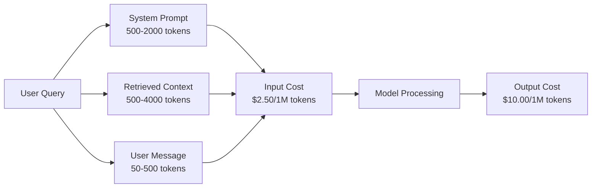
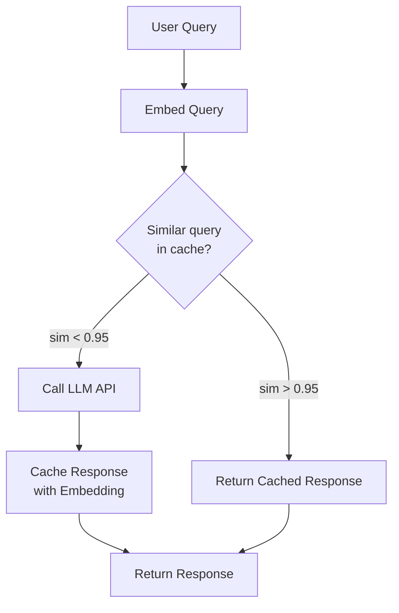
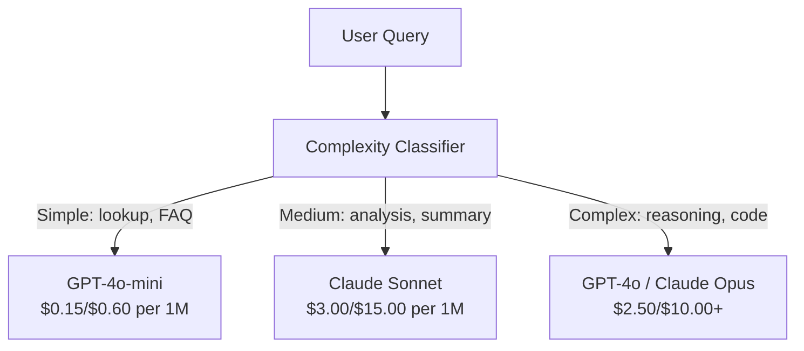

# Caching, Pembatasan Nilai & Optimization Biaya

> Kebanyakan startup AI tidak mati karena model yang buruk. Mereka mati karena unit ekonomi yang buruk. Biaya satu panggilan GPT-4o hanya sepersekian sen. Sepuluh ribu pengguna yang melakukan sepuluh panggilan per hari hanya dikenakan biaya token input sebesar $250 -- sebelum kamu mengenakan biaya satu dolar. Perusahaan yang bertahan adalah perusahaan yang memperlakukan setiap panggilan API sebagai transaksi keuangan, bukan panggilan fungsi.

**Type:** Build
**Language:** Python
**Prerequisites:** Fase 11 Lesson 09 (Pemanggilan Fungsi)
**Waktu:** ~45 menit
**Terkait:** Fase 11 · 15 (Prompt Caching) — lesson ini mencakup caching layer aplikasi (cache semantik, cache hash yang tepat, perutean model). Lesson 15 mencakup caching prompt layer penyedia (Anthropic cache_control, OpenAI otomatis, Gemini CachedContent). Gabungkan keduanya untuk pengurangan biaya 50-95%.

## Tujuan Pembelajaran

- Menerapkan cache semantik yang menyajikan kueri berulang atau serupa dari cache alih-alih membuat panggilan API baru
- Hitung biaya per permintaan di seluruh penyedia dan terapkan pembatasan tarif dan peringatan anggaran yang sadar token
- Build layer optimization biaya dengan kompresi cepat, perutean model (mahal vs murah), dan cache respons
- Rancang strategi caching berjenjang menggunakan pencocokan tepat, kesamaan semantik, dan caching awalan untuk jenis kueri yang berbeda

## Masalah

kamu membuat chatbot RAG. Ini bekerja dengan indah. Pengguna menyukainya.

Kemudian faktur tiba.

GPT-5 berharga $5 per juta token input dan $15 per juta output. Claude Opus 4.7 berharga input $15 / output $75. Gemini 3 Pro berharga input $1,25 / output $5. GPT-5-mini berharga $0,25/$2. Harga di bawah ini hanya ilustrasi; selalu periksa halaman harga penyedia saat ini.

Inilah matematika yang mematikan startup:

- 10.000 pengguna aktif setiap hari
- 10 pertanyaan per pengguna per hari
- 1.000 token input per kueri (system prompt + konteks + pesan pengguna)
- 500 token output per respons

**Biaya input harian:** 10.000 x 10 x 1.000 / 1.000.000 x $2,50 = **$250/hari**
**Biaya output harian:** 10.000 x 10 x 500 / 1.000.000 x $10,00 = **$500/hari**
**Total bulanan:** **$22.500/bulan**

Itu hanya LLM. Tambahkan embeddings, hosting basis data vector, infrastruktur. kamu mencari $30.000/bulan untuk chatbot.

Bagian yang brutal: 40-60% dari kueri tersebut hampir duplikat. Pengguna menanyakan pertanyaan yang sama dengan kata-kata yang sedikit berbeda. System prompt kamu -- sama di setiap permintaan -- akan ditagih setiap saat. Dokumen konteks yang diambil oleh RAG diulangi oleh pengguna yang menanyakan topik yang sama.

kamu membayar harga penuh untuk komputasi yang berlebihan.

## Konsep

### Anatomi Biaya Panggilan LLM

Setiap panggilan API memiliki lima komponen biaya.



System prompt adalah pembunuh diam-diam. System prompt 1.500 token yang dikirim dengan setiap permintaan dikenakan biaya $3,75 per juta permintaan hanya untuk awalan tersebut. Dengan 100 ribu permintaan per hari, itu berarti $375/hari -- $11.250/bulan -- untuk teks yang tidak pernah berubah.

### Penyedia Caching: Diskon Bawaan

Ketiga penyedia utama menawarkan cache cepat sisi penyedia pada tahun 2026, tetapi mekanismenya berbeda. Lihat Fase 11 · 15 untuk penyelaman lebih dalam.| Penyedia | Mekanisme | Diskon | Minimal | Durasi Tembolok |
|----------|-----------|----------|---------|----------------|
| Antropik | Penanda cache_control eksplisit | 90% pada cache hits (bayar ekstra 25% pada penulisan) | 1.024 token (Sonnet/Opus), 2.048 (Haiku) | default 5 menit; 1 jam diperpanjang (2x tulis premium) |
| OpenAI | Pencocokan awalan otomatis | 50% pada cache yang ditemukan | 1.024 token | Upaya terbaik hingga 1 jam |
| Google Gemini | API Konten Tembolok Eksplisit | ~Pengurangan 75% (ditambah penyimpanan) | 4.096 (Flash) / 32.768 (Pro) | TTL |

**Pendekatan Antropik** bersifat eksplisit. kamu menandai bagian dari prompt kamu dengan `cache_control: {"type": "ephemeral"}`. Permintaan pertama membayar premi tulis sebesar 25%. Permintaan selanjutnya dengan awalan yang sama mendapatkan diskon 90%. Prompt sistem 2.000 token dengan biaya $0,005 biasanya berharga $0,000625 jika cache ditemukan. Lebih dari 100 ribu permintaan, menghemat $437,50/hari.

**Pendekatan OpenAI** bersifat otomatis. Awalan cepat apa pun yang cocok dengan permintaan sebelumnya mendapat diskon 50%. Tidak diperlukan penanda. Dampaknya: diskon lebih sedikit, kontrol lebih sedikit, namun tidak ada upaya implementasi.

### Caching Semantik: Layer Khusus kamu

Caching penyedia hanya berfungsi untuk awalan yang identik. Caching semantik menangani kasus yang lebih sulit: kueri berbeda dengan arti yang sama.

“Apa kebijakan pengembaliannya?” dan "Bagaimana cara mengembalikan barang?" adalah string yang berbeda tetapi maksudnya sama. Cache semantik embed kedua kueri, menghitung kesamaan kosinus, dan mengembalikan respons yang disimpan dalam cache jika kesamaan melebihi ambang batas (biasanya 0,92-0,95).



Biaya embedding dapat diabaikan. Text-embedding-3-small OpenAI berharga $0,02 per juta token. Memeriksa cache hampir tidak memerlukan biaya apa pun dibandingkan dengan panggilan LLM penuh.

### Caching Akurat: Hash dan Pencocokan

Untuk panggilan deterministik (suhu=0, model yang sama, prompt yang sama), caching yang tepat lebih sederhana dan lebih cepat. Hash prompt lengkap, periksa cache, kembalikan jika ditemukan.

Ini berfungsi sempurna untuk:
- System prompt + konteks tetap + pertanyaan pengguna yang identik
- Pemanggilan fungsi dengan definisi alat yang identik
- Pemrosesan batch dimana dokumen yang sama diproses beberapa kali

### Pembatasan Tarif: Melindungi Anggaran kamu

Pembatasan tarif bukan hanya soal keadilan. Ini tentang kelangsungan hidup.

**Algoritme keranjang token:** setiap pengguna mendapat satu keranjang berisi N token yang diisi ulang dengan kecepatan R per detik. Permintaan menggunakan token dari bucket. Jika bucket kosong, permintaan ditolak. Hal ini memungkinkan terjadinya burst (gunakan keranjang penuh sekaligus) sambil menerapkan tarif rata-rata.

**Kuota per pengguna:** menetapkan batas token harian/bulanan per tingkat pengguna.

| Tingkat | Batas Token Harian | Permintaan Maks/mnt | Akses Model |
|------|------------------|------------------|-------------|
| Gratis | 50.000 | 10 | Hanya GPT-4o-mini |
| Pro | 500.000 | 60 | GPT-4o, Claude Soneta |
| Perusahaan | 5.000.000 | 300 | Semua model |

### Perutean Model: Model yang Akurat untuk Pekerjaan yang Akurat

Tidak semua kueri memerlukan GPT-4o.

"Jam berapa tokonya tutup?" tidak memerlukan model output $10/M. GPT-4o-mini dengan output $0,60/M menanganinya dengan sempurna. Claude Haiku dengan output $1,25/M menanganinya. Pengklasifikasi sederhana mengarahkan kueri murah ke model murah dan kueri kompleks ke model mahal.



Router yang disetel dengan baik menghemat 40-70% biaya model saja.

### Pelacakan Biaya: Ketahui Kemana Uang Pergi

kamu tidak dapat mengoptimalkan apa yang tidak kamu ukur. Catat setiap panggilan API dengan:- Stempel waktu
- Nama model
- Input token
- Token output
- Latensi (ms)
- Biaya yang dihitung ($)
- ID Pengguna
- Cache terbentur/tidak terjawab
- Kategori permintaan

Data ini mengungkapkan feature mana yang mahal, pengguna mana yang merupakan konsumen berat, dan feature caching mana yang memiliki dampak paling besar.

### Batching: Diskon Massal

API Batch OpenAI memproses permintaan secara asinkron dengan diskon 50%. kamu mengirimkan batch hingga 50.000 permintaan, dan hasilnya akan muncul dalam waktu 24 jam.

Gunakan pengelompokan untuk:
- Pemrosesan dokumen setiap malam
- Klasifikasi massal
- Evaluasi berjalan
- Jalur pengayaan data

Bukan untuk: kueri yang dihadapi pengguna secara real-time (latensi penting).

### Peringatan Anggaran dan Pemutus Arus

Pemutus sirkuit berhenti mengeluarkan uang ketika kamu mencapai batas. Tanpanya, bug atau penyalahgunaan dapat menghabiskan anggaran bulanan kamu dalam hitungan jam.

Tetapkan tiga ambang batas:
1. **Peringatan** (70% anggaran): kirim peringatan
2. **Throttle** (85% anggaran): beralih ke model yang lebih murah saja
3. **Hentikan** (95% anggaran): tolak permintaan baru, kembalikan respons yang disimpan dalam cache saja

### Tumpukan Optimization

Terapkan teknik ini secara berurutan. Setiap layer menyatu dengan layer sebelumnya.

| Layer | Teknik | Tabungan Khas | Upaya Implementasi |
|-------|-----------|----------------|----------------------|
| 1 | Caching cepat penyedia | 30-50% | Rendah (tambahkan penanda cache) |
| 2 | Cache yang tepat | 10-20% | Rendah (hash + dikt) |
| 3 | Caching semantik | 15-30% | Medium (embedding + kesamaan) |
| 4 | Perutean model | 40-70% | Sedang (pengklasifikasi) |
| 5 | Pembatasan tarif | Perlindungan anggaran | Rendah (ember token) |
| 6 | Kompresi cepat | 10-30% | Sedang (prompt menulis ulang) |
| 7 | Pengelompokan | 50% jika memenuhi syarat | Rendah (API batch) |

Aplikasi RAG yang menerapkan layer 1-5 biasanya mengurangi biaya dari $22.500/bulan menjadi $4.000-6.000/bulan. Itulah bedanya membakar landasan dan membangun bisnis.

### Penghematan Nyata: Sebelum dan Sesudah

Berikut adalah rincian nyata untuk chatbot RAG yang melayani 10.000 DAU.

| Metrik | Sebelum Optimization | Setelah Optimization | Tabungan |
|--------|--------------------|--------------------|---------|
| Biaya LLM bulanan | $22.500 | $5.200 | 77% |
| Biaya rata-rata per kueri | $0,0075 | $0,0017 | 77% |
| Tingkat hit cache | 0% | 52% | -- |
| Kueri dialihkan ke mini | 0% | 65% | -- |
| Latensi P95 | 2.800 md | 900ms (cache hits: 50ms) | 68% |
| Biaya embedding bulanan | $0 | $180 | (biaya baru) |
| Total biaya bulanan | $22.500 | $5.380 | 76% |

Biaya embedding untuk cache semantik ($180/bulan) terbayar sendiri dalam satu jam pertama setelah cache ditemukan.

## Build

### Langkah 1: Kalkulator Biaya

Buat kalkulator biaya token yang mengetahui harga saat ini untuk model-model utama.

```python
import hashlib
import time
import json
import math
from dataclasses import dataclass, field


MODEL_PRICING = {
    "gpt-4o": {"input": 2.50, "output": 10.00, "cached_input": 1.25},
    "gpt-4o-mini": {"input": 0.15, "output": 0.60, "cached_input": 0.075},
    "gpt-4.1": {"input": 2.00, "output": 8.00, "cached_input": 0.50},
    "gpt-4.1-mini": {"input": 0.40, "output": 1.60, "cached_input": 0.10},
    "gpt-4.1-nano": {"input": 0.10, "output": 0.40, "cached_input": 0.025},
    "o3": {"input": 2.00, "output": 8.00, "cached_input": 0.50},
    "o3-mini": {"input": 1.10, "output": 4.40, "cached_input": 0.55},
    "o4-mini": {"input": 1.10, "output": 4.40, "cached_input": 0.275},
    "claude-opus-4": {"input": 15.00, "output": 75.00, "cached_input": 1.50},
    "claude-sonnet-4": {"input": 3.00, "output": 15.00, "cached_input": 0.30},
    "claude-haiku-3.5": {"input": 0.80, "output": 4.00, "cached_input": 0.08},
    "gemini-2.5-pro": {"input": 1.25, "output": 10.00, "cached_input": 0.3125},
    "gemini-2.5-flash": {"input": 0.15, "output": 0.60, "cached_input": 0.0375},
}


def calculate_cost(model, input_tokens, output_tokens, cached_input_tokens=0):
    if model not in MODEL_PRICING:
        return {"error": f"Unknown model: {model}"}
    pricing = MODEL_PRICING[model]
    non_cached = input_tokens - cached_input_tokens
    input_cost = (non_cached / 1_000_000) * pricing["input"]
    cached_cost = (cached_input_tokens / 1_000_000) * pricing["cached_input"]
    output_cost = (output_tokens / 1_000_000) * pricing["output"]
    total = input_cost + cached_cost + output_cost
    return {
        "model": model,
        "input_tokens": input_tokens,
        "output_tokens": output_tokens,
        "cached_input_tokens": cached_input_tokens,
        "input_cost": round(input_cost, 6),
        "cached_input_cost": round(cached_cost, 6),
        "output_cost": round(output_cost, 6),
        "total_cost": round(total, 6),
    }
```

### Langkah 2: Cache Akurat

Hash prompt lengkap dan kembalikan respons cache untuk permintaan serupa.

```python
class ExactCache:
    def __init__(self, max_size=1000, ttl_seconds=3600):
        self.cache = {}
        self.max_size = max_size
        self.ttl = ttl_seconds
        self.hits = 0
        self.misses = 0

    def _hash(self, model, messages, temperature):
        key_data = json.dumps({"model": model, "messages": messages, "temperature": temperature}, sort_keys=True)
        return hashlib.sha256(key_data.encode()).hexdigest()

    def get(self, model, messages, temperature=0.0):
        if temperature > 0:
            self.misses += 1
            return None
        key = self._hash(model, messages, temperature)
        if key in self.cache:
            entry = self.cache[key]
            if time.time() - entry["timestamp"] < self.ttl:
                self.hits += 1
                entry["access_count"] += 1
                return entry["response"]
            del self.cache[key]
        self.misses += 1
        return None

    def put(self, model, messages, temperature, response):
        if temperature > 0:
            return
        if len(self.cache) >= self.max_size:
            oldest_key = min(self.cache, key=lambda k: self.cache[k]["timestamp"])
            del self.cache[oldest_key]
        key = self._hash(model, messages, temperature)
        self.cache[key] = {
            "response": response,
            "timestamp": time.time(),
            "access_count": 1,
        }

    def stats(self):
        total = self.hits + self.misses
        return {
            "hits": self.hits,
            "misses": self.misses,
            "hit_rate": round(self.hits / total, 4) if total > 0 else 0,
            "cache_size": len(self.cache),
        }
```

### Langkah 3: Cache Semantik

Sematkan kueri dan kembalikan respons yang di-cache ketika kesamaan melebihi ambang batas.

```python
def simple_embed(text):
    words = text.lower().split()
    vocab = {}
    for w in words:
        vocab[w] = vocab.get(w, 0) + 1
    norm = math.sqrt(sum(v * v for v in vocab.values()))
    if norm == 0:
        return {}
    return {k: v / norm for k, v in vocab.items()}


def cosine_similarity(a, b):
    if not a or not b:
        return 0.0
    all_keys = set(a) | set(b)
    dot = sum(a.get(k, 0) * b.get(k, 0) for k in all_keys)
    return dot


class SemanticCache:
    def __init__(self, similarity_threshold=0.85, max_size=500, ttl_seconds=3600):
        self.entries = []
        self.threshold = similarity_threshold
        self.max_size = max_size
        self.ttl = ttl_seconds
        self.hits = 0
        self.misses = 0

    def get(self, query):
        query_embedding = simple_embed(query)
        now = time.time()
        best_match = None
        best_sim = 0.0
        for entry in self.entries:
            if now - entry["timestamp"] > self.ttl:
                continue
            sim = cosine_similarity(query_embedding, entry["embedding"])
            if sim > best_sim:
                best_sim = sim
                best_match = entry
        if best_match and best_sim >= self.threshold:
            self.hits += 1
            best_match["access_count"] += 1
            return {"response": best_match["response"], "similarity": round(best_sim, 4), "original_query": best_match["query"]}
        self.misses += 1
        return None

    def put(self, query, response):
        if len(self.entries) >= self.max_size:
            self.entries.sort(key=lambda e: e["timestamp"])
            self.entries.pop(0)
        self.entries.append({
            "query": query,
            "embedding": simple_embed(query),
            "response": response,
            "timestamp": time.time(),
            "access_count": 1,
        })

    def stats(self):
        total = self.hits + self.misses
        return {
            "hits": self.hits,
            "misses": self.misses,
            "hit_rate": round(self.hits / total, 4) if total > 0 else 0,
            "cache_size": len(self.entries),
        }
```

### Langkah 4: Pembatas Nilai

Pembatas tingkat keranjang token dengan kuota per pengguna.

```python
class TokenBucketRateLimiter:
    def __init__(self):
        self.buckets = {}
        self.tiers = {
            "free": {"capacity": 50_000, "refill_rate": 500, "max_requests_per_min": 10},
            "pro": {"capacity": 500_000, "refill_rate": 5_000, "max_requests_per_min": 60},
            "enterprise": {"capacity": 5_000_000, "refill_rate": 50_000, "max_requests_per_min": 300},
        }

    def _get_bucket(self, user_id, tier="free"):
        if user_id not in self.buckets:
            tier_config = self.tiers.get(tier, self.tiers["free"])
            self.buckets[user_id] = {
                "tokens": tier_config["capacity"],
                "capacity": tier_config["capacity"],
                "refill_rate": tier_config["refill_rate"],
                "last_refill": time.time(),
                "request_timestamps": [],
                "max_rpm": tier_config["max_requests_per_min"],
                "tier": tier,
                "total_tokens_used": 0,
            }
        return self.buckets[user_id]

    def _refill(self, bucket):
        now = time.time()
        elapsed = now - bucket["last_refill"]
        refill = int(elapsed * bucket["refill_rate"])
        if refill > 0:
            bucket["tokens"] = min(bucket["capacity"], bucket["tokens"] + refill)
            bucket["last_refill"] = now

    def check(self, user_id, tokens_needed, tier="free"):
        bucket = self._get_bucket(user_id, tier)
        self._refill(bucket)
        now = time.time()
        bucket["request_timestamps"] = [t for t in bucket["request_timestamps"] if now - t < 60]
        if len(bucket["request_timestamps"]) >= bucket["max_rpm"]:
            return {"allowed": False, "reason": "rate_limit", "retry_after_seconds": 60 - (now - bucket["request_timestamps"][0])}
        if bucket["tokens"] < tokens_needed:
            deficit = tokens_needed - bucket["tokens"]
            wait = deficit / bucket["refill_rate"]
            return {"allowed": False, "reason": "token_limit", "tokens_available": bucket["tokens"], "retry_after_seconds": round(wait, 1)}
        return {"allowed": True, "tokens_available": bucket["tokens"]}

    def consume(self, user_id, tokens_used, tier="free"):
        bucket = self._get_bucket(user_id, tier)
        bucket["tokens"] -= tokens_used
        bucket["request_timestamps"].append(time.time())
        bucket["total_tokens_used"] += tokens_used

    def get_usage(self, user_id):
        if user_id not in self.buckets:
            return {"error": "User not found"}
        b = self.buckets[user_id]
        return {
            "user_id": user_id,
            "tier": b["tier"],
            "tokens_remaining": b["tokens"],
            "capacity": b["capacity"],
            "total_tokens_used": b["total_tokens_used"],
            "utilization": round(b["total_tokens_used"] / b["capacity"], 4) if b["capacity"] else 0,
        }
```

### Langkah 5: Pelacak Biaya

Catat setiap panggilan dan hitung total yang berjalan.

```python
class CostTracker:
    def __init__(self, monthly_budget=1000.0):
        self.logs = []
        self.monthly_budget = monthly_budget
        self.alerts = []

    def log_call(self, model, input_tokens, output_tokens, cached_input_tokens=0, latency_ms=0, user_id="anonymous", cache_status="miss"):
        cost = calculate_cost(model, input_tokens, output_tokens, cached_input_tokens)
        entry = {
            "timestamp": time.time(),
            "model": model,
            "input_tokens": input_tokens,
            "output_tokens": output_tokens,
            "cached_input_tokens": cached_input_tokens,
            "latency_ms": latency_ms,
            "cost": cost["total_cost"],
            "user_id": user_id,
            "cache_status": cache_status,
        }
        self.logs.append(entry)
        self._check_budget()
        return entry

    def _check_budget(self):
        total = self.total_cost()
        pct = total / self.monthly_budget if self.monthly_budget > 0 else 0
        if pct >= 0.95 and not any(a["level"] == "stop" for a in self.alerts):
            self.alerts.append({"level": "stop", "message": f"Budget 95% consumed: ${total:.2f}/${self.monthly_budget:.2f}", "timestamp": time.time()})
        elif pct >= 0.85 and not any(a["level"] == "throttle" for a in self.alerts):
            self.alerts.append({"level": "throttle", "message": f"Budget 85% consumed: ${total:.2f}/${self.monthly_budget:.2f}", "timestamp": time.time()})
        elif pct >= 0.70 and not any(a["level"] == "warning" for a in self.alerts):
            self.alerts.append({"level": "warning", "message": f"Budget 70% consumed: ${total:.2f}/${self.monthly_budget:.2f}", "timestamp": time.time()})

    def total_cost(self):
        return round(sum(e["cost"] for e in self.logs), 6)

    def cost_by_model(self):
        by_model = {}
        for e in self.logs:
            m = e["model"]
            if m not in by_model:
                by_model[m] = {"calls": 0, "cost": 0, "input_tokens": 0, "output_tokens": 0}
            by_model[m]["calls"] += 1
            by_model[m]["cost"] = round(by_model[m]["cost"] + e["cost"], 6)
            by_model[m]["input_tokens"] += e["input_tokens"]
            by_model[m]["output_tokens"] += e["output_tokens"]
        return by_model

    def cache_savings(self):
        cache_hits = [e for e in self.logs if e["cache_status"] == "hit"]
        if not cache_hits:
            return {"saved": 0, "cache_hits": 0}
        saved = 0
        for e in cache_hits:
            full_cost = calculate_cost(e["model"], e["input_tokens"], e["output_tokens"])
            saved += full_cost["total_cost"]
        return {"saved": round(saved, 4), "cache_hits": len(cache_hits)}

    def summary(self):
        if not self.logs:
            return {"total_calls": 0, "total_cost": 0}
        total_latency = sum(e["latency_ms"] for e in self.logs)
        cache_hits = sum(1 for e in self.logs if e["cache_status"] == "hit")
        return {
            "total_calls": len(self.logs),
            "total_cost": self.total_cost(),
            "avg_cost_per_call": round(self.total_cost() / len(self.logs), 6),
            "avg_latency_ms": round(total_latency / len(self.logs), 1),
            "cache_hit_rate": round(cache_hits / len(self.logs), 4),
            "cost_by_model": self.cost_by_model(),
            "cache_savings": self.cache_savings(),
            "budget_remaining": round(self.monthly_budget - self.total_cost(), 2),
            "budget_utilization": round(self.total_cost() / self.monthly_budget, 4) if self.monthly_budget > 0 else 0,
            "alerts": self.alerts,
        }
```

### Langkah 6: Model Router

Rutekan kueri ke model termurah yang dapat menanganinya.

```python
SIMPLE_KEYWORDS = ["what time", "hours", "address", "phone", "price", "return policy", "hello", "hi", "thanks", "yes", "no"]
COMPLEX_KEYWORDS = ["analyze", "compare", "explain why", "write code", "debug", "architect", "design", "trade-off", "evaluate"]


def classify_complexity(query):
    q = query.lower()
    if len(q.split()) <= 5 or any(kw in q for kw in SIMPLE_KEYWORDS):
        return "simple"
    if any(kw in q for kw in COMPLEX_KEYWORDS):
        return "complex"
    return "medium"


def route_model(query, tier="pro"):
    complexity = classify_complexity(query)
    routing_table = {
        "simple": {"free": "gpt-4.1-nano", "pro": "gpt-4o-mini", "enterprise": "gpt-4o-mini"},
        "medium": {"free": "gpt-4o-mini", "pro": "claude-sonnet-4", "enterprise": "claude-sonnet-4"},
        "complex": {"free": "gpt-4o-mini", "pro": "gpt-4o", "enterprise": "claude-opus-4"},
    }
    model = routing_table[complexity].get(tier, "gpt-4o-mini")
    return {"query": query, "complexity": complexity, "model": model, "tier": tier}
```

### Langkah 7: Jalankan Demo

```python
def simulate_llm_call(model, query):
    input_tokens = len(query.split()) * 4 + 500
    output_tokens = 150 + (len(query.split()) * 2)
    latency = 200 + (output_tokens * 2)
    return {
        "model": model,
        "response": f"[Simulated {model} response to: {query[:50]}...]",
        "input_tokens": input_tokens,
        "output_tokens": output_tokens,
        "latency_ms": latency,
    }


def run_demo():
    print("=" * 60)
    print("  Caching, Rate Limiting & Cost Optimization Demo")
    print("=" * 60)

    print("\n--- Model Pricing ---")
    for model, pricing in list(MODEL_PRICING.items())[:6]:
        cost_1k = calculate_cost(model, 1000, 500)
        print(f"  {model}: ${cost_1k['total_cost']:.6f} per 1K in + 500 out")

    print("\n--- Cost Comparison: 100K Requests ---")
    for model in ["gpt-4o", "gpt-4o-mini", "claude-sonnet-4", "claude-haiku-3.5"]:
        cost = calculate_cost(model, 1000 * 100_000, 500 * 100_000)
        print(f"  {model}: ${cost['total_cost']:.2f}")

    print("\n--- Anthropic Cache Savings ---")
    no_cache = calculate_cost("claude-sonnet-4", 2000, 500, 0)
    with_cache = calculate_cost("claude-sonnet-4", 2000, 500, 1500)
    saving = no_cache["total_cost"] - with_cache["total_cost"]
    print(f"  Without cache: ${no_cache['total_cost']:.6f}")
    print(f"  With 1500 cached tokens: ${with_cache['total_cost']:.6f}")
    print(f"  Savings per call: ${saving:.6f} ({saving/no_cache['total_cost']*100:.1f}%)")

    exact_cache = ExactCache(max_size=100, ttl_seconds=300)
    semantic_cache = SemanticCache(similarity_threshold=0.75, max_size=100)
    rate_limiter = TokenBucketRateLimiter()
    tracker = CostTracker(monthly_budget=100.0)

    print("\n--- Exact Cache ---")
    messages_1 = [{"role": "user", "content": "What is the return policy?"}]
    result = exact_cache.get("gpt-4o-mini", messages_1, 0.0)
    print(f"  First lookup: {'HIT' if result else 'MISS'}")
    exact_cache.put("gpt-4o-mini", messages_1, 0.0, "You can return items within 30 days.")
    result = exact_cache.get("gpt-4o-mini", messages_1, 0.0)
    print(f"  Second lookup: {'HIT' if result else 'MISS'} -> {result}")
    result = exact_cache.get("gpt-4o-mini", messages_1, 0.7)
    print(f"  With temp=0.7: {'HIT' if result else 'MISS (non-deterministic, skip cache)'}")
    print(f"  Stats: {exact_cache.stats()}")

    print("\n--- Semantic Cache ---")
    test_queries = [
        ("What is the return policy?", "Items can be returned within 30 days with receipt."),
        ("How do I return an item?", None),
        ("What are your store hours?", "We are open 9am-9pm Monday through Saturday."),
        ("When does the store open?", None),
        ("Tell me about quantum computing", "Quantum computers use qubits..."),
        ("Explain quantum mechanics", None),
    ]
    for query, response in test_queries:
        cached = semantic_cache.get(query)
        if cached:
            print(f"  '{query[:40]}' -> CACHE HIT (sim={cached['similarity']}, original='{cached['original_query'][:40]}')")
        elif response:
            semantic_cache.put(query, response)
            print(f"  '{query[:40]}' -> MISS (stored)")
        else:
            print(f"  '{query[:40]}' -> MISS (no match)")
    print(f"  Stats: {semantic_cache.stats()}")

    print("\n--- Rate Limiting ---")
    for i in range(12):
        check = rate_limiter.check("user_1", 1000, "free")
        if check["allowed"]:
            rate_limiter.consume("user_1", 1000, "free")
        status = "OK" if check["allowed"] else f"BLOCKED ({check['reason']})"
        if i < 5 or not check["allowed"]:
            print(f"  Request {i+1}: {status}")
    print(f"  Usage: {rate_limiter.get_usage('user_1')}")

    print("\n--- Model Routing ---")
    routing_queries = [
        "What time do you close?",
        "Summarize this quarterly earnings report",
        "Analyze the trade-offs between microservices and monoliths",
        "Hello",
        "Write code for a binary search tree with deletion",
    ]
    for q in routing_queries:
        route = route_model(q, "pro")
        print(f"  '{q[:50]}' -> {route['model']} ({route['complexity']})")

    print("\n--- Full Pipeline: Before vs After Optimization ---")
    queries = [
        "What is the return policy?",
        "How do I return something?",
        "What are your hours?",
        "When do you open?",
        "Explain the difference between TCP and UDP",
        "Compare TCP vs UDP protocols",
        "Hello",
        "What is your phone number?",
        "Write a Python function to sort a list",
        "Analyze the pros and cons of serverless architecture",
    ]

    print("\n  [Before: no caching, single model (gpt-4o)]")
    tracker_before = CostTracker(monthly_budget=1000.0)
    for q in queries:
        result = simulate_llm_call("gpt-4o", q)
        tracker_before.log_call("gpt-4o", result["input_tokens"], result["output_tokens"], latency_ms=result["latency_ms"], cache_status="miss")
    before = tracker_before.summary()
    print(f"  Total cost: ${before['total_cost']:.6f}")
    print(f"  Avg cost/call: ${before['avg_cost_per_call']:.6f}")
    print(f"  Avg latency: {before['avg_latency_ms']}ms")

    print("\n  [After: caching + routing + rate limiting]")
    exact_c = ExactCache()
    semantic_c = SemanticCache(similarity_threshold=0.75)
    tracker_after = CostTracker(monthly_budget=1000.0)

    for q in queries:
        messages = [{"role": "user", "content": q}]
        cached = exact_c.get("gpt-4o", messages, 0.0)
        if cached:
            tracker_after.log_call("gpt-4o-mini", 0, 0, latency_ms=5, cache_status="hit")
            continue
        sem_cached = semantic_c.get(q)
        if sem_cached:
            tracker_after.log_call("gpt-4o-mini", 0, 0, latency_ms=15, cache_status="hit")
            continue
        route = route_model(q)
        result = simulate_llm_call(route["model"], q)
        tracker_after.log_call(route["model"], result["input_tokens"], result["output_tokens"], latency_ms=result["latency_ms"], cache_status="miss")
        exact_c.put(route["model"], messages, 0.0, result["response"])
        semantic_c.put(q, result["response"])

    after = tracker_after.summary()
    print(f"  Total cost: ${after['total_cost']:.6f}")
    print(f"  Avg cost/call: ${after['avg_cost_per_call']:.6f}")
    print(f"  Avg latency: {after['avg_latency_ms']}ms")
    print(f"  Cache hit rate: {after['cache_hit_rate']:.0%}")

    if before["total_cost"] > 0:
        savings_pct = (1 - after["total_cost"] / before["total_cost"]) * 100
        print(f"\n  SAVINGS: {savings_pct:.1f}% cost reduction")
        print(f"  Latency improvement: {(1 - after['avg_latency_ms'] / before['avg_latency_ms']) * 100:.1f}% faster")

    print("\n--- Budget Alerts Demo ---")
    alert_tracker = CostTracker(monthly_budget=0.01)
    for i in range(5):
        alert_tracker.log_call("gpt-4o", 5000, 2000, latency_ms=500)
    print(f"  Total spent: ${alert_tracker.total_cost():.6f} / ${alert_tracker.monthly_budget}")
    for alert in alert_tracker.alerts:
        print(f"  ALERT [{alert['level'].upper()}]: {alert['message']}")

    print("\n--- Cost Breakdown by Model ---")
    multi_tracker = CostTracker(monthly_budget=500.0)
    for _ in range(50):
        multi_tracker.log_call("gpt-4o-mini", 800, 200, latency_ms=150)
    for _ in range(30):
        multi_tracker.log_call("claude-sonnet-4", 1500, 500, latency_ms=400)
    for _ in range(10):
        multi_tracker.log_call("gpt-4o", 2000, 800, latency_ms=600)
    for _ in range(10):
        multi_tracker.log_call("claude-opus-4", 3000, 1000, latency_ms=1200)
    breakdown = multi_tracker.cost_by_model()
    for model, data in sorted(breakdown.items(), key=lambda x: x[1]["cost"], reverse=True):
        print(f"  {model}: {data['calls']} calls, ${data['cost']:.6f}, {data['input_tokens']:,} in / {data['output_tokens']:,} out")
    print(f"  Total: ${multi_tracker.total_cost():.6f}")

    print("\n" + "=" * 60)
    print("  Demo complete.")
    print("=" * 60)


if __name__ == "__main__":
    run_demo()
```

## Pakai

### Caching Prompt Antropik

```python
# import anthropic
#
# client = anthropic.Anthropic()
#
# response = client.messages.create(
#     model="claude-sonnet-4-20250514",
#     max_tokens=1024,
#     system=[
#         {
#             "type": "text",
#             "text": "You are a helpful customer support agent for Acme Corp...",
#             "cache_control": {"type": "ephemeral"},
#         }
#     ],
#     messages=[{"role": "user", "content": "What is the return policy?"}],
# )
#
# print(f"Input tokens: {response.usage.input_tokens}")
# print(f"Cache creation tokens: {response.usage.cache_creation_input_tokens}")
# print(f"Cache read tokens: {response.usage.cache_read_input_tokens}")
```Panggilan pertama menulis ke cache (25% premium). Setiap panggilan berikutnya dengan awalan prompt sistem yang sama dibaca dari cache (diskon 90%). Cache bertahan selama 5 menit dan menyetel ulang penghitung waktu pada setiap pukulan.

### Caching Otomatis OpenAI

```python
# from openai import OpenAI
#
# client = OpenAI()
#
# response = client.chat.completions.create(
#     model="gpt-4o",
#     messages=[
#         {"role": "system", "content": "You are a helpful customer support agent..."},
#         {"role": "user", "content": "What is the return policy?"},
#     ],
# )
#
# print(f"Prompt tokens: {response.usage.prompt_tokens}")
# print(f"Cached tokens: {response.usage.prompt_tokens_details.cached_tokens}")
# print(f"Completion tokens: {response.usage.completion_tokens}")
```

OpenAI melakukan cache secara otomatis. Awalan cepat apa pun yang berjumlah 1.024+ token yang cocok dengan permintaan terbaru akan mendapat diskon 50%. Tidak diperlukan perubahan code -- cukup periksa `prompt_tokens_details.cached_tokens` sebagai respons untuk memverifikasi bahwa code tersebut berfungsi.

### API Kumpulan OpenAI

```python
# import json
# from openai import OpenAI
#
# client = OpenAI()
#
# requests = []
# for i, query in enumerate(queries):
#     requests.append({
#         "custom_id": f"request-{i}",
#         "method": "POST",
#         "url": "/v1/chat/completions",
#         "body": {
#             "model": "gpt-4o-mini",
#             "messages": [{"role": "user", "content": query}],
#         },
#     })
#
# with open("batch_input.jsonl", "w") as f:
#     for r in requests:
#         f.write(json.dumps(r) + "\n")
#
# batch_file = client.files.create(file=open("batch_input.jsonl", "rb"), purpose="batch")
# batch = client.batches.create(input_file_id=batch_file.id, endpoint="/v1/chat/completions", completion_window="24h")
# print(f"Batch ID: {batch.id}, Status: {batch.status}")
```

Batch API memberikan diskon tetap 50% untuk semua token. Hasil tiba dalam waktu 24 jam. Sempurna untuk weight kerja non-waktu nyata: evaluasi, pelabelan data, ringkasan massal.

### Produksi Cache Semantik dengan Redis

```python
# import redis
# import numpy as np
# from openai import OpenAI
#
# r = redis.Redis()
# client = OpenAI()
#
# def get_embedding(text):
#     response = client.embeddings.create(model="text-embedding-3-small", input=text)
#     return response.data[0].embedding
#
# def semantic_cache_lookup(query, threshold=0.95):
#     query_emb = np.array(get_embedding(query))
#     keys = r.keys("cache:emb:*")
#     best_sim, best_key = 0, None
#     for key in keys:
#         stored_emb = np.frombuffer(r.get(key), dtype=np.float32)
#         sim = np.dot(query_emb, stored_emb) / (np.linalg.norm(query_emb) * np.linalg.norm(stored_emb))
#         if sim > best_sim:
#             best_sim, best_key = sim, key
#     if best_sim >= threshold and best_key:
#         response_key = best_key.decode().replace("cache:emb:", "cache:resp:")
#         return r.get(response_key).decode()
#     return None
```

Dalam produksi, ganti pemindaian linier dengan indeks vector (Redis Vector Search, Pinecone, atau pgvector). Pemindaian linier berfungsi untuk <1.000 entri. Selain itu, gunakan ANN (perkiraan nearest neighbor) untuk pencarian O(log n).

## Kirim

Lesson ini menghasilkan `outputs/prompt-cost-optimizer.md` -- prompt yang dapat digunakan kembali yang menganalisis aplikasi LLM kamu dan merekomendasikan optimalisasi biaya tertentu dengan proyeksi penghematan.

Ini juga menghasilkan `outputs/skill-cost-patterns.md` -- kerangka keputusan untuk memilih strategi caching yang tepat, konfigurasi pembatasan laju, dan aturan perutean model untuk kasus penggunaan kamu.

## Latihan

1. **Terapkan eviction LRU untuk cache semantik.** Ganti eviction tertua pertama dengan yang paling sedikit digunakan. Lacak waktu akses terakhir untuk setiap entri dan keluarkan entri dengan waktu akses terlama ketika cache penuh. Bandingkan tingkat keberhasilan antara kedua strategi tersebut pada 100 kueri.

2. **Buat alat proyeksi biaya.** Berdasarkan log panggilan API (log CostTracker), proyeksikan biaya bulanan berdasarkan rata-rata 7 hari terakhir. Perhitungkan pola hari kerja/akhir pekan. Memicu peringatan jika proyeksi biaya bulanan melebihi anggaran lebih dari 20%.

3. **Menerapkan cache semantik berjenjang.** Gunakan dua ambang kesamaan: 0,98 untuk hit berkeyakinan tinggi (segera kembali) dan 0,90 untuk hit berkeyakinan sedang (kembali dengan penafian: "Berdasarkan pertanyaan serupa sebelumnya..."). Lacak dari tingkat mana setiap klik berasal dan ukur perbedaan kepuasan pengguna.

4. **Buat pengklasifikasi perutean model.** Ganti pengklasifikasi berbasis kata kunci dengan pengklasifikasi berbasis embedding. Sematkan 50 kueri berlabel (sederhana/sedang/kompleks), lalu klasifikasikan kueri baru dengan menemukan contoh berlabel terdekat. Ukur akurasi klasifikasi terhadap set pengujian yang terdiri dari 20 kueri.

5. **Menerapkan pemutus sirkuit dengan tingkat degradasi.** Dengan anggaran 70%, catat peringatan. Pada 85%, secara otomatis mengalihkan semua perutean ke model termurah (gpt-4o-mini). Pada tingkat 95%, hanya melayani respons yang di-cache dan menolak kueri baru. Uji dengan menyimulasikan 1.000 permintaan dengan anggaran $1,00 dan verifikasi setiap pemicu ambang batas dengan benar.

## Istilah Kunci| Istilah | Apa kata orang | Apa sebenarnya arti |
|------|----------------|----------------------|
| Caching cepat | "Cache prompt sistem" | Caching tingkat penyedia di mana awalan prompt berulang mendapatkan diskon (90% Antropik, 50% OpenAI) -- tidak ada perubahan code untuk OpenAI, penanda eksplisit untuk Antropik |
| Caching semantik | "Caching cerdas" | Embed kueri, menghitung kesamaan dengan kueri sebelumnya, dan mengembalikan respons yang di-cache jika kesamaan melebihi ambang batas -- menangkap parafrase yang tidak cocok dengan pencocokan tepat |
| Cache yang tepat | "Cache hash" | Melakukan hashing pada prompt lengkap (model + pesan + suhu) dan mengembalikan respons cache untuk input yang identik -- hanya berfungsi untuk panggilan deterministik temperatur=0 |
| Ember token | "Pembatas tarif" | Algoritma di mana setiap pengguna memiliki sekumpulan N token yang diisi ulang dengan kecepatan R per detik -- memungkinkan semburan hingga N sambil menerapkan kecepatan rata-rata R |
| Perutean model | "Rute murah" | Menggunakan pengklasifikasi untuk mengirim kueri sederhana ke model murah (GPT-4o-mini, Haiku) dan kueri kompleks ke model mahal (GPT-4o, Opus) -- menghemat biaya model sebesar 40-70% |
| Pelacakan biaya | "Pengukuran" | Mencatat setiap panggilan API dengan model, token, latensi, biaya, dan ID pengguna sehingga kamu tahu persis ke mana uang mengalir dan feature mana yang mahal |
| Pemutus arus | "Tombol mati" | Secara otomatis menurunkan layanan (model yang lebih murah, hanya dalam cache) atau menghentikan permintaan sepenuhnya ketika pengeluaran mendekati batas anggaran |
| API Batch | "Diskon massal" | Pemrosesan asinkron OpenAI dengan diskon 50% -- kirimkan hingga 50.000 permintaan, dapatkan hasilnya dalam waktu 24 jam |
| Kompresi cepat | "Token diet" | Menulis ulang system prompt dan konteks untuk menggunakan lebih sedikit token sambil mempertahankan makna -- prompt yang lebih pendek membutuhkan biaya lebih sedikit dan sering kali berkinerja lebih baik |
| Tingkat hit cache | "Efisiensi cache" | Persentase permintaan yang dilayani dari cache alih-alih menelepon LLM -- 40-60% adalah tipikal untuk chatbot produksi, menghemat biaya secara proporsional |

## Bacaan Lanjutan- [Panduan Caching Anthropic Prompt](https://docs.anthropic.com/en/docs/build-with-claude/prompt-caching) -- dokumen resmi untuk penanda cache_control eksplisit, harga, dan perilaku cache seumur hidup Anthropic
- [OpenAI Prompt Caching](https://platform.openai.com/docs/guides/prompt-caching) -- Caching otomatis OpenAI, cara memverifikasi cache yang ditemukan melalui bidang penggunaan, dan panjang awalan minimum
- [OpenAI Batch API](https://platform.openai.com/docs/guides/batch) -- Diskon 50% untuk pemrosesan asinkron, format JSONL, jangka waktu penyelesaian 24 jam, dan batas permintaan 50 ribu
- [GPTCache](https://github.com/zilliztech/GPTCache) -- pustaka cache semantik sumber terbuka yang mendukung beberapa backend embedding, penyimpanan vector, dan kebijakan penggusuran
- [Martian Model Router](https://docs.withmartian.com) -- perutean model produksi yang secara otomatis memilih model termurah yang mampu menangani setiap kueri
- [Bukan Diamond](https://www.notdiamond.ai) -- Model router berbasis ML yang mempelajari pola lalu lintas kamu untuk mengoptimalkan tradeoff biaya/kualitas di seluruh penyedia
- [Helicone](https://www.helicone.ai) -- Platform observasi LLM dengan pelacakan biaya, caching, pembatasan tarif, dan peringatan anggaran sebagai layer proksi
- [Dean & Barroso, "The Tail at Scale" (CACM 2013)](https://research.google/pubs/the-tail-at-scale/) -- latensi, throughput, persentil TTFT/TPOT, dan permintaan lindung nilai; model biaya di balik "pilih model termurah yang masih memenuhi P95."
- [Kwon dkk., "Manajemen Memori yang Efisien untuk Penyajian Large Language Model dengan PagedAttention" (SOSP 2023)](https://arxiv.org/abs/2309.06180) -- makalah vLLM; mengapa paged KV-cache + continuous batching mengalahkan server naif 24× dalam hal throughput, layer infra di bawah "caching dan biaya".
- [Dao dkk., "FlashAttention-2: Attention Lebih Cepat dengan Paralelisme dan Partisi Kerja yang Lebih Baik" (ICLR 2024)](https://arxiv.org/abs/2307.08691) -- pengurangan biaya tingkat kernel ortogonal untuk meminta cache; baca bersama decoding spekulatif dan GQA untuk gambaran lengkap kurva biaya.
