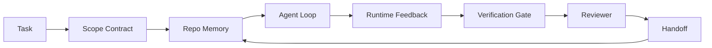

# Rekayasa Agen Meja Kerja: Mengapa Model yang Mampu Masih Gagal

> Model yang mumpuni saja tidak cukup. Agen yang andal memerlukan meja kerja: instruksi, status, ruang lingkup, umpan balik, verifikasi, peninjauan, dan penyerahan. Hapus semua itu dan bahkan model perbatasan akan menghasilkan pekerjaan yang tidak aman untuk dikirim.

**Type:** Learn + Build
**Language:** Python (stdlib)
**Prerequisites:** Fase 14 · 01 (Agent Loop), Fase 14 · 26 (Mode Kegagalan)
**Waktu:** ~45 menit

## Tujuan Pembelajaran

- Pisahkan kemampuan model dari keandalan eksekusi.
- Sebutkan tujuh permukaan meja kerja yang menentukan apakah agen akan melakukan pengiriman.
- Bandingkan proses yang dijalankan hanya dengan prompt dengan proses yang dipandu oleh meja kerja pada tugas repo kecil.
- Menghasilkan laporan mode kegagalan yang memetakan setiap permukaan yang terlewat ke gejala yang ditimbulkannya.

## Masalah

kamu memasukkan model perbatasan ke dalam repo nyata dan memintanya untuk menambahkan validasi input. Ini membuka empat file, menulis code yang masuk akal, menyatakan sukses, dan berhenti. kamu menjalankan tes. Dua gagal. File ketiga disentuh yang tidak ada hubungannya dengan validasi. Tidak ada catatan tentang asumsi agen, apa yang pertama kali dicoba, atau apa yang harus dilakukan.

Modelnya tidak salah tentang Python. Itu salah tentang pekerjaan itu. Ia tidak tahu apa yang dihitung sebagai selesai, di mana ia diizinkan untuk menulis, tes apa yang berwenang, atau bagaimana sesi berikutnya harus dilanjutkan.

Ini bukan bug model. Ini adalah bug meja kerja. Permukaan di sekitar agen kehilangan bagian-bagian yang mengubah generasi sekali pakai menjadi rekayasa yang andal dan dapat dilanjutkan.

## Konsep

Meja kerja adalah lingkungan operasi yang membungkus model selama suatu tugas. Ia memiliki tujuh permukaan:

| Permukaan | Apa yang dibawanya | Kegagalan saat hilang |
|---------|-----------------|----------------------|
| instruksi | Aturan startup, tindakan terlarang, definisi selesai | Agen menebak apa arti pengiriman |
| Negara | Tugas saat ini, file yang disentuh, pemblokir, tindakan selanjutnya | Setiap sesi dimulai ulang dari nol |
| Ruang Lingkup | File yang diizinkan, file terlarang, kriteria penerimaan | Pengeditan bocor ke code yang tidak terkait |
| Umpan Balik | Output prompt nyata ditangkap ke dalam loop | Agen menyatakan sukses pada 400 |
| Verifikasi | Tes, serat, asap, pemeriksaan cakupan | "Kelihatannya bagus" mencapai main |
| Ulasan | Pass kedua dengan peran berbeda | Pembangun menandai pekerjaan rumahnya sendiri |
| Penyerahan | Apa yang berubah, mengapa, apa yang tersisa | Sesi berikutnya menemukan kembali semuanya |

Meja kerja tidak bergantung pada model. kamu dapat menukar model dan mempertahankan permukaannya. kamu tidak dapat menukar permukaan dan menjaga keandalan.



Perulangan ditutup pada file negara, bukan pada riwayat obrolan. Obrolan tidak stabil. Repo adalah sistem pencatatan.

### Meja kerja versus rekayasa cepat

Anjuran memberi tahu model apa yang kamu inginkan pada giliran ini. Meja kerja memberi tahu model cara melakukan pekerjaan lintas putaran dan sesi. Kebanyakan kisah kegagalan agen adalah kegagalan di meja kerja yang mengenakan pakaian rekayasa cepat.

### Meja kerja versus framework

Kerangka kerja memberi kamu runtime (LangGraph, AutoGen, Agents SDK). Meja kerja memberi agen tempat untuk bekerja di dalam runtime tersebut. kamu membutuhkan keduanya. Mini-track ini tentang yang kedua.

### Alasan dari primitif, bukan dari taksonomi vendorAda banyak tulisan tentang "rekayasa harness" saat ini. Addy Osmani, OpenAI, Anthropic, LangChain, Martin Fowler, MongoDB, HumanLayer, Augment Code, Thoughtworks, daftar walklabs yang luar biasa, dan hentakan drum yang mantap dari Medium dan Hacker News semuanya membawanya. Mereka tidak sepakat mengenai batasan apa itu harness, apa cakupannya, dan kosa kata apa yang digunakan. Kita tidak perlu memihak. Ketujuh permukaan tersebut adalah layer UX; di bawah setiap meja kerja terdapat kumpulan primitif sistem terdistribusi yang sama yang mendukung backend yang andal.

Lepaskan label agen sejenak. Agen yang dijalankan adalah komputasi yang melintasi waktu, proses, dan mesin. Untuk membuatnya dapat diandalkan, kamu memerlukan primitif yang sama yang dibutuhkan sistem produksi apa pun.

| Primitif | Apa itu | Apa yang dibawanya untuk seorang agen |
|-----------|------------|------------------------------|
| Fungsi | Pengendali yang diketik. Murni jika memungkinkan. Memiliki input dan outputnya. | Panggilan alat, pemeriksaan aturan, langkah verifikasi, pemanggilan model |
| Pekerja | Proses berumur panjang yang memiliki satu atau lebih fungsi dan siklus hidup | Pembangun, peninjau, pemverifikasi, server MCP |
| Pemicu | Sumber peristiwa yang memanggil fungsi | Centang loop agen, permintaan HTTP, pesan antrian, cron, perubahan file, hook |
| Waktu proses | Batas yang menentukan apa yang dijalankan, di mana, dengan batas waktu dan sumber daya apa | Proses Claude Code, runtime LangGraph, container pekerja |
| HTTP/RPC | Kawat antara penelepon dan pekerja | Protokol panggilan alat, permintaan MCP, model API |
| Antrian | Penyangga yang tahan lama antara pemicu dan pekerja; tekanan balik, coba lagi, idempotensi | Papan tugas, log umpan balik, kotak masuk ulasan |
| Kegigihan sesi | Status yang selamat dari kerusakan, restart, pertukaran model | `agent_state.json`, pos pemeriksaan, toko KV, repo itu sendiri |
| Kebijakan otorisasi | Siapa yang dapat memanggil fungsi apa dengan cakupan apa | File yang diizinkan/dilarang, batasan persetujuan, daftar kemampuan MCP |

Sekarang petakan tujuh permukaan meja kerja ke permukaan primitif tersebut.

- **Petunjuk** — metadata kebijakan + fungsi. Aturan adalah pemeriksaan (fungsi). Router (`AGENTS.md`) adalah kebijakan yang melekat pada startup runtime.
- **Status** — persistensi sesi. Penyimpanan dengan kunci yang dibaca runtime di setiap langkah. File, KV, atau DB; semantik persistensi penting, backend penyimpanan tidak.
- **Cakupan** — kebijakan otorisasi per tugas. Gumpalan yang diizinkan/dilarang adalah ACL. Persetujuan yang diperlukan adalah kisi izin.
- **Umpan Balik** — log pemanggilan ditulis ke dalam antrean. Setiap panggilan shell adalah rekaman, tahan lama, dapat diputar ulang.
- **Verifikasi** — sebuah fungsi. deterministik atas input. Dipicu saat tugas ditutup. Gagal ditutup.
- **Review** — pekerja terpisah dengan autentikasi hanya baca pada artefak pembuat dan autentikasi hanya tulis pada laporan ulasan.
- **Handoff** — rekaman tahan lama yang dikeluarkan oleh pemicu akhir sesi. Pemicu startup sesi berikutnya membacanya.

Perulangan agen itu sendiri adalah pekerja yang menggunakan peristiwa (pesan pengguna, hasil alat, centang pengatur waktu), memanggil fungsi (model, lalu alat yang dipilih model), menulis catatan (status, umpan balik), dan mengeluarkan pemicu (verifikasi, tinjauan, handoff). Tidak ada misteri; bentuknya sama dengan pemroses pekerjaan.

### Pola yang beredar, diterjemahkan ke dalam primitif

Setiap pola harness yang populer direduksi menjadi delapan primitif. Tabel terjemahan.| Pola vendor atau komunitas | Apa itu sebenarnya |
|---------------|--------------------|
| Ralph Loop (Claude Code, Codex, agentic_harness book) — memasukkan kembali maksud asli ke dalam jendela konteks baru ketika agen mencoba berhenti lebih awal | Pemicu yang memasukkan kembali tugas ke dalam antrean ulang dengan konteks yang bersih; ketekunan sesi membawa tujuan ke depan |
| Rencanakan / Jalankan / Verifikasi (PEV) | Tiga pekerja, satu per peran, berkomunikasi melalui status dan antrian antar fase |
| Pemisahan komputasi-harness (OpenAI Agents SDK, April 2026) — memisahkan bidang kontrol dari bidang eksekusi | Menyatakan kembali bidang kontrol/bidang data. Lebih tua dari label agen selama beberapa dekade |
| Open Agent Passport (OAP, Maret 2026) — menandatangani dan mengaudit setiap panggilan alat terhadap kebijakan deklaratif sebelum dieksekusi | Kebijakan otorisasi yang diterapkan oleh pekerja pra-tindakan, dengan antrian audit yang ditandatangani |
| Pemandu dan Sensor (Birgitta Böckeler / Thoughtworks) — aturan umpan maju + observasi umpan balik | Kebijakan otorisasi + fungsi verifikasi + jejak observasi |
| Pemadatan progresif, 5 phase (Rekayasa balik Claude Code, April 2026) | Seorang pekerja manajemen negara yang menjalankan persistensi sesi seperti cron agar tetap sesuai anggaran |
| Hooks / middleware (LangChain, Claude Code) — mencegat model dan panggilan alat | Pemicu + fungsi membungkus jalur pemanggilan runtime |
| Keterampilan sebagai Penurunan Harga dengan Pengungkapan Progresif (Antropik, Flue) | Registri fungsi tempat metadata fungsi dimuat ke dalam konteks tepat waktu |
| Agen Sandbox (Codex, Sandcastle, Vercel Sandbox) | Bidang komputasi: runtime dengan sistem file, jaringan, dan siklus hidup yang terisolasi |
| Server MCP | Pekerja mengekspos fungsi melalui RPC yang stabil, dengan daftar kemampuan sebagai otorisasi |

Setiap entri dalam tabel tersebut adalah komunitas agen yang tiba pada primitif yang telah memiliki nama dalam sistem terdistribusi dan memberinya nama baru. Label yang berguna untuk pemasaran; tidak berguna sebagai kosakata teknik.

### Apa yang sebenarnya tertulis di kuitansi

Klaim harness-over-model kini memiliki sejumlah alasan di baliknya. Perlu diketahui, karena ini juga merupakan satu-satunya argumen jujur ​​yang menentang "tunggu saja model yang lebih cerdas".

- Terminal Bench 2.0 — model yang sama, perubahan harness memindahkan agen pengkodean dari luar 30 teratas ke peringkat lima (LangChain, *Anatomy of an Agent Harness*).
- Vercel — menghapus 80% alat agennya; tingkat keberhasilan melonjak dari 80% menjadi 100% (MongoDB).
- Harvey - agen hukum meningkatkan akurasi lebih dari dua kali lipat melalui optimalisasi harness saja (MongoDB).
- 88% proyek agen AI perusahaan gagal mencapai produksi. Kegagalan berkumpul di sekitar waktu proses, bukan alasan (preprints.org, *Harness Engineering for Language Agents*, Maret 2026).
- Studi benchmark pada tahun 2025 di tiga framework sumber terbuka populer melaporkan ~50% penyelesaian tugas; WebAgent konteks panjang turun dari 40-50% menjadi di bawah 10% dalam kondisi konteks panjang, sebagian besar disebabkan oleh loop tak terbatas dan kehilangan sasaran (dibahas secara luas pada penulisan awal tahun 2026).

Kesimpulannya bukanlah "harness menang selamanya." Model memang menyerap trik harness seiring berjalannya waktu. Kesimpulannya adalah saat ini, rekayasa penahan weight ada di sekitar model, bukan di dalamnya, dan perangkat primitif yang memikul weight tersebut adalah yang selalu dibutuhkan oleh setiap sistem produksi.

### Saat penulisan vendor terhenti

Ini adalah bagian yang tidak perlu kamu bersikap sopan.- *Anatomi Agen Harness* LangChain menyebutkan sebelas komponen — petunjuk, alat, pengait, kotak pasir, orkestrasi, memori, keterampilan, subagen, dan "lingkaran bodoh" runtime. Ini tidak menyebutkan antrean, pekerja sebagai unit penerapan, semantik pemicu, persistensi sesi sebagai masalah terpisah, atau kebijakan otorisasi. Ini memperlakukan harness sebagai objek yang kamu konfigurasikan, bukan sebagai sistem yang kamu terapkan.
- *Agent Harness Engineering* dari Addy Osmani mendapatkan pembingkaian `Agent = Model + Harness` dan pola ratchet, namun tidak menjelaskan dari bahan apa harness itu dibuat. Bunyinya sebagai pendirian, bukan spesifikasi.
- Anthropic dan OpenAI bekerja paling dalam di permukaan namun tetap berada di dalam runtime mereka sendiri. Pengumuman "pemisahan harness-compute" di Agents SDK bulan April 2026 adalah bagian vendor pertama yang secara eksplisit mendukung pemisahan bidang kontrol/bidang data. Itu adalah gagasan primitif, bukan gagasan baru.
- Buku agentic_harness memperlakukan harness sebagai objek konfigurasi (*Agentic Engineering* karya Jaymin West, bab 6) dan baris terkuat di dalamnya adalah "harness adalah batas keamanan utama dalam sistem agen." Itu hanya kebijakan otorisasi, dinyatakan kembali.
- Utas Berita Peretas terus berdatangan di tempat yang sama. Utas April 2026 *Agen harness berada di luar kotak pasir* berpendapat bahwa harness harus ditempatkan "lebih seperti hypervisor yang berada di luar segalanya dan memberi otorisasi akses berdasarkan konteks dan pengguna." Sekali lagi, ini adalah kebijakan otorisasi sebagai bidang yang terpisah.

kamu tidak perlu berbeda pendapat dengan salah satu bagian ini untuk melihat kesenjangannya. Mereka menulis deskripsi UX dari sistem yang sudah ada. Kami sedang menulis sistem. Ketika sistem dibangun dengan benar, tujuh permukaan akan keluar dari permukaan primitif. Jika pembuatannya salah, `AGENTS.md` polesan apa pun tidak dapat memperbaiki antrean yang hilang.

Jadi ketika kamu mendengar "rekayasa harness" di tempat lain, terjemahkan ke dalam bahasa primitif. Anjuran dan aturan adalah kebijakan dan fungsi. Scaffolding adalah runtimenya. Pagar pembatas adalah otorisasi + verifikasi. Kait adalah pemicu. Memori adalah persistensi sesi. Ralph Loop sedang dalam antrian. Subagen adalah pekerja. Kotak pasir adalah bidang komputasi. Kosa kata berubah; rekayasa tidak. Meja kerja adalah UX yang menghadap agen; harness, dalam artian yang bertahan dalam kerangka ulang vendor berikutnya, adalah fungsi, pekerja, pemicu, runtime, antrian, persistensi, dan kebijakan yang digabungkan dengan benar.

## Build

`code/main.py` menjalankan tugas repo kecil dua kali. Pertama hanya sebagai prompt, lalu dengan tujuh permukaan yang disambungkan. Model yang sama, tugas yang sama. Skrip menghitung permukaan mana yang hilang pada proses yang gagal dan mencetak laporan mode kegagalan.

Tugas repo sengaja dibuat kecil: menambahkan validasi input ke penangan gaya FastAPI satu file dan menulis tes kelulusan.

Jalankan:

```
python3 code/main.py
```

Output: log berdampingan dari dua proses, `failure_modes.json` yang meringkas proses hanya prompt, dan keputusan satu baris untuk proses di meja kerja.

Agen adalah sebuah rintisan kecil yang berbasis aturan; intinya adalah permukaannya, bukan modelnya. Di sisa jalur mini ini, kamu akan membangun kembali setiap permukaan menjadi artefak nyata yang dapat digunakan kembali.

## Pakai

Tiga tempat permukaan meja kerja sudah ada di alam liar, meskipun tidak ada yang menyebutnya demikian:- **Claude Code, Codex, Cursor.** `AGENTS.md` dan `CLAUDE.md` adalah permukaan instruksi. Prompt garis miring adalah ruang lingkup. Kait adalah verifikasi.
- **LangGraph, OpenAI Agents SDK.** Pos pemeriksaan dan penyimpanan sesi adalah permukaan negara bagian. Handoff adalah permukaan handoff.
- **CI pada repo asli.** Pengujian, lint, dan pemeriksaan tipe adalah verifikasi. Templat PR adalah serah terima. CODEOWNERS adalah ulasan.

Rekayasa meja kerja adalah disiplin untuk menjadikan permukaan tersebut eksplisit dan dapat digunakan kembali, alih-alih membiarkan setiap tim menemukannya kembali.

## Kirim

`outputs/skill-workbench-audit.md` adalah keterampilan portabel yang mengaudit repo yang ada untuk tujuh permukaan meja kerja dan laporan yang hilang, sebagian, dan sehat. Letakkan di sebelah pengaturan agen mana pun; ini memberi tahu kamu apa yang harus diperbaiki terlebih dahulu.

## Latihan

1. Pilih repo tempat kamu menjalankan agen. Skor tujuh permukaan dari 0 (hilang) hingga 2 (sehat). Apa permukaan terlemah kamu?
2. Perpanjang `main.py` sehingga proses hanya prompt juga menghasilkan klaim "sukses" palsu. Verifikasi gerbang verifikasi akan menangkapnya.
3. Tambahkan permukaan kedelapan untuk produk kamu sendiri. Berikan alasan mengapa hal itu tidak dipecah menjadi salah satu dari tujuh yang ada.
4. Jalankan kembali skrip dengan agen rintisan berbeda yang berhalusinasi penulisan file tambahan. Permukaan manakah yang pertama kali menangkapnya?
5. Petakan lima mode kegagalan industri yang berulang dari Fase 14 · 26 ke tujuh permukaan. Mode manakah yang dirancang untuk diserap oleh setiap permukaan?

## Istilah Kunci

| Istilah | Apa kata orang | Apa sebenarnya arti |
|------|----------------|------------------------|
| Meja Kerja | "Pengaturan" | Permukaan yang direkayasa di sekitar model yang membuat pekerjaan dapat diandalkan |
| Permukaan | "Sebuah dokumen" atau "skrip" | Input bernama yang dapat dibaca mesin yang dibaca atau ditulis agen setiap giliran |
| Sistem pencatatan | "Catatan" | File yang diperlakukan agen sebagai kebenaran ketika riwayat obrolan hilang |
| Definisi selesai | "Penerimaan" | Daftar periksa obyektif dan didukung file yang tidak dapat dipalsukan oleh agen |
| Audit meja kerja | "Pemeriksaan kesiapan repo" | Melewati tujuh permukaan yang menandai bagian yang hilang sebelum pekerjaan dimulai |

## Bacaan Lanjutan

Bacalah ini sebagai poin data, bukan sebagai otoritas. Masing-masing merupakan taksonomi parsial. Terjemahkan setiap konsep kembali ke primitif (fungsi, pekerja, pemicu, waktu proses, HTTP/RPC, antrian, persistensi, kebijakan) sebelum memutuskan apakah akan mengadopsinya.

Kerangka vendor:- [Addy Osmani, Agent Harness Engineering](https://addyosmani.com/blog/agent-harness-engineering/) — `Agent = Model + Harness` dan pola ratchet; lemah dalam hal infrastruktur
- [LangChain, Anatomi Agen Harness](https://blog.langchain.com/the-anatomy-of-an-agent-harness/) — sebelas komponen: petunjuk, alat, kait, orkestrasi, kotak pasir, memori, keterampilan, subagen, waktu proses; menghilangkan antrian, penerapan, authz
- [OpenAI, Harness engineering: memanfaatkan Codex di dunia yang mengutamakan agen](https://openai.com/index/harness-engineering/) — pandangan tim Codex terhadap permukaan di sekitar waktu proses mereka
- [OpenAI, Membuka gulungan loop agen Codex](https://openai.com/index/unrolling-the-codex-agent-loop/) — loop agen dikurangi menjadi `while` melalui pemanggilan fungsi
- [Anthropic, Effective harnesses for long-running-agents](https://www.anthropic.com/engineering/ Effective-harnesses-for-long-running-agents) — permukaan cakrawala panjang di dalam runtime tertentu
- [Antropik, desain Harness untuk pengembangan aplikasi jangka panjang](https://www.anthropic.com/engineering/harness-design-long-running-apps) — catatan desain terapan
- [LangChain Deep Agents memanfaatkan kemampuan](https://docs.langchain.com/oss/python/deepagents/harness) — permukaan konfigurasi runtime

Karya praktisi dengan detail yang dapat digunakan:

- [Martin Fowler / Birgitta Böckeler, Teknik Harness untuk pengguna agen pengkodean](https://martinfowler.com/articles/harness-engineering.html) — panduan (umpan maju) + sensor (umpan balik); pembingkaian teori kontrol yang paling bersih
- [HumanLayer, Skill Issue: Harness Engineering for Coding Agents](https://www.humanlayer.dev/blog/skill-issue-harness-engineering-for-coding-agents) — "ini bukan masalah model, ini masalah konfigurasi"
- [MongoDB, Agen Harness: Mengapa LLM Adalah Bagian Terkecil dari Sistem Agen kamu](https://www.mongodb.com/company/blog/technical/agent-harness-why-llm-is-smallest-part-of-your-agent-system) — tanda terima: Vercel 80% hingga 100%, akurasi Harvey 2x, Terminal Bench Top 30 hingga Top 5
- [Augment Code, Harness Engineering untuk AI Coding Agents](https://www.augmentcode.com/guides/harness-engineering-ai-coding-agents) — panduan yang mengutamakan batasan
- [Podcast Sequoia, Harrison Chase tentang Rekayasa Konteks Agen Long-Horizon](https://sequoiacap.com/podcast/context-engineering-our-way-to-long-horizon-agents-langchains-harrison-chase/) — kekhawatiran waktu proses atas masalah model

Buku, makalah, dan implementasi referensi:

- [Jaymin West, Agentic Engineering — Bab 6: Harness](https://www.jayminwest.com/agentic-engineering-book/6-harnesses) — perlakuan sepanjang buku, memperlakukan harness sebagai batas keamanan utama
- [preprints.org, Harness Engineering for Language Agents (Maret 2026)](https://www.preprints.org/manuscript/202603.1756) — pembingkaian akademis sebagai kontrol / agensi / runtime
- [walkinglabs/awesome-harness-engineering](https://github.com/walkinglabs/awesome-harness-engineering) — daftar bacaan yang dikurasi berdasarkan konteks, evaluasi, observabilitas, orkestrasi
- [ai-boost/awesome-harness-engineering](https://github.com/ai-boost/awesome-harness-engineering) — daftar pilihan alternatif (alat, evaluasi, memori, MCP, izin)
- [andrewgarst/agentic_harness](https://github.com/andrewgarst/agentic_harness) — implementasi referensi siap produksi dengan memori dan eval suite yang didukung Redis
- [HKUDS/OpenHarness](https://github.com/HKUDS/OpenHarness) — memanfaatkan agen terbuka dengan agen pribadi bawaanRangkaian Berita Peretas layak dibaca karena ketidaksepakatannya, bukan konsensusnya:

- [HN: Harness yang efektif untuk agen yang sudah berjalan lama](https://news.ycombinator.com/item?id=46081704)
- [HN: Meningkatkan 15 LLM dalam Coding dalam Satu Sore. Hanya Harnessnya yang Berubah](https://news.ycombinator.com/item?id=46988596)
- [HN: Agent harness berada di luar sandbox](https://news.ycombinator.com/item?id=47990675) — mengajukan otorisasi sebagai pesawat terpisah

Referensi silang dalam kurikulum ini:

- Fase 14 · 23 — Konvensi OpenTelemetry GenAI: layer observabilitas yang ditunjukkan oleh literatur sensor
- Fase 14 · 26 — Katalog mode kegagalan yang dirancang untuk menyerap tujuh permukaan
- Fase 14 · 27 — Pertahanan injeksi cepat yang berada pada kebijakan otorisasi primitif
- Fase 14 · 29 — Waktu proses produksi (antrian, peristiwa, cron): di mana primitif dalam lesson ini hidup dalam penerapan
