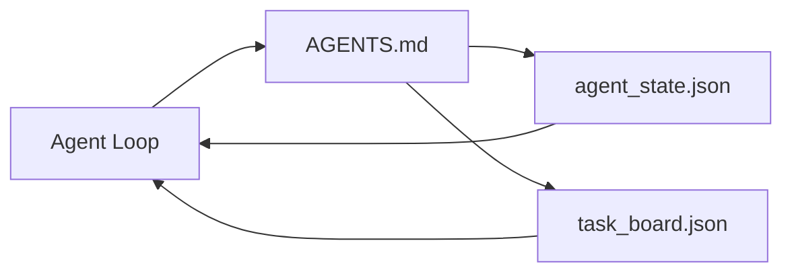

# Meja Kerja Agen Minimal

> Meja kerja terkecil yang berguna adalah tiga file: router instruksi root, file status, dan papan tugas. Segala sesuatu yang lain berlapis di atas. Jika repo tidak dapat memuat ketiga hal ini, tidak ada model yang akan menyimpannya.

**Type:** Build
**Language:** Python (stdlib)
**Prerequisites:** Fase 14 · 31 (Mengapa Model yang Mampu Masih Gagal)
**Waktu:** ~45 menit

## Tujuan Pembelajaran

- Tentukan tiga file yang membentuk meja kerja minimum yang layak.
- Jelaskan mengapa router root pendek mengalahkan `AGENTS.md` monolitik panjang.
- Buat file status yang dapat dibaca agen di setiap kesempatan dan ditulis di akhir.
- Build papan tugas yang bertahan dalam pekerjaan multi-sesi tanpa riwayat obrolan.

## Masalah

Sebagian besar tim mencapai meja kerja dengan menulis 3000 baris `AGENTS.md` dan menyatakan selesai. Model memuatnya, mengabaikan bagian-bagian yang tidak dapat diringkas, dan masih gagal pada permukaan yang sama dimana selalu gagal.

kamu membutuhkan yang sebaliknya. File root kecil yang merutekan agen ke file yang lebih dalam hanya jika relevan. Keadaan tahan lama yang dibaca agen sebelum bertindak dan menulis setelahnya. Papan tugas yang memberitahukan apa yang sedang dalam penerbangan, apa yang diblokir, dan apa yang terjadi selanjutnya.

Tiga file. Masing-masing dengan pekerjaan. Masing-masing cukup dapat dibaca mesin untuk kemudian berevolusi menjadi sistem nyata.

## Konsep



### AGENTS.md adalah router, bukan manual

`AGENTS.md` yang bagus itu pendek. Ini mengarahkan agen ke:

- File negara (di mana kamu berada).
- Papan tugas (yang tersisa).
- Aturan yang lebih dalam (di bawah `docs/agent-rules.md`).
- Prompt verifikasi (cara mengetahui cara kerjanya).

Apa pun yang lebih panjang dimasukkan ke dalam dokumen yang lebih dalam, dimuat hanya jika diperlukan. Manual yang panjang diabaikan. Router pendek diikuti.

### agent_state.json adalah sistem pencatatan

Status membawa: id tugas aktif, file yang disentuh, asumsi yang dibuat, pemblokir, dan tindakan selanjutnya. Agen membacanya di setiap kesempatan. Sesi berikutnya membacanya alih-alih memutar ulang obrolan.

Status ada dalam file karena riwayat obrolan tidak dapat diandalkan. Sesi mati. Percakapan menjadi terpotong. Filenya tidak.

### task_board.json adalah antriannya

Papan tugas membawa setiap tugas dengan status `todo | in_progress | done | blocked`. Ini adalah antrian yang diambil agen ketika keadaan kosong, dan antrian yang kamu baca ketika kamu ingin mengetahui apakah agen berada di jalurnya.

Tugas di papan memiliki id, tujuan, pemilik (`builder`, `reviewer`, atau `human`), dan kriteria penerimaan. Papan ini sengaja dibuat kecil: ketika melampaui layar, kamu memiliki masalah perencanaan, bukan masalah papan.

### Tiga file adalah lantai, bukan langit-langit

Lesson selanjutnya menambahkan kontrak cakupan, pelari umpan balik, gerbang verifikasi, daftar periksa peninjau, dan paket handoff. Ketiga file di sini adalah asumsi mereka semua.

## Build

`code/main.py` menulis meja kerja minimal ke dalam repo kosong dan mendemonstrasikan giliran agen tunggal yang:

1. Dibaca `agent_state.json`.
2. Menarik tugas berikutnya dari `task_board.json` jika status kosong.
3. Menyentuh satu file di dalam cakupan.
4. Menulis kembali status yang diperbarui.

Jalankan:

```
python3 code/main.py
```

Skrip membuat `workdir/` di sebelahnya, meletakkan tiga file, menjalankan satu putaran, dan mencetak perbedaannya. Jalankan kembali untuk melihat bagaimana putaran kedua melanjutkan putaran pertama.

## Pakai

Di dalam produk agen produksi, tiga file yang sama muncul dengan nama berbeda:- **Code Claude:** `AGENTS.md` atau `CLAUDE.md` untuk router, toko bergaya `.claude/state.json` untuk negara bagian, kait untuk papan.
- **Codex / Kursor:** aturan ruang kerja untuk router, memori sesi untuk status, tugas antrian di sidebar obrolan untuk board.
- **Agen Python khusus:** file yang sama yang baru saja kamu tulis.

Nama-namanya berubah. Bentuknya tidak.

## Pola produksi di alam liar

Meja kerja minimum bertahan dari kontak dengan monorepo asli ketika tiga pola dilapis di atasnya. Mereka mandiri; pilih yang benar-benar dibutuhkan repo kamu.

**Bersarang `AGENTS.md` dengan prioritas kemenangan terdekat.** OpenAI mengirimkan 88 file `AGENTS.md` di seluruh repo utamanya, satu file per subkomponen. Codex, Cursor, Claude Code, dan Copilot semuanya berjalan dari file kerja menuju root repo dan menggabungkan setiap `AGENTS.md` yang mereka temukan di jalan. File subdirektori memperluas file root. Codex menambahkan `AGENTS.override.md` untuk menggantikan daripada memperluas; mekanisme override khusus untuk Codex dan hindari untuk pekerjaan lintas alat. Pengukuran Augment Code adalah hal yang penting: file `AGENTS.md` terbaik memberikan lompatan kualitas yang setara dengan peningkatan dari Haiku ke Opus; yang terburuk membuat output lebih buruk daripada tidak ada file sama sekali.

**Anti-pola untuk ditolak, meskipun terlihat seperti cakupan.** Instruksi yang bertentangan secara diam-diam mengubah agen dari mode interaktif ke mode serakah (ICLR 2026 AMBIG-SWE: 48,8% → tingkat penyelesaian 28%); nomor prioritas daripada menumpuknya secara mendatar. Aturan gaya yang tidak dapat diverifikasi ("ikuti Panduan Gaya Google Python") tanpa prompt penerapan membiarkan agen menciptakan kepatuhan; pasangkan setiap aturan gaya dengan prompt lint yang tepat. Memimpin dengan gaya alih-alih prompt mengubur jalur verifikasi; prompt terlebih dahulu, gaya terakhir. Menulis untuk manusia dan bukan untuk agen hanya membuang-buang anggaran konteks; ketegasan adalah sebuah feature.

**Simlink lintas alat.** Satu file root dengan symlink (`ln -s AGENTS.md CLAUDE.md`, `ln -s AGENTS.md .github/copilot-instructions.md`, `ln -s AGENTS.md .cursorrules`) menjaga setiap agen pengkodean pada sumber kebenaran yang sama. `nx ai-setup` Nx mengotomatiskan ini di Claude Code, Cursor, Copilot, Gemini, Codex, dan OpenCode dari satu konfigurasi.

## Kirim

`outputs/skill-minimal-workbench.md` menghasilkan meja kerja tiga file untuk setiap repo baru: router `AGENTS.md` yang disetel ke proyek, `agent_state.json` dengan kunci yang tepat, dan `task_board.json` yang diunggulkan dengan simpanan saat ini.

## Latihan

1. Tambahkan stempel waktu `last_run` ke `agent_state.json`. Menolak untuk dijalankan jika file lebih lama dari 24 jam kecuali operator mengonfirmasi.
2. Tambahkan bidang `priority` ke papan tugas dan ubah penarik untuk selalu memilih prioritas tertinggi `todo`.
3. Migrasi `task_board.json` ke JSON Lines sehingga setiap tugas adalah satu baris dan perbedaannya bersih dalam kontrol versi.
4. Tulis `lint_workbench.py` yang gagal jika `AGENTS.md` lebih dari 80 baris atau mereferensikan file yang tidak ada.
5. Putuskan mana salah satu dari tiga file yang paling menyakitkan jika hilang. Pertahankan itu.

## Istilah Kunci| Istilah | Apa kata orang | Apa sebenarnya arti |
|------|----------------|------------------------|
| Perute | `AGENTS.md` | File root pendek yang mengarahkan agen ke dokumen dan file yang lebih dalam |
| Berkas negara | "Catatan" | Catatan yang dapat dibaca mesin tentang lokasi agen, ditulis setiap saat |
| Papan tugas | "Tunggakan" | Antrian pekerjaan JSON dengan status, pemilik, penerimaan |
| Sistem pencatatan | "Sumber kebenaran" | File yang dianggap otoritatif oleh meja kerja ketika obrolan hilang |

## Bacaan Lanjutan

- [agents.md — spesifikasi terbuka](https://agents.md/) — diadopsi oleh Cursor, Codex, Claude Code, Copilot, Gemini, OpenCode
- [Code Augment, AGENTS.md yang bagus adalah peningkatan model. Dokumen yang buruk lebih buruk daripada tidak ada dokumen sama sekali](https://www.augmentcode.com/blog/how-to-write-good-agents-dot-md-files) — lompatan kualitas yang terukur
- [Blake Crosley, AGENTS.md Patterns: Apa yang Sebenarnya Mengubah Perilaku Agen](https://blakecrosley.com/blog/agents-md-patterns) — apa yang berhasil secara empiris, apa yang tidak
- [Datadog Frontend, Mengarahkan Agen AI di Monorepos dengan AGENTS.md](https://dev.to/datadog-frontend-dev/steering-ai-agents-in-monorepos-with-agentsmd-13g0) — prioritas yang diutamakan dalam praktik
- [Nx Blog, Ajari Agen AI kamu Cara Bekerja di Monorepo](https://nx.dev/blog/nx-ai-agent-skills) — pembuatan sumber tunggal di enam alat
- [The Prompt Shelf, AGENTS.md Praktik Terbaik: Struktur, Ruang Lingkup, dan Contoh Nyata](https://thepromptshelf.dev/blog/agents-md-best-practices/) — urutan bagian yang bertahan dalam tinjauan
- [Antropik, subagen Claude Code dan penyimpanan sesi](https://docs.anthropic.com/en/docs/agents-and-tools/claude-code/sub-agents)
- Fase 14 · 31 — mode kegagalan yang diserap minimum ini
- Fase 14 · 34 — skema status tahan lama yang dipratinjau lesson ini
