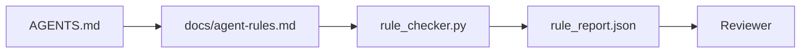

# Instruksi Agen sebagai Batasan yang Dapat Dieksekusi

> Instruksi yang ditulis dalam bentuk prosa adalah keinginan. Instruksi yang ditulis sebagai batasan adalah tes. Meja kerja mengubah setiap aturan menjadi sesuatu yang dapat diperiksa oleh agen saat runtime dan peninjau dapat memverifikasinya setelah kejadian tersebut.

**Type:** Build
**Language:** Python (stdlib)
**Prerequisites:** Fase 14 · 32 (Meja Kerja Minimal)
**Waktu:** ~50 menit

## Tujuan Pembelajaran

- Pisahkan prosa perutean dari aturan operasional.
- Ekspresikan aturan startup, tindakan terlarang, definisi selesai, penanganan ketidakpastian, dan batasan persetujuan sebagai batasan yang dapat diperiksa mesin.
- Menerapkan pemeriksa aturan yang mencetak skor berdasarkan aturan yang ditetapkan.
- Jadikan kumpulan aturan ramah terhadap perbedaan sehingga peninjau dapat melihat apa yang berubah.

## Masalah

`AGENTS.md` yang khas terbaca seperti dokumentasi orientasi. Ini memberitahu agen untuk "berhati-hati" dan "menguji secara menyeluruh" dan "bertanya jika tidak yakin." Tiga hari kemudian, agen mengirimkan perubahan tanpa tes, menulis ke direktori terlarang, dan tidak pernah bertanya karena tidak pernah tahu di mana jalurnya.

Instruksi menjadi kuat jika bersifat operasional dan lemah jika bersifat aspiratif. Cara mengatasinya adalah dengan menulis aturan yang dapat ditafsirkan oleh meja kerja dan dapat dinilai oleh pengulas.

## Konsep

Aturan ada di `docs/agent-rules.md`, jauh dari router root pendek. Setiap aturan memiliki nama, kategori, dan tanda centang.



### Lima kategori yang mencakup sebagian besar aturan

| Kategori | Pertanyaan yang dijawab aturan | Contoh |
|----------|---------------------------|---------|
| Memulai | Apa yang harus benar sebelum pekerjaan dimulai? | "file negara ada dan segar" |
| Dilarang | Apa yang tidak boleh terjadi? | "jangan edit `scripts/release.sh`" |
| Definisi selesai | Apa yang membuktikan bahwa tugas tersebut telah selesai? | "pytest keluar 0 dan jalur penerimaan lewat" |
| Ketidakpastian | Apa yang dilakukan agen ketika tidak yakin? | "buka catatan pertanyaan daripada menebak-nebak" |
| Persetujuan | Apa yang memerlukan persetujuan manusia? | "ketergantungan baru apa pun, tulis produk apa pun" |

Suatu aturan yang tidak sesuai dengan salah satu dari kelima aturan tersebut biasanya ingin menjadi dua aturan. Paksa perpecahan.

### Aturan dapat dibaca mesin

Setiap aturan memiliki slug, kategori, deskripsi satu baris, dan bidang `check` yang memberi nama fungsi di `rule_checker.py`. Menambahkan aturan berarti menambahkan tanda centang; pemeriksa tumbuh bersama meja kerja.

### Aturan ramah terhadap perbedaan

Aturan berlaku satu per judul dalam satu file penurunan harga. Penggantian nama terlihat dalam perbedaan. Aturan baru berada di urutan teratas dalam kategorinya. Aturan basi akan dihapus, bukan dikomentari, karena meja kerja adalah sumber kebenaran, bukan log obrolan tentang perasaan tim pada kuartal terakhir.

### Aturan versus pagar pembatas framework

Pagar framework (pagar pembatas OpenAI Agents SDK, interupsi LangGraph) menegakkan aturan di tingkat waktu proses. Aturan yang ditetapkan dalam lesson ini adalah kontrak yang dapat dibaca manusia dan dapat ditinjau yang diterapkan oleh pagar pembatas tersebut. kamu memerlukan keduanya: runtime menangkap pelanggaran saat berbelok, aturan yang ditetapkan membuktikan runtime melakukan hal yang benar.

## Build

`code/main.py` dikirimkan:

- `agent-rules.md` parser yang memuat aturan ke dalam kelas data.
- `rule_checker.py` fungsi pemeriksa gaya, satu per `check` referensi.
- Agen demo dijalankan yang melanggar dua aturan dan izin pemeriksaan yang menangkap mereka.

Jalankan:

```
python3 code/main.py
```

Output: kumpulan aturan yang diurai, penelusuran yang dijalankan, lulus/gagal per aturan, dan `rule_report.json` disimpan di sebelah skrip.

## Pola produksi di alam liarTiga pola memisahkan kumpulan aturan yang bertahan selama seperempat dari kumpulan aturan yang tidak berlaku lagi dalam seminggu.

**Penandaan tingkat keparahan pada waktu penulisan.** Setiap aturan membawa `severity`: `block`, `warn`, atau `info`. Pemeriksa melaporkan ketiganya; runtime hanya menolak pada `block`. Kebanyakan tim melebih-lebihkan tingkat keparahan di awal, kemudian secara diam-diam melemahkannya di bawah tekanan tenggat waktu; pemberian tag pada waktu tulis memaksa kalibrasi di muka. Pasangkan dengan gerbang verifikasi (Fase 14 · 38), yang menandatangani setiap penggantian aturan `block` ke dalam log audit `overrides.jsonl`.

**Kedaluwarsa aturan sebagai fungsi pemaksa.** Setiap aturan memiliki tanggal `expires_at` (defaultnya adalah 90 hari sejak pembuatan). Pemeriksa mengeluarkan peringatan ketika aturan yang belum habis masa berlakunya tidak memiliki pelanggaran apa pun selama 60 hari berturut-turut; tinjauan triwulanan berikutnya membenarkan untuk menyimpannya, melemahkannya menjadi `info`, atau menghapusnya. Data Tinjauan Code AI produksi Cloudflare (April 2026, 131.246 tinjauan berjalan di 5.169 repo dalam 30 hari) menunjukkan bahwa kumpulan aturan dengan masa berlaku eksplisit tetap berada di bawah 30 aturan per repo; set tanpa berkembang menjadi 80+ dengan sebagian besar tidak pernah menyala.

**Penurunan harga sebagai sumber, JSON sebagai cache.** `agent-rules.md` adalah file yang dibuat; `agent-rules.lock.json` adalah cache yang dibaca pemeriksa di jalur panas. Kunci dibuat ulang dengan kait pra-komitmen. Perbedaan penurunan harga dapat ditinjau; Penguraian JSON selalu dihindari. Bentuknya sama seperti `package.json` / `package-lock.json` dan `Cargo.toml` / `Cargo.lock`.

## Pakai

Dalam produksi:

- Claude Code, Codex, Cursor membaca aturan di awal sesi dan mengutipnya ketika menolak tindakan. Pemeriksa menjalankannya kembali di CI untuk mendeteksi penyimpangan diam.
- Pagar pembatas OpenAI Agents SDK mendaftarkan pemeriksaan yang sama seperti pagar pembatas input dan output. Penurunan harga adalah permukaan dokumen; SDK adalah permukaan runtime.
- LangGraph menghentikan kebakaran ketika node dalam penerbangan melanggar aturan. Penangan interupsi membaca aturan, bertanya kepada manusia, dan melanjutkan.

Kumpulan aturan bersifat portabel di ketiganya karena hanya penurunan harga ditambah nama fungsi.

## Kirim

`outputs/skill-rule-set-builder.md` mewawancarai pemilik proyek, mengklasifikasikan instruksi prosa yang ada ke dalam lima kategori, dan mengeluarkan `agent-rules.md` berversi plus rintisan pemeriksa.

## Latihan

1. Tambahkan kategori keenam jika produk kamu benar-benar membutuhkannya. Pertahankan mengapa hal itu tidak jatuh ke dalam salah satu dari lima hal tersebut.
2. Perluas pemeriksa sehingga aturan dapat membawa tingkat keparahan (`block`, `warn`, `info`) dan laporan dikumpulkan sesuai dengan itu.
3. Hubungkan pemeriksa ke CI: gagalkan build jika aturan tingkat keparahan blok gagal saat agen terakhir dijalankan.
4. Tambahkan kolom "kedaluwarsa" per aturan. Setelah 90 hari tanpa pemeriksaan gagal, aturan tersebut akan ditinjau.
5. Temukan `AGENTS.md` yang asli dan tulis ulang sebagai aturan lima kategori. Berapa banyak jalurnya yang beroperasi? Berapa banyak yang aspirasional?

## Istilah Kunci| Istilah | Apa kata orang | Apa sebenarnya arti |
|------|----------------|------------------------|
| Aturan operasional | "Instruksi nyata" | Aturan yang dapat diperiksa oleh meja kerja saat runtime |
| Aturan aspirasi | "Hati-hati" | Sebuah aturan tanpa pemeriksaan; baik menghapus atau meningkatkan |
| Definisi selesai | "Penerimaan" | Bukti obyektif dan didukung file bahwa tugas telah selesai |
| Tingkat keparahan blok | "Aturan keras" | Pelanggaran menghentikan lari; tidak bisa dibungkam tanpa operator |
| Masa berlaku aturan | "Penyapuan aturan basi" | Aturan tanpa kegagalan dalam N hari akan pensiun |

## Bacaan Lanjutan

- [Pagar pembatas SDK Agen OpenAI](https://platform.openai.com/docs/guides/agents-sdk/guardrails)
- [Interupsi LangGraph](https://langchain-ai.github.io/langgraph/how-tos/human_in_the_loop/breakpoints/)
- [Antropik, Agen Bangunan yang Efektif](https://www.anthropic.com/research/building- Effective-agents)
- [Rick Hightower, Agent RuleZ: Mesin Kebijakan Deterministik](https://medium.com/@richardhightower/agent-rulez-a-deterministic-policy-engine-for-ai-coding-agents-9489e0561edf) — memblokir/memperingatkan/info tingkat keparahan dalam produksi
- [Cloudflare, Mengatur Tinjauan Code AI dalam Skala Besar](https://blog.cloudflare.com/ai-code-review/) — 131 ribu tinjauan berjalan, lesson komposisi aturan
- [microservices.io, platform pengembangan GenAI — bagian 1: pagar pembatas](https://microservices.io/post/architecture/2026/03/09/genai-development-platform-part-1-development-guardrails.html) — pertahanan mendalam antara aturan dan CI
- [Kepatuhan yang Diperiksa Tipe: Pagar Pembatas deterministik (arXiv 2604.01483)](https://arxiv.org/pdf/2604.01483) — Lean 4 sebagai batas atas pada rule-as-check
- [logi-cmd/agent-guardrails](https://github.com/logi-cmd/agent-guardrails) — implementasi gerbang gabungan: cakupan, pengujian mutasi, anggaran pelanggaran
- Fase 14 · 32 — meja kerja minimal yang ditetapkan oleh aturan ini
- Fase 14 · 38 — gerbang verifikasi yang menggunakan laporan aturan
- Fase 14 · 39 — agen peninjau yang menilai kepatuhan aturan
