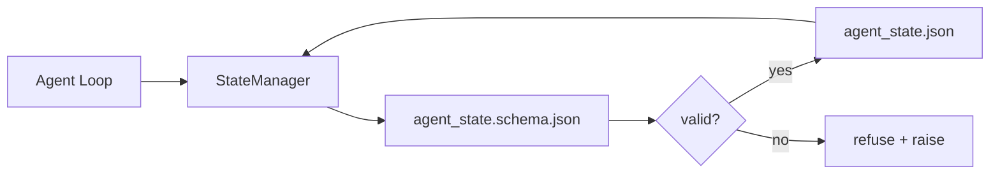

# Memori Repo dan Status Tahan Lama

> Riwayat obrolan mudah berubah. Reponya tahan lama. Meja kerja menyimpan status agen dalam file berversi sehingga sesi berikutnya, agen berikutnya, dan peninjau berikutnya semuanya dibaca dari sumber kebenaran yang sama.

**Type:** Build
**Language:** Python (stdlib + `jsonschema` opsional)
**Prerequisites:** Fase 14 · 32 (Meja Kerja Minimal)
**Waktu:** ~60 menit

## Tujuan Pembelajaran

- Tentukan apa yang termasuk dalam memori repo dan apa yang termasuk dalam riwayat obrolan.
- Penulis Skema JSON untuk `agent_state.json` dan `task_board.json`.
- Membangun manajer negara yang memuat, memvalidasi, bermutasi, dan mempertahankan keadaan secara atom.
- Gunakan skema untuk menolak penulisan yang buruk sebelum merusak meja kerja.

## Masalah

Agen menyelesaikan sesi. Obrolan ditutup. Sesi berikutnya terbuka dan menanyakan harus mulai dari mana. Model mengatakan "biarkan saya memeriksa file", membaca catatan basi, dan mengerjakan kembali pekerjaan yang sudah selesai. Atau lebih buruk lagi, ia menulis ulang file yang sudah selesai karena tidak ada yang memberi tahu bahwa file tersebut telah selesai.

Perbaikan meja kerja adalah memori repo: status ada dalam file JSON di repo, ditulis berdasarkan skema, bertahan secara atom, ramah terhadap perbedaan dalam tinjauan code. Obrolan adalah umpan sementara; repo adalah sistem pencatatan.

## Konsep



### Apa yang termasuk dalam memori repo

| Milik | Bukan milik |
|---------|-----------------|
| Id tugas aktif | Transkrip obrolan mentah |
| Menyentuh file sesi ini | Jejak penalaran tingkat token |
| Asumsi yang dibuat agen | "Pengguna tampak frustrasi" |
| Buka pemblokir | Penyelesaian sample |
| Tindakan selanjutnya | Id model khusus vendor |

Uji cobanya adalah ketahanan: apakah ini akan berguna dalam pemeriksaan ulang CI tiga bulan dari sekarang? Jika ya, repo. Jika tidak, telemetri.

### Status skema-pertama

Skema JSON adalah kontraknya. Tanpanya, setiap agen menciptakan bidang baru, setiap pengulas mempelajari bentuk baru, dan setiap skrip CI harus membuat kasus khusus pada versi sebelumnya. Dengan itu, tulisan yang buruk adalah tulisan yang ditolak.

Skema ini mencakup:

- Kunci yang diperlukan.
- Nilai `status` diperbolehkan.
- Nilai terlarang (misalnya `null` untuk array).
- Batasan pola (id tugas cocok dengan `T-\d{3,}`).
- Bidang versi untuk migrasi.

### Atom menulis

Penulisan status harus bertahan dari kegagalan sebagian: tulis ke file temp, fsync, ganti nama di atas target. Arsip negara adalah sumber kebenaran; yang setengah tertulis lebih buruk daripada tidak ada file sama sekali.

### Migrasi

Saat skema berubah, kirimkan skrip migrasi di sebelah perubahan skema. File negara membawa bidang `schema_version`; pengelola menolak memuat file dari versi yang tidak dapat dimigrasikan.

## Build

`code/main.py` mengimplementasikan:

- `agent_state.schema.json` dan `task_board.schema.json`.
- Validator khusus stdlib (bagian dari Skema JSON: wajib, ketik, enum, pola, item).
- `StateManager.load`, `StateManager.update`, `StateManager.commit` dengan penulisan temp-and-rename atom.
- Demo yang mengubah status, bertahan, memuat ulang, dan membuktikan perjalanan pulang pergi.

Jalankan:

```
python3 code/main.py
```

Skrip menulis `workdir/agent_state.json` dan `workdir/task_board.json`, memutasinya dalam dua putaran, dan mencetak status tervalidasi pada setiap langkah.

## Pola produksi di alam liar

Empat pola mengubah lesson minimum menjadi sesuatu yang dapat dipertahankan oleh monorepo multi-agen.**Temp-and-rename atom bukan opsional.** Laporan bug proyek Hive bulan Maret 2026 mendokumentasikan mode kegagalan dengan jelas: `state.json` ditulis melalui `write_text()` dan pengecualian ditangkap dan dibungkam. Penulisan sebagian sesi kiri dilanjutkan kembali dalam keadaan rusak tanpa sinyal. Cara mengatasinya selalu: `tempfile.mkstemp` di direktori yang sama dengan target, tulis, `fsync`, `os.replace` (ganti nama atom di POSIX dan Windows). `atomic_write` lesson ini melakukan hal tersebut.

**Kunci idempotensi pada setiap panggilan alat non-idempoten.** Jika agen mengalami error setelah memanggil alat tetapi sebelum memeriksa hasilnya, pemulihan akan mencoba kembali panggilan alat tersebut. Aman untuk dibaca; berbahaya untuk email, sisipan DB, unggahan file. Polanya: catat setiap ID panggilan alat sebelum dieksekusi ke `pending_calls.jsonl`. Saat mencoba lagi, periksa ID; jika ada, lewati panggilan dan gunakan hasil cache. Anthropic dan LangChain keduanya menyebutkan hal ini dalam panduan tahun 2026; Checkpointer LangGraph tetap menunggu penulisan karena alasan yang sama.

**Pisahkan artefak besar dari negara bagian.** Jangan simpan CSV, transkrip panjang, atau file yang dibuat di `agent_state.json`. Simpan artefak sebagai file terpisah (atau unggah ke penyimpanan objek) dan simpan hanya jalurnya saja. Pos pemeriksaan tetap kecil dan cepat; artefak tumbuh secara mandiri.

**Sumber peristiwa untuk audit, cuplikan untuk resume.** Tambahkan ke log peristiwa (`state.events.jsonl`) pada setiap mutasi; snapshot secara berkala ke `state.json`. Lanjutkan membaca snapshot, lalu memutar ulang peristiwa apa pun setelah stempel waktu snapshot. Ini membutuhkan lebih banyak biaya disk, tetapi memungkinkan kamu memutar ulang keputusan agen secara verbatim — penting saat melakukan debug pada jangka panjang. Bentuk yang sama digunakan Postgres secara internal untuk WAL.

**Migrasi skema atau penolakan memuat.** Bilangan bulat `schema_version` adalah kontraknya. Ketika manajer memuat file dengan versi yang tidak diketahui, ia menolak untuk membaca. Kirim skrip migrasi di sebelah skema; `tools/migrate_state.py` berjalan idempoten di setiap startup.

## Pakai

Dalam produksi:

- **Pemeriksa LangGraph.** Ide yang sama, penyimpanan berbeda. Checkpointer mempertahankan status grafik ke SQLite, Postgres, atau backend khusus. Skema yang diajarkan lesson ini adalah apa yang kamu capai ketika checkpointer mati dan kamu perlu membaca status dengan tangan.
- **Blok memori Letta.** Blok persisten dengan skema terstruktur (Fase 14 · 08). Disiplin yang sama mencakup persona jangka panjang.
- **Penyimpanan sesi OpenAI Agents SDK.** Backend yang dapat dicolokkan, peka terhadap skema. File status dalam lesson ini adalah backend file lokal.

## Kirim

`outputs/skill-state-schema.md` menghasilkan pasangan Skema JSON khusus proyek (status + papan), Python `StateManager` yang dihubungkan ke penulisan atom, dan perancah migrasi sehingga perubahan skema berikutnya tidak merusak meja kerja.

## Latihan

1. Tambahkan stempel waktu `last_human_touch`. Tolak agen mana pun yang menulis dalam waktu lima detik setelah pengeditan manusia.
2. Perluas validator untuk mendukung `oneOf` sehingga tugas dapat berupa tugas pembangunan atau tugas tinjauan dengan bidang wajib yang berbeda.
3. Tambahkan bidang `schema_version` dan tulis migrasi dari v1 ke v2 (ganti nama `blockers` menjadi `risks`).
4. Pindahkan backend penyimpanan dari file lokal ke SQLite. Jaga agar `StateManager` API tetap identik.
5. Jalankan dua agen terhadap file status yang sama dengan lomba tulis 50 ms. Apa yang salah dan bagaimana penggantian nama atom menyelamatkan kamu?

## Istilah Kunci| Istilah | Apa kata orang | Apa sebenarnya arti |
|------|----------------|------------------------|
| Memori repo | "Berkas catatan" | Status disimpan dalam file yang dilacak di repo, di bawah skema |
| Skema-pertama | "Validasi input" | Tentukan kontrak sebelum penulis, tolak penyimpangan |
| Tulisan atom | "Ganti saja namanya" | Tulis ke temp, fsync, ganti nama, sehingga kegagalan sebagian tidak dapat merusak |
| Migrasi | "Skema benjolan" | Skrip yang mengubah status vN menjadi status v(N+1) |
| Sistem pencatatan | "Sumber kebenaran" | Artefak yang dianggap berwibawa oleh meja kerja |

## Bacaan Lanjutan

- [Spesifikasi Skema JSON](https://json-schema.org/spesifikasi.html)
- [Poin pemeriksaan LangGraph](https://langchain-ai.github.io/langgraph/concepts/persistence/)
- [Blok memori Letta](https://docs.letta.com/concepts/memory)
- [Fast.io, Pos Pemeriksaan Status Agen AI: Panduan Praktis](https://fast.io/resources/ai-agent-state-checkpointing/) — pos pemeriksaan pertama skema dengan idempotensi
- [Fast.io, Persistensi Status Alur Kerja Agen AI: Praktik Terbaik 2026](https://fast.io/resources/ai-agent-workflow-state-persistence/) — kontrol konkurensi, TTL, sumber peristiwa
- [Hive Issue #6263 — penulisan state.json non-atomik diabaikan secara diam-diam](https://github.com/aden-hive/hive/issues/6263) — mode kegagalan dalam proyek nyata
- [eunomia, Checkpoint/Restore Systems: Evolution, Techniques, Applications](https://eunomia.dev/blog/2025/05/11/checkpointrestore-systems-evolution-techniques-and-applications-in-ai-agents/) — Primitif CR dari riwayat OS yang diterapkan pada agen
- [Indium, 7 Strategi Kegigihan Negara untuk Agen AI Jangka Panjang pada tahun 2026](https://www.indium.tech/blog/7-state-persistence-strategies-ai-agents-2026/)
- [Microsoft Agent Framework, Pemadatan](https://learn.microsoft.com/en-us/agent-framework/agents/conversations/compaction) — manajer pos pemeriksaan vendor
- Fase 14 · 08 — blok memori dan komputasi waktu tidur
- Fase 14 · 32 — minimum tiga file yang dibuat skema lesson ini
- Fase 14 · 40 — paket handoff dibaca dari skema yang sama
