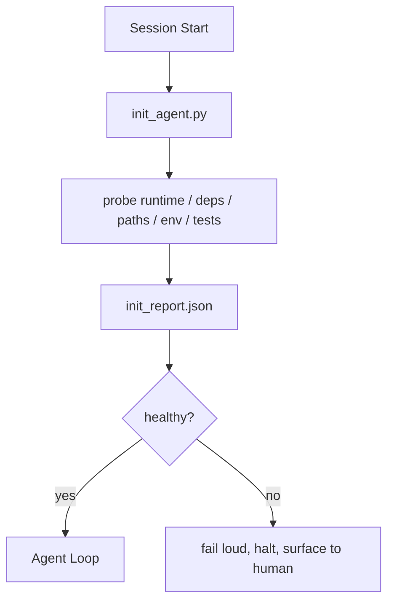

# Skrip Inisialisasi untuk Agen

> Setiap sesi yang dimulai dengan dingin akan dikenakan pajak. Agen membaca file yang sama, mencoba kembali probe yang sama, dan menemukan kembali jalur yang sama. Skrip init membayar pajak satu kali dan menulis jawabannya ke negara bagian.

**Type:** Build
**Language:** Python (stdlib)
**Prerequisites:** Fase 14 · 32 (Meja Kerja Minimal), Fase 14 · 34 (Memori Repo)
**Waktu:** ~45 menit

## Tujuan Pembelajaran

- Identifikasi pekerjaan yang tidak boleh dilakukan agen lagi per sesi.
- Membangun skrip init deterministik yang menyelidiki runtime, dependensi, dan kesehatan repo.
- Pertahankan hasil penyelidikan sehingga agen membacanya alih-alih menjalankan kembali pemeriksaan.
- Gagal dengan keras, cepat, dan dengan satu tempat untuk melihat ketika inisialisasi gagal.

## Masalah

Buka sesi. Agen menebak versi Python. Menebak prompt tes. Cantumkan root repo lima kali untuk menemukan titik masuk. Mencoba mengimpor paket yang belum diinstal. Menanyakan kepada pengguna di mana file konfigurasi berada. Pada saat melakukan pengeditan nyata, sepuluh ribu token telah digunakan untuk pekerjaan penyiapan yang seharusnya berupa skrip tunggal.

Perbaikannya adalah satu skrip inisialisasi yang dijalankan sebelum agen melakukan hal lain dan menulis `init_report.json` yang dibaca agen saat startup.

## Konsep



### Apa yang diperiksa oleh skrip init

| Selidiki | Mengapa itu penting |
|-------|----------------|
| Versi waktu proses | Versi Python atau Node yang salah berarti membungkam bug versi yang salah |
| Ketersediaan ketergantungan | Paket yang hilang nanti harganya sepuluh kali lipat biaya penangkapannya sekarang |
| Prompt uji | Agen harus mengetahui cara memverifikasi; jika perintahnya hilang meja kerja rusak |
| Jalur repo | Jalur dengan code keras melayang; selesaikan sekali dan sematkan |
| Variabel lingkungan | `OPENAI_API_KEY` yang hilang adalah permukaan kegagalan, bukan misteri runtime |
| Kesegaran negara + papan | Keadaan basi dari sesi yang mogok adalah sebuah footgun |
| Komitmen baik yang terakhir diketahui | Jangkar untuk perbedaan handoff di akhir sesi |

### Gagal besar, gagal cepat, gagal di satu tempat

Kegagalan probe berarti terhenti dan muncul ke permukaan manusia. Tidak, "agen akan mengetahuinya." Inti dari init adalah menolak memulai ketika meja kerja rusak.

### Idempoten

Jalankan dua kali berturut-turut. Proses kedua seharusnya tidak boleh dilakukan kecuali untuk stempel waktu baru. Idempotensi memungkinkan kamu menyambungkan skrip ke CI, hook, atau prompt garis miring sebelum tugas.

### Init versus aturan startup

Aturan (Fase 14 · 33) menggambarkan apa yang harus benar untuk bertindak. Init adalah skrip yang menetapkan bahwa aturan tersebut dapat diperiksa. Aturan tanpa init menjadi "hati-hati". Init tanpa aturan menjadi kegagalan yang sempurna.

## Build

`code/main.py` mengimplementasikan `init_agent.py`:

- Lima probe: versi Python, dependensi terdaftar melalui `importlib.util.find_spec`, uji resolusi prompt, env vars yang diperlukan, status kesegaran file.
- Setiap pemeriksaan mengembalikan `(name, status, detail)`.
- Skrip menulis `init_report.json` dengan set probe lengkap dan keluar bukan nol jika ada probe tingkat keparahan blok yang gagal.

Jalankan:

```
python3 code/main.py
```

Skrip mencetak tabel probe, menulis `init_report.json`, dan keluar dari nol di jalur bahagia atau bukan nol dengan daftar probe yang gagal.

## Pola produksi di alam liar

Tiga pola memisahkan skrip init yang berguna dari sebuah upacara.**Penahan komit yang terakhir diketahui-baik.** Selidiki komit saat ini terhadap file `LKG` yang ditulis pada penggabungan terakhir yang berhasil. Jika perbedaan melebihi anggaran (default 50 file), tolak untuk memulai dan minta manusia untuk meratifikasi baseline baru. Inilah yang digunakan oleh Tinjauan Code AI Cloudflare untuk mencakup agen peninjau: setiap sesi peninjauan berlabuh pada barang-barang yang terakhir diketahui-barang yang sama dan tidak pernah terjadi penyimpangan antar sesi.

**Kunci file dengan TTL.** Tulis `prereqs.lock` setelah probe pertama berhasil lulus. Proses berikutnya mempercayai kunci selama N jam (default 24 jam) dan melewati pemeriksaan yang mahal. Skrip init membaca kuncinya terlebih dahulu; jika masih baru dan hash manifes ketergantungan cocok, maka akan terjadi hubungan arus pendek. Ini adalah pola yang sama yang digunakan Docker untuk cache layer: probe idempoten + hash konten = lewati.

**Tidak ada jaringan, tidak ada LLM, tidak ada kejutan di jalur panas.** Probe init merupakan pipa deterministik. Penyelidikan yang memanggil LLM untuk mengklasifikasikan kegagalan atau yang mengenai layanan eksternal untuk memeriksa lisensi bukanlah penyelidikan; itu adalah alur kerja. Jika probe membutuhkan waktu lebih dari tiga detik dalam proses kering, perlakukan itu sebagai bau meja kerja dan pindahkan dari init atau simpan hasilnya.

## Pakai

Dalam produksi:

- **Claude Code hooks.** `pre-task` hook memanggil skrip init dan menolak meluncurkan agen jika gagal.
- **Tindakan GitHub.** Pekerjaan `setup-agent` menjalankan skrip init; pekerjaan agen bergantung padanya.
- **Titik masuk Docker.** Kontainer agen menjalankan skrip init sebelum mengeksekusi runtime agen; permukaan log pada kegagalan.

Skrip init bersifat portabel karena tidak melakukan panggilan ke framework tertentu. Bash, Make, atau file tugas semuanya dapat membungkusnya.

## Kirim

`outputs/skill-init-script.md` mewawancarai proyek, mengklasifikasikan pekerjaan penyiapannya ke dalam penyelidikan, dan mengeluarkan `init_agent.py` khusus proyek ditambah alur kerja CI yang menjalankannya sebelum langkah agen apa pun.

## Latihan

1. Tambahkan probe yang membedakan komit saat ini dengan komit yang terakhir diketahui baik dan menolak untuk memulai jika lebih dari 50 file diubah.
2. Hubungkan skrip untuk menulis file `prereqs.lock` dan tolak untuk memulai jika kunci lebih lama dari tujuh hari.
3. Tambahkan tanda `--fix` yang secara otomatis menginstal dependensi dev yang hilang tetapi tidak pernah mengubah dependensi runtime tanpa persetujuan.
4. Pindahkan probe dari fungsi hardcode ke registri YAML. Pertahankan trade-off.
5. Tambahkan anggaran waktu per penyelidikan. Sebuah probe yang berjalan lebih dari tiga detik adalah bau meja kerja.

## Istilah Kunci

| Istilah | Apa kata orang | Apa sebenarnya arti |
|------|----------------|------------------------|
| Selidiki | "Sebuah cek" | Fungsi deterministik yang mengembalikan `(name, status, detail)` |
| Laporan awal | "Pengaturan output" | JSON ditulis disebelah state dengan hasil probe |
| Idempoten | "Aman untuk dijalankan kembali" | Dua proses berturut-turut menghasilkan laporan yang identik stempel waktu modulo |
| Gagal keras | "Jangan menelan" | Berhenti dan muncul ke permukaan manusia; tidak ada kemunduran diam |
| Pengaturan pajak | "Biaya bootstrap" | Token yang dikeluarkan agen per sesi untuk menemukan kembali |

## Bacaan Lanjutan- [Pengmanfaatan Antropik dan Efektif untuk agen jangka panjang](https://www.anthropic.com/engineering/ Effective-harnesses-for-long-running-agents)
- [Tindakan GitHub, tindakan gabungan untuk penyiapan](https://docs.github.com/en/actions/sharing-automations/creating-actions/creating-a-composite-action)
- [microservices.io, platform pengembang GenAI: pagar pembatas](https://microservices.io/post/architecture/2026/03/09/genai-development-platform-part-1-development-guardrails.html) — pemeriksaan pra-komit + CI sebagai init
- [Code Augment, Cara Membangun AGENTS.md kamu (2026)](https://www.augmentcode.com/guides/how-to-build-agents-md) — init ekspektasi
- [Blog Codex, Pemadatan Konteks Codex CLI](https://codex.danielvaughan.com/2026/03/31/codex-cli-context-compaction-architecture/) — sesi dimulai sebagai init yang sadar akan pemadatan
- Fase 14 · 33 — kumpulan aturan yang diaktifkan skrip ini
- Fase 14 · 34 — status file benih skrip ini
- Fase 14 · 38 — gerbang verifikasi yang diumpankan skrip init
- Fase 14 · 40 — handoff yang menggunakan barang terakhir yang diketahui dari laporan awal
