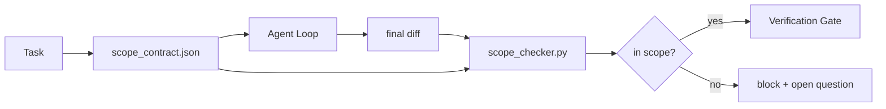

# Kontrak Ruang Lingkup dan Batasan Tugas

> Model tidak mengetahui di mana pekerjaannya berakhir. Kontrak cakupan adalah file per tugas yang menyatakan di mana pekerjaan dimulai, di mana berakhir, dan cara melakukan roll back jika pekerjaan tersebut tumpah. Kontrak tersebut mengubah "tetap dalam ruang lingkup" dari sebuah keinginan menjadi sebuah cek.

**Type:** Build
**Language:** Python (stdlib)
**Prerequisites:** Fase 14 · 32 (Meja Kerja Minimal), Fase 14 · 33 (Aturan sebagai Batasan)
**Waktu:** ~50 menit

## Tujuan Pembelajaran

- Tulis kontrak cakupan yang dibaca agen saat tugas dimulai dan verifikator membaca di akhir tugas.
- Tentukan file yang diizinkan, file terlarang, kriteria penerimaan, rencana rollback, dan batasan persetujuan.
- Menerapkan pemeriksa cakupan yang membandingkan perbedaan dengan kontrak dan menandai pelanggaran.
- Jadikan scope creep terlihat, otomatis, dan dapat ditinjau.

## Masalah

Agen merayap. Tugasnya adalah "memperbaiki bug login". Perbedaannya menyentuh rute login, pembantu email, driver database, README, dan skrip rilis. Setiap sentuhan memiliki alasan yang masuk akal pada saat itu. Bersama-sama, keduanya merupakan perubahan yang berbeda dari yang telah ditinjau.

Scope creep adalah mode kegagalan yang paling kurang dipantau dalam pekerjaan agen karena agen menceritakan setiap langkah dengan itikad baik. Perbaikannya bukanlah prompt yang lebih ketat. Cara mengatasinya adalah kontrak pada disk yang menyatakan apa yang dijanjikan dan pemeriksaan yang membandingkan hasilnya dengan janji.

## Konsep



### Apa yang ada dalam kontrak lingkup

| Bidang | Tujuan |
|-------|---------|
| `task_id` | Tautan ke tugas di papan |
| `goal` | Satu kalimat yang dapat diverifikasi oleh pengulas |
| `allowed_files` | Gumpalan yang mungkin ditulis agen |
| `forbidden_files` | Gumpalan yang tidak boleh disentuh oleh agen bahkan secara tidak sengaja |
| `acceptance_criteria` | Uji prompt atau baris pernyataan yang terbukti selesai |
| `rollback_plan` | Satu paragraf yang dapat dijalankan oleh operator jika diperlukan penghentian |
| `approvals_required` | Tindakan di luar cakupan yang memerlukan persetujuan manusia secara eksplisit |

Kontrak tanpa `forbidden_files` tidak lengkap. Ruang negatif adalah setengah kontrak.

### Gumpalan, bukan jalur mentah

Repo nyata memindahkan file. Sematkan kontrak ke glob (`app/**/*.py`, `tests/test_signup*.py`) sehingga pemfaktoran ulang antar sesi tidak membuat kontrak menjadi tidak valid.

### Rollback adalah bagian dari cakupan

Mencantumkan cara melakukan roll back memaksa pembuat kontrak memikirkan apa yang mungkin salah. Kontrak yang tidak dapat kamu batalkan adalah kontrak yang tidak boleh disetujui.

### Pemeriksaan cakupan adalah pemeriksaan perbedaan

Agen menulis perbedaan. Pemeriksa membaca perbedaan, glob yang diizinkan, glob terlarang, dan daftar prompt penerimaan apa pun yang dijalankan. Setiap pelanggaran ditandai dengan temuan yang dapat ditolak oleh gerbang verifikasi.

## Build

`code/main.py` mengimplementasikan:

- Skema `scope_contract.json` (bagian dari Skema JSON, array glob).
- Parser berbeda yang mengubah daftar file yang disentuh ditambah daftar prompt yang dijalankan menjadi `RunSummary`.
- `scope_check` yang mengembalikan `(violations, in_scope, off_scope)` bertentangan dengan kontrak.
- Dua demo berjalan: satu yang tetap dalam cakupan, satu lagi yang merayap. Pemeriksa menandai creep dengan file dan alasan yang tepat.

Jalankan:

```
python3 code/main.py
```

Output: kontrak, dua proses, keputusan per proses, dan `scope_report.json` yang disimpan.

## Pola produksi di alam liarSeorang praktisi yang menjalankan "specsmaxxing" (kontrak cakupan di YAML sebelum memanggil agen) melaporkan tingkat lubang kelinci turun dari 52% menjadi 21% dalam tiga minggu tanpa mengganti agen. Kontraklah yang melakukan pekerjaannya, bukan modelnya. Tiga pola membuat perolehan tetap.

**Pelanggaran anggaran, bukan kegagalan biner.** `agent-guardrails` (gerbang penggabungan OSS yang digunakan oleh Claude Code, Cursor, Windsurf, Codex melalui MCP) mengirimkan `violationBudget` per tugas: penyimpangan kecil dalam cakupan anggaran akan muncul sebagai peringatan; hanya ketika anggaran terlampaui barulah gerbang penggabungan menolak. Sandingkan dengan `violationSeverity: "error" | "warning"`. Anggaran adalah selisih antara gerbang yang dikirimkan dan gerbang yang dinonaktifkan oleh tim yang membencinya.

**Keparahan asimetri berdasarkan kelompok jalur.** Penulisan di luar cakupan ke `docs/**` biasanya `warn`; tulisan di luar cakupan ke `scripts/**`, `migrations/**`, `config/prod/**` selalu `block`. Asimetri ini harus ada dalam kontrak, bukan dalam runtime, karena ini bersifat spesifik proyek dan berubah per tugas.

**Anggaran waktu dan jaringan di samping anggaran file.** Bidang `time_budget_minutes` membatasi jam dinding; runtime menolak untuk terus melewatinya tanpa persetujuan ulang. Daftar `network_egress` yang diizinkan pada nama host mencegah agen secara diam-diam mengakses API eksternal yang bukan bagian dari tugas. Ini juga merupakan dimension cakupan; gumpalan file diperlukan, tidak cukup.

**Semantik penggabungan multi-kontrak (hak istimewa paling rendah).** Jika dua kontrak cakupan berlaku (misalnya, kontrak seluruh proyek ditambah satu kontrak khusus tugas), penggabungannya adalah: **berpotongan** `allowed_files` (kedua kontrak harus mengizinkan jalurnya), **penyatuan** `forbidden_files` (keduanya bisa melarang), `time_budget_minutes` adalah yang paling ketat (min), `approvals_required` terakumulasi. `network_egress` adalah `None` tanpa penegakan hukum, `[]` untuk penolakan semua, `[...]` sebagai daftar yang diizinkan; di bawah penggabungan, `None` menangguhkan ke sisi lain, dua daftar berpotongan, dan tolak-semua tetap tolak-semua. Nyatakan hal ini dalam skema kontrak sehingga penggabungan bersifat mekanis dan dapat ditinjau.

## Pakai

Pola produksi:

- **Prompt garis miring Code Claude.** Prompt `/scope` menulis kontrak dan menyematkannya sebagai konteks sesi. Subagen membaca kontrak sebelum bertindak.
- **GitHub PRs.** Masukkan kontrak sebagai file JSON di badan PR atau sebagai artefak yang didaftarkan. CI menjalankan pemeriksa cakupan terhadap perbedaan penggabungan.
- **Interupsi LangGraph.** Pelanggaran cakupan memicu interupsi; pawang bertanya kepada manusia apakah kontrak perlu diperpanjang atau agen harus mundur.

Kontrak berjalan dengan tugas. Saat tugas ditutup, kontrak diarsipkan di `outputs/scope/closed/`.

## Kirim

`outputs/skill-scope-contract.md` menghasilkan kontrak cakupan untuk deskripsi tugas dan pemeriksa sadar glob yang berjalan di CI pada setiap perbedaan agen.

## Latihan1. Tambahkan bidang `network_egress` yang mencantumkan host eksternal yang diizinkan. Tolak proses yang menyentuh host lain.
2. Perpanjang pemeriksa untuk gagal lunak pada `docs/**` dan keras pada `scripts/**`. Benarkan asimetri tersebut.
3. Buat kontrak diturunkan `allowed_files` dari bidang `goal` menggunakan kumpulan aturan statis (tanpa LLM). Apa yang salah pada kasus tepi pertama?
4. Tambahkan `time_budget_minutes` dan tolak untuk melanjutkan setelah jam dinding melebihinya.
5. Jalankan dua kontrak dengan perbedaan yang sama. Apa semantik gabungan yang tepat ketika keduanya berlaku?

## Istilah Kunci

| Istilah | Apa kata orang | Apa sebenarnya arti |
|------|----------------|------------------------|
| Kontrak ruang lingkup | "Ringkasan tugas" | Daftar JSON per tugas file yang diizinkan/dilarang, penerimaan, rollback |
| Ruang lingkup merayap | "Itu juga menyentuh..." | File di luar kontrak diubah dalam tugas yang sama |
| Rencana pengembalian | "Kita bisa kembali" | Runbook operator satu paragraf untuk menghentikan |
| Batas persetujuan | "Perlu persetujuan" | Suatu tindakan yang tercantum dalam kontrak memerlukan persetujuan manusia secara eksplisit |
| Periksa perbedaan | "Audit jalur" | Membandingkan file yang disentuh dengan gumpalan kontrak |

## Bacaan Lanjutan

- [interupsi LangGraph human-in-the-loop](https://langchain-ai.github.io/langgraph/concepts/human_in_the_loop/)
- [Kebijakan persetujuan alat OpenAI Agents SDK](https://platform.openai.com/docs/guides/agents-sdk)
- [logi-cmd/agent-guardrails — menggabungkan gerbang dan validasi cakupan](https://github.com/logi-cmd/agent-guardrails) — anggaran pelanggaran, tingkat keparahan
- [Dev|Journal, Mencegah Penyimpangan Konfigurasi Agen AI dengan Pengujian Kontrak Agen](https://earezki.com/ai-news/2026-05-05-i-built-a-tiny-ci-tool-to-keep-ai-agent-configs-from-drifting-in-my-repo/) — mode `--strict` tanpa deps eksternal
- [Agentic Coding Bukanlah Jebakan (log produksi)](https://dev.to/jtorchia/agentic-coding-is-not-a-trap-i-answered-the-viral-hn-post-with-my-own-production-logs-33d9) — penerimaan specsmaxxing: 52% → 21%
- [gumpalan izin OpenCode](https://opencode.ai/docs/agents/) — cakupan per izin yang terperinci
- [Knostic, Keamanan Agen Pengodean AI: Model Ancaman dan Strategi Perlindungan](https://www.knostic.ai/blog/ai-coding-agent-security) — cakupan sebagai bagian dari hak istimewa paling rendah
- [Code Augment, Templat Spesifikasi AI](https://www.augmentcode.com/guides/ai-spec-template) — sistem batas tiga tingkat (must/ask/never)
- Fase 14 · 27 — pertahanan injeksi cepat yang dipasangkan dengan kunci lingkup
- Fase 14 · 33 — aturan yang ditetapkan kontrak ini mengkhususkan per tugas
- Fase 14 · 38 — gerbang verifikasi tempat pemeriksa melapor
