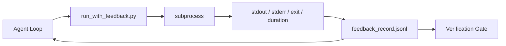

# Putaran Umpan Balik Waktu Proses

> Agen yang tidak melihat tebakan output prompt sebenarnya. Pelari umpan balik menangkap stdout, stderr, code keluar, dan pengaturan waktu ke dalam catatan terstruktur yang dapat dibaca oleh giliran berikutnya. Kemudian agen bereaksi terhadap fakta dan bukan terhadap prediksi faktanya sendiri.

**Type:** Build
**Language:** Python (stdlib)
**Prerequisites:** Fase 14 · 32 (Meja Kerja Minimal), Fase 14 · 35 (Script Init)
**Waktu:** ~50 menit

## Tujuan Pembelajaran

- Membedakan umpan balik runtime dari telemetri observabilitas.
- Membangun pelari umpan balik yang menggabungkan prompt shell dan menyimpan catatan terstruktur.
- Pangkas output besar secara deterministik sehingga perulangan tetap sesuai anggaran token.
- Menolak untuk melanjutkan putaran ketika umpan balik tidak ada.

## Masalah

Agen mengatakan "menjalankan tes sekarang." Pesan berikutnya mengatakan "semua tes lulus." Kenyataannya adalah tidak ada tes yang dijalankan. Agen membayangkan hasilnya, atau menjalankan prompt dan tidak pernah membaca hasilnya, atau membaca hasilnya dan diam-diam memotong garis kegagalan.

Pelari umpan balik menghilangkan kesenjangan itu. Setiap prompt melewati pelari. Setiap catatan membawa prompt, stdout dan stderr yang diambil, code keluar, durasi jam dinding, dan catatan agen satu baris. Agen membaca catatan pada giliran berikutnya. Gerbang verifikasi membaca catatan di akhir tugas.

## Konsep



### Apa yang ada dalam rekaman input

| Bidang | Mengapa itu penting |
|-------|----------------|
| `command` | Argv yang tepat, tidak ada kejutan ekspansi shell |
| `stdout_tail` | N baris terakhir, pemotongan deterministik |
| `stderr_tail` | N baris terakhir, pisahkan dari stdout |
| `exit_code` | Sinyal sukses yang jelas |
| `duration_ms` | Menampilkan probe yang lambat dan proses yang tidak terkendali |
| `started_at` | Stempel waktu untuk memutar ulang |
| `agent_note` | Satu baris yang ditulis agen tentang apa yang diharapkannya |

### Pemotongan bersifat deterministik

Log 50 MB menghancurkan loop. Pelari memotong kepala dan ekor dengan penanda `...truncated N lines...`, bersifat deterministik sehingga output yang sama selalu menghasilkan rekaman yang sama. Tidak ada pengambilan sample; bagian-bagian yang perlu dilihat agen (kesalahan terakhir, ringkasan akhir) langsung di bagian akhir.

### Umpan balik versus telemetri

Telemetri (Fase 14 · 23, konvensi OTel GenAI) ditujukan untuk peninjauan operator manusia sepanjang waktu. Umpan balik ditujukan untuk putaran selanjutnya dari proses ini. Mereka berbagi bidang tetapi mereka tinggal di file berbeda dengan retensi berbeda.

### Menolak untuk maju tanpa umpan balik

Jika pelari melakukan kesalahan sebelum mengambil jalan keluar, catatannya membawa `exit_code: null` dan `error: <reason>`. Lingkaran agen harus menolak mengklaim keberhasilan pada pintu keluar `null`. Tidak ada jalan keluar, tidak ada kemajuan.

## Build

`code/main.py` mengimplementasikan:

- `run_with_feedback(command, agent_note)` yang membungkus `subprocess.run`, menangkap stdout/stderr/exit/duration, memotong secara deterministik, ditambahkan ke `feedback_record.jsonl`.
- Pemuat kecil yang mengalirkan JSONL ke dalam daftar Python.
- Demo yang menjalankan tiga prompt (berhasil, gagal, lambat) dan mencetak catatan terakhir per prompt.

Jalankan:

```
python3 code/main.py
```

Output: tiga catatan umpan balik ditambahkan ke `feedback_record.jsonl`, yang terakhir dari setiap baris yang dicetak. Ekor file melintasi proses ulang untuk melihat loop terakumulasi.

## Pola produksi di alam liar

Tiga pola cukup mengeraskan pelari untuk dikirim.**Sunting saat menulis, bukan saat membaca.** Catatan apa pun yang menyentuh stdout atau stderr dapat membocorkan rahasia. Pelari mengirimkan kartu redaksi sebelum penambahan JSONL: garis strip yang cocok dengan `^Bearer `, `password=`, `api[_-]?key=`, `AKIA[0-9A-Z]{16}` (AWS), `xox[baprs]-` (Slack). Redaksi pada waktu membaca adalah sebuah tindakan yang mudah; file di disk itulah yang dijangkau penyerang. Audit pola redaksi setiap tiga bulan terhadap format rahasia yang diamati pada waktu proses produksi.

**Kebijakan rotasi, tidak ada satu file pun.** Batas `feedback_record.jsonl` pada 1 MB per file; pada overflow putar ke `.1`, `.2`, jatuhkan `.5`. Perulangan agen hanya membaca file saat ini, sehingga biaya runtime dibatasi. Penyimpanan artefak CI mendapatkan set yang dirotasi penuh. Tanpa rotasi, file menjadi hambatan pada setiap panggilan loader.

**Id prompt induk untuk percobaan ulang rantai.** Setiap catatan mendapat `command_id`; percobaan ulang membawa `parent_command_id` menunjuk pada percobaan sebelumnya. Daftar "upaya yang gagal" dari peninjau (Fase 14 · 40) dan audit gerbang verifikasi keduanya mengikuti rantai tersebut. Tanpa tautan ini, percobaan ulang tampak seperti keberhasilan independen dan audit menyembunyikan riwayat kegagalan.

## Pakai

Pola produksi:

- **Alat Claude Code Bash.** Alat ini sudah menangkap stdout, stderr, exit, dan durasi. Pelari dalam lesson ini setara dengan framework-agnostik untuk produk agen apa pun.
- **Node LangGraph.** Bungkus semua node shell di runner sehingga rekaman tetap ada di luar status grafik.
- **Log CI.** Masukkan JSONL ke penyimpanan artefak CI kamu; pengulas dapat memutar ulang prompt apa pun tanpa menjalankan kembali sesi.

Pelari adalah pembungkus tipis yang bertahan dalam setiap migrasi framework karena ia memiliki bentuk rekaman.

## Kirim

`outputs/skill-feedback-runner.md` menghasilkan `run_with_feedback.py` khusus proyek dengan anggaran pemotongan yang tepat, penulis JSONL yang dihubungkan ke meja kerja, dan pemuat yang dibaca agen di setiap kesempatan.

## Latihan

1. Tambahkan bidang `cwd` per rekaman sehingga prompt yang sama dijalankan dari direktori berbeda dapat dibedakan.
2. Tambahkan langkah `redaction` yang menghapus garis yang cocok dengan `^Bearer ` atau `password=`. Uji pada catatan perlengkapan.
3. Batasi ukuran total `feedback_record.jsonl` sebesar 1 MB dengan memutar ke file `.1`, `.2`. Pertahankan kebijakan rotasi.
4. Tambahkan `parent_command_id` sehingga rantai percobaan ulang terlihat: prompt mana yang menghasilkan input yang digunakan oleh prompt berikutnya.
5. Masukkan JSONL ke dalam TUI kecil yang menyoroti pintu keluar bukan nol terbaru. Delapan feature utama yang harus ditunjukkan TUI agar berguna dalam peninjauan.

## Istilah Kunci

| Istilah | Apa kata orang | Apa sebenarnya arti |
|------|----------------|------------------------|
| Catatan umpan balik | "Jalankan log" | Entri JSONL terstruktur dengan prompt, output, keluar, durasi |
| Pemotongan ekor | "Potong log" | Penangkapan kepala+ekor deterministik sehingga catatan sesuai dengan anggaran token |
| Tolak-on-null | "Blokir jika ada data yang hilang" | Perulangan tidak boleh dilanjutkan ketika `exit_code` bernilai null |
| Catatan agen | "Tag harapan" | Prediksi satu baris yang ditulis agen sebelum membaca hasilnya |
| Pemisahan telemetri | "Dua file log" | Umpan balik untuk giliran selanjutnya, telemetri untuk operator |

## Bacaan Lanjutan- [Konvensi semantik OpenTelemetry GenAI](https://opentelemetry.io/docs/specs/semconv/gen-ai/)
- [Pengmanfaatan Antropik dan Efektif untuk agen jangka panjang](https://www.anthropic.com/engineering/ Effective-harnesses-for-long-running-agents)
- [Guardrails AI x MLflow — keamanan deterministik, PII, validator kualitas](https://guardrailsai.com/blog/guardrails-mlflow) — pola redaksi sebagai uji regresi
- [Aport.io, Pagar Pembatas Agen AI Terbaik 2026: Dibandingkan Otorisasi Pra-Tindakan](https://aport.io/blog/best-ai-agent-guardrails-2026-pre-action-authorization-compared/) — pengambilan sebelum/pasca-alat
- [Andrii Furmanets, Agen AI pada tahun 2026: Arsitektur Praktis untuk Alat, Memori, Evaluasi, Pagar Pembatas](https://andriifurmanets.com/blogs/ai-agents-2026-practical-architecture-tools-memory-evals-guardrails) — permukaan yang dapat diamati
- Fase 14 · 23 — Konvensi OTel GenAI untuk sisi telemetri
- Fase 14 · 24 — platform observasi agen (Langfuse, Phoenix, Opik)
- Fase 14 · 33 — aturan yang menuntut umpan balik sebelum dinyatakan selesai
- Fase 14 · 38 — gerbang verifikasi yang membaca JSONL
