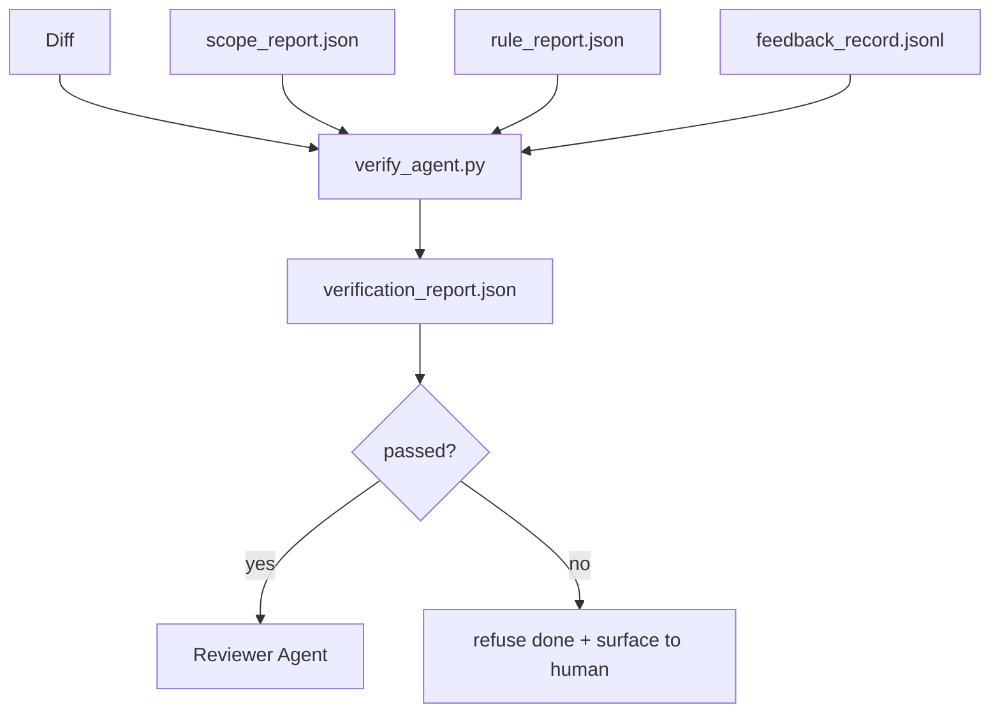

# Gerbang Verifikasi

> Agen tidak boleh menandai pekerjaannya sendiri sebagai selesai. Gerbang verifikasi membaca kontrak cakupan, log umpan balik, laporan aturan, dan perbedaannya, serta menjawab satu pertanyaan: apakah tugas ini benar-benar selesai? Jika gerbang mengatakan tidak, tugas belum selesai, apa pun isi obrolannya.

**Type:** Build
**Language:** Python (stdlib)
**Prerequisites:** Fase 14 · 33 (Peraturan), Fase 14 · 36 (Cakupan), Fase 14 · 37 (Umpan Balik)
**Waktu:** ~55 menit

## Tujuan Pembelajaran

- Tetapkan gerbang verifikasi sebagai fungsi deterministik pada artefak meja kerja.
- Gabungkan laporan aturan, laporan cakupan, catatan umpan balik, dan bedakan menjadi satu putusan.
- Kirim `verification_report.json` yang dapat dibaca oleh agen pengulas dan CI.
- Menolak untuk memajukan tugas pada kegagalan tingkat keparahan blok apa pun, tanpa kecuali.

## Masalah

Agen menyatakan kesuksesan terlalu mudah. Tiga bentuk kegagalan mendominasi:

- "Kelihatannya bagus." Model membaca perbedaannya sendiri dan memutuskan bahwa itu benar.
- "Tes lulus." Mengatakan dengan percaya diri. Tidak ada catatan pengujian yang benar-benar berjalan.
- "Penerimaan terpenuhi." Kriteria penerimaan ditafsirkan secara longgar dengan arti "segala sesuatu yang menyerupai telah selesai".

Perbaikan meja kerja adalah gerbang verifikasi tunggal yang membaca artefak yang telah dibuat oleh agen dan melakukan panggilan. Gerbangnya bersifat deterministik. Gerbangnya ada dalam kontrol versi. Gerbangnya dihubungkan ke CI. Agen tidak bisa menyuapnya.

## Konsep



### Apa yang diperiksa gerbang

| Periksa | Artefak sumber | Keparahan |
|-------|-----------------|----------|
| Semua prompt penerimaan dijalankan | `feedback_record.jsonl` | blok |
| Semua prompt penerimaan keluar dari nol | `feedback_record.jsonl` | blok |
| Pemeriksaan cakupan tidak memiliki larangan menulis | `scope_report.json` | blok |
| Pemeriksaan cakupan tidak memiliki penulisan di luar cakupan | `scope_report.json` | memblokir atau memperingatkan |
| Semua aturan tingkat keparahan blok lolos | `rule_report.json` | blok |
| Tidak ada `null` code keluar dalam input | `feedback_record.jsonl` | blok |
| File yang disentuh cocok dengan `scope.allowed_files` | keduanya | memperingatkan |

Temuan `warn` membubuhi keterangan pada putusan; temuan `block` mencegah `passed: true`.

### deterministik, bukan probabilistik

Gerbang tersebut harus menghasilkan keputusan yang sama untuk kumpulan artefak yang sama setiap saat. Tidak ada juri LLM. Juri LLM berada di sisi peninjau (Fase 14 · 39) yang tujuannya adalah evaluasi kualitatif, bukan status.

### Satu laporan, satu jalur

Gerbang mengeluarkan satu `verification_report.json` per penutupan tugas, ditulis di bawah `outputs/verification/<task_id>.json`. CI menggunakan jalur yang sama. Banyak gerbang dengan jalur berbeda bercabang menjadi sumber kebenaran.

### Menolak tanpa kecuali

Temuan tingkat keparahan blok tidak dapat dikesampingkan oleh agen. Mereka hanya dapat ditimpa oleh manusia, dengan rekaman `override_reason` dan id pengguna `overridden_by`. Penggantian tersebut merupakan perubahan yang ditandatangani, bukan keputusan agen.

## Build

`code/main.py` mengimplementasikan:

- Sebuah pemuat untuk setiap artefak input, semuanya dimatikan secara lokal sehingga pelajarannya mandiri.
- Fungsi murni `verify(task_id, artifacts) -> VerdictReport`.
- Printer yang menampilkan hasil per-cek dan kelulusan/gagal terakhir.
- Demo dengan tiga skenario tugas: clean pass, scope creep, penerimaan hilang.

Jalankan:

```
python3 code/main.py
```

Output: tiga laporan putusan, masing-masing disimpan di sebelah skrip.

## Pola produksi di alam liar

Empat pola meningkatkan gerbang dari "pekerjaan serat lainnya" menjadi "tepi penentu".**Pertahanan mendalam, bukan gerbang tunggal.** Kait pra-komit → Pemeriksaan status CI → kait autentikasi pra-alat → gerbang pra-penggabungan. Setiap layer bersifat deterministik sehingga kegagalan pada satu layer akan ditangkap oleh layer berikutnya. Panduan microservices.io bulan Maret 2026 bersifat eksplisit: hook pra-komit tidak dapat dilewati karena, tidak seperti keterampilan sisi model, hook ini tidak bergantung pada agen yang mengikuti instruksi. Gerbang verifikasi berada di layer CI/pra-penggabungan.

**Pertahanan dengan pemeriksaan deterministik, hakim model hanya untuk nuansa.** Pasangan Norm Hibrida 2026 Anthropic: imbalan yang dapat diverifikasi (pengujian unit, pemeriksaan skema, code keluar) jawab "apakah code menyelesaikan masalah?" — Rubrik LLM menjawab "apakah code dapat dibaca, aman, sesuai gaya?" Kelas satu berjalan di gerbang; pengulas (Fase 14 · 39) menjalankan yang kedua. Mencampurnya akan menghancurkan sinyalnya.

**Log override yang ditandatangani, bukan thread Slack.** Setiap override memunculkan baris di `outputs/verification/overrides.jsonl` dengan: stempel waktu, code temuan, alasan, pengguna yang menandatangani, penerapan HEAD saat ini. Runtime menolak segala override yang tidak memiliki tanda tangan; jejak audit dilacak dengan git. Ini adalah batas antara kebijakan pengesampingan dan teater pengesampingan.

**Cakupan lantai sebagai cek kelas satu.** `coverage_report.json` memberikan cek `coverage_floor` (default 80%). Gerbang gagal jika cakupan terukur turun di bawah lantai atau di bawah lantai penggabungan sebelumnya lebih dari 1 poin persentase. Tanpa pemeriksaan ini, agen secara diam-diam menghapus pengujian yang gagal dan laporan verifikasi tetap hijau.

**Mode `--strict` mendorong peringatan menjadi pemblokiran.** Untuk cabang rilis, PR pemblokiran kapal, atau triase pasca-insiden, `--strict` menjadikan setiap peringatan gagal total. Bendera tersebut diikutsertakan berdasarkan cabang; bukan standar global, karena pembatasan yang ketat pada segala hal akan merusak alur kerja sehari-hari.

## Pakai

Pola produksi:

- **Langkah CI.** Tugas `verify_agent` menjalankan gerbang terhadap artefak akhir agen. Perlindungan gabungan ditolak tanpa `passed: true`.
- **Kait pra-handoff.** Waktu proses agen memanggil gerbang sebelum membuat dokumen handoff. Tidak ada putusan hijau, tidak ada serah terima.
- **Pemeriksaan manual.** Operator membaca laporan ketika agen mengklaim keberhasilan dan manusia mencurigainya.

Gerbang adalah tepi penentu dalam aliran meja kerja. Setiap permukaan lainnya berada di hulunya.

## Kirim

`outputs/skill-verification-gate.md` menyambungkan gerbang ke proyek tertentu: prompt penerimaan mana yang memasukkannya, aturan mana yang merupakan tingkat keparahan blok, penulisan di luar cakupan mana yang dapat ditoleransi, bagaimana log audit override disimpan.

## Latihan

1. Tambahkan tanda centang `coverage_floor`: prompt pengujian harus menghasilkan laporan cakupan dengan minimal 80%. Putuskan artefak mana yang membawa lantai.
2. Mendukung mode `--strict` yang mempromosikan setiap `warn` ke `block`. Dokumentasikan kasus di mana mode ketat adalah default yang tepat.
3. Buat gerbang menghasilkan ringkasan penurunan harga selain JSON. Pertahankan bidang mana yang termasuk dalam ringkasan.
4. Tambahkan tanda `time_since_last_human_touch`: file apa pun yang diedit dalam waktu 60 detik setelah penekanan tombol manusia dikecualikan dari tanda di luar cakupan.
5. Jalankan gerbang pada agen nyata yang berbeda dari produk kamu. Berapa banyak temuan yang nyata dan berapa banyak yang bersifat noise? Di mana gerbangnya perlu tumbuh?

## Istilah Kunci| Istilah | Apa kata orang | Apa sebenarnya arti |
|------|----------------|------------------------|
| Gerbang verifikasi | "Cek yang menghentikan sesuatu" | Fungsi deterministik pada artefak meja kerja yang menghasilkan putusan lulus/gagal |
| Tingkat keparahan blok | "Gagal keras" | Temuan yang mencegah `passed: true` dan memerlukan penggantian yang ditandatangani |
| Ganti log | "Mengapa kita membiarkannya lewat" | Entri yang ditandatangani dengan alasan dan id pengguna, diaudit melalui ulasan |
| Prompt penerimaan | "Buktinya" | Prompt shell yang pintu keluarnya nol adalah `done` artinya |
| Satu jalur laporan | "Sumber kebenaran" | `outputs/verification/<task_id>.json`, dikonsumsi oleh CI dan manusia |

## Bacaan Lanjutan

- [Antropik, desain Harness untuk pengembangan aplikasi jangka panjang](https://www.anthropic.com/engineering/harness-design-long-running-apps)
- [Pagar pembatas SDK Agen OpenAI](https://platform.openai.com/docs/guides/agents-sdk/guardrails)
- [microservices.io, platform pengembang GenAI: pagar pembatas](https://microservices.io/post/architecture/2026/03/09/genai-development-platform-part-1-development-guardrails.html) — pertahanan mendalam antara pra-komitmen dan CI
- [ICMD, Pedoman 2026 untuk Operasi AI Agentik](https://icmd.app/article/the-2026-playbook-for-agentic-ai-ops-guardrails-costs-and-reliability-at-scale-1776661990431) — tangga gerbang persetujuan (draf → persetujuan → otomatis di bawah ambang batas)
- [Kepatuhan yang Diperiksa Tipe: Pagar Pembatas deterministik (arXiv 2604.01483)](https://arxiv.org/pdf/2604.01483) — Lean 4 sebagai batas atas gerbang deterministik
- [logi-cmd/agent-guardrails — spesifikasi gerbang gabungan](https://github.com/logi-cmd/agent-guardrails) — cakupan + gerbang pengujian mutasi
- [Guardrails AI x MLflow](https://guardrailsai.com/blog/guardrails-mlflow) — validator deterministik sebagai pencetak skor CI
- [Akira, Pagar Pembatas Real-Time untuk Sistem Agen](https://www.akira.ai/blog/real-time-guardrails-agentic-systems) — gerbang sebelum/sesudah alat
- Fase 14 · 27 — pertahanan injeksi cepat (pasangan musuh di gerbang)
- Fase 14 · 36 — kontrak lingkup yang diberlakukan gerbang ini
- Fase 14 · 37 — catatan umpan balik skor gerbang ini
- Fase 14 · 39 — agen pengulas yang diserahkan gerbangnya
