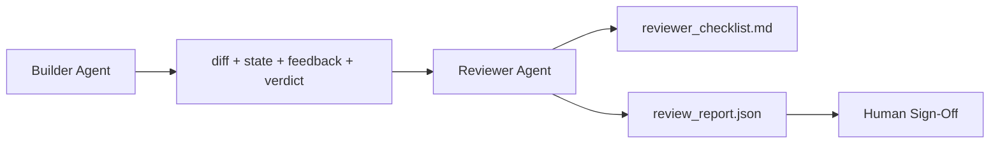

# Agen Peninjau: Pembuat Terpisah dari Penanda

> Agen yang menulis code tidak dapat menilainya. Peninjau adalah putaran kedua dengan system prompt berbeda, sasaran berbeda, dan akses hanya baca ke semua yang dihasilkan pembuat. Kesenjangan antara pembuat dan peninjau adalah tempat sebagian besar keandalan berada.

**Type:** Build
**Language:** Python (stdlib)
**Prerequisites:** Phase 14 · 38 (Gerbang Verifikasi)
**Waktu:** ~55 menit

## Tujuan Pembelajaran

- Nyatakan mengapa agen yang sama tidak dapat meninjau pekerjaannya sendiri dengan andal.
- Membangun lingkaran agen peninjau yang menggunakan artefak pembuat dan mengeluarkan laporan tinjauan terstruktur.
- Tulis rubrik pengulas yang menilai dimension tertentu, bukan getaran.
- Masukkan pengulas ke meja kerja sehingga langkah peninjauan manusia dimulai dari artefak nyata.

## Masalah

kamu meminta agen untuk memperbaiki bug. Itu mengedit empat file, menjalankan tes, dan laporan selesai. Gerbang verifikasi (Fase 14 · 38) mengonfirmasi penerimaan telah dijalankan dan cakupan dipertahankan. Gerbangnya bertuliskan `passed: true`. kamu bergabung. Dua hari kemudian kamu menemukan bahwa perbaikan tersebut memecahkan separuh bug yang salah.

Penerimaan itu perlu, tidak cukup. Peninjau mengajukan pertanyaan yang tidak dapat diajukan oleh penerimaan: apakah ini memecahkan masalah yang benar? Apakah ia memperluas cakupannya tanpa menandainya? Apakah laporan tersebut mendokumentasikan asumsi-asumsi yang seharusnya dipertanyakan? Apakah ia meninggalkan meja kerja dalam keadaan yang dapat diambil sesi berikutnya?

## Konsep



### Rubrik pengulas

Lima dimension, masing-masing mendapat skor 0 hingga 2.

| Dimension | Pertanyaan |
|-----------|----------|
| Masalah cocok | Apakah perubahan tersebut menyelesaikan tugas seperti yang dinyatakan, bukan tugas terdekat? |
| Disiplin Lingkup | Apakah pengeditan hanya terbatas pada kontrak atau apakah kontrak tersebut dibuat dengan sengaja? |
| Asumsi | Apakah semua asumsi tersembunyi yang dituliskan di suatu tempat dapat ditinjau? |
| Kualitas verifikasi | Apakah prompt penerimaan benar-benar membuktikan tujuannya, atau justru membuktikan versi yang lebih lemah? |
| Kesiapan serah terima | Bisakah sesi berikutnya mengambil alih kondisi saat ini? |

Total dari 10. Lari di bawah 7 adalah kegagalan ringan; lari di bawah 5 adalah kegagalan besar.

### Peninjau adalah peran terpisah, bukan model terpisah

kamu dapat menjalankan reviewer dengan model yang sama dengan pembuatnya. Disiplin adalah pemisahan peran: prompt sistem berbeda, input berbeda, tidak ada akses tulis ke diff. Perubahan postur adalah perubahan sinyal.

### Peninjau tidak dapat mengedit perbedaannya

Peninjau membaca perbedaannya, keadaannya, umpan baliknya, putusannya. Ia menulis laporan. Itu tidak menambal perbedaan. Jika laporan mengatakan "perbaiki ini", giliran pembuat berikutnya yang melakukan perbaikan; pengulas kembali meninjau. Mencampur peran akan mengatasi kesenjangan tersebut.

### Rubrik pengulas versus gerbang verifikasi

Gerbang (Fase 14 · 38) memeriksa fakta-fakta deterministik: apakah penerimaan berjalan, apakah peraturan disahkan, apakah ruang lingkup dipertahankan. Peninjau membuat penilaian kualitatif: apakah karya ini benar, apakah didokumentasikan, apakah serah terimanya dapat digunakan. Keduanya diperlukan.

## Build

`code/main.py` mengimplementasikan:

- Kelas data `ReviewerInputs` yang menggabungkan artefak yang dibaca pengulas.
- Pencetak rubrik dengan satu fungsi per dimension. Setiap fungsi bersifat deterministik dan merupakan nilai rintisan untuk lesson tersebut; implementasi nyata akan disebut LLM.
- Seorang penulis `review_report.json` dengan lima skor, total, dan putusan (`pass`, `soft_fail`, `hard_fail`).
- Dua kasus demo: perubahan bersih dan perubahan "tes yang benar, masalah yang salah".

Jalankan:

```
python3 code/main.py
```Output: dua laporan tinjauan yang ditulis ke disk dan tabel konsol skor dimension.

## Pola produksi di alam liar

Tanda terimanya: Sistem Peninjauan Code AI Cloudflare pada bulan April 2026 menjalankan 131.246 proses peninjauan pada 48.095 permintaan penggabungan dalam 5.169 repo dalam 30 hari. Tinjauan median selesai dalam 3 menit 39 detik. Hingga tujuh peninjau spesialis (keamanan, kinerja, kualitas code, dokumen, manajemen rilis, kepatuhan, Kodeks Teknik) dijalankan secara paralel di bawah Koordinator Tinjauan yang menghapus duplikat temuan dan menilai tingkat keparahan. Model tingkat atas disediakan khusus untuk koordinator; spesialis menggunakan tingkatan yang lebih murah.

Empat pola membuat ini berhasil dalam skala besar.

**Kumpulan spesialis, bukan satu pengulas besar.** Satu pengulas dengan rubrik 5 dimension berfungsi untuk repo tunggal. Setelah basis code memiliki tampilan yang kritis terhadap keamanan, kritis terhadap kinerja, dan dokumen, bagilah menjadi spesialis dengan prompt yang lebih kecil. Koordinator melakukan deduplikasi; para spesialis tidak pernah menjalankan rubrik secara lengkap. Pemisahan tingkat model terjadi: spesialis murah, koordinator mahal.

**Mitigasi bias sebagai persyaratan desain, bukan optimization.** Juri LLM menunjukkan empat bias yang dapat diandalkan (Adnan Masood, April 2026): bias posisi (GPT-4 ~40% tidak konsisten pada urutan (A,B) vs (B,A)), bias verbositas (~15% skor inflasi terhadap output yang lebih panjang), preferensi diri (hakim lebih memilih output dari kelompok model yang sama), otoritas (hakim menilai terlalu tinggi referensi ke penulis terkenal). Mitigasi: evaluasi kedua pemesanan dan hanya hitung kemenangan yang konsisten; gunakan 1-4 skala yang secara eksplisit menghargai keringkasan; merotasi juri di seluruh keluarga teladan; menghapus nama penulis sebelum mencetak gol.

**Kumpulan kalibrasi, bukan getaran.** Kumpulan riwayat tugas 10-20 dengan keputusan yang diketahui benar. Jalankan peninjau pada setiap perubahan yang cepat. Jika kesesuaian dengan catatan sejarah kurang dari 80%, rubrik perlu direvisi sebelum pengulas mengirimkannya. Inilah yang pada akhirnya ditemukan kembali oleh setiap tim; lebih baik memulainya.

**Norm hibrid dengan gerbang.** Gerbang verifikasi (Fase 14 · 38) menangani pemeriksaan deterministik (apakah penerimaan dijalankan, apakah pengujian lulus, apakah cakupan ditahan). Reviewer menangani pemeriksaan semantik (apakah ini pekerjaan yang benar, apakah asumsi didokumentasikan, apakah handoff dapat digunakan). Panduan Anthropic tahun 2026 secara eksplisit mengenai pemisahan ini: jangan meminta pengulas mengulangi apa yang sudah dibuktikan oleh gerbang tersebut.

## Pakai

Pola produksi:

- **Subagen Code Claude.** Subagen peninjau berjalan setelah pembuat menutup tugas. Ini memposting komentar pada PR dengan skor rubrik.
- **Serah terima SDK Agen OpenAI.** Pembuat menyerahkan kepada Peninjau setelah tugas selesai. Reviewer dapat menyerahkan kembali daftar temuan atau terserah manusia.
- **Pemasangan dua model.** Builder menggunakan model yang lebih cepat dan lebih murah. Peninjau menggunakan model yang lebih kuat dengan konteks yang lebih kecil, berfokus pada penilaian.

Peninjau adalah sepasang mata kedua yang tumbuh di meja kerja ketika manusia tidak dapat melakukan setiap peninjauan sendiri.

## Kirim

`outputs/skill-reviewer-agent.md` menghasilkan rubrik peninjau khusus proyek, stub agen peninjau yang dihubungkan ke artefak pembuat, dan integrasi dengan gerbang verifikasi sehingga peninjauan manusia dimulai dari laporan tertulis, bukan halaman kosong.

## Latihan1. Tambahkan dimension keenam khusus untuk domain produk kamu. Pertahankan mengapa tidak diserap oleh lima yang sudah ada.
2. Jalankan peninjau dengan dua system prompt yang berbeda (singkat, bertele-tele). Manakah yang menghasilkan laporan yang lebih mungkin dibaca manusia?
3. Tambahkan bidang `confidence` per dimension. Menolak untuk mengirimkan laporan ketika keyakinan pada dimension terendah di bawah 0,6.
4. Buat set kalibrasi: 10 penyelesaian tugas historis dengan keputusan yang diketahui benar. Jalankan peninjau atas mereka. Apa yang tidak sesuai dengan catatan sejarah?
5. Tambahkan keterjangkauan "minta lebih banyak bukti": pengulas dapat meminta pembuatnya untuk melakukan uji coba tertentu sebelum memberikan penilaian. Apa back-off yang tepat agar ini tidak berulang?

## Istilah Kunci

| Istilah | Apa kata orang | Apa sebenarnya arti |
|------|----------------|------------------------|
| Rubrik pengulas | "Daftar Periksa" | Penilaian lima dimension 0-2 dengan pertanyaan tertulis per dimension |
| Gagal lunak | "Perlu revisi" | Jumlahnya di bawah 7; pembangun mendapatkan temuan untuk diatasi |
| Gagal keras | "Tolak" | Total di bawah 5 atau dimension apa pun pada 0; berhenti dan muncul ke permukaan manusia |
| Pemisahan peran | "Permintaan berbeda" | Model yang sama bisa menjadi kedua peran; disiplin input dan postur |
| Lantai kepercayaan | "Jangan mengirimkan laporan dengan sinyal rendah" | Menolak mengeluarkan putusan bila rubriknya tidak pasti |

## Bacaan Lanjutan

- [Serah terima SDK Agen OpenAI](https://platform.openai.com/docs/guides/agents-sdk/handoffs)
- [Subagen Anthropic Claude Code](https://docs.anthropic.com/en/docs/agents-and-tools/claude-code/sub-agents)
- [Cloudflare, Mengatur Tinjauan Code AI dalam Skala Besar](https://blog.cloudflare.com/ai-code-review/) — Arsitektur 7 spesialis + koordinator, 131 ribu pengoperasian / 30 hari
- [Agen-sebagai-Judge: Mengevaluasi Agen dengan Agen (OpenReview / ICLR)](https://openreview.net/forum?id=DeVm3YUnpj) — Tolok ukur DevAI, 366 persyaratan solusi hierarki
- [Adnan Masood, Evaluasi Berbasis Rubrik dan LLM-as-a-Judge: Metodologi, Bias, Validasi Empiris](https://medium.com/@adnanmasood/rubric-based-evals-llm-as-a-judge-methodologies-and-empirical-validation-in-domain-context-71936b989e80) — 4 bias dan mitigasi
- [MLflow, LLM-as-a-Judge Evaluation](https://mlflow.org/llm-as-a-judge) — alat produksi untuk pembuat/evaluator terpisah
- [LangChain, Cara Mengkalibrasi LLM sebagai Hakim dengan Koreksi Manusia](https://www.langchain.com/articles/llm-as-a-judge) — alur kerja set kalibrasi
- [Ternyata AI, LLM-as-a-judge: panduan lengkap](https://www.evidentlyai.com/llm-guide/llm-as-a-judge)
- [Arize, LLM sebagai Juri — Evaluator Primer dan Pra-Built](https://arize.com/llm-as-a-judge/)
- Fase 14 · 05 — Penyempurnaan Mandiri dan KRITIS (garis dasar peninjauan mandiri agen tunggal)
- Fase 14 · 30 — Pengembangan agen berbasis evaluasi (generator set kalibrasi)
- Fase 14 · 38 — gerbang verifikasi yang dibaca oleh reviewer
- Fase 14 · 40 — paket handoff yang dimasukkan ke dalam laporan reviewer
