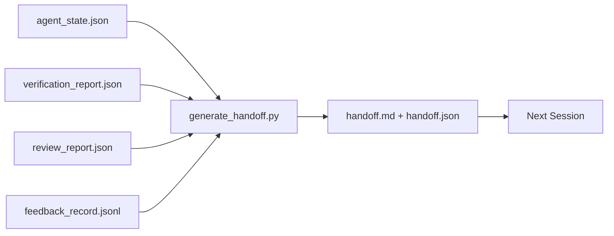

# Handoff Multi-Sesi

> Sesi akan berakhir. Pekerjaannya tidak. Paket handoff adalah artefak yang mengubah "agen bekerja selama satu jam" menjadi "sesi berikutnya produktif di menit pertama". Bangunlah dengan sengaja, bukan hanya sekedar renungan.

**Type:** Build
**Language:** Python (stdlib)
**Prerequisites:** Phase 14 · 34 (Memori Repo), Phase 14 · 38 (Verifikasi), Phase 14 · 39 (Reviewer)
**Waktu:** ~50 menit

## Tujuan Pembelajaran

- Identifikasi tujuh bidang yang dibutuhkan setiap paket handoff.
- Hasilkan handoff dari artefak meja kerja tanpa prosa tulisan tangan.
- Pangkas log umpan balik yang besar menjadi ringkasan berukuran handoff.
- Jadikan tindakan pertama sesi berikutnya bersifat deterministik.

## Masalah

Sesi berakhir. Agen itu berkata, "hebat, kami membuat kemajuan." Sesi berikutnya terbuka. Agen berikutnya bertanya "di mana kita tinggalkan?" Jawaban agen pertama hilang. Agen berikutnya menemukan kembali, menjalankan kembali prompt yang sama, menanyakan kembali pertanyaan yang sama kepada manusia, dan menghabiskan waktu tiga puluh menit untuk memulihkan tiga puluh detik terakhir dari sesi sebelumnya.

Biaya handoff yang buruk dibayarkan setiap sesi selama tugas berlangsung. Perbaikannya adalah paket yang dihasilkan secara otomatis di akhir sesi: apa yang berubah, mengapa, apa yang dicoba, apa yang gagal, apa yang tersisa, apa yang harus dilakukan pertama kali di waktu berikutnya.

## Konsep



### Tujuh bidang yang dibawa setiap handoff

| Bidang | Pertanyaan yang dijawabnya |
|-------|---------------------|
| `summary` | Satu paragraf dari apa yang telah dilakukan |
| `changed_files` | Sekilas Perbedaannya |
| `commands_run` | Apa yang sebenarnya dieksekusi |
| `failed_attempts` | Apa yang dicoba dan mengapa tidak berhasil |
| `open_risks` | Apa yang bisa menggigit sesi berikutnya, dengan tingkat keparahan |
| `next_action` | Langkah konkrit pertama yang diambil sesi selanjutnya |
| `verdict_pointer` | Jalur menuju verifikasi + laporan peninjauan |

Bidang `next_action` adalah bidang penahan weight. Serah terima dengan semuanya kecuali `next_action` adalah laporan status, bukan serah terima.

### Handoff dibuat, bukan ditulis

Handoff yang ditulis tangan adalah handoff yang dilewati pada hari yang berat. Generator membaca artefak meja kerja dan memancarkan paket. Tugas agen adalah meninggalkan meja kerja dalam keadaan yang dapat diringkas oleh generator, bukan menulis ringkasan.

### Dua bentuk: dapat dibaca manusia dan dapat dibaca mesin

`handoff.md` adalah apa yang dibaca manusia. `handoff.json` adalah apa yang dimuat agen selanjutnya. Keduanya berasal dari sumber artefak yang sama. Jika berbeda, JSON menang.

### Pemangkasan log umpan balik

`feedback_record.jsonl` lengkapnya mungkin ratusan entri. Handoff hanya membawa K terakhir ditambah setiap entri dengan pintu keluar bukan nol. Sesi berikutnya memuat log lengkap jika diperlukan, namun paket tetap kecil.

## Build

`code/main.py` mengimplementasikan:

- Pemuat yang mengumpulkan status, putusan, tinjauan, dan input ke dalam satu `WorkbenchSnapshot`.
- Fungsi `generate_handoff(snapshot) -> (markdown, payload)`.
- Filter yang memilih entri umpan balik K terakhir ditambah semua pintu keluar bukan nol.
- Demo dijalankan dengan tulisan `handoff.md` dan `handoff.json` di sebelah skrip.

Jalankan:

```
python3 code/main.py
```

Output: badan handoff yang dicetak, ditambah kedua file di disk.

## Pola produksi di alam liar

Codex CLI, Claude Code, dan OpenCode masing-masing memberikan cerita pemadatan yang berbeda; paket handoff terstruktur berada di atas ketiganya.**Strategi pemadatan bervariasi; skema paket tidak.** POST /v1/responses/compact Codex CLI adalah gumpalan AES buram sisi server (jalur cepat untuk model OpenAI); cadangannya adalah "ringkasan serah terima" lokal yang ditambahkan sebagai pesan peran pengguna `_summary`. Claude Code menjalankan pemadatan progresif lima phase pada 95% konteks. OpenCode menyembunyikan pesan berbasis stempel waktu ditambah ringkasan LLM 5 judul. Tiga mekanisme berbeda, kebutuhan yang sama: membuat serialisasi apa yang bertahan dari kompresi menjadi artefak portabel. Paketnya adalah artefak itu.

**Serah terima sesi baru bukanlah pemadatan.** Pemadatan memperpanjang sesi; handoff menutup satu dengan rapi dan memulai yang berikutnya. Pembingkaian Hermes Issue #20372 (April 2026) benar: ketika kompresi di tempat mulai menurun, agen harus menulis handoff ringkas, mengakhiri sesi, dan melanjutkan dalam konteks baru. Paket itulah yang membuat transisi itu murah. Kesalahannya adalah terus mengompresi hingga kualitasnya menurun; cara mengatasinya adalah menganggarkan dana untuk serah terima yang lebih awal dan bersih.

**Satu handoff aktif per cabang dan topik.** Koordinasi multi-agen lebih banyak rusak pada handoff yang sudah lama dibandingkan pada output model yang buruk. Selalu sertakan `branch`, `last_known_good_commit`, dan `status` dari `active | superseded | archived`. Serah terima yang sudah basi diarsipkan; hanya yang aktif yang mendorong sesi berikutnya. Inilah perbedaan antara handoff-as-notes dan handoff-as-state.

**Selesaikan sebelum 50-75% konteks, bukan di dinding.** Buku pedoman pola tulisan tangan (CLAUDE.md + HANDOVER.md) melaporkan hasil terbaik ketika sesi berakhir pada anggaran konteks 50-75%, bukan 95%. Generator paket berjalan dengan bersih sebelum artefak kompresi mencemari status sumber. Murah untuk ditulis jika konteksnya utuh; mahal ketika modelnya sudah kehilangan tempatnya.

## Pakai

Pola produksi:

- **Hook akhir sesi.** Runtime akan mengaktifkan generator saat pengguna menutup chat. Paket masuk ke `outputs/handoff/<session_id>/`.
- **Template PR.** Penurunan harga generator juga merupakan badan PR. Reviewer membacanya tanpa membuka lima file lainnya.
- **Serah terima lintas agen.** Buat dengan satu produk (Claude Code), lanjutkan dengan produk lain (Codex). Paket tersebut adalah lingua franca.

Paketnya kecil, teratur, dan murah untuk diproduksi. Penghematan biaya bertambah di setiap sesi.

## Kirim

`outputs/skill-handoff-generator.md` menghasilkan generator yang disetel ke jalur artefak proyek, hook akhir sesi yang menjalankannya, dan skema `handoff.json` yang dibaca agen berikutnya saat startup.

## Latihan

1. Tambahkan bidang `assumptions_to_validate` yang menampilkan setiap asumsi yang dicatat oleh pembuat tetapi pengulas tidak mendapat skor di atas 1.
2. Pangkas ringkasan umpan balik secara berbeda untuk proses yang gagal dan yang lolos. Pertahankan asimetri.
3. Sertakan daftar “pertanyaan untuk manusia”. Berapa ambang batas sebuah pertanyaan untuk masuk ke dalam paket versus menjadi pesan obrolan?
4. Jadikan generator idempoten: menjalankannya dua kali akan menghasilkan paket yang sama. Apa yang perlu stabil agar hal itu dapat dipertahankan?
5. Tambahkan bagian "prasyarat sesi berikutnya" yang mencantumkan artefak yang harus dimuat sesi berikutnya sebelum bertindak.

## Istilah Kunci| Istilah | Apa kata orang | Apa sebenarnya arti |
|------|----------------|------------------------|
| Paket serah terima | "Ringkasan sesi" | Artefak yang dihasilkan membawa tujuh bidang, baik penurunan harga maupun JSON |
| Tindakan selanjutnya | "Apa yang harus dilakukan pertama kali" | Satu langkah konkrit mengawali sesi berikutnya |
| Potongan umpan balik | "Ringkasan log" | Catatan K terakhir ditambah setiap pintu keluar bukan nol |
| Laporan status | "Apa yang kami lakukan" | Dokumen hilang `next_action`; berguna, tapi bukan serah terima |
| Penunjuk putusan | "Tanda terima" | Jalur menuju laporan verifikasi + peninjauan untuk ketertelusuran |

## Bacaan Lanjutan

- [Pengmanfaatan Antropik dan Efektif untuk agen jangka panjang](https://www.anthropic.com/engineering/ Effective-harnesses-for-long-running-agents)
- [Serah terima SDK Agen OpenAI](https://platform.openai.com/docs/guides/agents-sdk/handoffs)
- [Blog Codex, Pemadatan Konteks Codex CLI: Arsitektur, Konfigurasi, Mengelola Sesi Panjang](https://codex.danielvaughan.com/2026/03/31/codex-cli-context-compaction-architecture/) — POST /v1/responses/compact dan fallback lokal
- [Justin3go, Menumpahkan Kenangan Berat: Pemadatan Konteks dalam Codex, Claude Code, OpenCode](https://justin3go.com/en/posts/2026/04/09-context-compaction-in-codex-claude-code-and-opencode) — perbandingan pemadatan tiga vendor
- [JD Hodges, Claude Handoff Prompt: Cara Menjaga Konteks di Seluruh Sesi (2026)](https://www.jdhodges.com/blog/ai-session-handoffs-keep-context-across-conversations/) — CLAUDE.md + HANDOVER.md, anggaran konteks 50-75%
- [Mervin Praison, Mengelola Handoff dalam Sesi Pengkodean Multi-Agen: Konteks Baru Tanpa Kehilangan Kontinuitas](https://mer.vin/2026/04/managing-handoffs-in-multi-agent-coding-sessions-fresh-context-without-losing-continuity/) — pembingkaian sistem terdistribusi
- [Masalah Hermes #20372 — handoff sesi baru otomatis ketika kompresi menjadi berisiko](https://github.com/NousResearch/hermes-agent/issues/20372)
- [Masalah Hermes #499 — Perombakan Kualitas Pemadatan Konteks](https://github.com/NousResearch/hermes-agent/issues/499) — prompt berorientasi handoff di Codex CLI
- [Framework Agen Microsoft, Pemadatan](https://learn.microsoft.com/en-us/agent-framework/agents/conversations/compaction)
- [OpenCode, Manajemen Konteks, dan Pemadatan](https://deepwiki.com/sst/opencode/2.4-context-management-and-compaction)
- [LangChain, Rekayasa Konteks untuk Agen](https://www.langchain.com/blog/context-engineering-for-agents)
- Fase 14 · 34 — file status yang dibaca generator
- Fase 14 · 38 — keputusan verifikasi yang menjadi titik paket
- Fase 14 · 39 — laporan reviewer digabungkan ke dalam paket
