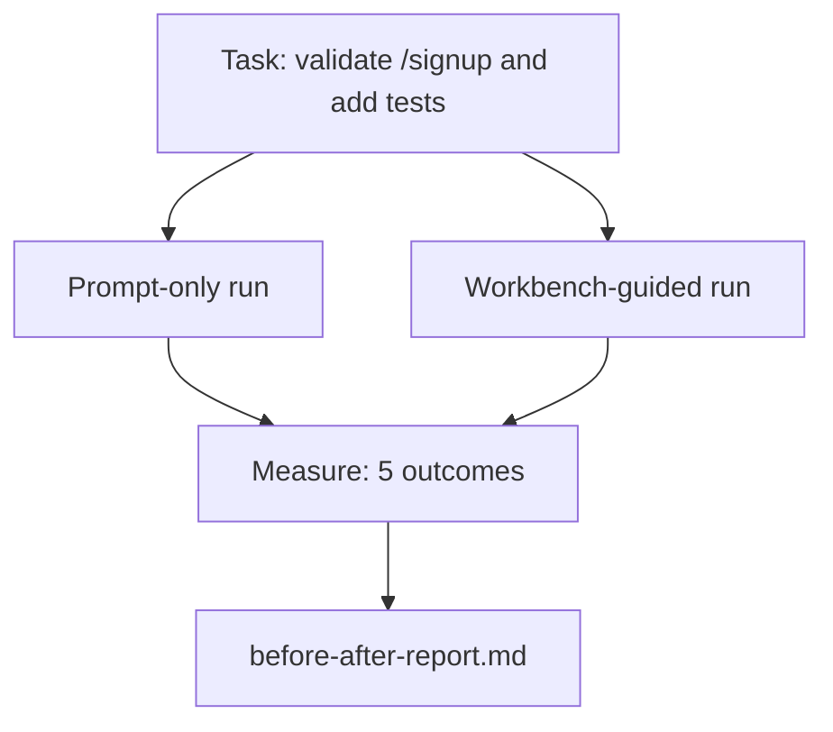

# Meja Kerja di Repo Nyata

> Sebelas lesson tentang permukaan tidak ada gunanya jika tidak bertahan dalam kontak dengan basis code nyata. Lesson ini menjalankan tugas yang sama dua kali pada aplikasi sample kecil: hanya prompt versus dipandu meja kerja. Angkalah yang menjadi penentu perdebatan.

**Type:** Build
**Language:** Python (stdlib)
**Prerequisites:** Phase 14 · 32 hingga 14 · 40
**Waktu:** ~60 menit

## Tujuan Pembelajaran

- Satukan ketujuh permukaan meja kerja dalam satu aplikasi kecil.
- Jalankan tugas yang sama dua kali (hanya cepat dan dipandu meja kerja) dan ukur lima hasil.
- Baca laporan sebelum/sesudah dan putuskan permukaan mana yang memberikan pengaruh paling besar.
- Pertahankan meja kerja dari penolakan "tetapi model saya cukup baik".

## Masalah

Demo tugas mainan tidak dapat meyakinkan siapa pun. Kasus untuk meja kerja dibuat ketika tugas perasaan nyata pada repo perasaan nyata mendarat di produksi dengan lebih sedikit kegagalan, lebih sedikit pengembalian, dan sebuah paket dapat digunakan pada sesi berikutnya.

Lesson ini mengirimkan repo perasaan nyata dan menjalankan tugas yang sama melalui kedua pipeline pipa. Hasilnya adalah laporan sebelum/sesudah yang dapat kamu berikan kepada orang yang skeptis.

## Konsep



### Contoh aplikasi

Penangan gaya FastAPI minimal di `sample_app/`:

- `app.py` dengan `/signup` (belum ada validasi).
- `test_app.py` dengan satu tes jalur bahagia.
- `README.md` dan `scripts/release.sh` sebagai umpan zona terlarang.

### Tugas

> Tambahkan validasi input ke `/signup`: tolak kata sandi yang kurang dari 8 karakter, kembalikan 422 dengan amplop kesalahan yang diketik. Tambahkan tes yang membuktikan perilaku baru.

### Kedua pipeline pipa

Hanya cepat:

1. Baca READMEnya.
2. Baca `app.py`.
3. Mengedit file.
4. Klaim selesai.

Dipandu oleh meja kerja:

1. Jalankan skrip init (Lesson 35).
2. Baca kontrak ruang lingkup (Lesson 36).
3. Baca keadaan (Lesson 34).
4. Edit file yang diperbolehkan saja.
5. Jalankan prompt penerimaan melalui pelari umpan balik (Lesson 37).
6. Jalankan gerbang verifikasi (Lesson 38).
7. Jalankan reviewer (Lesson 39).
8. Menghasilkan handoff (Lesson 40).

### Lima hasil diukur

| Hasil | Mengapa itu penting |
|---------|----------------|
| `tests_actually_run` | Kebanyakan klaim "lulus pengujian" tidak dapat diverifikasi |
| `acceptance_met` | Tes yang membuktikan tujuan haruslah tes yang dijalankan |
| `files_outside_scope` | Scope creep adalah kegagalan diam yang dominan |
| `handoff_quality` | Sesi berikutnya membayar atau mendapat manfaat dari |
| `reviewer_total` | Penilaian kualitatif di atas gerbang |

## Build

`code/main.py` mengatur dua pipeline pipa terhadap perlengkapan aplikasi sample yang sama. Kedua pipeline pipa memiliki skrip (tidak ada LLM dalam loop) sehingga pengukuran dapat direproduksi. Script menulis perbandingan ke dalam `before-after-report.md` dan `comparison.json`.

Jalankan:

```
python3 code/main.py
```

Output: tabel konsol hasil per pipeline, laporan penurunan harga disimpan di sebelah skrip, dan JSON untuk siapa pun yang ingin memetakannya.

## Pola produksi di alam liar

Pertanyaan skeptis adalah "seberapa besar manfaat meja kerja?" Angka-angka pada tahun 2026 mengungkapkan lebih banyak hal daripada penjelasannya.

**Terminal Bench Top-30 ke Top-5 pada model yang sama.** *Anatomi Agen Harness* LangChain (April 2026): agen pengkode melompat dari luar 30 besar ke peringkat lima di Terminal Bench 2.0 hanya dengan mengubah harness. Model yang sama. Permukaan yang berbeda. Delta peringkat dua puluh lima.**Vercel 80% hingga 100% dengan menghapus alat.** Vercel melaporkan bahwa menghapus 80% alat agennya meningkatkan tingkat keberhasilan dari 80% menjadi 100%. Permukaan alat yang lebih kecil, cakupan yang lebih tajam, lebih sedikit kemungkinan terjadinya kegagalan. Ruang negatif menang.

**Akurasi Harvey 2x lipat hanya melalui harness.** Agen hukum meningkatkan akurasinya lebih dari dua kali lipat melalui optimalisasi harness, tanpa perubahan model.

**88% proyek agen AI perusahaan gagal mencapai produksi.** Makalah *Harness Engineering for Language Agents* preprints.org (Maret 2026) menelusuri kegagalan pada waktu proses, bukan alasan: status basi, percobaan ulang yang rapuh, konteks yang berlebihan, pemulihan yang buruk dari kesalahan perantara.

**Keruntuhan konteks panjang.** Keberhasilan dasar WebAgent 40-50% turun menjadi di bawah 10% dalam kondisi konteks panjang, sebagian besar disebabkan oleh perulangan tak terbatas dan hilangnya sasaran. Ralph Loop dan paket handoff ada untuk menyerapnya.

**Negatif palsu masih ada.** Tugas faktual satu langkah, lint satu baris, proses pemformat, apa pun yang diingat oleh model secara verbatim — tugas ini berjalan lebih cepat hanya dengan prompt. Tolok ukurnya harus menyebutkannya secara jujur ​​sehingga meja kerja tidak dianggap berlebihan.

Kesimpulannya bukanlah "harness menang selamanya." Model memang menyerap trik harness seiring berjalannya waktu. Kesimpulannya adalah saat ini, weight teknik berada di tujuh permukaan, dan angka-angka membuktikannya.

## Pakai

Lesson ini adalah file kasus yang kamu kutip ketika:

- Ada yang bertanya kenapa setiap PR membawa `agent-rules.md` dan kontrak cakupan.
- Sebuah tim ingin menutup gerbang verifikasi "hanya untuk sprint ini".
- Produk agen baru diluncurkan dan kamu memerlukan tolok ukur portabel apakah produk tersebut benar-benar menghemat waktu.

Angka-angka tersebut berjalan lebih jauh dari penjelasannya.

## Kirim

`outputs/skill-workbench-benchmark.md` adalah pemanfaatan evaluasi portabel yang menjalankan produk agen apa pun melalui kedua pipeline terhadap aplikasi sample milik proyek dan melaporkan lima hasil.

## Latihan

1. Tambahkan hasil keenam: waktu-untuk-pertama-edit-bermakna. Bagaimana cara mengukurnya dengan bersih?
2. Jalankan perbandingan pada tugas hari kedua yang sebenarnya di basis code kamu. Di mana nomor meja kerja tergelincir?
3. Tambahkan pass "negatif palsu": tugas-tugas yang hanya bersifat prompt akan lebih cepat dan overhead meja kerja adalah biaya sebenarnya. Tetap pertahankan menjaga meja kerja.
4. Gantikan "agen" yang tertulis dengan panggilan LLM yang sebenarnya. Hasil manakah yang lebih berisik?
5. Tulis ringkasan satu halaman yang ditujukan untuk non-insinyur. Apa yang bertahan dari pemotongan tersebut?

## Istilah Kunci

| Istilah | Apa kata orang | Apa sebenarnya arti |
|------|----------------|------------------------|
| Contoh aplikasi | "Repo mainan" | Kecil tapi cukup realistis untuk melatih ketujuh permukaan |
| Pipeline pipa | "Alur Kerja" | Urutan pembacaan/penulisan permukaan yang diurutkan agen berikut |
| Laporan sebelum/sesudah | "Kwitansi" | Artefak yang kamu serahkan kepada orang yang skeptis |
| Negatif palsu | "Meja kerja berlebihan" | Tugas yang hanya meminta prompt lebih cepat; berguna untuk menghitung dengan jujur ​​|
| Tolok ukur meja kerja | "Skor keandalan" | Harness portabel yang menjalankan perbandingan pada basis code kamu |

## Bacaan Lanjutan- [LangChain, Anatomi Agen Harness](https://blog.langchain.com/the-anatomy-of-an-agent-harness/) — Tanda terima Terminal Bench Top-30 hingga Top-5
- [MongoDB, Agen Harness: Mengapa LLM Merupakan Bagian Terkecil dari Sistem Agen kamu](https://www.mongodb.com/company/blog/technical/agent-harness-why-llm-is-smallest-part-of-your-agent-system) — nomor Vercel + Harvey
- [preprints.org, Harness Engineering for Language Agents](https://www.preprints.org/manuscript/202603.1756) — 88% tingkat kegagalan perusahaan, akar permasalahan runtime
- [HN: Meningkatkan 15 LLM dalam Coding dalam Satu Sore. Hanya Harness yang Berubah](https://news.ycombinator.com/item?id=46988596) — direplikasi di 15 model
- [Cloudflare, Mengatur Peninjauan Code AI dalam Skala Besar](https://blog.cloudflare.com/ai-code-review/) — 131 ribu peninjauan berjalan / 30 hari dalam produksi
- [Antropik, Agen Bangunan yang Efektif](https://www.anthropic.com/research/building- Effective-agents)
- Fase 14 · 32 hingga 14 · 40 — permukaan yang dilatih dalam lesson ini secara menyeluruh
- Fase 14 · 19 — SWE-bench, GAIA, AgentBench sebagai tolok ukur makro yang melengkapi lesson ini
- Fase 14 · 30 — pengembangan agen yang digerakkan oleh eval yang dihubungkan dengan harness yang sama
