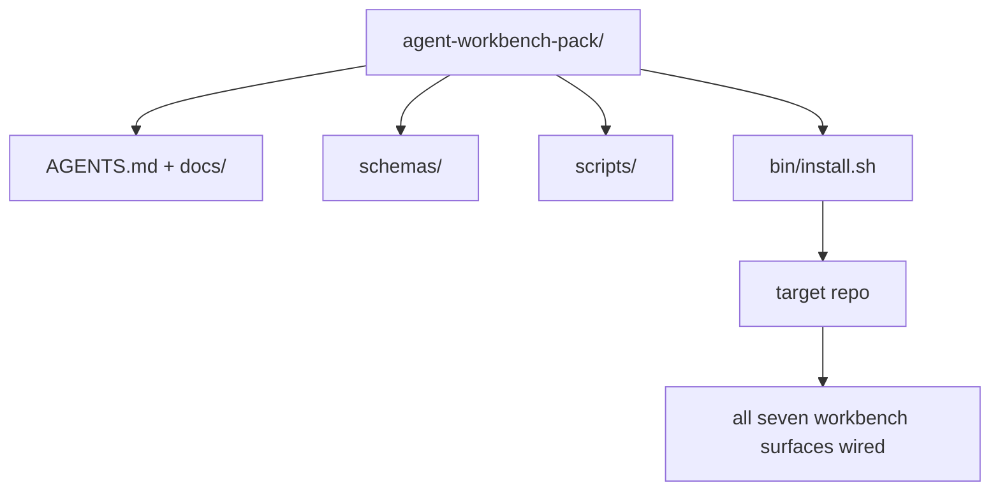

# Capstone: Kirim Paket Meja Kerja Agen yang Dapat Digunakan Kembali

> Mini-track diakhiri dengan paket yang kamu masukkan ke repo mana pun. Sebelas lesson tentang permukaan yang dikompres ke dalam direktori kamu dapat `cp -r` dan meminta agen bekerja dengan andal keesokan paginya. Batu penjuru adalah artefak yang diperdagangkan dalam kurikulum ini.

**Type:** Build
**Language:** Python (stdlib)
**Prerequisites:** Phase 14 · 31 hingga 14 · 41
**Waktu:** ~75 menit

## Tujuan Pembelajaran

- Kemas tujuh permukaan meja kerja ke dalam satu direktori drop-in.
- Sematkan skema, skrip, dan templat sehingga repo baru mendapatkan dasar yang baik.
- Tambahkan satu skrip penginstal yang meletakkan paket secara idempoten.
- Putuskan apa yang tersisa di dalam kemasan dan apa yang tersisa, pertahankan potongannya untuk masing-masing paket.

## Masalah

Meja kerja yang ada di Google Dokumen, riwayat obrolan, dan tiga skrip yang setengah diingat adalah meja kerja yang dibuat ulang setiap kuartal. Obatnya adalah paket berversi: repo atau direktori dengan permukaan, skema, skrip, dan penginstal satu prompt.

kamu akan mengakhiri lesson ini dengan `outputs/agent-workbench-pack/` dikirimkan pada disk dan `bin/install.sh` yang memasukkannya ke dalam repo target mana pun.

## Konsep



### Tata letak paket

```
outputs/agent-workbench-pack/
├── AGENTS.md
├── docs/
│   ├── agent-rules.md
│   ├── reliability-policy.md
│   ├── handoff-protocol.md
│   └── reviewer-rubric.md
├── schemas/
│   ├── agent_state.schema.json
│   ├── task_board.schema.json
│   └── scope_contract.schema.json
├── scripts/
│   ├── init_agent.py
│   ├── run_with_feedback.py
│   ├── verify_agent.py
│   └── generate_handoff.py
├── bin/
│   └── install.sh
└── README.md
```

### Apa yang tertinggal, apa yang tertinggal

Di:

- Skema permukaan. Itu adalah kontraknya.
- Keempat script di atas. Mereka adalah runtimenya.
- Keempat dokumen. Itu adalah aturan dan rubriknya.

Keluar:

- Tugas khusus proyek. Tugas ada di papan repo target, bukan di paket.
- Panggilan Vendor SDK. Paket ini bersifat agnostik framework.
- Prosa orientasi. Paket tersebut berada di sebelah orientasi tim yang sudah ada, bukan di dalamnya.

### Pemasang

Singkat `bin/install.sh` (atau `bin/install.py`):

1. Menolak untuk menginstal pada paket yang sudah ada tanpa `--force`.
2. Menyalin paket ke dalam repo target.
3. Hubungkan CI jika `.github/workflows/` ada.
4. Mencetak langkah selanjutnya: mengisi papan, mengatur prompt penerimaan, menjalankan skrip init.

### Pembuatan Versi

Paket tersebut berisi file `VERSION`. Perubahan skema dan perubahan skrip yang memerlukan migrasi merupakan perubahan besar. Perubahan khusus dokumen akan menggantikan patch tersebut. `agent_state.json` repo target mencatat versi paket mana yang diinisialisasi.

## Build

`code/main.py` merakit paket menjadi `outputs/agent-workbench-pack/` di samping lesson, dilengkapi dengan skema dan skrip dari lesson sebelumnya di mini-track ini dan dokumen yang sudah kamu tulis.

Jalankan:

```
python3 code/main.py
```

Script menyalin dan embed permukaan, menulis README, mencetak pohon paket, dan keluar dari nol. Menjalankan kembali adalah idempoten.

## Pola produksi di alam liar

Sebuah paket hanya bernilai jika dapat bertahan dari percabangan, pembaruan, dan upstream yang tidak bersahabat. Empat pola membuatnya berhasil.

**`VERSION` adalah kontraknya, bukan pemasarannya.** Kendala besar memerlukan migrasi negara bagian. Benjolan kecil memerlukan pemeriksa yang dijalankan ulang. Benjolan tambalan hanya untuk dokumen. Pemasang menulis `.workbench-version` ke dalam repo target pada setiap pemasangan; `lint_pack.py` menolak mengirim jika kunci target tidak sesuai dengan paket `VERSION`. Beginilah cara `npm`, `Cargo`, dan `pyproject.toml` bertahan selama 10 tahun churn; tidak ada apa pun tentang agen yang mengubah aturan.**Sumber tunggal untuk distribusi lintas alat.** Nx mengirimkan satu `nx ai-setup` yang berisi `AGENTS.md`, `CLAUDE.md`, `.cursor/rules/`, `.github/copilot-instructions.md`, dan server MCP dari satu konfigurasi. Paket tersebut harus melakukan hal yang sama; penginstal memancarkan symlink (`ln -s AGENTS.md CLAUDE.md`) sehingga satu sumber kebenaran menyebar ke setiap agen pengkodean. Membagi paket untuk mendukung satu alat dibandingkan alat lainnya adalah mode kegagalan.

**`uninstall.sh` yang menolak pada keadaan non-sepele.** Menghapus instalasi paket tidak boleh menghapus `agent_state.json`, `task_board.json`, atau `outputs/` milik pengguna. Uninstaller menghapus skema, skrip, dokumen, dan `AGENTS.md` (dengan `--keep-agents-md` opt-out) dan menolak untuk melanjutkan jika file negara memiliki perubahan yang belum dikomit. Negara adalah milik pengguna; paket itu tidak memilikinya.

**Keterampilan yang dapat diterbitkan. Distribusi bergaya SkillKit.** Paket dikirimkan sebagai keterampilan SkillKit: `skillkit install agent-workbench-pack` meletakkannya di 32 agen AI dari satu sumber. Repo paket adalah sumber kebenaran; SkillKit adalah pipeline distribusi. Penguncian vendor runtuh; ketujuh permukaannya tetap sama.

## Pakai

Tiga tempat paket dikirimkan:

- **Sebagai direktori, kamu memasukkan ke dalam repo.** `cp -r outputs/agent-workbench-pack /path/to/repo`.
- **Sebagai repo template publik.** Fork-dan-kustomisasi, dengan `VERSION` mengendalikan penyimpangan.
- **Sebagai keterampilan SkillKit.** Disambungkan ke produk agen kamu sehingga satu prompt akan meletakkannya.

Paketnya adalah resepnya. Setiap instalasi adalah satu porsi.

## Kirim

`outputs/skill-workbench-pack.md` menghasilkan paket yang disesuaikan dengan proyek: aturan yang dipertajam dengan riwayat tim, gumpalan cakupan yang cocok dengan repo, dimension rubrik diperluas dengan satu entri khusus domain.

## Latihan

1. Putuskan dokumen kelima opsional mana yang layak dipromosikan ke dalam paket kanonik. Pertahankan potongannya.
2. Tulis ulang penginstal sebagai Python dengan tanda `--dry-run`. Bandingkan ergonomi dengan bash.
3. Tambahkan `bin/uninstall.sh` yang menghapus paket dengan aman dan menolak jika file negara memiliki riwayat yang tidak sepele. Apa yang dianggap tidak sepele?
4. Tambahkan `lint_pack.py` yang gagal ketika paket berpindah dari `VERSION`. Kirim ke CI untuk repo paket itu sendiri.
5. Tulis runbook migrasi dari meja kerja linting tangan ke paket ini. Bagaimana urutan operasi yang meminimalkan downtime?

## Istilah Kunci

| Istilah | Apa kata orang | Apa sebenarnya arti |
|------|----------------|------------------------|
| Paket meja kerja | "Perlengkapan Pemula" | Direktori berversi yang memuat ketujuh permukaan |
| Pemasang | "Skrip pengaturan" | `bin/install.sh` yang meletakkan paket secara idempoten |
| Versi paket | "VERSI" | Kendala besar untuk perubahan skema/skrip, patch hanya untuk dokumen |
| Paket drop-in | "cp -r dan pergi" | Paket berfungsi tanpa penyesuaian per-repo pada hari pertama |
| Templat yang dapat di-fork | "Templat GitHub" | Repo publik tempat "Gunakan templat ini" GitHub dapat dikloning dari |

## Bacaan Lanjutan- Fase 14 · 31 hingga 14 · 41 — setiap permukaan dibundel dengan paket ini
- [SkillKit](https://github.com/rohitg00/skillkit) — instal keterampilan ini di 32 agen AI
- [Nx Blog, Ajari Agen AI kamu Cara Bekerja di Monorepo](https://nx.dev/blog/nx-ai-agent-skills) — generator sumber tunggal di enam alat
- [agents.md — spesifikasi terbuka](https://agents.md/) — apa yang harus diimplementasikan oleh router paket kamu
- [HKUDS/OpenHarness](https://github.com/HKUDS/OpenHarness) — implementasi referensi dari paket yang setara
- [andrewgarst/agentic_harness](https://github.com/andrewgarst/agentic_harness) — Referensi yang didukung Redis dengan eval suite
- [Code Augment, AGENTS.md yang baik adalah peningkatan model](https://www.augmentcode.com/blog/how-to-write-good-agents-dot-md-files) — bilah kualitas dokumen paket
- [Pengmanfaatan Antropik dan Efektif untuk agen jangka panjang](https://www.anthropic.com/engineering/ Effective-harnesses-for-long-running-agents)
- [Antropik, desain Harness untuk pengembangan aplikasi jangka panjang](https://www.anthropic.com/engineering/harness-design-long-running-apps)
- Fase 14 · 30 — pengembangan agen berbasis eval yang menggunakan gerbang verifikasi paket
- Fase 14 · 41 — tolok ukur sebelum/sesudah yang ditingkatkan oleh paket ini
