# Protokol Komunikasi

> Agen yang tidak dapat berbicara dalam bahasa yang sama bukanlah sebuah tim. Mereka adalah orang asing yang berteriak ke dalam kehampaan.

**Type:** Build
**Language:** TypeScript
**Prerequisites:** Fase 14 (Rekayasa Agen), Lesson 16.01 (Mengapa Multi-Agen)
**Waktu:** ~120 menit

## Tujuan Pembelajaran

- Menerapkan penemuan dan pemanggilan alat MCP sehingga agen dapat menggunakan alat yang diekspos oleh server eksternal
- Membangun kartu agen A2A dan titik akhir tugas yang memungkinkan satu agen mendelegasikan pekerjaan ke agen lain melalui HTTP
- Bandingkan MCP (akses alat), A2A (agen-ke-agen), ACP (audit perusahaan), dan ANP (kepercayaan terdesentralisasi) dan jelaskan protokol mana yang memecahkan masalah mana
- Menyatukan beberapa protokol dalam satu sistem di mana agen menemukan alat melalui MCP dan mendelegasikan tugas melalui A2A

## Masalah

kamu membagi sistem kamu menjadi beberapa agen. Seorang peneliti, pembuat code, pengulas. Mereka hebat dalam pekerjaan masing-masing. Namun sekarang kamu membutuhkan mereka untuk benar-benar berbicara satu sama lain.

Upaya pertama kamu sudah jelas: menyebarkan string. Peneliti mengembalikan gumpalan teks, pembuat code menguraikannya sebisa mungkin. Ini berfungsi sampai pembuat code salah menafsirkan ringkasan penelitian, atau dua agen mengalami kebuntuan yang menunggu satu sama lain, atau kamu memerlukan agen yang dibangun oleh tim berbeda untuk berkolaborasi. Tiba-tiba "hanya meneruskan string" berantakan.

Ini adalah masalah protokol komunikasi. Tanpa kontrak bersama mengenai cara agen bertukar informasi, sistem multi-agen akan rapuh, tidak dapat diaudit, dan tidak mungkin diperluas melampaui beberapa agen yang kamu tulis secara pribadi.

Ekosistem AI telah merespons dengan empat protokol, yang masing-masing memecahkan masalah yang berbeda:

- **MCP** untuk akses alat
- **A2A** untuk kolaborasi antar agen
- **ACP** untuk kemampuan audit perusahaan
- **ANP** untuk identitas dan kepercayaan yang terdesentralisasi

Lesson ini sangat mendalam. kamu akan membaca format kabel nyata dari setiap spesifikasi, membangun implementasi kerja, dan menghubungkan keempatnya ke dalam sistem terpadu.

## Konsep

### Lanskap Protokol

Anggaplah keempat protokol ini sebagai layer, masing-masing menjawab pertanyaan berbeda:

```mermaid
block-beta
  columns 1
  block:ANP["ANP — How do agents trust strangers?\nDecentralized identity (DID), E2EE, meta-protocol"]
  end
  block:A2A["A2A — How do agents collaborate on goals?\nAgent Cards, task lifecycle, streaming, negotiation"]
  end
  block:ACP["ACP — How do agents talk in auditable systems?\nRuns, trajectory metadata, session continuity"]
  end
  block:MCP["MCP — How does an agent use a tool?\nTool discovery, execution, context sharing"]
  end

  style ANP fill:#f3e8ff,stroke:#7c3aed
  style A2A fill:#dbeafe,stroke:#2563eb
  style ACP fill:#fef3c7,stroke:#d97706
  style MCP fill:#d1fae5,stroke:#059669
```

Mereka bukan pesaing. Mereka memecahkan masalah yang berbeda pada tingkat yang berbeda.

### MCP (Rekap)

MCP dibahas secara mendalam di Fase 13. Rekap singkat: MCP menstandardisasi cara LLM terhubung ke alat eksternal dan sumber data. Ini adalah protokol **client-server** tempat agen (klien) menemukan dan memanggil alat yang diekspos oleh server.

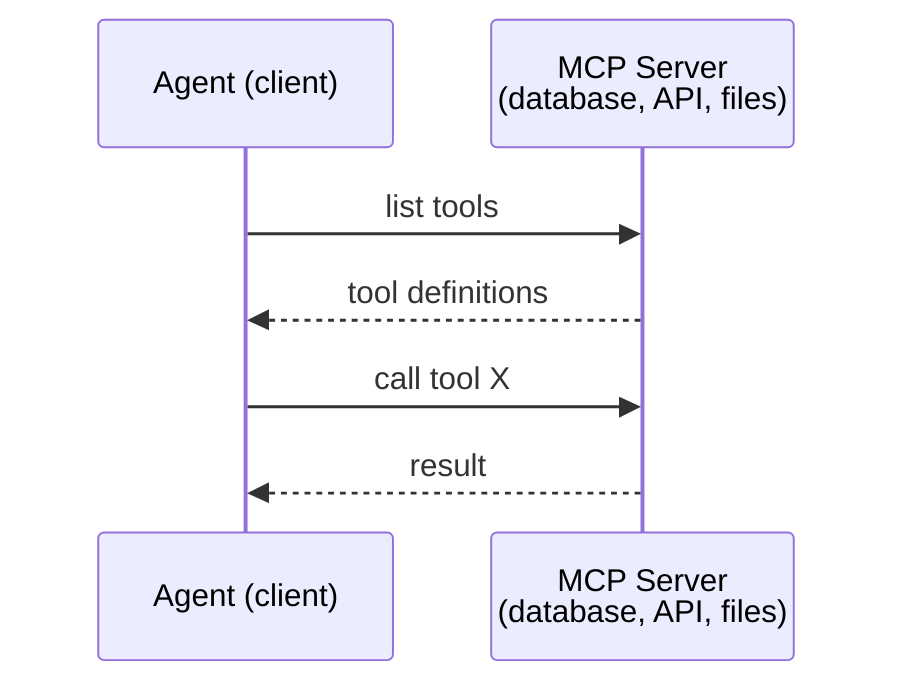

MCP adalah komunikasi **agen-ke-alat**. Itu tidak membantu agen berbicara satu sama lain.

### A2A (Protokol Agen2Agen)

**Dibuat oleh:** Google (sekarang berada di bawah Linux Foundation sebagai `lf.a2a.v1`)
**Versi spesifikasi:** 1.0.0
**Masalah:** Bagaimana cara agen otonom berkolaborasi, bernegosiasi, dan mendelegasikan tugas satu sama lain?

A2A adalah protokol untuk **kolaborasi agen peer-to-peer**. Jika MCP menghubungkan agen ke alat, A2A menghubungkan agen ke agen lain. Setiap agen menerbitkan **Kartu Agen** di URL terkenal, dan agen lain menemukan, bernegosiasi, dan mendelegasikan tugas ke URL tersebut.

#### Cara Kerja A2A

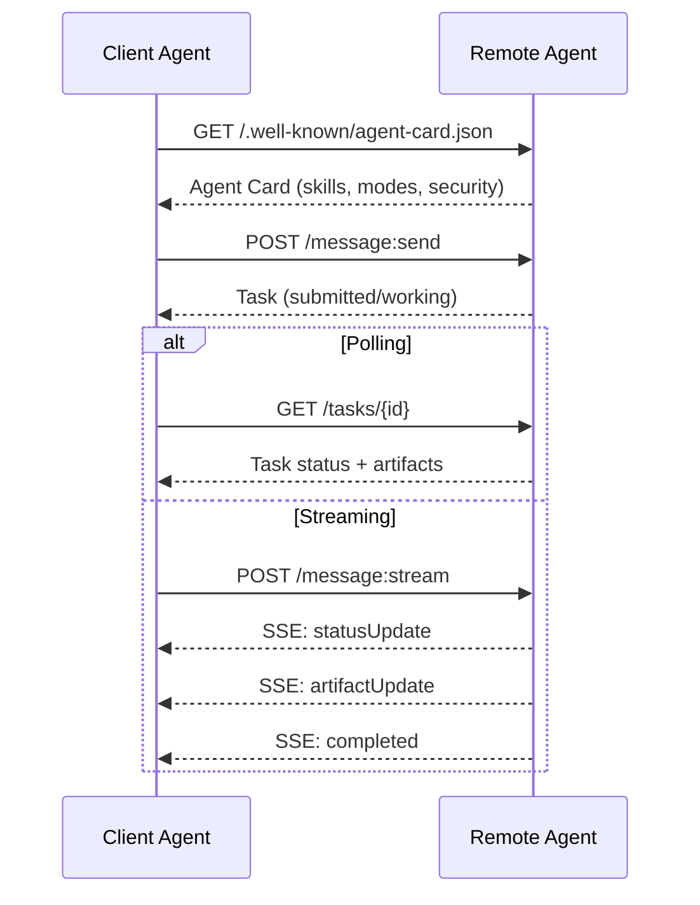

#### Kartu Agen Asli

Seperti inilah sebenarnya Kartu Agen A2A di alam liar. Disajikan di `GET /.well-known/agent-card.json`:

```json
{
  "name": "Research Agent",
  "description": "Searches documentation and summarizes findings",
  "version": "1.0.0",
  "supportedInterfaces": [
    {
      "url": "https://research-agent.example.com/a2a/v1",
      "protocolBinding": "JSONRPC",
      "protocolVersion": "1.0"
    },
    {
      "url": "https://research-agent.example.com/a2a/rest",
      "protocolBinding": "HTTP+JSON",
      "protocolVersion": "1.0"
    }
  ],
  "provider": {
    "organization": "Your Company",
    "url": "https://example.com"
  },
  "capabilities": {
    "streaming": true,
    "pushNotifications": false
  },
  "defaultInputModes": ["text/plain", "application/json"],
  "defaultOutputModes": ["text/plain", "application/json"],
  "skills": [
    {
      "id": "web-research",
      "name": "Web Research",
      "description": "Searches the web and synthesizes findings",
      "tags": ["research", "search", "summarization"],
      "examples": ["Research the latest changes in React 19"]
    },
    {
      "id": "doc-analysis",
      "name": "Documentation Analysis",
      "description": "Reads and analyzes technical documentation",
      "tags": ["docs", "analysis"],
      "inputModes": ["text/plain", "application/pdf"],
      "outputModes": ["application/json"]
    }
  ],
  "securitySchemes": {
    "bearer": {
      "httpAuthSecurityScheme": {
        "scheme": "Bearer",
        "bearerFormat": "JWT"
      }
    }
  },
  "security": [{ "bearer": [] }]
}
```Hal-hal penting yang perlu diperhatikan:
- **Keterampilan** adalah apa yang bisa dilakukan agen. Masing-masing memiliki ID, tag, dan tipe MIME input/output yang didukung. Ini adalah bagaimana agen klien memutuskan apakah agen distance jauh ini dapat menangani permintaannya.
- **Antarmuka yang didukung** mencantumkan beberapa pengikatan protokol. Satu agen dapat menggunakan JSON-RPC, REST, dan gRPC secara bersamaan.
- **Keamanan** sudah terpasang di kartu. Klien mengetahui autentikasi apa yang dibutuhkannya sebelum membuat satu permintaan.

#### Siklus Hidup Tugas

Tugas adalah unit inti pekerjaan di A2A. Mereka bergerak melalui negara-negara tertentu:

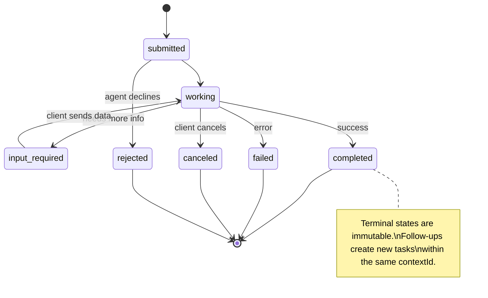

Kedelapan negara bagian tersebut (spesifikasi juga mendefinisikan `UNSPECIFIED` sebagai penjaga, dihilangkan di sini):

| Negara | Terminal? | Arti |
|---|---|---|
| `TASK_STATE_SUBMITTED` | Tidak | Diakui, belum diproses |
| `TASK_STATE_WORKING` | Tidak | Sedang diproses secara aktif |
| `TASK_STATE_INPUT_REQUIRED` | Tidak | Agen memerlukan info lebih lanjut dari klien |
| `TASK_STATE_AUTH_REQUIRED` | Tidak | Otentikasi diperlukan |
| `TASK_STATE_COMPLETED` | Ya | Selesai dengan sukses |
| `TASK_STATE_FAILED` | Ya | Selesai dengan kesalahan |
| `TASK_STATE_CANCELED` | Ya | Dibatalkan sebelum selesai |
| `TASK_STATE_REJECTED` | Ya | Agen menolak tugas |

Setelah tugas mencapai status terminal, tugas tersebut tidak dapat diubah. Tidak ada pesan lebih lanjut. Tindak lanjut membuat tugas baru dalam `contextId` yang sama.

#### Format Kawat

A2A menggunakan JSON-RPC 2.0. Berikut tampilan pertukaran pesan yang sebenarnya:

**Klien mengirimkan tugas:**
```json
{
  "jsonrpc": "2.0",
  "id": 1,
  "method": "SendMessage",
  "params": {
    "message": {
      "messageId": "msg-001",
      "role": "ROLE_USER",
      "parts": [{ "text": "Research React 19 compiler features" }]
    },
    "configuration": {
      "acceptedOutputModes": ["text/plain", "application/json"],
      "historyLength": 10
    }
  }
}
```

**Agen merespons dengan tugas:**
```json
{
  "jsonrpc": "2.0",
  "id": 1,
  "result": {
    "task": {
      "id": "task-abc-123",
      "contextId": "ctx-xyz-789",
      "status": {
        "state": "TASK_STATE_COMPLETED",
        "timestamp": "2026-03-27T10:30:00Z"
      },
      "artifacts": [
        {
          "artifactId": "art-001",
          "name": "research-results",
          "parts": [{
            "data": {
              "findings": [
                "React 19 compiler auto-memoizes components",
                "No more manual useMemo/useCallback needed",
                "Compiler runs at build time, not runtime"
              ]
            },
            "mediaType": "application/json"
          }]
        }
      ]
    }
  }
}
```

**Streaming melalui SSE:**
```text
POST /message:stream HTTP/1.1
Content-Type: application/json
A2A-Version: 1.0

data: {"task":{"id":"task-123","status":{"state":"TASK_STATE_WORKING"}}}

data: {"statusUpdate":{"taskId":"task-123","status":{"state":"TASK_STATE_WORKING","message":{"role":"ROLE_AGENT","parts":[{"text":"Searching documentation..."}]}}}}

data: {"artifactUpdate":{"taskId":"task-123","artifact":{"artifactId":"art-1","parts":[{"text":"partial findings..."}]},"append":true,"lastChunk":false}}

data: {"statusUpdate":{"taskId":"task-123","status":{"state":"TASK_STATE_COMPLETED"}}}
```

### ACP (Protokol Komunikasi Agen)

**Dibuat oleh:** IBM / BeeAI
**Versi spesifikasi:** 0.2.0 (OpenAPI 3.1.1)
**Status:** Penggabungan ke dalam A2A di bawah Linux Foundation
**Masalah:** Bagaimana cara agen berkomunikasi dengan kemampuan audit penuh, kontinuitas sesi, dan pelacakan lintasan?

ACP adalah **protokol perusahaan**. Berbeda dengan klaim ringkasan lainnya, ACP **tidak** menggunakan JSON-LD. Ini adalah REST/JSON API sederhana yang ditentukan melalui OpenAPI. Yang membuatnya istimewa adalah **TrajectoryMetadata**: setiap respons agen dapat membawa log mendetail tentang langkah-langkah penalaran dan panggilan alat yang menghasilkan respons tersebut.

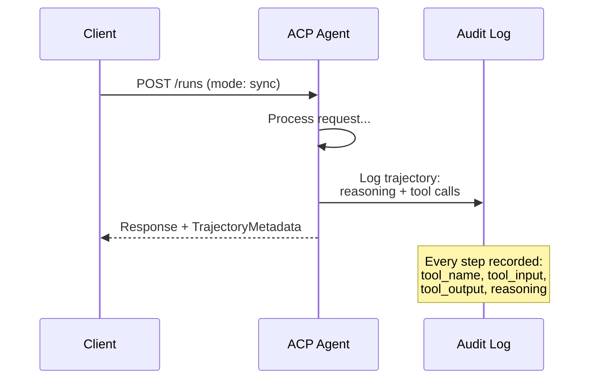

#### Penemuan Agen di ACP

ACP mendefinisikan empat metode penemuan:

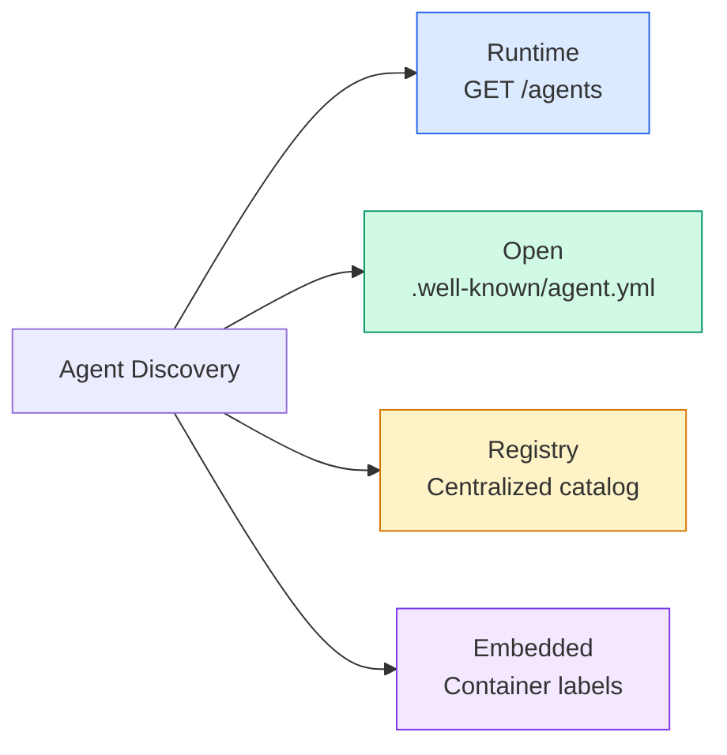

**AgentManifest** lebih sederhana dibandingkan Kartu Agen A2A:

```json
{
  "name": "summarizer",
  "description": "Summarizes documents with source citations",
  "input_content_types": ["text/plain", "application/pdf"],
  "output_content_types": ["text/plain", "application/json"],
  "metadata": {
    "tags": ["summarization", "RAG"],
    "framework": "BeeAI",
    "capabilities": [
      {
        "name": "Document Summarization",
        "description": "Condenses long documents into key points"
      }
    ],
    "recommended_models": ["llama3.3:70b-instruct-fp16"],
    "license": "Apache-2.0",
    "programming_language": "Python"
  }
}
```

#### Jalankan Siklus Hidup

ACP menggunakan "Berjalan" dan bukan "Tugas". Run adalah eksekusi agen dengan tiga mode:

| Modus | Perilaku |
|---|---|
| `sync` | Pemblokiran. Respons berisi hasil lengkap. |
| `async` | Mengembalikan 202 segera. Jajak pendapat `GET /runs/{id}` untuk status. |
| `stream` | aliran SSE. Acara dipicu saat agen bekerja. |

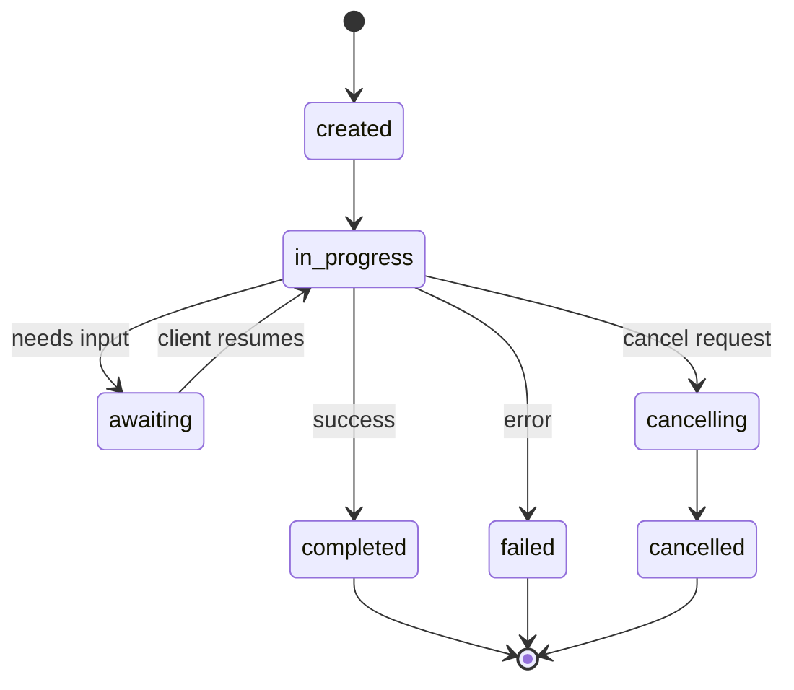

#### Lintasan Metadata (Jejak Audit)

Ini adalah pembeda utama ACP. Setiap bagian pesan dapat menyertakan metadata yang menunjukkan dengan tepat apa yang dilakukan agen:

```json
{
  "role": "agent/researcher",
  "parts": [
    {
      "content_type": "text/plain",
      "content": "The weather in San Francisco is 72F and sunny.",
      "metadata": {
        "kind": "trajectory",
        "message": "I need to check the weather for this location",
        "tool_name": "weather_api",
        "tool_input": { "location": "San Francisco, CA" },
        "tool_output": { "temperature": 72, "condition": "sunny" }
      }
    }
  ]
}
```

Untuk industri yang diatur, ini adalah emas. Setiap jawaban disertai dengan rangkaian pemikiran yang dapat dibuktikan: alat apa yang digunakan, input apa yang digunakan, output apa yang diterima. Tidak ada kotak hitam.

ACP juga mendukung **CitationMetadata** untuk atribusi sumber:

```json
{
  "kind": "citation",
  "start_index": 0,
  "end_index": 47,
  "url": "https://weather.gov/sf",
  "title": "NWS San Francisco Forecast"
}
```

### ANP (Protokol Jaringan Agen)**Dibuat oleh:** Komunitas sumber terbuka (didirikan oleh GaoWei Chang)
**Repo:** [github.com/agent-network-protocol/AgentNetworkProtocol](https://github.com/agent-network-protocol/AgentNetworkProtocol)
**Masalah:** Bagaimana agen dari organisasi yang berbeda saling percaya tanpa otoritas pusat?

ANP adalah **protokol identitas terdesentralisasi**. Itu membangun kepercayaan menggunakan Pengidentifikasi Terdesentralisasi (DID) W3C dan enkripsi ujung ke ujung. Tidak seperti A2A di mana kamu menemukan agen melalui titik akhir yang diketahui, ANP memungkinkan agen membuktikan identitas mereka secara kriptografis.

ANP memiliki tiga layer:

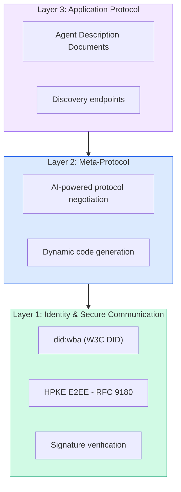

#### Dokumen DID (Struktur Nyata)

ANP menggunakan metode DID khusus yang disebut `did:wba` (Agen Berbasis Web). DID `did:wba:example.com:user:alice` memutuskan untuk `https://example.com/user/alice/did.json`:

```json
{
  "@context": [
    "https://www.w3.org/ns/did/v1",
    "https://w3id.org/security/suites/jws-2020/v1",
    "https://w3id.org/security/suites/secp256k1-2019/v1"
  ],
  "id": "did:wba:example.com:user:alice",
  "verificationMethod": [
    {
      "id": "did:wba:example.com:user:alice#key-1",
      "type": "EcdsaSecp256k1VerificationKey2019",
      "controller": "did:wba:example.com:user:alice",
      "publicKeyJwk": {
        "crv": "secp256k1",
        "x": "NtngWpJUr-rlNNbs0u-Aa8e16OwSJu6UiFf0Rdo1oJ4",
        "y": "qN1jKupJlFsPFc1UkWinqljv4YE0mq_Ickwnjgasvmo",
        "kty": "EC"
      }
    },
    {
      "id": "did:wba:example.com:user:alice#key-x25519-1",
      "type": "X25519KeyAgreementKey2019",
      "controller": "did:wba:example.com:user:alice",
      "publicKeyMultibase": "z9hFgmPVfmBZwRvFEyniQDBkz9LmV7gDEqytWyGZLmDXE"
    }
  ],
  "authentication": [
    "did:wba:example.com:user:alice#key-1"
  ],
  "keyAgreement": [
    "did:wba:example.com:user:alice#key-x25519-1"
  ],
  "humanAuthorization": [
    "did:wba:example.com:user:alice#key-1"
  ],
  "service": [
    {
      "id": "did:wba:example.com:user:alice#agent-description",
      "type": "AgentDescription",
      "serviceEndpoint": "https://example.com/agents/alice/ad.json"
    }
  ]
}
```

Hal-hal penting yang perlu diperhatikan:
- **Pemisahan kunci** diterapkan. Kunci penandatanganan (secp256k1) terpisah dari kunci enkripsi (X25519).
- **`humanAuthorization`** unik untuk ANP. Kunci ini memerlukan persetujuan manusia secara eksplisit (biometrik, kata sandi, HSM) sebelum digunakan. Operasi berisiko tinggi seperti transfer dana melalui jalur ini.
- Kunci **`keyAgreement`** digunakan untuk enkripsi ujung ke ujung HPKE (RFC 9180).
- Bagian **layanan** tertaut ke dokumen Deskripsi Agen.

#### Cara Kerja Kepercayaan di ANP

ANP **tidak** menggunakan grafik web-of-trust atau endorsement. Kepercayaan bersifat bilateral dan terverifikasi per interaksi:

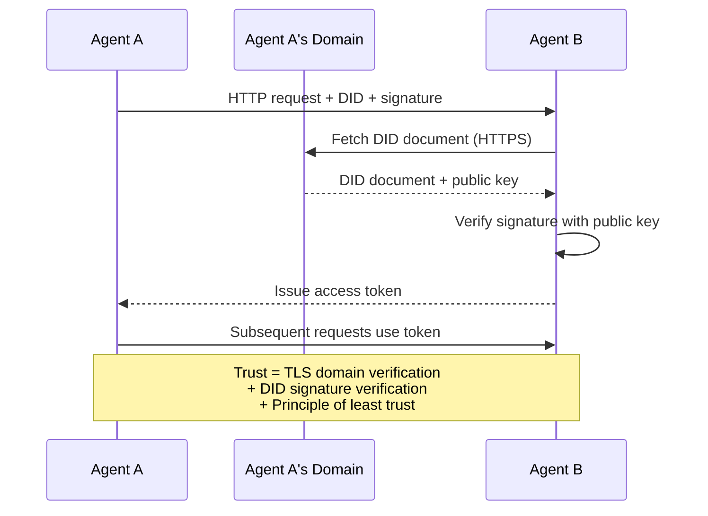

Kepercayaan berasal dari tiga sumber:
1. **TLS tingkat domain** memverifikasi host dokumen DID
2. **DID tanda tangan kriptografi** memverifikasi identitas agen
3. **Prinsip paling tidak percaya** hanya memberikan izin minimum

Tidak ada penyebaran kepercayaan berbasis gosip atau penilaian PageRank. kamu memverifikasi setiap agen secara langsung melalui DID-nya.

#### Negosiasi Meta-Protokol

Ini adalah feature ANP yang paling baru. Ketika dua agen dari ekosistem berbeda bertemu, mereka tidak memerlukan format data yang telah disepakati sebelumnya. Mereka bernegosiasi dalam bahasa alami:

```json
{
  "action": "protocolNegotiation",
  "sequenceId": 0,
  "candidateProtocols": "I can communicate using:\n1. JSON-RPC with hotel booking schema\n2. REST with OpenAPI 3.1 spec\n3. Natural language over HTTP",
  "modificationSummary": "Initial proposal",
  "status": "negotiating"
}
```

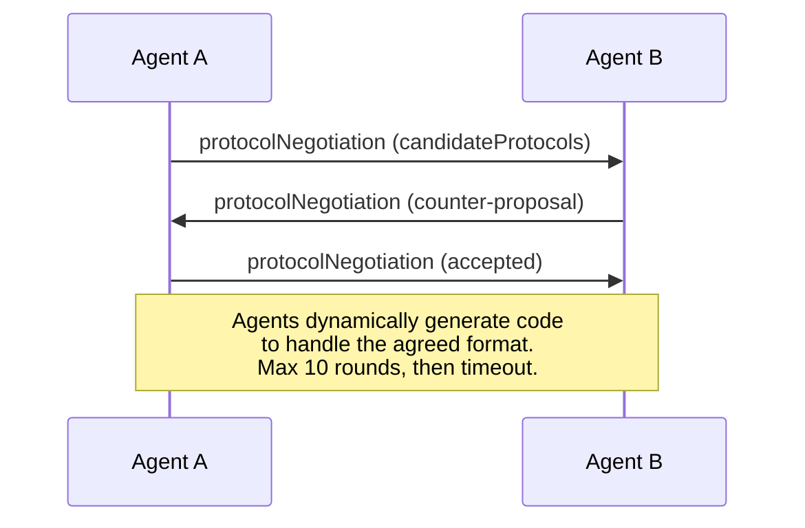

Agen bolak-balik (maks 10 putaran) hingga mereka menyetujui format, lalu secara dinamis membuat code untuk menanganinya. Nilai status: `negotiating`, `rejected`, `accepted`, `timeout`.

Ini berarti dua agen yang belum pernah bertemu satu sama lain sebelumnya dapat mengetahui cara berkomunikasi tanpa ada yang menentukan terlebih dahulu skema bersama.

### Perbandingan (Dikoreksi)| | MCP | A2A | ACP | ANP |
|---|---|---|---|---|
| **Dibuat oleh** | Antropik | Yayasan Google/Linux | IBM / BeeAI | Komunitas |
| **Format spesifikasi** | JSON-RPC | JSON-RPC / REST / gRPC | OpenAPI 3.1 (REST) ​​| JSON-RPC |
| **Penggunaan utama** | Agen ke Alat | Agen ke Agen | Agen ke Agen | Agen ke Agen |
| **Penemuan** | Daftar alat | `/.well-known/agent-card.json` | `GET /agents`, `/.well-known/agent.yml` | `/.well-known/agent-descriptions`, titik akhir layanan DID |
| **Identitas** | Implisit (lokal) | Skema keamanan (OAuth, mTLS) | Tingkat server | W3C MELAKUKAN (`did:wba`) dengan E2EE |
| **Jejak audit** | T/A | Dasar (riwayat tugas) | TrajectoryMetadata (panggilan alat, penalaran) | Tidak ditentukan secara formal |
| **Mesin negara** | T/A | 9 status tugas | 7 negara bagian | T/A |
| **Streaming** | T/A | SSE | SSE | Transportasi-agnostik |
| **Feature unik** | Skema alat | Kartu Agen + Keterampilan | Jejak audit lintasan | Negosiasi meta-protokol |
| **Terbaik untuk** | Alat & data | Kolaborasi dinamis | Industri yang diatur | Kepercayaan lintas organisasi |
| **Statusnya** | Stabil | Stabil (v1.0) | Menggabungkan menjadi A2A | Pengembangan aktif |

### Bagaimana Mereka Bekerja Sama

Protokol-protokol ini tidak eksklusif satu sama lain. Sistem perusahaan yang realistis menggunakan banyak hal:

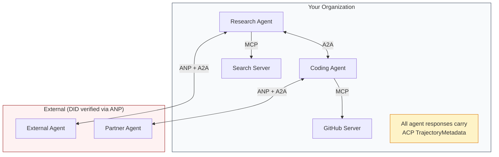

- **MCP** menghubungkan setiap agen ke alatnya
- **A2A** menangani kolaborasi antar agen (internal dan eksternal)
- **ACP** menggabungkan respons dalam metadata lintasan agar dapat diaudit
- **ANP** menyediakan verifikasi identitas untuk agen yang tidak kamu kendalikan

## Build

### Langkah 1: Jenis Pesan Inti

Setiap sistem multi-agen dimulai dengan format pesan. Kami mendefinisikan tipe yang memetakan apa yang digunakan protokol sebenarnya:

```typescript
import crypto from "node:crypto";

type MessageRole = "user" | "agent";

type MessagePart =
  | { kind: "text"; text: string }
  | { kind: "data"; data: unknown; mediaType: string }
  | { kind: "file"; name: string; url: string; mediaType: string };

type TrajectoryEntry = {
  reasoning: string;
  toolName?: string;
  toolInput?: unknown;
  toolOutput?: unknown;
  timestamp: number;
};

type AgentMessage = {
  id: string;
  role: MessageRole;
  parts: MessagePart[];
  trajectory?: TrajectoryEntry[];
  replyTo?: string;
  timestamp: number;
};

function createMessage(
  role: MessageRole,
  parts: MessagePart[],
  replyTo?: string
): AgentMessage {
  return {
    id: crypto.randomUUID(),
    role,
    parts,
    replyTo,
    timestamp: Date.now(),
  };
}

function textMessage(role: MessageRole, text: string): AgentMessage {
  return createMessage(role, [{ kind: "text", text }]);
}
```

Pemberitahuan: `MessagePart` bersifat multimodal (teks, data terstruktur, file) sama seperti spesifikasi A2A dan ACP sebenarnya. `TrajectoryEntry` menangkap rantai penalaran, cocok dengan TrajectoryMetadata ACP.

### Langkah 2: Kartu Agen A2A dan Registri

Build penemuan agen yang cocok dengan spesifikasi A2A sebenarnya:

```typescript
type Skill = {
  id: string;
  name: string;
  description: string;
  tags: string[];
  inputModes: string[];
  outputModes: string[];
};

type AgentCard = {
  name: string;
  description: string;
  version: string;
  url: string;
  capabilities: {
    streaming: boolean;
    pushNotifications: boolean;
  };
  defaultInputModes: string[];
  defaultOutputModes: string[];
  skills: Skill[];
};

class AgentRegistry {
  private cards: Map<string, AgentCard> = new Map();

  register(card: AgentCard) {
    this.cards.set(card.name, card);
  }

  discoverBySkillTag(tag: string): AgentCard[] {
    return [...this.cards.values()].filter((card) =>
      card.skills.some((skill) => skill.tags.includes(tag))
    );
  }

  discoverByInputMode(mimeType: string): AgentCard[] {
    return [...this.cards.values()].filter(
      (card) =>
        card.defaultInputModes.includes(mimeType) ||
        card.skills.some((skill) => skill.inputModes.includes(mimeType))
    );
  }

  resolve(name: string): AgentCard | undefined {
    return this.cards.get(name);
  }

  listAll(): AgentCard[] {
    return [...this.cards.values()];
  }
}
```

Ini jauh lebih kaya daripada peta nama-ke-kemampuan yang sederhana. kamu dapat menemukan agen berdasarkan tag keahlian, dengan memasukkan tipe MIME, atau berdasarkan nama, seperti dukungan spesifikasi A2A yang sebenarnya.

### Langkah 3: Siklus Hidup Tugas A2A

Build mesin status tugas lengkap:

```typescript
type TaskState =
  | "submitted"
  | "working"
  | "input-required"
  | "auth-required"
  | "completed"
  | "failed"
  | "canceled"
  | "rejected";

const TERMINAL_STATES: TaskState[] = [
  "completed",
  "failed",
  "canceled",
  "rejected",
];

type TaskStatus = {
  state: TaskState;
  message?: AgentMessage;
  timestamp: number;
};

type Artifact = {
  id: string;
  name: string;
  parts: MessagePart[];
};

type Task = {
  id: string;
  contextId: string;
  status: TaskStatus;
  artifacts: Artifact[];
  history: AgentMessage[];
};

type TaskEvent =
  | { kind: "statusUpdate"; taskId: string; status: TaskStatus }
  | {
      kind: "artifactUpdate";
      taskId: string;
      artifact: Artifact;
      append: boolean;
      lastChunk: boolean;
    };

type TaskHandler = (
  task: Task,
  message: AgentMessage
) => AsyncGenerator<TaskEvent>;

class TaskManager {
  private tasks: Map<string, Task> = new Map();
  private handlers: Map<string, TaskHandler> = new Map();
  private listeners: Map<string, ((event: TaskEvent) => void)[]> = new Map();

  registerHandler(agentName: string, handler: TaskHandler) {
    this.handlers.set(agentName, handler);
  }

  subscribe(taskId: string, listener: (event: TaskEvent) => void) {
    const existing = this.listeners.get(taskId) ?? [];
    existing.push(listener);
    this.listeners.set(taskId, existing);
  }

  async sendMessage(
    agentName: string,
    message: AgentMessage,
    contextId?: string
  ): Promise<Task> {
    const handler = this.handlers.get(agentName);
    if (!handler) {
      const task = this.createTask(contextId);
      task.status = {
        state: "rejected",
        timestamp: Date.now(),
        message: textMessage("agent", `No handler for ${agentName}`),
      };
      return task;
    }

    const task = this.createTask(contextId);
    task.history.push(message);
    task.status = { state: "submitted", timestamp: Date.now() };

    this.processTask(task, handler, message).catch((err) => {
      task.status = {
        state: "failed",
        timestamp: Date.now(),
        message: textMessage("agent", String(err)),
      };
    });
    return task;
  }

  getTask(taskId: string): Task | undefined {
    return this.tasks.get(taskId);
  }

  cancelTask(taskId: string): boolean {
    const task = this.tasks.get(taskId);
    if (!task || TERMINAL_STATES.includes(task.status.state)) return false;
    task.status = { state: "canceled", timestamp: Date.now() };
    this.emit(taskId, {
      kind: "statusUpdate",
      taskId,
      status: task.status,
    });
    return true;
  }

  private createTask(contextId?: string): Task {
    const task: Task = {
      id: crypto.randomUUID(),
      contextId: contextId ?? crypto.randomUUID(),
      status: { state: "submitted", timestamp: Date.now() },
      artifacts: [],
      history: [],
    };
    this.tasks.set(task.id, task);
    return task;
  }

  private async processTask(
    task: Task,
    handler: TaskHandler,
    message: AgentMessage
  ) {
    task.status = { state: "working", timestamp: Date.now() };
    this.emit(task.id, {
      kind: "statusUpdate",
      taskId: task.id,
      status: task.status,
    });

    try {
      for await (const event of handler(task, message)) {
        if (TERMINAL_STATES.includes(task.status.state)) break;

        if (event.kind === "statusUpdate") {
          task.status = event.status;
        }
        if (event.kind === "artifactUpdate") {
          const existing = task.artifacts.find(
            (a) => a.id === event.artifact.id
          );
          if (existing && event.append) {
            existing.parts.push(...event.artifact.parts);
          } else {
            task.artifacts.push(event.artifact);
          }
        }
        this.emit(task.id, event);
      }
    } catch (err) {
      task.status = {
        state: "failed",
        timestamp: Date.now(),
        message: textMessage("agent", String(err)),
      };
      this.emit(task.id, {
        kind: "statusUpdate",
        taskId: task.id,
        status: task.status,
      });
    }
  }

  private emit(taskId: string, event: TaskEvent) {
    for (const listener of this.listeners.get(taskId) ?? []) {
      listener(event);
    }
  }
}
```

Ini mengimplementasikan siklus hidup tugas A2A yang sebenarnya: status terminal dikirimkan, berfungsi, diperlukan input. Penangan adalah generator asinkron yang menghasilkan peristiwa (pembaruan status dan potongan artefak) yang cocok dengan model streaming SSE.

### Langkah 4: Jejak Audit Bergaya ACP

Bungkus komunikasi dengan pelacakan lintasan:

```typescript
type AuditEntry = {
  runId: string;
  agentName: string;
  input: AgentMessage[];
  output: AgentMessage[];
  trajectory: TrajectoryEntry[];
  status: "created" | "in-progress" | "completed" | "failed" | "awaiting";
  startedAt: number;
  completedAt?: number;
  sessionId?: string;
};

class AuditableRunner {
  private log: AuditEntry[] = [];
  private handlers: Map<
    string,
    (input: AgentMessage[]) => Promise<{
      output: AgentMessage[];
      trajectory: TrajectoryEntry[];
    }>
  > = new Map();

  registerAgent(
    name: string,
    handler: (input: AgentMessage[]) => Promise<{
      output: AgentMessage[];
      trajectory: TrajectoryEntry[];
    }>
  ) {
    this.handlers.set(name, handler);
  }

  async run(
    agentName: string,
    input: AgentMessage[],
    sessionId?: string
  ): Promise<AuditEntry> {
    const entry: AuditEntry = {
      runId: crypto.randomUUID(),
      agentName,
      input: structuredClone(input),
      output: [],
      trajectory: [],
      status: "created",
      startedAt: Date.now(),
      sessionId,
    };
    this.log.push(entry);

    const handler = this.handlers.get(agentName);
    if (!handler) {
      entry.status = "failed";
      return entry;
    }

    entry.status = "in-progress";
    try {
      const result = await handler(input);
      entry.output = structuredClone(result.output);
      entry.trajectory = structuredClone(result.trajectory);
      entry.status = "completed";
      entry.completedAt = Date.now();
    } catch (err) {
      entry.status = "failed";
      entry.trajectory.push({
        reasoning: `Error: ${String(err)}`,
        timestamp: Date.now(),
      });
      entry.completedAt = Date.now();
    }
    return entry;
  }

  getFullAuditLog(): AuditEntry[] {
    return structuredClone(this.log);
  }

  getAuditLogForAgent(agentName: string): AuditEntry[] {
    return structuredClone(
      this.log.filter((e) => e.agentName === agentName)
    );
  }

  getAuditLogForSession(sessionId: string): AuditEntry[] {
    return structuredClone(
      this.log.filter((e) => e.sessionId === sessionId)
    );
  }

  getTrajectoryForRun(runId: string): TrajectoryEntry[] {
    const entry = this.log.find((e) => e.runId === runId);
    return entry ? structuredClone(entry.trajectory) : [];
  }
}
```

Setiap eksekusi agen menghasilkan entri audit lengkap: apa yang masuk, apa yang keluar, dan lintasan lengkap dari pemanggilan alat dan langkah-langkah penalaran di antaranya. kamu dapat melakukan kueri berdasarkan agen, sesi, atau eksekusi individual.

### Langkah 5: Verifikasi Identitas Bergaya ANP

Build identitas dan verifikasi berbasis DID:

```typescript
type VerificationMethod = {
  id: string;
  type: string;
  controller: string;
  publicKeyDer: string;
};

type DIDDocument = {
  id: string;
  verificationMethod: VerificationMethod[];
  authentication: string[];
  keyAgreement: string[];
  humanAuthorization: string[];
  service: { id: string; type: string; serviceEndpoint: string }[];
};

type AgentIdentity = {
  did: string;
  document: DIDDocument;
  privateKey: crypto.KeyObject;
  publicKey: crypto.KeyObject;
};

class IdentityRegistry {
  private documents: Map<string, DIDDocument> = new Map();

  publish(doc: DIDDocument) {
    this.documents.set(doc.id, doc);
  }

  resolve(did: string): DIDDocument | undefined {
    return this.documents.get(did);
  }

  verify(did: string, signature: string, payload: string): boolean {
    const doc = this.documents.get(did);
    if (!doc) return false;

    const authKeyIds = doc.authentication;
    const authKeys = doc.verificationMethod.filter((vm) =>
      authKeyIds.includes(vm.id)
    );

    for (const key of authKeys) {
      const publicKey = crypto.createPublicKey({
        key: Buffer.from(key.publicKeyDer, "base64"),
        format: "der",
        type: "spki",
      });
      const isValid = crypto.verify(
        null,
        Buffer.from(payload),
        publicKey,
        Buffer.from(signature, "hex")
      );
      if (isValid) return true;
    }
    return false;
  }

  requiresHumanAuth(did: string, operationKeyId: string): boolean {
    const doc = this.documents.get(did);
    if (!doc) return false;
    return doc.humanAuthorization.includes(operationKeyId);
  }
}

function createIdentity(domain: string, agentName: string): AgentIdentity {
  const did = `did:wba:${domain}:agent:${agentName}`;
  const { publicKey, privateKey } = crypto.generateKeyPairSync("ed25519");

  const publicKeyDer = publicKey
    .export({ format: "der", type: "spki" })
    .toString("base64");

  const keyId = `${did}#key-1`;
  const encKeyId = `${did}#key-x25519-1`;

  const document: DIDDocument = {
    id: did,
    verificationMethod: [
      {
        id: keyId,
        type: "Ed25519VerificationKey2020",
        controller: did,
        publicKeyDer,
      },
      {
        id: encKeyId,
        type: "X25519KeyAgreementKey2019",
        controller: did,
        publicKeyDer,
      },
    ],
    authentication: [keyId],
    keyAgreement: [encKeyId],
    humanAuthorization: [],
    service: [
      {
        id: `${did}#agent-description`,
        type: "AgentDescription",
        serviceEndpoint: `https://${domain}/agents/${agentName}/ad.json`,
      },
    ],
  };

  return { did, document, privateKey, publicKey };
}

function signPayload(identity: AgentIdentity, payload: string): string {
  return crypto
    .sign(null, Buffer.from(payload), identity.privateKey)
    .toString("hex");
}
```

Hal ini mencerminkan model identitas ANP yang sebenarnya: agen memiliki dokumen DID dengan autentikasi terpisah, perjanjian kunci, dan kunci otorisasi manusia. `IdentityRegistry` menyimulasikan resolusi DID (dalam produksi, ini adalah pengambilan HTTP ke domain agen).

### Langkah 6: Gerbang Protokol

Hubungkan keempat protokol ke dalam sistem terpadu:

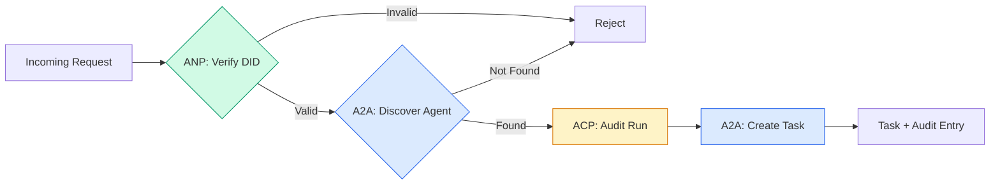

```typescript
class ProtocolGateway {
  private registry: AgentRegistry;
  private taskManager: TaskManager;
  private auditRunner: AuditableRunner;
  private identityRegistry: IdentityRegistry;

  constructor(
    registry: AgentRegistry,
    taskManager: TaskManager,
    auditRunner: AuditableRunner,
    identityRegistry: IdentityRegistry
  ) {
    this.registry = registry;
    this.taskManager = taskManager;
    this.auditRunner = auditRunner;
    this.identityRegistry = identityRegistry;
  }

  async delegateTask(
    fromDid: string,
    signature: string,
    targetAgent: string,
    message: AgentMessage,
    sessionId?: string
  ): Promise<{ task: Task; audit: AuditEntry } | { error: string }> {
    if (!this.identityRegistry.verify(fromDid, signature, message.id)) {
      return { error: "Identity verification failed" };
    }

    const card = this.registry.resolve(targetAgent);
    if (!card) {
      return { error: `Agent ${targetAgent} not found in registry` };
    }

    const audit = await this.auditRunner.run(
      targetAgent,
      [message],
      sessionId
    );
    const task = await this.taskManager.sendMessage(targetAgent, message);

    return { task, audit };
  }

  discoverAndDelegate(
    fromDid: string,
    signature: string,
    skillTag: string,
    message: AgentMessage
  ): Promise<{ task: Task; audit: AuditEntry } | { error: string }> {
    const candidates = this.registry.discoverBySkillTag(skillTag);
    if (candidates.length === 0) {
      return Promise.resolve({
        error: `No agents found with skill tag: ${skillTag}`,
      });
    }
    return this.delegateTask(
      fromDid,
      signature,
      candidates[0].name,
      message
    );
  }
}
```Gateway melakukan empat hal dalam satu panggilan:
1. **ANP**: Memverifikasi identitas penelepon melalui tanda tangan DID
2. **A2A**: Menemukan agen target dan memeriksa kemampuannya
3. **ACP**: Menggabungkan eksekusi dalam jejak audit dengan lintasan
4. **A2A**: Membuat tugas dengan pelacakan siklus hidup penuh

### Langkah 7: Menyatukan Semuanya

```typescript
async function protocolDemo() {
  const registry = new AgentRegistry();
  registry.register({
    name: "researcher",
    description: "Searches and summarizes findings",
    version: "1.0.0",
    url: "https://researcher.local/a2a/v1",
    capabilities: { streaming: true, pushNotifications: false },
    defaultInputModes: ["text/plain"],
    defaultOutputModes: ["text/plain", "application/json"],
    skills: [
      {
        id: "web-research",
        name: "Web Research",
        description: "Searches the web",
        tags: ["research", "search", "summarization"],
        inputModes: ["text/plain"],
        outputModes: ["application/json"],
      },
    ],
  });
  registry.register({
    name: "coder",
    description: "Writes code from specs",
    version: "1.0.0",
    url: "https://coder.local/a2a/v1",
    capabilities: { streaming: false, pushNotifications: false },
    defaultInputModes: ["text/plain", "application/json"],
    defaultOutputModes: ["text/plain"],
    skills: [
      {
        id: "code-gen",
        name: "Code Generation",
        description: "Generates code",
        tags: ["coding", "generation"],
        inputModes: ["text/plain", "application/json"],
        outputModes: ["text/plain"],
      },
    ],
  });

  const taskManager = new TaskManager();
  const auditRunner = new AuditableRunner();

  const researchTrajectory: TrajectoryEntry[] = [];

  taskManager.registerHandler(
    "researcher",
    async function* (task, message) {
      yield {
        kind: "statusUpdate" as const,
        taskId: task.id,
        status: { state: "working" as const, timestamp: Date.now() },
      };

      researchTrajectory.push({
        reasoning: "Searching for React 19 documentation",
        toolName: "web_search",
        toolInput: { query: "React 19 compiler features" },
        toolOutput: {
          results: ["react.dev/blog/react-19", "github.com/react/react"],
        },
        timestamp: Date.now(),
      });

      researchTrajectory.push({
        reasoning: "Extracting key findings from search results",
        toolName: "doc_analysis",
        toolInput: { url: "react.dev/blog/react-19" },
        toolOutput: {
          summary:
            "React 19 compiler auto-memoizes, no manual useMemo needed",
        },
        timestamp: Date.now(),
      });

      yield {
        kind: "artifactUpdate" as const,
        taskId: task.id,
        artifact: {
          id: crypto.randomUUID(),
          name: "research-results",
          parts: [
            {
              kind: "data" as const,
              data: {
                findings: [
                  "React 19 compiler auto-memoizes components",
                  "No more manual useMemo/useCallback needed",
                  "Compiler runs at build time, not runtime",
                ],
                sources: ["react.dev/blog/react-19"],
              },
              mediaType: "application/json",
            },
          ],
        },
        append: false,
        lastChunk: true,
      };

      yield {
        kind: "statusUpdate" as const,
        taskId: task.id,
        status: { state: "completed" as const, timestamp: Date.now() },
      };
    }
  );

  auditRunner.registerAgent("researcher", async () => ({
    output: [
      textMessage("agent", "React 19 compiler auto-memoizes components"),
    ],
    trajectory: researchTrajectory,
  }));

  const identityRegistry = new IdentityRegistry();

  const coderIdentity = createIdentity("coder.local", "coder");
  const researcherIdentity = createIdentity("researcher.local", "researcher");

  identityRegistry.publish(coderIdentity.document);
  identityRegistry.publish(researcherIdentity.document);

  const gateway = new ProtocolGateway(
    registry,
    taskManager,
    auditRunner,
    identityRegistry
  );

  console.log("=== Protocol Demo ===\n");

  console.log("1. Agent Discovery (A2A)");
  const researchAgents = registry.discoverBySkillTag("research");
  console.log(
    `   Found ${researchAgents.length} agent(s):`,
    researchAgents.map((a) => a.name)
  );

  console.log("\n2. Identity Verification (ANP)");
  const message = textMessage("user", "Research React 19 compiler features");
  const signature = signPayload(coderIdentity, message.id);
  const verified = identityRegistry.verify(
    coderIdentity.did,
    signature,
    message.id
  );
  console.log(`   Coder DID: ${coderIdentity.did}`);
  console.log(`   Signature verified: ${verified}`);

  console.log("\n3. Task Delegation (A2A + ACP + ANP)");
  const result = await gateway.delegateTask(
    coderIdentity.did,
    signature,
    "researcher",
    message,
    "session-001"
  );

  if ("error" in result) {
    console.log(`   Error: ${result.error}`);
    return;
  }

  console.log(`   Task ID: ${result.task.id}`);
  console.log(`   Task state: ${result.task.status.state}`);
  console.log(`   Artifacts: ${result.task.artifacts.length}`);

  console.log("\n4. Audit Trail (ACP)");
  console.log(`   Run ID: ${result.audit.runId}`);
  console.log(`   Status: ${result.audit.status}`);
  console.log(`   Trajectory steps: ${result.audit.trajectory.length}`);
  for (const step of result.audit.trajectory) {
    console.log(`     - ${step.reasoning}`);
    if (step.toolName) {
      console.log(`       Tool: ${step.toolName}`);
    }
  }

  console.log("\n5. Full Audit Log");
  const fullLog = auditRunner.getFullAuditLog();
  console.log(`   Total runs: ${fullLog.length}`);
  for (const entry of fullLog) {
    const duration = entry.completedAt
      ? `${entry.completedAt - entry.startedAt}ms`
      : "in-progress";
    console.log(`   ${entry.agentName}: ${entry.status} (${duration})`);
  }
}

protocolDemo().catch((err) => {
  console.error("Protocol demo failed:", err);
  process.exitCode = 1;
});
```

## Apa yang Salah

Protokol menyelesaikan jalan bahagia. Inilah yang rusak dalam produksi:

**Penyimpangan skema.** Agen A menerbitkan output iklan Kartu Agen `application/json`. Namun skema JSON berubah antar versi. Agen B mem-parsing format lama dan mendapatkan sampah. Perbaiki: buat versi keterampilan dan skema output kamu. Spesifikasi A2A mendukung `version` pada Kartu Agen karena alasan ini.

**Pelanggaran mesin status.** Pengendali agen menghasilkan peristiwa `completed`, lalu mencoba menghasilkan lebih banyak artefak. Tugas ini tidak dapat diubah. Code kamu secara diam-diam menghapus pembaruan atau lemparan. Cara mengatasinya: periksa status terminal sebelum menghasilkan. `TaskManager` di atas menerapkan hal ini dengan `break` setelah status terminal.

**Resolusi kepercayaan gagal.** Agen A mencoba memverifikasi DID Agen B, namun domain Agen B tidak aktif. Dokumen DID tidak dapat diambil. Apakah kamu gagal membuka (menerima agen yang belum terverifikasi) atau gagal menutup (menolak semuanya)? ANP merekomendasikan fail close dengan prinsip paling tidak percaya.

**Trajectory bloat.** Pencatatan lintasan ACP sangat efektif namun mahal. Agen kompleks yang melakukan 200 panggilan alat per proses menghasilkan entri audit yang sangat besar. Perbaiki: mencatat lintasan pada tingkat verbositas yang dapat dikonfigurasi. Catat nama alat dan IO untuk kepatuhan, lewati langkah penalaran untuk weight kerja yang tidak diatur.

**Penemuan kawanan yang menggelegar.** 50 agen semuanya menanyakan `GET /agents` secara bersamaan saat startup. Perbaiki: cache Kartu Agen dengan TTL, interval penemuan terhuyung-huyung, atau gunakan registrasi berbasis push alih-alih polling.

## Pakai

### Implementasi Nyata

**A2A** adalah yang paling dewasa. [Spesifikasi resmi] Google(https://github.com/google/A2A) adalah sumber terbuka di bawah Linux Foundation. SDK untuk Python dan TypeScript. Jika agen kamu memerlukan penemuan dan kolaborasi dinamis, mulailah dari sini.

**ACP** bergabung menjadi A2A. [Proyek BeeAI] IBM(https://github.com/i-am-bee/acp) menciptakan ACP sebagai alternatif yang mengutamakan REST, namun konsep metadata lintasan diserap ke dalam ekosistem A2A. Gunakan pola ACP (pencatatan lintasan, jalankan siklus hidup) bahkan jika kamu menggunakan A2A sebagai transportasi.

**ANP** adalah yang paling eksperimental. [Repo komunitas](https://github.com/agent-network-protocol/AgentNetworkProtocol) memiliki Python SDK (AgentConnect). Konsep negosiasi meta-protokol benar-benar baru. Layak diperhatikan untuk penerapan agen lintas organisasi.

**MCP** sudah tercakup dalam Fase 13. Jika kamu ingin agen menggunakan alat, MCP adalah standarnya.

### Memilih Protokol yang Akurat

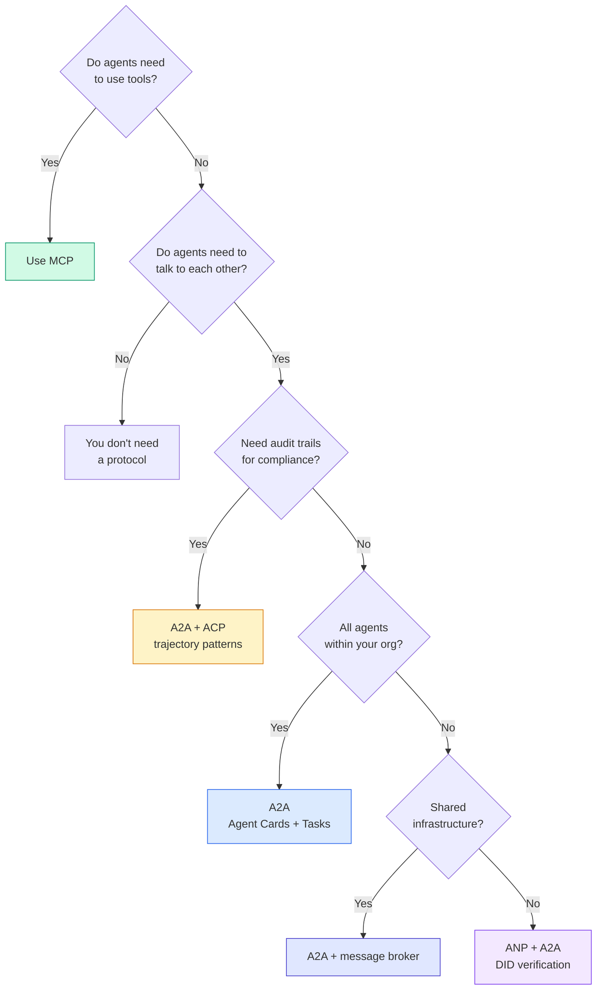

## Kirim

Lesson ini menghasilkan:
- `code/main.ts` -- implementasi lengkap keempat pola protokol
- `outputs/prompt-protocol-selector.md` -- prompt yang membantu kamu memilih protokol untuk sistem kamu

## Latihan

1. **Delegasi tugas multi-hop.** Perluas `TaskManager` sehingga pengendali agen dapat mendelegasikan subtugas ke agen lain. Peneliti menerima tugas, mendelegasikan subtugas "pencarian" dan "meringkas" ke dua agen spesialis, menunggu keduanya selesai, lalu menggabungkan hasilnya ke dalam artefaknya sendiri.2. **Jejak audit streaming.** Ubah `AuditableRunner` untuk mendukung mode streaming. Daripada menunggu hasil lengkap, hasilkan pembaruan `AuditEntry` secara real-time seiring dengan penambahan entri lintasan. Gunakan generator async yang menghasilkan snapshot audit.

3. **DID rotasi.** Tambahkan rotasi kunci ke `IdentityRegistry`. Agen harus dapat menerbitkan dokumen DID baru dengan kunci yang diperbarui dengan tetap mempertahankan referensi `previousDid`. Verifikator harus menerima tanda tangan dari kunci saat ini dan sebelumnya selama masa tenggang.

4. **Negosiasi protokol.** Menerapkan konsep meta-protokol ANP. Dua agen bertukar pesan `protocolNegotiation` dengan format kandidat (misalnya, "Saya bisa berbicara JSON-RPC" vs "Saya lebih suka REST"). Setelah maksimal 3 putaran, mereka menyetujui format atau batas waktu. Format yang disepakati menentukan `TaskManager` atau `AuditableRunner` mana yang mereka gunakan.

5. **Penemuan dengan tarif terbatas.** Tambahkan pembungkus `RateLimitedRegistry` yang menyimpan pencarian Kartu Agen dalam cache dengan TTL yang dapat dikonfigurasi dan membatasi kueri penemuan per agen per detik. Simulasikan kumpulan 100 agen yang saling bertemu saat startup dan ukur perbedaannya.

## Istilah Kunci

| Istilah | Apa kata orang | Apa sebenarnya arti |
|------|----------------|----------------------|
| MCP | "Protokol untuk alat AI" | Protokol klien-server bagi agen untuk menemukan dan menggunakan alat. Agen-ke-alat, bukan agen-ke-agen. |
| A2A | "Protokol agen Google" | Protokol peer-to-peer untuk kolaborasi agen di bawah Linux Foundation. Penemuan melalui Kartu Agen, siklus hidup tugas 9 negara, streaming melalui SSE. Mendukung pengikatan JSON-RPC, REST, dan gRPC. |
| ACP | "Pesan agen perusahaan" | REST API IBM/BeeAI untuk agen berjalan dengan TrajectoryMetadata: setiap respons membawa rangkaian lengkap penalaran dan panggilan alat. Penggabungan menjadi A2A. |
| ANP | "Identitas agen terdesentralisasi" | Protokol komunitas yang menggunakan `did:wba` (DID) untuk identitas kriptografi, HPKE untuk E2EE, dan negosiasi meta-protokol bertenaga AI untuk agen yang belum pernah bertemu satu sama lain. |
| Kartu Agen | "Kartu nama agen" | Dokumen JSON di `/.well-known/agent-card.json` yang menjelaskan keterampilan, jenis MIME yang didukung, skema keamanan, dan pengikatan protokol. |
| MELAKUKAN | "ID Terdesentralisasi" | Standar W3C untuk identitas yang dapat diverifikasi secara kriptografis yang dihosting di domain milik agen. ANP menggunakan metode `did:wba`. |
| Metadata Lintasan | "Tanda terima audit" | Mekanisme ACP untuk melampirkan langkah-langkah penalaran, pemanggilan alat, dan input/outputnya ke setiap respons agen. |
| Meta-protokol | "Agen menegosiasikan cara berbicara" | Pendekatan ANP di mana agen menggunakan bahasa alami untuk menyetujui format data secara dinamis, kemudian menghasilkan code untuk menanganinya. |
| Tugas | "Satuan kerja" | Pelacakan objek stateful A2A berfungsi mulai dari penyerahan hingga penyelesaian. Terminal sekali yang tidak dapat diubah. |

## Bacaan Lanjutan- [Spesifikasi Google A2A](https://github.com/google/A2A) -- spesifikasi dan SDK resmi (v1.0.0, Linux Foundation)
- [Spesifikasi IBM/BeeAI ACP](https://github.com/i-am-bee/acp) -- Spesifikasi OpenAPI 3.1 untuk eksekusi agen dan metadata lintasan
- [Protokol Jaringan Agen](https://github.com/agent-network-protocol/AgentNetworkProtocol) -- identitas berbasis DID, E2EE, negosiasi meta-protokol
- [Dokumen Model Context Protocol](https://modelcontextprotocol.io/) -- Spesifikasi MCP Anthropic (dibahas dalam Fase 13)
- [Pengidentifikasi Terdesentralisasi W3C](https://www.w3.org/TR/did-core/) -- standar identitas yang mendasari ANP
- [RFC 9180 (HPKE)](https://www.rfc-editor.org/rfc/rfc9180) -- skema enkripsi yang digunakan ANP untuk E2EE
- [Bahasa Komunikasi Agen FIPA](http://www.fipa.org/specs/fipa00061/SC00061G.html) -- cikal bakal akademis protokol agen modern
